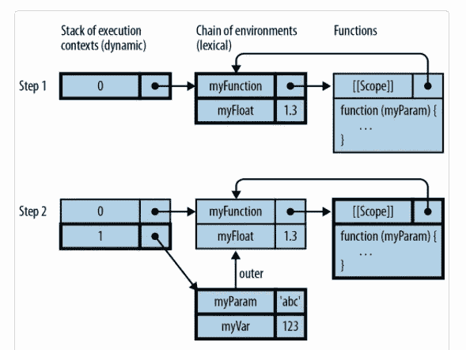

# Javascript 闭包不仅仅是有范围的函数。

> 原文：<https://itnext.io/javascript-closures-are-more-than-just-functions-with-scope-f088ee63139e?source=collection_archive---------3----------------------->

## 什么是结束，你为什么需要它？

# 什么是终结？

这是区分新手开发者和菜鸟开发者的最可靠的问题之一。现在有一种趋势，就是“把它弄得很简单”,或者把几乎所有的东西都给人们 TLDR，这样他们就可以对天底下的每一个概念都有一个粗略的了解，然后继续他们的生活，做一个无所不能的万事通。闭包也不例外。[这篇博文](https://medium.com/javascript-scene/master-the-javascript-interview-what-is-a-closure-b2f0d2152b36)对这些概念进行了深入的探讨。但是(总有一个)，用“有状态函数”回答提示的 tweet 形式的非常优雅的定义，从一开始就提供了一个过于简单的定义，这给人们带来了伤害。因为大多数人会读完然后继续前进。我知道这一点，因为我就是这么做的，而且我很确定这让我丢了工作。不管怎样，废话不多说，下面是引擎盖下发生的事情。

# **环境**

为了深入理解闭包，我们必须首先了解使用环境管理变量的概念。

*“当程序执行进入变量的作用域时，变量就存在了。”*

*摘自:阿克塞尔·劳施迈尔。“说 JavaScript。”*

这意味着它们只在被传递时才开始占用内存(有两种方法)。

## 方法 1:动态维度:调用函数。

当一个函数被调用时，它包含的参数和变量的适当空间被清除。这个空间以后应该可以用于垃圾收集。

## 方法 2:词法(静态)维度:与周围的作用域保持联系。

一个变量总是可以访问周围作用域的变量，这意味着内存也被分配给这些变量。每次调用函数时，它都需要访问自己的局部变量及其周围的作用域。为了访问创建函数的作用域，内部属性 [[[Scope]]](https://developer.mozilla.org/en-US/docs/Glossary/Scope) 。

下面的例子和图表来自阿克塞尔的书，让事情更清楚。

```
1.function myFunction(myParam){ 
2\.    let myVar = 123;
3\.    return myFloat;
4\.    }
5\. let myFloat = 1.3; 
6\. myFunction('abc'); //1.3
```



如果你对我明目张胆的剽窃有任何问题，请不要犹豫。

这是一个很好的例子，因为它一次演示了执行上下文堆栈的整个范围，总共六行简洁的代码。

以下步骤概述了在周期的每个点对范围的访问。

# 第一步

在第 1–5 行调用函数之前，程序可以访问全局环境中的变量 myFunction 和 myFloat，全局环境由左边的#0 框表示。

# 第二步

一旦在第 6 行调用了该函数，就会生成一个新的环境(#1)，该环境只能由该函数访问。它可以通过外部访问全球环境。

# 闭包本身

闭包利用这些环境为函数创建一个封闭的作用域，以避免全局变量的问题以及与变量命名相关的常见问题。一个函数将保留已经附加到它的[[作用域]]的变量，即使它离开了那个环境。再次[Mozilla 文档中的一个例子](https://developer.mozilla.org/en-US/docs/Web/JavaScript/Closures)比我微不足道的文字更好地解释了这个概念。

```
function makeAdder(x) { 
    return function(y) { 
         return x + y;
     };
}let add5 = makeAdder(5);
let add10 = makeAdder(10);console.log(add5(2)); //7
console.log(add10(2)); //12
```

正如我们在函数 makeAdder 的`add5`变量实例中所看到的(它们基本上是相同的概念)，该函数在它的局部[[Scope]]中保留了第一次被调用时的初始值作为它的'`x`,并推断下一个值作为它的 y 值传递。

# 一些结束


它们比看起来要复杂得多，使用闭包并不需要完全理解这些东西，但是它确实很有帮助。


【https://www.youtube.com/watch?v=DdCYMvaUcrA 

# 特别感谢

[Axel Rauschmayer](https://medium.com/u/7fab51e62203?source=post_page-----f088ee63139e--------------------------------) 和 speakingJS，此处[为免费，此处](http://speakingjs.com/es5/index.html)[为付费。](http://shop.oreilly.com/product/0636920029564.do?cmp=af-prog-books-videos-product_cj_9781449364984_%25zp)

[杰夫·波兹纳](https://medium.com/u/b1236ccd62f0?source=post_page-----f088ee63139e--------------------------------)，让我看到了光明。

# 资源

[https://developer . Mozilla . org/en-US/docs/Web/JavaScript/Closures](https://developer.mozilla.org/en-US/docs/Web/JavaScript/Closures)

[https://medium . com/JavaScript-scene/master-the-JavaScript-interview-what-a-a-closure-b2f0d 2152 b 36](https://medium.com/javascript-scene/master-the-javascript-interview-what-is-a-closure-b2f0d2152b36)