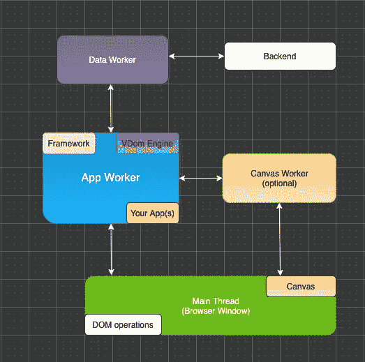
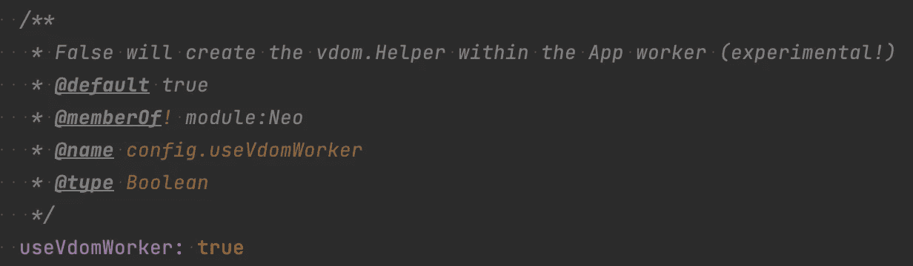
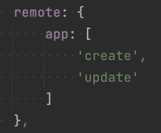

# JavaScript 开发:让 Web Worker 成为可选的

> 原文：<https://itnext.io/javascript-development-making-a-web-worker-optional-f23a13490b28?source=collection_archive---------2----------------------->

如果您在主线程或 [Web Worker](https://developer.mozilla.org/en-US/docs/Web/API/Web_Workers_API) 中运行大量 JavaScript 相关逻辑，那么将昂贵的逻辑转移到另一个 Worker 中是非常明智的。如果可能的话，工作线程使用自己的 CPU 在不同的线程中运行。

然而，在某些场景中，一个给定的线程上有很多与 JS 相关的工作负载，而在其他场景中，这个线程大部分时间是空闲的。

如果您的线程大部分时间都是空闲的，您不希望创建额外的工作线程，因为与直接在目标线程中运行相关的业务逻辑相比，基于 [postMessage](https://developer.mozilla.org/en-US/docs/Web/API/Worker/postMessage) 的通信会导致延迟。

本文将介绍一种非常通用的方法，说明如何在保持相同 API 不变的情况下，有选择地使用额外的工人。

# 内容

1.  介绍
2.  创建使用可选工作线程的框架配置
3.  如果需要，创建可选员工
4.  查看虚拟 dom worker
5.  将 vdom 引擎动态导入应用工作进程
6.  调查 vdom。助手
7.  我们需要调整我们的远程定义吗？
8.  远程 API 是如何工作的？
9.  不使用 vdom worker 有什么副作用吗？
10.  最后的想法

# 1.介绍

我刚刚完成了 [neo.mjs](https://github.com/neomjs/neo) UI 框架的 PoC 实现，使虚拟 DOM worker 成为可选的。

使用 vdom worker 时，我们的 workers 设置如下所示:


如果我们的应用程序工作人员(主要参与者)大部分时间都处于空闲状态，那么在这个范围内直接运行 vdom 引擎是有意义的:



显然，我们希望两个版本保持相同的 API。

实现这一点的概念可以在 neo.mjs 范围之外应用。唯一的需求是一个可靠的抽象层来处理跨工作者的通信。我们还将涉及远程 API(远程方法访问),因为它为通信部分提供了一个非常优雅的解决方案。

# 2.创建使用可选工作线程的框架配置



这部分比较琐碎。我们只是将新配置放入:
[src/default config . mjs # L190](https://github.com/neomjs/neo/blob/dev/src/DefaultConfig.mjs#L190)

现在，我们可以在我们要构建的每个应用程序的`neo-config.json`文件中使用这个配置:

(该文件将使用`npx neo-app`自动生成)

# 3.如果需要，创建可选员工

这部分也很简单。我们正在调整`worker.Manager`:
[src/worker/manager . mjs # L174](https://github.com/neomjs/neo/blob/dev/src/worker/Manager.mjs#L174)中的`createWorkers()`方法

如果我们的 worker key (name)是“vdom ”,我们的新配置被设置为 false，我们就跳过创建。

# 4.查看虚拟 dom worker

为了了解我们需要调整哪个逻辑，我们应该快速查看:
[src/worker/vdom . mjs](https://github.com/neomjs/neo/blob/dev/src/worker/VDom.mjs)

这个工人只是导入`vdom.Helper`(vdom 引擎)，所以这是唯一需要调整的 JS 模块。

# 5.将 vdom 引擎动态导入应用工作进程

一旦我们的 app worker 获得了`Neo.config`对象，我们需要惰性加载(动态导入)我们的助手类:
[src/worker/app . mjs # L222](https://github.com/neomjs/neo/blob/dev/src/worker/App.mjs#L222)

这在开发模式下运行良好(没有构建/传输),并且 [webpack](https://github.com/webpack/webpack) 将为我们调整`dist/development`和`dist/production`环境的分割块。

[旁注]如果您使用基于 [SharedWorkers](https://developer.mozilla.org/en-US/docs/Web/API/SharedWorker) 的多窗口应用程序设置，您需要对运行在同一共享应用程序 worker 实例中的所有应用程序使用相同的`useVdomWorker`配置值。

# 6.调查 vdom。助手

这个类(singleton)包含了很多不同的方法:
[src/vdom/helper . mjs](https://github.com/neomjs/neo/blob/dev/src/vdom/Helper.mjs)

关键部分在`static getConfig()`里面:

我们只向应用程序工作人员公开了`create()`和`update()`方法。

如果您还不熟悉“远程方法访问”API，您肯定需要更多的输入来了解它的确切含义。

如果我们使用 vdom worker，我们的`vdom.Helper` singleton 就在 vdom worker 范围内。在这种情况下，`Neo.vdom`是 app worker 范围内的`undefined`。

使用 remotes API 会将这两种方法公开给应用程序工作器。框架将在 app worker 全局范围内创建`Neo.vdom`名称空间。然后我们可以直接调用公开的方法作为承诺。`component.Base` (app worker)内部示例:

```
***Neo***.***vdom***.Helper.update(opts).then(data => {/*...*/});
```

调用公开的方法作为承诺将在内部从应用程序向 vdom 工作者发送 postMessage，用传递的 opts 参数触发`update()`,并将返回值发送回应用程序工作者，应用程序工作者解析承诺。

为了保持我们的 API 同步，我们需要稍微调整一下我们的`create()`和`update()`方法的返回值。

基本上我们有两个选择:

选择一是在我们的代码库中改变这个方法的所有调用(有 vdom 工作者吗？→称之为承诺，否则直接称之)。这会破坏我们的 API。

选项二是更改返回值:

```
return ***Neo***.config.useVdomWorker ? node : ***Promise***.resolve(node);
```

这种方法已经使 API 在两种模式下保持同步。

在对`update()`方法进行同样的修改后，我们就完成了。

# 7.我们需要调整我们的远程定义吗？

如果我们在 app worker 范围内运行`vdom.Helper`，您可能会怀疑`remote`定义是否有问题。



毕竟，我们是在向我们已经在的范围公开方法:)

`core.Base`将检查相同的作用域，并在这种情况下忽略注册方法: [src/core/Base.mjs#L357](https://github.com/neomjs/neo/blob/dev/src/core/Base.mjs#L357)

所以答案是“不，我们很好”。

# 8.远程 API 是如何工作的？

如果您想将这个概念应用到非基于 [neo.mjs](https://github.com/neomjs/neo) 的环境中，欢迎您根据需要使用代码库(毕竟，整个项目都是 MIT 授权的)。

如果你已经在使用 neo，你只需要知道如何使用 API。

在这两种情况下，我强烈建议深入研究代码库(只有 160 行)。

[](https://github.com/neomjs/neo/blob/dev/src/worker/mixin/RemoteMethodAccess.mjs) [## neo/RemoteMethodAccess.mjs 位于 dev neomjs/neo

### 应用工人驱动的前端框架。通过创建一个关于…的帐户，为 neomjs/neo 开发做出贡献

github.com](https://github.com/neomjs/neo/blob/dev/src/worker/mixin/RemoteMethodAccess.mjs) 

`worker.mixin.RemoteMethodAccess`确实包含在`worker.Manager`(主线程)中，还有`worker.Base`。

# 9.不使用 vdom worker 有什么副作用吗？

实际上有一些。Rich Waters 早在 2015 年就实现了这种沟通逻辑，远在我将 [MessageChannels](https://developer.mozilla.org/en-US/docs/Web/API/MessageChannel) 添加到组合中之前。

vdom 工作通信的运行方式如下:

App → Main → VDom → Main → App

在 vdom 工作器使用`update()`方法创建增量或初始 vnode 通过`create()`返回后，这些消息将在返回到应用工作器的途中将更改丢弃到它们所经过的主线程中。

这个想法是为了保存一个额外的消息链:

App → Main → App

显然，如果我们直接在 app worker 范围内运行 vdom 引擎，则根本没有后消息链。

我调整了`component.Base.render()`来触发`this.mount()`以及`updateVdom()`来触发`Neo.applyDeltas()`，以防我们不使用 vdom 工作器。

即使我们在新的非 vdom 工作环境中即时解析承诺，承诺仍然是异步的:

意思是:如果你在一个类方法中触发了一个更新，比如:

```
this.vdom = vdom;
```

新状态(vnode)在此方法中不可用。显然你可以在 1ms 后使用`setTimeout()`来确保安全。

如果您在新的 vnode 就位之前触发了另一个 vdom 引擎更新，这可能会带来麻烦。

在`component.Base`内部有一个故障保险，防止在更新仍在运行时调用新的引擎。在这种情况下，累积更新将发生在上次更新之后。

但是，引擎调用不会锁定父组件树进行更新。这可能是一个很好的补充(随意开一张票)。

# 10.最后的想法

“应用程序工作人员是主要参与者”范例可以显著提高您的前端相关代码库的性能。

在生态系统内进行了 12，000 多次提交后，使用 neo 的好处是我无法在此列出的。

我只能重复我自己的话，并强烈建议深入研究代码库:

[](https://github.com/neomjs/neo) [## GitHub - neomjs/neo:应用工人驱动的前端框架

### neo.mjs 使您能够使用一个以上的 CPU 创建可扩展的高性能应用程序。不需要照顾一个…

github.com](https://github.com/neomjs/neo) 

如果您希望看到可选工作器的概念也应用于 neo 数据工作器，欢迎您开一张票。

我用日历应用程序测试了非 vdom 工作者设置，这个运行得非常好。

covid 应用程序也可以很好地渲染，但是有一些副作用(例如，表格选择没有得到可视化应用)。

由于演示应用程序不会触发大量与 JS 相关的逻辑，因此不使用 vdom 工作人员会感觉快一拍。

我们可以做一些基准测试，让“感觉”变成更精确的数字。非常感谢您的帮助！

总的来说，我确实在寻找更多关于这个话题的反馈:

在 app worker 中运行虚拟 dom 引擎的设置是不是一个有趣的话题，是不是我们应该投入更多时间来完善它？

路线图仍然很紧张，所以进一步推动这个主题**强烈**依赖于你的投入。

非常欢迎您加入 Slack 频道:

[](https://join.slack.com/t/neomjs/shared_invite/zt-6c50ueeu-3E1~M4T9xkNnb~M_prEEOA) [## 在 Slack 上加入 neo.mjs

### Slack 是一种与团队沟通的新方式。它比电子邮件更快、更有条理、更安全。

join.slack.com](https://join.slack.com/t/neomjs/shared_invite/zt-6c50ueeu-3E1~M4T9xkNnb~M_prEEOA) 

问候&快乐编码，
托拜厄斯

PS:下面是使 vdom worker 可选的完整更改日志:

[](https://github.com/neomjs/neo/commit/4287eb438e40fbfd44b5956323fa74b766761f5e) [## 来自 neomjs/dev neomjs/neo@4287eb4 的合并拉取请求#2690

### 应用工人驱动的前端框架。通过创建一个关于…的帐户，为 neomjs/neo 开发做出贡献

github.com](https://github.com/neomjs/neo/commit/4287eb438e40fbfd44b5956323fa74b766761f5e) 

56 处增加，27 处删除。