# Javascript E2E / UI 测试(或者如何与 Selenium 分手并继续前进)

> 原文：<https://itnext.io/javascript-e2e-ui-testing-or-how-to-brake-up-with-selenium-and-move-on-f991c142079a?source=collection_archive---------4----------------------->

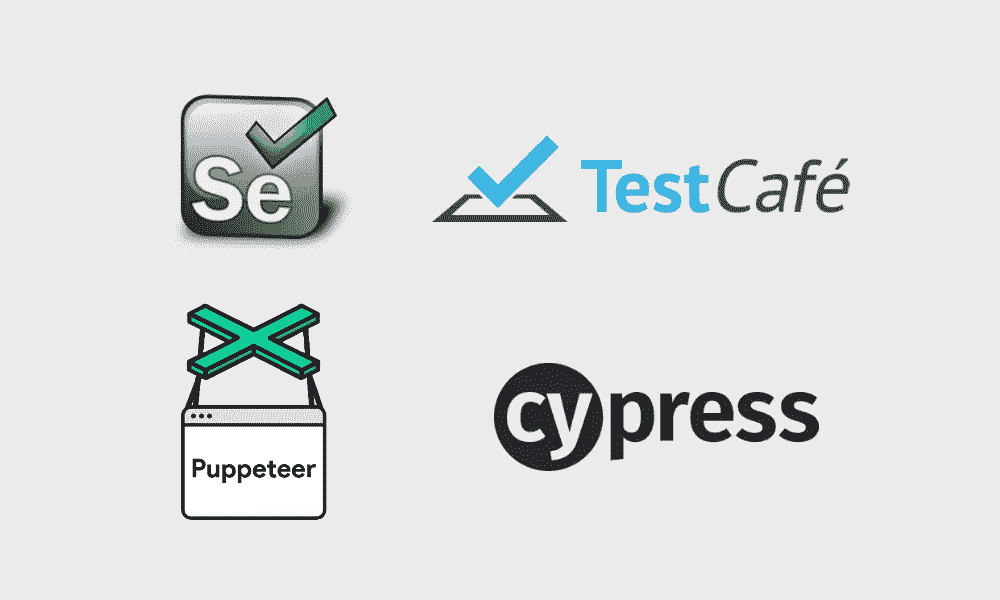

网络浏览器自动化工具

当你的测试**缓慢、不稳定**并且**忽略**时，你就知道出问题了。我有没有提到**不可维护**和**难写**？最后，设置您的测试环境**有多容易/多难？**

编写测试通常是痛苦和无聊的任务，但我知道我们可以做得更好。所以让我们看看如何在 JS 中实现它。为了展示 JS 的威力，我开始评估一些工具。当然，JS 生态系统是如此不稳定，当你读完这篇文章时，也许会有新的/闪亮的工具出现(或者没有)。

# 操纵木偶的人

有了木偶师，你几乎可以自动化一切。我们可以创建 UI 测试，运行 web scraper，截图，创建 pdf，检查代码覆盖率和可视化比较网站。木偶师通过 DevTools 协议⚡.直接控制 Chromium 浏览器
困扰我的一件事是当编写 UI 测试时，我们需要编写大量代码，这使得测试变得冗长(waitForSelector，waitForNavigation，wait and wait some)。不要误会，我们完全掌控，但是要写很多嘈杂的代码可能导致**不可维护的代码**。

# 柏树

Cypress 在设计时就考虑了测试，它有很好的特性。Cypress 通过 API 控制浏览器，在浏览器中运行代码。网站加载在 iframe 中，Cypress 可以访问真正的 DOM 元素。Cypress 有很好的元素检查、断言模式、执行测试命令的侧边平移和 DOM 快照。我无法将测试配置为并行运行，所以我只能继续前进。然而，Cypress 是一个很好的测试工具。

# 然后我就爱上了 [TestCafe](https://devexpress.github.io/testcafe/)

所有其他工具都感觉有点笨拙，但是当我开始使用 TestCafe 时，我感觉我在编写 UI 测试时拥有了超能力。TestCafe 在 Node 中运行。它使用代理来注入模拟用户动作的脚本，并从那里进行完全控制。

空谈是廉价的，所以让我给你看看代码。

我将使用 TodoMVC 应用程序，你可以在 [github repo](https://github.com/fvitas/testcafe-todomvc) 上检查测试文件。

```
npm i testcafe
```

首先，我创建了带有页面选择器的类和带有初始页面的 fixture:

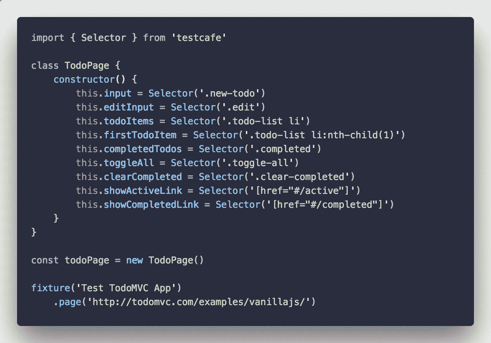

使用异步 await 测试看起来如此干净和甜蜜:

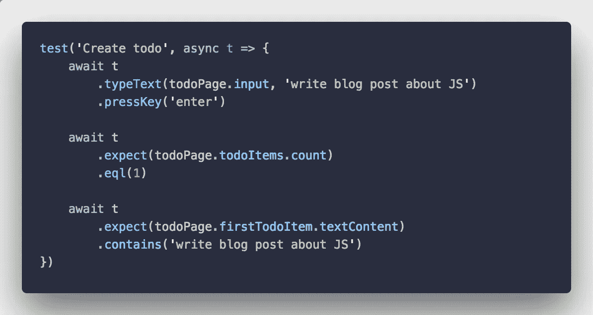

添加 npm 脚本并运行它，或者在终端中键入:

```
"test": "./node_modules/.bin/testcafe chrome tests/"
```

让我们断言删除一个 todo:

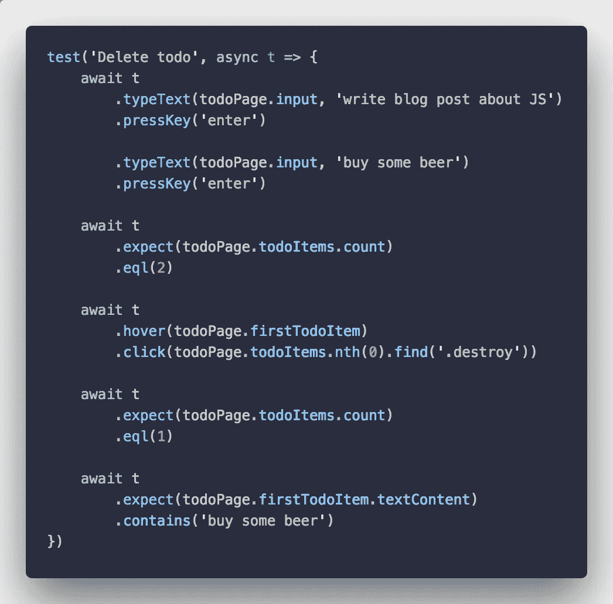

有很多不错的功能，我们可以断言元素有多少个子元素，或者断言元素的 css 类。就个人而言，我不喜欢 nth(0)是从零开始的，因为它是从 css :nth-child(1)开始的，但是我喜欢这个函数式 api。

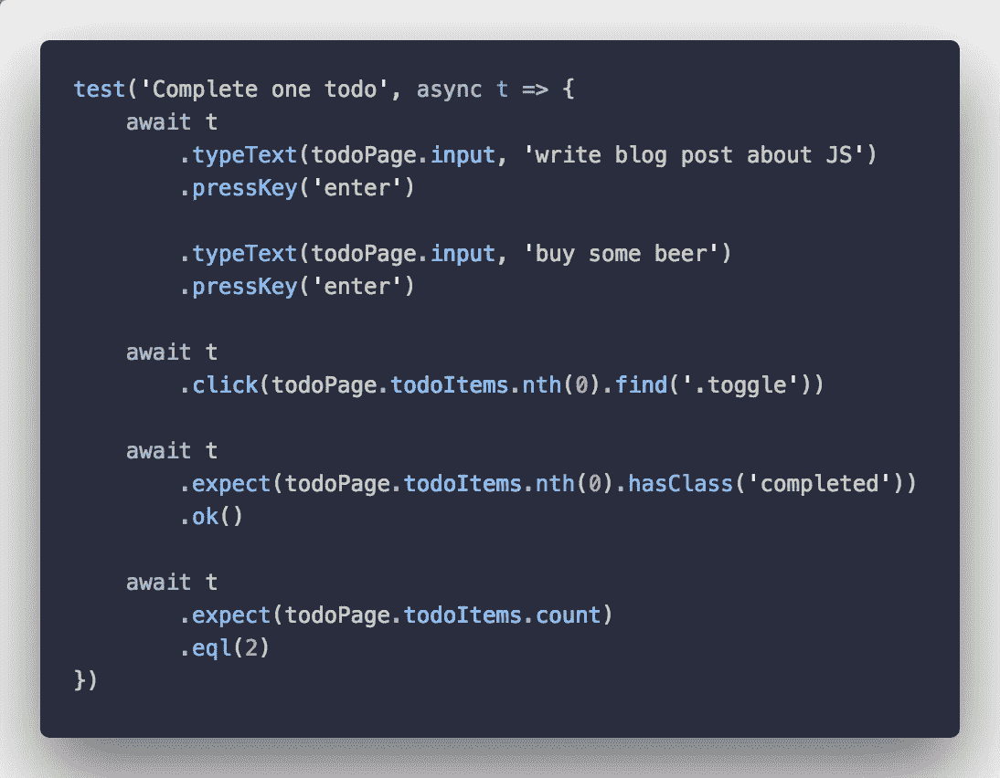

有了他们漂亮的[动作 api](https://devexpress.github.io/testcafe/documentation/test-api/actions/) ，我们可以像真正的用户一样做很多事情:

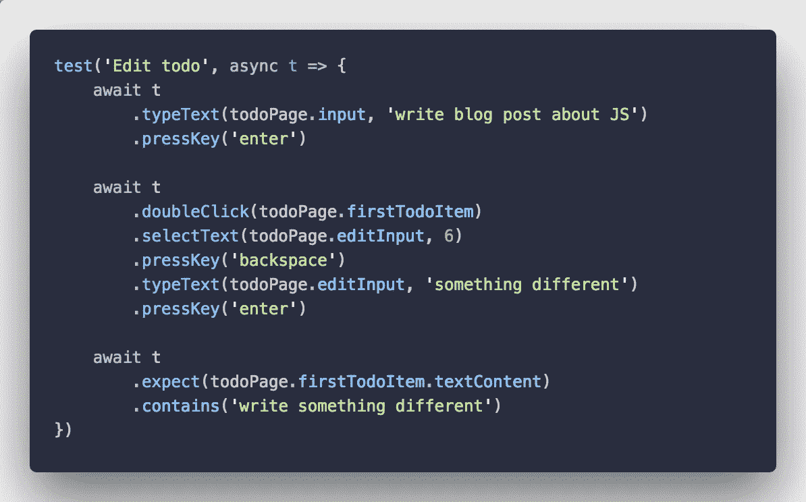

现在测试完成所有待办事项:

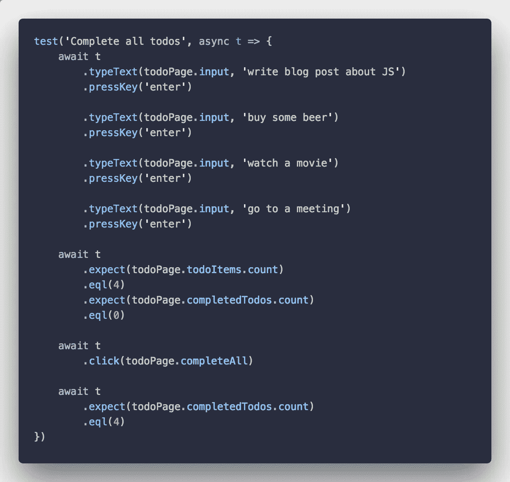

为了让事情变得更简单(不要重复)，我们可以使用 for-of 循环和 await，但是我们必须使用 Node 9+:

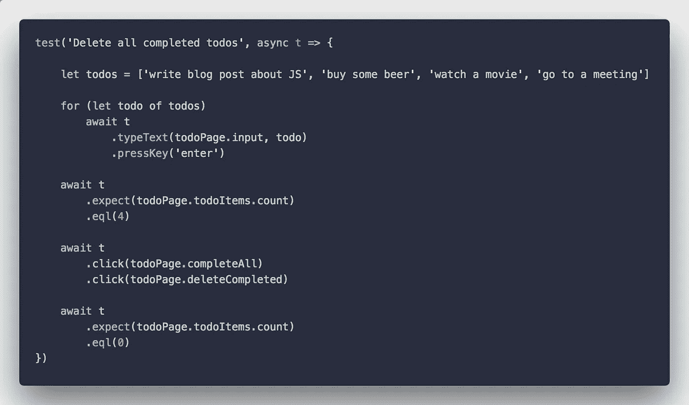

# 测试失败的地方

如果断言失败，我们会得到一个非常好的错误消息，包括行号和上下文。在这里，我在测试中犯了错误，只是为了看到这个漂亮输出:

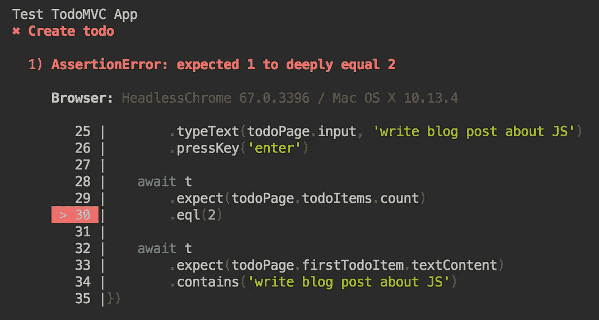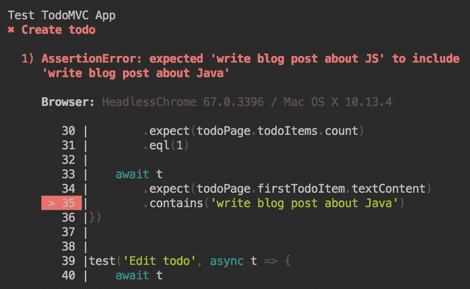

# 平行得要命

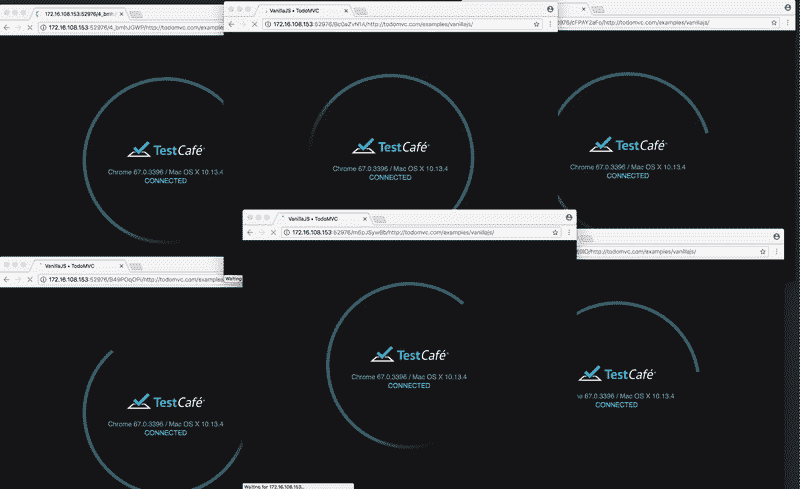

并行运行测试

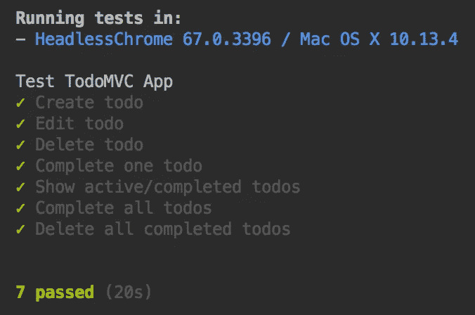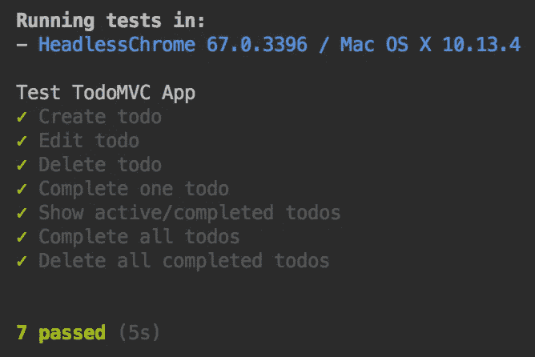

串行执行(左)与并行执行(右)

# TestCafe CLI 选项

**跨浏览器支持:**

```
$ testcafe chrome tests/
$ testcafe firefox tests/
$ testcafe ie tests/
$ testcafe safari tests/
$ testcafe all tests/
```

**设备仿真:**

```
$ testcafe "chrome:emulation:device=iphone 6" tests/
```

**无头:**

```
$ testcafe chrome:headless tests/
```

**测试失败时的截图:**

```
$ testcafe chrome tests/ --screenshots-on-fails -s screenshots
```

**降低测试速度:**

```
$ testcafe chrome tests/ --speed 0.5
```

**测试失败时调试:**

```
$ testcafe chrome tests/ --debug-on-fail
```

**最好的并发性:**

```
$ testcafe chrome tests/ --concurrency 8
```

# 排除故障

因为它是从节点运行的，所以调试 testcafe 的服务器端版本是用`--inspect`或`--inspect-brk`运行它，并在测试代码中的任何地方放置`debugger`操作符。
客户端版本的调试被放到【test 里面，testcafe 会暂停执行。另一个客户端版本是运行带有
`--debug-mode`标志的 testcafe，我们可以手动继续执行测试。

# 在 CI 上运行

TestCafe 有很棒的[流行词文档](https://devexpress.github.io/testcafe/documentation/recipes/integrating-testcafe-with-ci-systems/)。当我需要快速和出色的设置时，Travis 总是我的第一选择。您可以查看[作业日志](https://travis-ci.org/fvitas/testcafe-todomvc/builds/390368486)了解我最近的测试执行情况。这是 travis.yml:

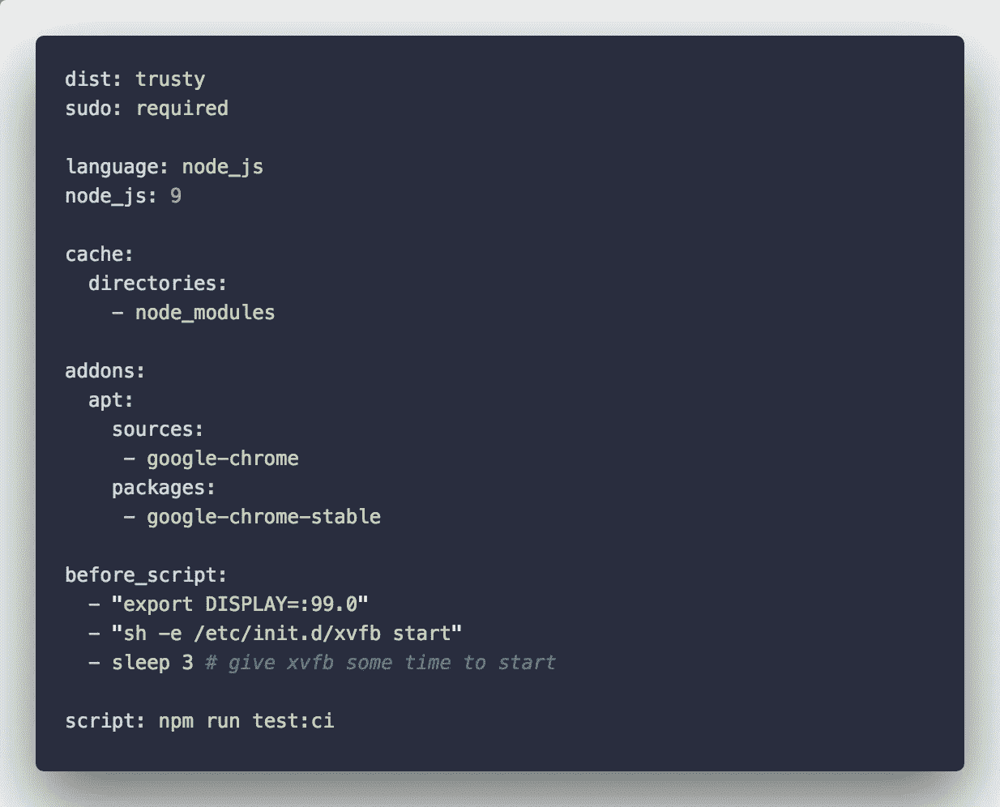

# 结论


遵循测试金字塔，不要写太多的 UI 测试，他们应该验证一些用户流。写得足够让你对自己的申请充满信心。

希望你喜欢它，TestCafe 是一个非常棒的工具，它让编写测试变得非常漂亮。

喝杯咖啡，检查一下 TestCafe 文档，写下这些测试☕

[](https://www.buymeacoffee.com/filipvitas)