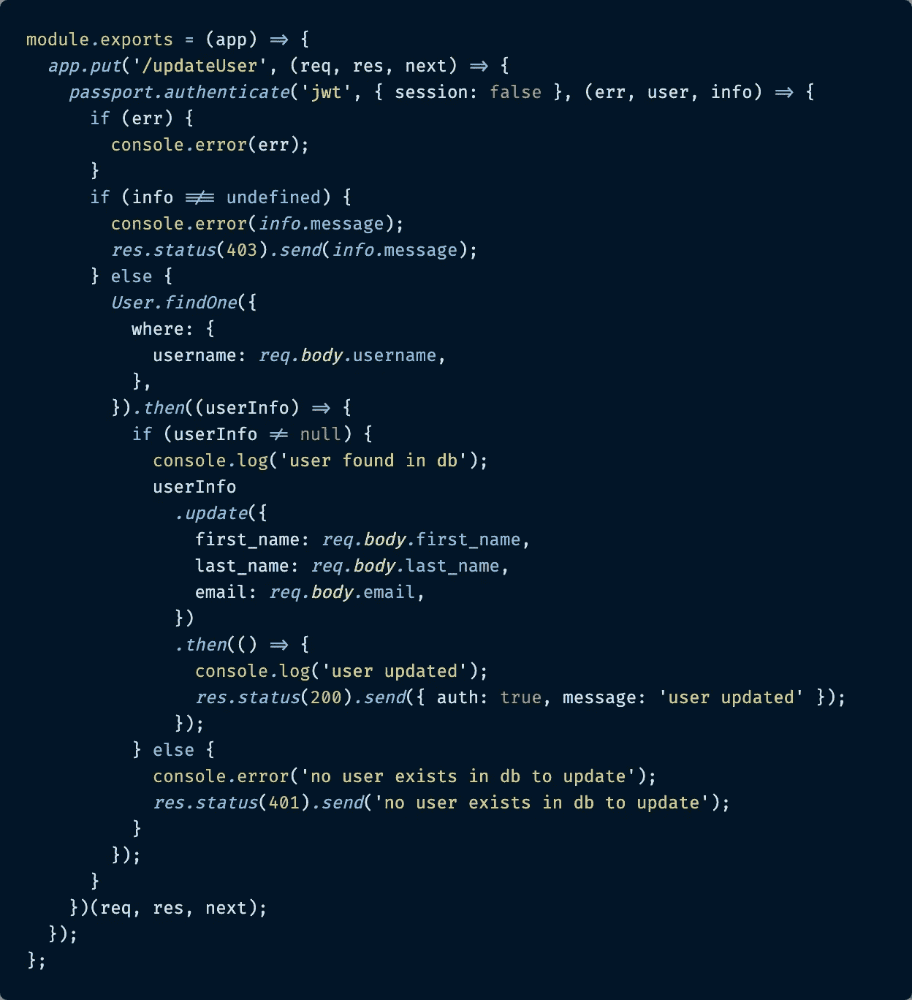
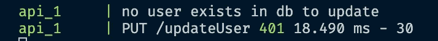
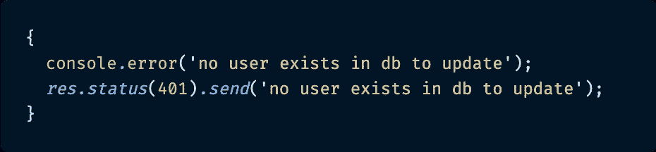
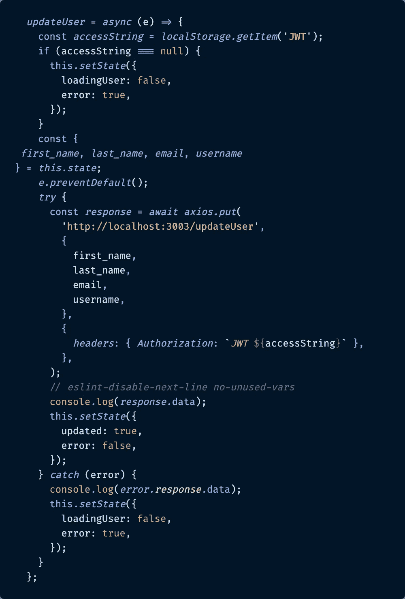
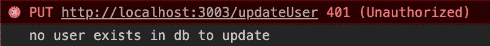
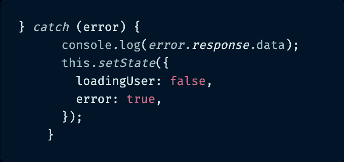

# 从 Express.js 到 React 的 JavaScript 错误处理

> 原文：<https://itnext.io/javascript-error-handling-from-express-js-to-react-810deb5e5e28?source=collection_archive---------0----------------------->

## 因为错误是必然会发生的，我们需要正确地处理它们。


照片由[杰米街](https://unsplash.com/@jamie452?utm_source=unsplash&utm_medium=referral&utm_content=creditCopyText)在 [Unsplash](https://unsplash.com/s/photos/something-went-wrong?utm_source=unsplash&utm_medium=referral&utm_content=creditCopyText)

# 介绍

我已经用了一整套 [MERN (MySQL、Express、React 和 Node.js)项目](https://github.com/paigen11/mysql-registration-passport)来写了一大堆博文。随着我慢慢地构建它并添加更多的功能，我学到了许多值得分享的新东西，以帮助其他开发人员避开我在这个过程中遇到的障碍。

过去的主题包括使用 [Sequelize](https://medium.com/@paigen11/sequelize-the-orm-for-sql-databases-with-nodejs-daa7c6d5aca3) 作为 MySQL 数据库的 ORM，使用 [PassportJS 和 JWT](/implementing-json-web-tokens-passport-js-in-a-javascript-application-with-react-b86b1f313436) 进行认证和保护路由，使用 [Nodemailer](/password-reset-emails-in-your-react-app-made-easy-with-nodemailer-bb27968310d7) 通过电子邮件提供密码重置功能，等等。老实说，通过构建这个应用程序，只是为了学习更多的节点、更多的反应、更多的核心 JavaScript，教会了我很多。

如果你想看我关于这个回购和代码本身的其余帖子，我会在本文底部链接到它们。

今天的帖子也不例外。

> 今天我将讨论如何正确处理 JavaScript 应用程序两端的错误:从在 Express 中的服务器端抛出错误，到使用 React 和 Axios 在客户端捕捉和处理错误。

# 快速错误处理

因为服务器端是大多数错误发生的地方，所以我也将从 Node.js / Express 服务器代码开始。

我必须承认，在相当长的一段时间里，在构建这个应用程序的过程中，我从 Express 服务器传回了 [HTTP 200 状态](https://developer.mozilla.org/en-US/docs/Web/HTTP/Status)(OK 状态)代码，即使在数据库中没有发现像丢失 JWT 令牌或用户 ID 这样的错误。

*不当表达错误处理示例*

```
res.status(200).json('404 - no user exists in db to update');
```

我这样做是因为我不仅想发送 401(未授权)或 403(禁止)HTTP 状态代码，而且还想发送一条书面消息，说明服务器端到底发生了什么错误，在很长一段时间里，我都找不到如何使用 Express 来实现这两个目的。

要么通过`res.json('This is an error message the client can read')`发送一个错误消息，带有 200 HTTP 状态，*要么*发送一个 401 或 403 HTTP 状态，没有关于`res.status(401)`实际上出了什么问题的进一步信息。

终于有一天，我在 [Express 文档](https://expressjs.com/en/guide/error-handling.html)中找到了我一直在寻找的解决方案，这个文档有很多。这真的没有我想象的那么棘手——这类似于当事情进展顺利时我发送一条消息和一个 200 HTTP 状态，就像这样:

*快递成功状态码报文示例*

```
res.status(200).send({ message: 'user created' });
```

我可以用错误状态和消息做同样的事情。

*表示故障状态代码和信息示例*

```
res.status(401).send('no user exists in db to update');
```

仅仅通过从 Express 的`.json()`切换到`.send()`方法，就意味着我可以将 HTTP 错误代码*和*信息消息链接在一起，供客户端解密，然后在浏览器端进行适当的处理。😄

值得注意的是，`[.send()](https://expressjs.com/en/api.html#res.send)`可以在 JavaScript 中处理对象、字符串或数组。成功消息示例是一个具有属性`message`的对象，而失败响应只是一个字符串，因为在成功响应的情况下，像消息、JSON Web 令牌或其他数据可能会从服务器发送到客户机。然而，我的错误只需要一个 HTTP 响应和字符串形式的错误消息。只是为了让你知道未来。🙂

下面是我的应用程序中的一个服务器端路由的例子，展示了当用户试图在登录时更新他们的个人信息时发送成功或失败的完整实现。(我选择将它作为来自 VS 代码的格式良好且突出显示的图像和可复制的代码片段包含在内)。

`updateUser.js`



js 是服务器端的路由，它可以更新用户的个人信息，也可以不更新。

```
module*.*exports = (app) => {
  *app.put*('/updateUser', (req, res, next) => {
    *passport.authenticate*('jwt', { session: false }, (err, user, info) => {
      if (err) {
        console*.*error(err);
      }
      if (info !== undefined) {
        console*.*error(*info.*message);
        *res.status*(403)*.send*(*info.*message);
      } else {
        *User.findOne*({
          where: {
            username: *req.body.*username,
          },
        })*.then*((userInfo) => {
          if (userInfo != null) {
            console*.*log('user found in db');
            userInfo
              *.update*({
                first_name: *req.body.*first_name,
                last_name: *req.body.*last_name,
                email: *req.body.*email,
             })
            *.then*(() => {
              console*.*log('user updated');
              *res.status*(200)*.send*({ auth: true, message: 'user updated' });
            });
         } else {
          console*.*error('no user exists in db to update');
          *res.status*(401)*.send*('no user exists in db to update');
         }
       });
      }
    })(req, res, next);
  });
};
```

让我快速分析一下这个文件中发生了什么。

当路由被点击时发生的第一件事是 PassportJS 接管并检查用户的 JSON Web 令牌是否存在和有效，这发生在另一个文件中，并在另一个[博客](/implementing-json-web-tokens-passport-js-in-a-javascript-application-with-react-b86b1f313436)帖子中涉及，所以我现在不会深入讨论这个问题。

一旦用户通过了身份验证，该路由就会尝试在 MySQL 数据库中找到那个`username`,如果找到了，就会更新用户信息，并发回一条 HTTP status 200 的成功消息和一条`'user updated'`消息。

如果在数据库中没有找到`username`，服务器会记录用户不存在的错误，并发回 401 HTTP 状态和消息`'no user exists in db to update'`。

这就是您在查看日志时看到的服务器端控制台上记录的内容。

## 服务器日志中的错误快速抛出



将错误打印到服务器的控制台并发送到客户端

就错误处理而言，需要重点关注的主要代码是文件底部的这个代码块。



负责向浏览器发送错误状态和消息的代码。

这就是从 Express 向浏览器成功发送错误状态代码和消息的全部内容。现在我们来谈谈浏览器是如何处理这些错误的。

# React & Axios 错误处理

对于我的全栈应用程序的客户端，我选择使用非常流行的基于 promise 的 HTTP 库 [Axios](https://www.npmjs.com/package/axios) ，而不是浏览器的本机 [fetch API](https://developer.mozilla.org/en-US/docs/Web/API/Fetch_API/Using_Fetch) ，因为我发现它更容易使用。这个例子将使用 Axios 显示所有 HTTP 请求和错误处理。

正如我在慢慢改进服务器端的错误处理一样，随着应用程序的发展和改进，我也在改进客户端的错误处理。

在我正确处理服务器抛出的错误之前，我所做的就是解释错误。

*对从服务器向客户端抛出的错误处理不当的例子*

```
 .catch(error => {        
    console.log(error.data);             
    this.setState({         
      loadingUser: false,         
      error: true,       
    });
  });
```

我会尝试捕捉一个错误，将其消息记录到控制台，然后相应地设置 React 应用程序的状态。对于一个开始来说并不可怕，但是对于一个最终的解决方案来说也不太好——当我试图用一条消息抛出一个 200 HTTP 状态之外的东西时，客户端就会在`catch()`块中崩溃。

就像服务器端一样，我终于厌倦了我正在做的这种半生不熟的错误处理，并找到了一些更好的关于库希望你如何处理错误的 Axios 文档，这是我以前忽略的。

事实证明，使用 Axios 读取和处理错误的方法实际上是`error.response.data`，而不仅仅是`catch()`函数中的`error.data`。它没有被很好地强调，但是文档指出:

```
 catch(error => {
  if(error.response) { 
    /* the request was made and the server responded
    with a status code that falls out of the range of 2xx */
    console.log(error.response.data)
  }
}
```

有了这一发现，在客户端捕捉错误突然变得更加容易和更具描述性。

Axios 解释来自服务器的成功响应的方式与解释错误代码的方式几乎完全相同。

*Axios 成功响应处理*

```
try {      
  const response = await axios.get('api/findUser', {
    params: {          
      username,        
    },        
    headers: { Authorization: `JWT ${accessString}` },      
  });      
  console.log(response.data); 
  // this.setState and so on after response is received...
}
```

*Axios 故障响应处理*

```
catch (error) {      
  console.log(error.response.data);      
  this.setState({        
    loadingUser: false,        
    error: true,      
  });    
}
```

事实证明，对我来说，更新所有的`catch()`块以接受这种新的错误格式比我预期的要容易得多。

同样，这是文件中的一个大片段，用户从客户端更新他们的数据，并将其保存到数据库中。

`UpdateProfile.js`



js 显示了发送到服务器的客户端更新请求，它可以工作，也可以不工作。

```
*updateUser* = *async* (e) => {
  const *accessString* = *localStorage.getItem*('JWT');
  if (accessString === null) {
    this*.setState*({
      loadingUser: false,
      error: true,
    });
  }
  const{
    *first_name*, *last_name*, *email*, *username* }= *this.state*;
  *e.preventDefault*();
  *try* {
    const *response* = *await axios.put*(
      'http://localhost:3003/updateUser',
      {
        first_name,
        last_name,
        email,
        username,
      },
      {
        *headers*:{ *Authorization*:`*JWT* ${accessString}`},
      },
    );
    // *eslint-disable-next-line no-unused-vars* console*.*log(*response.*data);
    this*.setState*({
      updated: true,
      error: false,
    });
  } *catch* (error) {
    console*.*log(*error.response.*data);
    this*.setState*({
      loadingUser: false,
      error: true,
    });
  }
};
```

下面是这个函数调用中发生的情况。

首先，`updateUser()`从先前添加的本地存储中取出 JWT 令牌。

如果找到了令牌，Axios 将构建包含所有用户新信息的 PUT 请求的`body`,并将`header`设置为服务器认证所需的 JWT 令牌。

最后，响应要么以成功更新的形式返回，要么以失败的形式返回，在这种情况下,`error.response.data`被记录到控制台，以帮助开发人员找出问题所在，应用程序的状态被设置为`error`,以帮助用户了解发生了什么。

这是当失败的请求发出时，如果开发工具控制台是打开的，用户将会看到的。

## 控制台日志中出现错误反应



开发人员将在浏览器的开发人员工具控制台中看到的错误。

客户机看到用户发回的 401 状态代码，以及来自服务器的消息，表明在数据库中没有找到具有匹配用户名的用户。

实现这一点的代码就是这段代码。



负责在客户端解释并处理错误的代码。

这就结束了我对客户机如何处理和显示服务器抛出的错误的解释。再说一次，这并不太难理解，但是将所有这些放在一起有时会证明是最棘手的部分。

# 结论

代码中的错误就像死亡和税收一样，它们注定会发生。作为开发人员，我们的工作是确保我们知道它们何时发生，并优雅地处理它们，这样用户就可以对我们的应用程序有良好的体验。

尽管这种类型的事情很常见并且非常重要，但是有时关于这种错误处理的文档被隐藏得很深，或者对于所提供的基本代码片段来说有点神秘。这就是为什么我今天想详细描述我是如何将错误代码和消息从 Express 一直传递到 React 前端使用的 Axios 库的原因。

过几周再来看看，我会写更多关于 JavaScript、React、ES6 或其他与 web 开发相关的东西。跟着我，这样你就不会错过了！

感谢您的阅读，我希望我已经为您提供了一些好的解决方案，帮助您将来在自己的全栈 JavaScript 应用程序中处理错误。会出现错误，让我们好好处理它们。

如果你喜欢读这篇文章，你可能也会喜欢我的其他作品:

*   [Sequelize:像猫鼬，但不是 SQL](https://medium.com/@paigen11/sequelize-the-orm-for-sql-databases-with-nodejs-daa7c6d5aca3)
*   [使用 Docker & Docker Compose 改进您的全栈应用开发](https://medium.com/@paigen11/using-docker-docker-compose-to-improve-your-full-stack-application-development-1e41280748f4)
*   [用 React](/implementing-json-web-tokens-passport-js-in-a-javascript-application-with-react-b86b1f313436) 在 JavaScript 应用中实现 JSON Web 令牌& Passport.js
*   [使用 Nodemailer 简化 React 应用程序中的密码重置电子邮件](/password-reset-emails-in-your-react-app-made-easy-with-nodemailer-bb27968310d7)
*   [在 JavaScript 应用程序中设置 Swagger 进行 API 测试](/setting-up-swagger-in-a-node-js-application-d3c4d7aa56d4)
*   [ESLint 如何让我成为更好的 React 开发人员](/how-eslint-makes-me-a-better-react-developer-237fb14c00ae)

# 参考资料和更多资源

*   https://github.com/paigen11/mysql-registration-passport github repo、MERN stack 用户注册项目:
*   HTTP 响应状态代码，MDN 文档:[https://developer.mozilla.org/en-US/docs/Web/HTTP/Status](https://developer.mozilla.org/en-US/docs/Web/HTTP/Status)
*   Axios，错误处理文档:【https://github.com/axios/axios#handling-errors 
*   快递，错误处理文档:【https://expressjs.com/en/guide/error-handling.html 