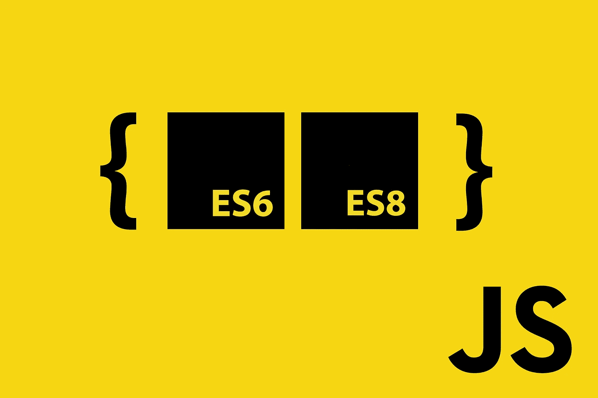

# Javascript ES8 异步等待服务+ ES6 模块

> 原文：<https://itnext.io/javascript-es8-asynchronous-await-service-es6-modules-bcb842340c0e?source=collection_archive---------2----------------------->



## ES8 从不同模块异步获取。

> [点击这里在 LinkedIn 上分享这篇文章](https://www.linkedin.com/cws/share?url=https%3A%2F%2Fitnext.io%2Fjavascript-es8-asynchronous-await-service-es6-modules-bcb842340c0e%3Futm_source%3Dmedium_sharelink%26utm_medium%3Dsocial%26utm_campaign%3Dbuffer)

我推荐熟悉最新版本的 ECMAScript 或者“ECMA-262”。真正对我有帮助的好资源可以在这里找到[。Jeffery Way 有一个关于 ES2015+的优秀系列，适合初学者](https://es6.io/)[这里](https://laracasts.com/series/es6-cliffsnotes)。

假设我们有一个 ES6 类文件，包含所有需要从不同来源获取数据的方法。

```
(function () {
   'use strict';
}());export default class someClass {
    constructor() {
        this.users = '[https://jsonplaceholder.typicode.com/users](https://jsonplaceholder.typicode.com/users)';
        this.posts ='[https://jsonplaceholder.typicode.com/posts](https://jsonplaceholder.typicode.com/posts/)'; this.getUsers();
        this.getPosts();
    } getUsers() {
        fetch(this.posts)
        .then(response => response.json())
        .then(data => console.log(data))
        .catch(error => console.log('Error:', error));
    } getPosts() {
        fetch(this.posts)
        .then(response => response.json())
        .then(data => console.log(data))
        .catch(error => console.log('Error:', error));
    }
}
```

正如你在上面看到的，getUsers()和 getPosts()实际上包含了相同的获取请求逻辑。我们在这里复制代码，这可以包装在一个 ES8 糖异步等待功能。让我们首先将类代码改为更简洁的代码:-

```
(function () {
   'use strict';
}());import { getData } from './GetDataHelper.js';export default class someClass {
    constructor() {
        this.users = '[https://jsonplaceholder.typicode.com/users](https://jsonplaceholder.typicode.com/users)';
        this.posts ='[https://jsonplaceholder.typicode.com/posts](https://jsonplaceholder.typicode.com/posts/)'; this.getUsers();
        this.getPosts();
    } getUsers() {
        getData(this.users);
    } getPosts() {
        getData(this.posts);
    }
}
```

我们现在可以创建一个新文件 GetDataHelper.js:-

```
(function () {
   'use strict';
}());// async function
export async function getData(url) {
    return await (await(fetch(url))).json();
}
```

总之，我们现在将 getData 作为一个模块导入到类中。这个模块可以包含多个方法，如果我们想在类中使用更多的方法，我们可以将导入改为:-

```
import { getData, someFunc, anotherFunc } from './GetDataHelper.js';
```

或者全部使用星号。

```
import { * } from './GetDataHelper.js';
```

我们正在等待在新模块中使用我们新的异步方法获取 JSON 的承诺。如果你需要的话，这可以变得更复杂，但是正如你所看到的，现在它非常简洁明了。所有需要的是使用转换器如 babel 来转换 ES2015+代码。我需要使用 ES8 异步功能和 HTML5 的本地存储功能的更复杂的例子可以在我最近的作品中看到。

类文件这里是[这里是](http://here)。

缓存服务(HTML5 —本地存储在这里是。

异步请求服务(getData helper)在这里是。