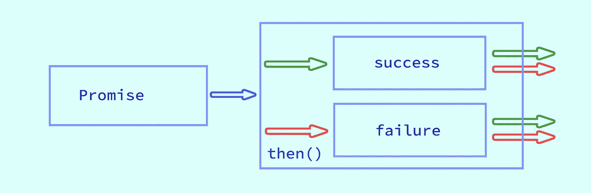
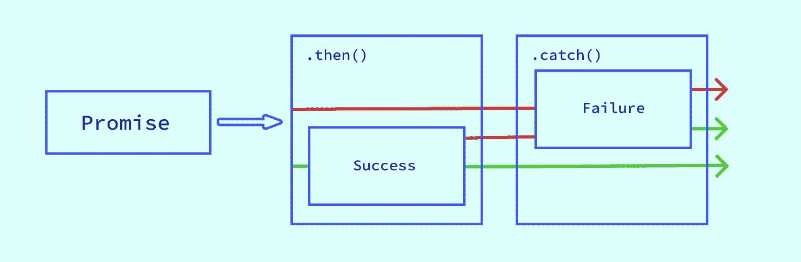
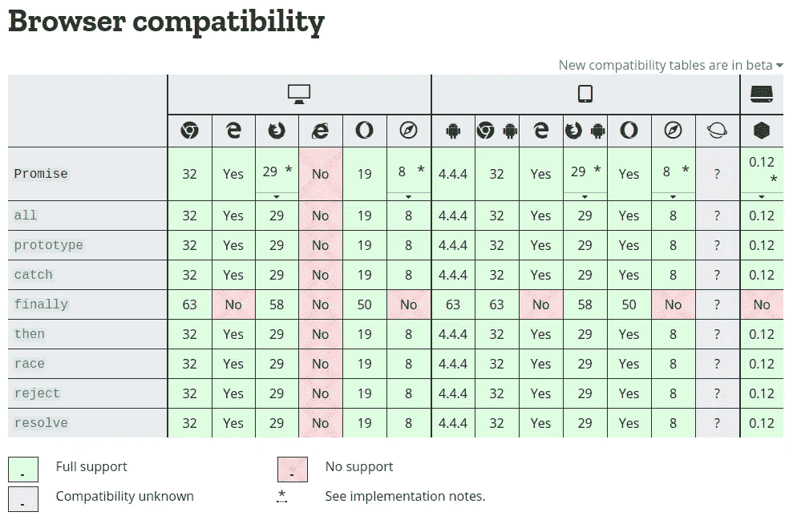
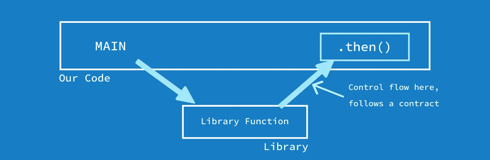

# JavaScript 要点:理解承诺

> 原文：<https://itnext.io/javascript-essentials-understanding-promises-200657e11667?source=collection_archive---------3----------------------->

> JavaScript Essentials 收集了一些主题，将向您介绍该语言的基本概念和结构。这些主题没有特定的顺序，你可以根据自己的喜好从任何地方开始。

# 这个想法背后的一点背景

让我们首先声明 JavaScript 是单线程的(我们将在另一篇文章中详细讨论这一点)。这意味着在一个给定的时间内只有一件事可以执行，而其他所有的事情都在等待轮到它们，这可能会变得非常可怕。幸运的是，我们的大多数用例都会产生稍后执行或在事件发生时执行的代码。这些是非阻塞任务，将异步完成。

# 回调和异步

异步代码在一段时间后完成，这是我们不知道的。“等待”异步函数返回结果的一个简单方法是向它传递一个回调函数。

回调函数是作为参数传递给另一个函数的函数，回调函数在另一个函数内部被调用。

例如:

在上面的代码示例中，我们正在调用`getUser()`方法，该方法将通过进行 API 调用来获取用户。我们在这里说的是:“嘿` getUser `，去用`user-id`给我找个用户，慢慢来。一旦你有了它，运行这个函数，我传给你的详细资料的用户或错误在任何情况下”。

如果我们仔细想想，对于我们来说，异步代码执行需要多长时间，它是否会立即给我们结果，或者在给出结果之前是否需要一段时间来完成操作，都无关紧要。因此，通过传递回调，我们知道无论何时结果出现，我的代码都会被执行。

# 回调回落

嗯，我们通过使用回调来处理代码的异步性，但是它们有一些相关的问题。

## 控制反转

当我们使用需要回调的代码时，我们实际上是在反转对程序的控制。我们希望接收我们回调的函数会在正确的时间执行它，并向我们传递所需的结果。换句话说，我们非常信任接收回调的函数。如果需要回调的异步代码是我们写的，这是可以的，但是当我们使用第三方库时就不行了。

调用您的回调的第三方库。

当我们隐式信任任何使用回调的代码时，我们希望它们:

1.  在适当的时候打电话回电
2.  只打一次
3.  成功或失败都在意料之中
4.  给我们发送正确的参数
5.  还有更多…

## 处理多个异步任务

假设我们想一起执行多个异步任务，并在所有任务完成时做一些事情。对于回调来说，这不是真正合理或可以理解的。让我们来看一个例子:

虽然有很多其他的方法来处理回调，但是相信我，它变得越来越笨拙，越来越难以推理和理解。

## 回调地狱

作为一个人，我们的大脑自然地计划事件顺序发生(一件事会发生，然后另一件，然后另一件)。使用回调按顺序计划事情的唯一方法是将它们嵌套在彼此内部。

让我们考虑这样一种情况，我们有多个异步任务，所有这些任务都相互依赖。因此，对于三个相互依赖的任务，第三个任务依赖于第二个任务的结果，第二个任务依赖于第一个任务的结果。让我们来看看使用回调实现的这段代码:

看着上面的代码，我们内心的工程师醒来说:“等等！可能有一种方法可以让我们避免这种回调的嵌套，并且仍然可以获得相同的结果。是的，我们当然可以！看一下下面的代码:

我们已经解决了这个代码的一个问题:我们成功地避免了回调地狱。我们将看看如何进一步改进它。

## 隐式错误处理

我们已经在上面的代码示例中看到了我们是如何处理回调中的错误的。我们使用节点的错误处理风格，称为错误优先回调。还有一种风格是为成功和错误传递不同的处理程序(这又增加了我们的控制反转问题)。

虽然这看起来不错，但在大型代码库中传播错误变得相当棘手，也不太容易理解。

# 介绍承诺

嗯，你的生日快到了，你爸爸答应在你生日那天给你买一辆新自行车。直到你生日的时候你才知道你是否会得到你的自行车。你爸爸可能会也可能不会给你买一辆新自行车，这取决于具体情况。但是最后，你要么会得到一辆新自行车，要么你会知道因为这样那样的原因你不会得到它。

承诺代表了一种价值，这种价值可能还不存在，但在未来的某个时刻，它将被解决，或者成为未被解决的原因。它允许您以更同步的方式编写异步代码。

# 承诺的生命周期

承诺可以是:

*   完成—与承诺相关的任务成功完成
*   拒绝-与承诺相关的任务失败
*   待定—任务仍在进行中，承诺尚未履行或拒绝
*   已解决—与承诺相关的任务已成功或失败

假设我们使用一个承诺来发出一个 API 请求。因为从服务器获得响应会有延迟(网络延迟、服务器处理等。，)，承诺不会立即包含最终值，也不能报告错误。这是一个承诺被称为**待定**的时候。

一旦服务器回复，可能会有两种结果:

1.  该承诺将从 API 中获得预期的值，并将成为**履行的**
2.  由于某些情况，API call me error out，承诺可能会被拒绝

**一旦一个承诺被实现或拒绝，它就被解决了。一旦解决(履行或拒绝)，承诺不能转换到任何其他状态，这使它或多或少像一个我们可以依赖的合同。**

****

**承诺生命周期**

# **承诺 API**

**我们将看到如何创建承诺，从承诺中获取价值，处理错误情况和其他情况。**

## **创造一个承诺**

**让我们看看如何创造我们自己的承诺:**

**在上面的代码中，我们将通常的`XMLHttpRequest`包装在承诺定义中。如果我们的要求由于某种原因出错，我们拒绝承诺。如果我们收到来自 API 的响应，并且收到错误状态，我们拒绝承诺。如果一切顺利，我们用从 API 收到的值来解决承诺。**

## **消费我们的承诺**

**既然我们已经许下了诺言，那就让我们看看如何利用它。**

**从我们的“创建承诺”示例中，我们知道我们的`get`函数返回一个承诺。为了在这个承诺被解决或拒绝时采取行动，我们使用`then`和`catch`来处理它们。**

**`then`接受两个参数，都是可选的。一个回调用于成功案例，另一个回调用于失败案例。这是你处理成功和失败案例的一种方式。也可以用`then`表示成功案例，用`catch`表示失败。**

## **处理多重承诺**

**为此我们有两个不同的 API，两者的功能都有所不同。`Promise.all()`当我们想完成所有的承诺，然后做些什么的时候，`Promise.race()`当我们想先完成任何一个承诺，然后做些什么的时候。**

**上面的代码难道不简单易懂吗？想象一下在回调的时候这样做而不会造成混乱。**

# **连锁承诺**

**我记得你爸爸答应在你生日时送你一辆自行车。假设你进一步承诺你的女朋友，你会在生日那天骑着自行车带她去一个好地方。这是另一个承诺。你和女朋友的旅行只有在你拿到自行车的时候才会发生。**

**我们要不要为此写个代码？我认为我们应该:**

**`then`不是世界末日。您可以将多个`then`链接在一起，以转换前一个承诺返回的值，或者一个接一个地运行额外的异步操作。**

## **转变价值观**

**让我们看看如何利用这一优势:**

**在第一个`then`中收到的响应是一个序列化的字符串，我们将其转换为`json`值并返回。**

## **排队多个异步任务**

**在幕后链接多个`then`有些棘手。如果你返回一个值，它将被传递给下一个`then`，但是如果你返回一个承诺，下一个`then`将等待这个值，只有当承诺完成时才会被调用。**

# **错误处理**

**请记住，承诺既有成功，也有错误处理程序。这里有一个例子:**

**如果成功处理程序失败了怎么办？没有任何东西可以捕捉到那个异常。这意味着您的应用程序中的错误没有得到处理。因此，人们认为这是一种反模式。**

****

**我们可以使用`catch`实现同样的事情，它更简洁，不会让错误在您的整个流程中消失:**

**在整个流程中出现任何错误，`catch`将被执行。差别很小，但影响很大。**

****

**最后，用`catch`处理错误情况会更好。**

# **跨平台兼容性**

**大多数浏览器和 JavaScript 平台都做出了承诺。下面是取自 [Mozilla MDN](https://developer.mozilla.org/en-US/docs/Web/JavaScript/Reference/Global_Objects/Promise) 的兼容性图表:**

****

**承诺的平台兼容性**

**上面的图片是写这篇文章时拍摄的兼容性图表的截图，可能已经过时了。请务必查看 Mozilla MDN 的 Promise 文档以获取最新的兼容性图表。**

# **用承诺解决回拨的不利因素**

**我们之前讨论过回调的一些负面影响。让我们来谈谈承诺是如何解决这些问题的。**

## **控制反转**

**我们知道，承诺是未来价值的容器，在执行和转换其状态的方式上，它遵循某种契约。我们知道一个承诺一旦`settled`就不能过渡到任何其他状态，也就是说`resolve`或者`reject`无论被调用多少次都只能产生一次效果。**

**此外，通过使用承诺，我们保留了控制流，而不是放弃控制。我们期望异步调用期望回调给我们叫做`.then()`和`.catch()`的处理程序。**

****

**最后，我们可以从像契约一样严格的承诺中期待某种行为。要了解这方面的更多信息，请阅读 [Promise/A+](https://promisesaplus.com/) spec。**

## **处理多个异步任务**

**我们已经看到了如何通过承诺处理多个异步任务。让我们比较一下回访和承诺的做法。**

**多个异步任务的执行是很容易理解的，这最终会使你的代码更容易维护和扩展，而这对于回调来说是非常困难的。此外，我们不需要一些计数器来检查我们所有的异步任务是否被承诺执行。有保证地执行多个异步任务是有意义的。**

## **回调地狱**

**我们看到了当我们有多个依赖的异步任务时，回调地狱是如何被创建的。我们也看到了我们如何处理回调本身的回调问题。回调地狱通常发生在我们一个接一个地连续执行多个异步任务的时候。我们已经看到了在承诺中如何处理多个依赖任务。**

## **错误处理**

**我们看到了承诺如何使错误处理变得更好，并且您可以完全控制它的处理。处理回调特有的错误并在大型多异步流中传播它既困难又笨拙。此外，它还会夺走你的控制力。在 promise 中这样做将让您保持对错误处理的控制，并且更容易通过您的应用程序逻辑传播。**

# **包扎**

**异步编程很难理解，但是一旦你理解了，它就会成为你的习惯，你会觉得很舒服。我们已经看到了如何使用回调来编写异步代码，以及它们的缺点。然后，我们了解了承诺，并看到了它如何使异步代码的工作变得更容易。一般来说，promises 是处理异步任务的一个非常好的工具，因为它有严格的实现规范和改进的可读性。**

**为了深入了解异步编程，请阅读[你不知道 JS](https://github.com/getify/You-Dont-Know-JS/tree/master/async%20%26%20performance) 的这一章，以及关于[重新思考异步 JavaScript](https://frontendmasters.com/courses/rethinking-async-js/) 的课程。**

**我还想推荐杰克·阿奇博尔德的[这篇文章](https://developers.google.com/web/fundamentals/primers/promises)和关于谷歌承诺的[课程。](https://in.udacity.com/course/javascript-promises--ud898)**

**希望这篇文章对承诺的基本运作以及我们为什么使用它们有所启发。在下一篇文章中，我们将探讨这门语言的一些更基本的概念。**

**请在下面的评论中告诉我，你对承诺的看法，如果我哪里错了，请纠正我，或者随时补充我遗漏的地方。**

**谢谢你。**