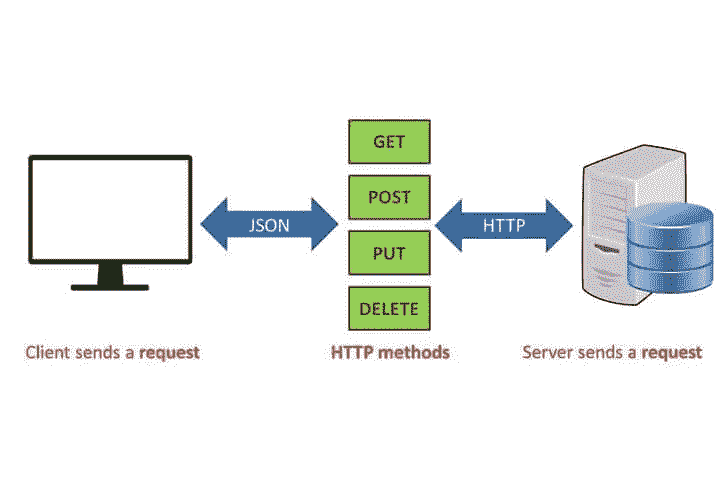

# JavaScript 基础:REST APIs 简介

> 原文：<https://itnext.io/javascript-fundamentals-an-introduction-to-rest-apis-7cbe8a809d3b?source=collection_archive---------0----------------------->


**RE**presentational**S**tate**T**transfer(REST)是一种处理客户机-服务器关系的架构风格，目的是通过使用可重用组件来提高速度和性能。

Roy Fielding 在 2000 年的一篇博士论文中把 REST 作为一种技术介绍给了世界。如今，它通常比 SOAP(简单对象访问协议)更受欢迎，因为 REST 使用的带宽更少，对于互联网的使用更简单、更灵活。我们可以使用它从 web 服务获取或给出一些信息，这是通过对 REST API 的 HTTP 请求来完成的。

***你准备好让你的 CSS 技能更上一层楼了吗？*** *现在就开始用我的新电子书:*[*CSS 指南:现代 CSS 完全指南*](https://gumroad.com/l/the-css-guide) *。获取从 Flexbox & Grid 等核心概念到动画、架构等更高级主题的最新信息！！*

*现已上市！👉【https://gumroad.com/l/the-css-guide】[](https://gumroad.com/l/the-css-guide)*

# *什么是 REST API？*

*REST API 是一种无需额外处理就能轻松访问 web 服务的方式。每当调用 RESTful API 时，服务器将*向客户端传输所请求资源的*状态*的*表示*。**

*事实上，我们几乎每天都在使用它！如果你想在 YouTube 上找到关于骑自行车的视频。你可以在 YouTube 搜索栏中输入“骑自行车”,按回车键，然后你会看到一个关于骑自行车的视频列表。从概念上讲，REST API 就是这样工作的！您搜索一些东西，然后从您请求的服务返回一个结果列表。*

**一个****API****是一个应用编程接口。这是一组允许程序相互通信的规则。开发人员在服务器上创建 API，并允许客户端与之对话。**

***REST** 决定了 API 的外观。这是开发人员在创建 API 时遵循的规则。其中一条规则规定，当您链接到一个特定的 URL 时，您应该能够获得一段数据(一个资源)。*

*每个 URL 被称为一个**请求**，而返回给你的数据被称为一个**响应**。*

# *宁静的建筑*

*那么 REST 的基本特征是什么呢？*

*   ***无状态:**表示客户端数据不存储在服务器上，会话存储在客户端(通常在会话存储中)。*
*   ***客户端< - >服务器:**前端(客户端)和后端(服务器)有关注点的分离。它们彼此独立运行，并且都是可替换的。*
*   ***缓存:**来自服务器的数据可以缓存在客户端，这样可以提高性能速度。*
*   ***URL 组合:**我们使用标准化的方法来组合基本 URL。例如，对`/cities`的一个`GET`请求应该产生数据库中的所有城市，而对`/cities/seattle`的一个`GET`请求将产生一个 ID 为西雅图的城市。类似地，REST 使用标准的方法如`GET`、`PUT`、`DELETE`和`POST`来执行动作。我们将在下一节中研究它！*

*因此，我们可以将 RESTful API 定义为无状态的 API，它将客户端和服务器端的关注点分开，允许客户端缓存数据，并利用标准化的基本 URL 和方法来执行操作、添加或删除数据。*

# *在行动中休息*

*现在让我们仔细看看这是如何做到的！我们的请求以 web URL 的形式通过 HTTP 从客户机发送到服务器。使用 GET、POST、PUT 或 DELETE。然后，服务器以资源的形式发回一个响应，可以是 HTML、XML、Image 或 JSON。JSON 是目前最流行的格式，所以我们将使用它作为例子。*

**

*图片鸣谢: [https://antmedia.io](https://antmedia.io/)*

*HTTP 有五个在基于 REST 的架构中常用的方法:POST、GET、PUT、PATCH 和 DELETE。事实上，它们分别对应于创建、读取、更新和删除(CRUD)操作。还应注意的是，还有其他不常用的方法，如期权和 HEAD。*

*   ***GET:** 这个方法用于**读取**(或者检索)一个资源的表示。如果一切正常，GET 将返回一个 XML 或 JSON 格式的表示和一个 HTTP 响应代码 200 (OK)。在错误情况下，它通常返回 404(未找到)或 400(错误请求)。*
*   ***帖子:**这种方法经常被用来**创造**新资源。特别是，它用于创建从属资源。也就是说，从属于某个其他(例如，父)资源。成功创建后，它返回 HTTP status 201，返回一个 location 头，其中包含指向新创建的 HTTP status 为 201 的资源的链接。*
*   ***PUT:** 它用于**更新**功能，也用于**创建**资源(在资源 ID 由客户端而不是服务器选择的情况下)。本质上，PUT 指向一个包含不存在的资源 ID 值的 URL。一次成功的更新从 PUT 返回 200(如果没有在主体中返回任何内容，则返回 204)。如果使用 PUT for create，它会在成功创建时返回 HTTP 状态 201。*
*   ***补丁:**用于**修改**功能。补丁请求只需要包含对资源的更改，而不是整个资源。这类似于 PUT，但是主体包含一组说明，描述如何修改当前驻留在服务器上的资源以产生新版本。所以补丁体不应该只是资源的一个修改部分，而应该是某种补丁语言，比如 JSON 补丁或者 XML 补丁。*
*   ***删除:**非常简单明了，它用于**删除**由 URL 标识的资源。成功删除后，它将返回 HTTP 状态 200 (OK)以及响应正文。*

# *使用 REST 数据*

*此外，REST APIs 也以标准格式返回数据已经成为惯例。如前所述，如今最流行的格式是 JSON (JavaScript 对象符号)。数据格式的标准化是朝着 web 上资源交互方式的统一性迈出的又一步，允许开发人员解决问题，而不是把时间花在基本架构的配置上！*

*当从 API 请求数据时，您可能会得到类似这样的结果:*

```
*{
    title: "Hi, I am JSON",
    content: [
        chapter: "1",
        page: "100",
        firstParagraph: "I am JSON, this is what I look like when I am returned from an API."
    ],
    author: "Bruce Smithesson"
}*
```

*这种格式允许轻松访问 JSON 中的数据，使用点符号，如`data.title`，它返回“嗨，我是 JSON”。*

*在哪里可以找到 RESTful APIs？到处都是！[推特](https://dev.twitter.com/twitterkit/android/access-rest-api)。[谷歌](https://developers.google.com/drive/v2/reference/)。[打开天气图](https://openweathermap.org/api)。 [YouTube](https://developers.google.com/youtube/v3) 。我们日常使用的大多数流行服务都利用 RESTful 架构来提供 API 服务。因此，继续前进&探索向您的网站添加 API 功能的世界&应用程序！*

****你准备好让你的 JavaScript 技能更上一层楼了吗？*** *今天就开始用我的新电子书吧！无论你是想学习你的第一行代码，还是想扩展你的知识面并真正学习基础知识..*[*《JavaScript 掌握完全指南》*](https://gum.co/mastering-javascript) *带你从零到英雄！**

**

**现已上市！👉[https://gum.co/mastering-javascript](https://gum.co/mastering-javascript)T21**

# *结论*

*我们走吧！我们已经了解了什么是 REST，以及管理其架构的原则。我们已经了解了 REST 如何使用 API 在客户机和服务器之间发送和接收数据。我们还研究了 JSON 格式，这是我们在访问和操作数据时最常使用的格式！*

*我希望这篇文章对你有用！你可以在 Medium 上跟我学。我也在[推特](https://twitter.com/easeoutco)上。欢迎在下面的评论中留下任何问题。我很乐意帮忙！*

# *关于我的一点点..*

*嘿，我是提姆！👋我是一名开发人员、技术作家和作家。如果你想看我所有的教程，可以在我的个人博客上找到。*

*我目前正在构建我的[自由职业者完整指南](http://www.easeout.co/freelance)。坏消息是它还不可用！但是如果这是你可能感兴趣的东西，你可以[注册，当它可用时会通知你](https://easeout.eo.page/news)👍*

*感谢阅读🎉*