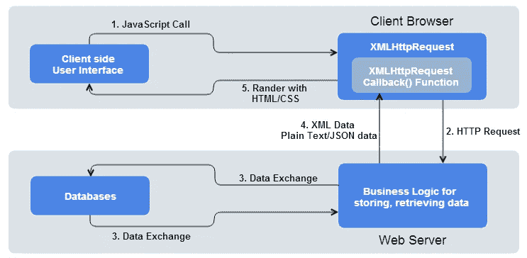

# JavaScript 基础:从服务器获取数据

> 原文：<https://itnext.io/javascript-fundamentals-fetching-data-from-a-server-100ee464231c?source=collection_archive---------2----------------------->


在本文中，我们将了解如何从服务器检索数据。现代网站和应用程序需要能够无缝地做到这一点——也就是说，更新网页的各个部分，而不需要重新加载整个页面。我们将着眼于使这成为可能的两种技术: **XMLHttpRequest** 和 **Fetch API** 。

这篇文章是上一篇文章的继续:[理解 API](/javascript-fundamentals-understanding-apis-3552c822c3e8)。如果您是使用 API 的新手，一定要先检查一下！

🤓想要了解最新的 web 开发吗？🚀*想要将最新消息直接发送到您的收件箱吗？
🎉加入一个不断壮大的设计师&开发者社区！*

**在这里订阅我的简讯→**[**https://ease out . EO . page**](https://easeout.eo.page/)

# 老办法..

使用旧方法在 web 上加载页面非常简单——您可以向服务器发送一个网站请求，如果没有任何问题，组成页面的任何资源都会被下载并显示在您的计算机或设备上。


这是多年来网站的工作方式。然而，它有许多缺陷..每当您想要更新页面的任何部分时，例如，显示一组新的产品或提交一个表单，整个页面都必须重新加载。这种做法非常耗费资源，导致 UX 很差，尤其是当页面变得越来越复杂的时候。

# 解决方案:AJAX

随着允许网页请求小块数据(如 HTML、XML、JSON 或纯文本)并仅在需要时显示它们的技术的出现，这个问题得到了解决。

这是通过使用像`XMLHttpRequest`或 Fetch API 这样的 API 来实现的。这些技术允许网页直接处理对服务器上可用的特定资源的 HTTP 请求，并在显示结果数据之前根据需要格式化结果数据。

这个技巧就是所谓的**【Ajax】**，或者说 **A** 同步**J**avaScript**A**nd**X**ML。最初它主要使用`XMLHttpRequest`来请求 XML 数据(因此有了“and XML”)。然而，现在你更有可能使用`XMLHttpRequest`或 Fetch 来请求 JSON——但是结果还是一样，所以术语“Ajax”被保留了下来。



从概念上讲，Ajax 涉及使用 web API 作为代理来更智能地请求数据，而不仅仅是让浏览器重新加载整个页面。

你可以在几乎每一个主要网站上看到它的运行。例如，当你在 YouTube 上播放一个新视频时，你会看到导航、页眉和页脚部分并没有刷新——只有包含视频的部分。

**为什么这很重要？**

*   页面更新要快得多&你等待页面刷新的时间会更少，所以网站感觉更快，响应更快(页面速度对 Google 排名和 SEO 也很重要！).
*   每次更新下载的数据更少，意味着浪费的带宽更少。虽然这在台式机上不是一个大问题，但在移动设备上却是一个大问题，尤其是在没有高速互联网的发展中国家。

# 创建 Ajax 请求

在这一节中，我们将首先使用一个`XMLHttpRequest`然后获取来执行一个 Ajax 请求。

# XMLHttpRequest

一个`XMLHttpRequest`(通常缩写为 **XHR** )现在实际上是一项相当古老的技术——它是由微软在 90 年代发明的，并且一直沿用至今。

要创建一个 XHR 请求，首先需要使用`XMLHttpRequest()`构造函数创建一个新的请求对象。您可以随意称呼这个对象，在我们的演示中，我们称它为`xhr`。像这样:

```
let xhr = new XMLHttpRequest(); 
```

下一步是使用`open()`方法初始化它。这里我们指定使用什么 HTTP 请求方法从网络请求资源，以及它所在的 URL。这里我们将使用`GET` 方法，并将 URL 设置为一个`url`变量(它应该将地址存储为字符串)。

我们将它添加到上一行的下方:

```
xhr.open('GET', url);
```

接下来，我们将预期的响应类型设置为`text`。这并不是绝对必要的，因为默认情况下 XHR 会返回文本——但是养成这个习惯是个好主意，因为将来你肯定会获取其他类型的数据！现在我们补充一下:

```
xhr.responseType = 'text';
```

每当我们从网络获取资源时，我们都在执行异步操作。这意味着您必须等待该操作完成(当资源从网络返回时)，然后才能对该响应做任何事情，否则将会抛出一个错误。有了 XHR，我们可以使用`onload`事件处理程序来处理这个问题——它在`load`事件触发时运行(在响应返回后)。响应数据将在 XHR 请求对象的`response`属性中可用。

接下来我们创建我们的函数来处理`onload`事件&(在本例中)显示我们的`xhr.status` & `xhr.response`值:

```
xhr.onload = function() {
  alert(`Loaded: ${xhr.status} ${xhr.response}`);
};
```

最后，我们需要一个`send()`方法来运行请求:

`xhr.send();`

# 取得

Fetch API 是一个现代的替代品，可以作为 XHR 的替代品。它使异步 HTTP 请求在 JavaScript 中变得容易。

让我们来看一个语法的基本例子:

```
fetch(url) // Call the fetch function passing the url of the API as a parameter
.then(function() {
    // Your code for handling the data you get from the API
})
.catch(function() {
    // This is where you run code if the server returns any errors
});
```

我们在这里所做的就是获取我们想要的 URL，默认情况下 fetch 使用 GET 方法——这就是我们在本例中想要的！

让我们看看更多的样本代码:

```
fetch('http://example.com/songs.json')
  .then(function(response) {
    return response.json();
  })
  .then(function(myJson) {
    console.log(JSON.stringify(myJson));
  });
```

这里，我们从 URL 获取一个 JSON 文件，然后将其打印到控制台。`fetch()`最简单的用法是接受一个参数——您想要获取的资源的路径——并返回一个包含响应的承诺(以 JavaScript 对象的形式)。

为了从响应中提取 JSON 主体内容，我们使用了`JSON.stringify(myJson)` 方法。然后，我们可以将响应对象转换为可以与之交互的对象。

# 履行承诺

像许多现代 JavaScript APIs 一样，Fetch 使用承诺。虽然一开始他们有点困惑，但现在不要太担心。你会习惯的！

让我们看看与我们的获取请求相关的承诺结构:

```
fetch('http://example.com/songs.json')
  .then(function(response) {
    return response.json();
  })
  .then(function(myJson) {
    console.log(JSON.stringify(myJson));
});
```

第一行是“获取位于我们的 URL 的资源”(`fetch('http://example.com/songs.json')`)和“然后在承诺完成时运行指定的函数”(`.then(function() { ... })`)。“解决”是指“在未来的某个时间点完成执行指定的操作”。

在这种情况下，指定的操作是从我们指定的 URL 获取资源(使用 HTTP 请求)，并返回响应让我们做一些事情。

实际上，传递给`then()`的函数是一段不会立即运行的代码。相反，当响应被返回时，它将在将来的某个时间点运行。

## 那么应该使用哪种技术呢？

XHR 已经存在很长时间了，并且有很好的跨浏览器支持。另一方面，Fetch 和 Promises 是 web 平台的新成员，尽管它们在除 Internet Explorer 之外的所有浏览器中都得到了很好的支持。

如果您需要支持旧的浏览器，那么 XHR 解决方案可能更好。然而，如果你正在做一个更进步的项目，并且不担心旧的浏览器，那么 Fetch 将是一个不错的选择。

***你准备好让你的 JavaScript 技能更上一层楼了吗？*** *今天就开始用我的新电子书吧！无论你是想学习你的第一行代码，还是想扩展你的知识面并真正学习基础知识..*[*JavaScript 掌握完全指南*](https://gum.co/mastering-javascript) *带你从零到英雄！*


*现已上市！👉*[https://gum.co/mastering-javascript](https://gum.co/mastering-javascript)

# 结论

就是这样！我们研究了如何开始使用 AJAX，使用 XHR 和 Fetch 等技术从服务器检索数据。我们看了每一个的基本例子！希望现在您已经掌握了每一项，可以开始将异步操作合并到您的代码中了！

我希望这篇文章对你有用！你可以在 Medium 上[关注我](https://medium.com/@timothyrobards?source=post_page---------------------------)。我也在[推特](https://twitter.com/easeoutco)上。欢迎在下面的评论中留下任何问题。我很乐意帮忙！

# 关于我的一点点..

嘿，我是提姆！👋我是一名开发人员、技术作家和作家。如果你想看我所有的教程，可以在我的个人博客上找到。

我目前正在撰写我的[自由职业完整指南](http://www.easeout.co/freelance)。坏消息是它还不可用！但是如果这是你可能感兴趣的东西，你可以[注册，当它可用的时候会通知你👍](https://easeout.eo.page/news)

感谢阅读🎉