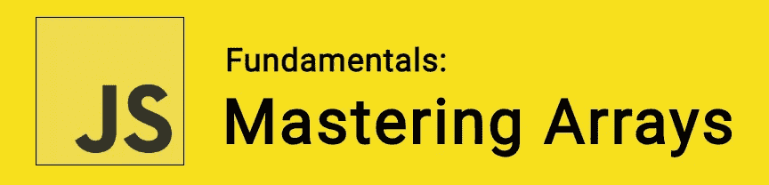

# JavaScript 基础:掌握数组

> 原文：<https://itnext.io/javascript-fundamentals-mastering-arrays-4f5b446287db?source=collection_archive---------7----------------------->



JavaScript 中的*数组*可以被视为一种特殊的变量，它能够一次保存多个值。数组可以包含任何数据类型，包括数字、字符串、布尔值和对象。

更具体地说，数组是一种类似列表的高级对象，它由包含零个或多个数据类型的有序集合(或列表)组成。我们使用从 0 开始的编号索引来访问特定的项目。

🤓*想与 web dev 保持同步吗？*
🚀想要将最新消息直接发送到您的收件箱吗？
🎉加入一个不断壮大的设计师&开发者社区！

**在这里订阅我的简讯→**[**https://ease out . EO . page**](https://easeout.eo.page/)

让我们用一些例子来介绍一下基础知识吧！

# **创建数组**

```
var shapes = [‘Square’, ‘Circle’, 'Triangle']; 
console.log(shapes.length); // 3
```

我们如何访问每个数组项？

```
var first = shapes[0]; // Square 
var second = shapes[1]; // Circle
var last = shapes[shapes.length — 1]; // Triangle
```

# **循环遍历一个数组**

您可以使用任何循环方法，但是让我们使用`forEach`:

```
shapes.forEach(function(item, index, array){
  console.log(item, index);
});// Square 0
// Circle 1
// Triangle 2
```

# **添加到数组末尾**

我们使用`push()`方法:

```
var addItem = shapes.push(‘Rectangle’); // [“Square”, “Circle”, “Triangle”, "Rectangle"]
```

# **从数组末尾移除**

我们使用`pop()`方法:

```
var removeItemEnd = shapes.pop();// [“Square”, “Circle”, “Triangle"]
```

# **从数组前面移除**

我们使用`shift()`方法:

```
var removeItemFront = shapes.shift(); // [“Circle”, "Triangle"];
```

# **添加到数组的前面**

我们使用`unshift()`方法:

```
var addItemFront = shapes.unshift(‘Hexagon’);// [“Hexagon”, “Circle”, "Triangle"];
```

# **获取数组项的索引**

我们使用`indexOf()`方法:

```
var pos = shapes.indexOf(‘Circle’); // 1
```

# **通过步进位置移除项目**

我们使用`splice()`方法:

```
var removedItem = shapes.splice(1, 1); // [“Hexagon”, “Triangle”]
```

# **从一个索引位置移除多个项目**

```
var colors = [‘Red’, ‘Green’, ‘Blue’, ‘Yellow’]; console.log(colors); // [“Red”, “Green”, “Blue”, “Yellow”] var pos = 1, n = 2; 
var removedItems = colors.splice(pos, n); // We use **n** to define the number of items to be removed, from **pos** until **n** inclusive.console.log(colors); 
// [“Red”, “Yellow”] console.log(removedItems); 
// [“Green”, “Blue”]
```

# **复制数组**

我们使用`slice()`方法将数组赋给一个新变量:

```
var arrayCopy = shapes.slice(); // [“Hexagon”, “Triangle”]
```

# 检查对象是否是数组

我们使用`isArray()`方法来测试对象是否是数组:

```
Array.isArray(shapes);// true
```

# 反转数组的顺序

我们使用`reverse()`方法:

```
var food = ['pizza', 'pasta', 'salad', 'bread'];food.reverse();// ["bread", "salad", "pasta", "pizza"]
```

# 用静态值替换数组元素

我们使用`fill()`方法用静态值替换元素:

```
food.fill("yum");// ["yum", "yum", "yum", "yum"]
```

相反，如果我们希望仅替换某些元素，我们可以设置起点和终点:

```
food.fill("yum", 1);// ["bread", "yum", "yum", "yum"]food.fill("yuck", 2,4);// ["pizza", "pasta", "yuck", "yuck"]
```

# 对数组排序

我们使用`sort()`方法根据元素中的第一个字符对元素进行排序。

*注意:*如果我们的第一个字符相同，它会比较第二个，然后是第三个，以此类推。

```
var food = ['pizza', 'pasta', 'salad', 'bread'];food.sort();// ["bread", "pasta", "pizza", "salad"]
```

如果我们的数组项中有任何一个以大写字符开头，它们将在小写项之前排序，例如:

```
var food = ['pizza', 'pasta', '**S**alad', 'bread'];food.sort();// ["**S**alad", "bread", "pasta", "pizza"]
```

使用数字数组时，默认行为可能与您预期的不同:

```
var numbers = [111, 2, 45, 32, 788, 4, 7];// [111, 2, 32, 4, 45, 7, 788]
```

`sort()`方法只检查数字的第一个字符。

因此，为了正确排序，您可以创建如下函数:

```
function sortNumber(a,b) {
  return a - b;
}numbers.sort(sortNumber);// [2, 4, 7, 32, 45, 111, 788]
```

或者，您可以使用箭头功能获得额外的加分:

```
numbers.sort((a, b) => a - b); // For ascending sort
numbers.sort((a, b) => b - a); // For descending sort
```

# 合并数组

我们使用`concat()`方法将两个或多个数组合并在一起:

```
var dogs = ['Labrador', 'Chihuahua', 'Greyhound', 'Beagle'];var cats = ['Persian', 'Siamese', 'Ragdoll', 'Bengal'];var animals = dogs.concat(cats);animals;// ["Labrador", "Chihuahua", "Greyhound", "Beagle", "Persian", "Siamese", "Ragdoll", "Bengal"]
```

# 将数组元素转换为字符串

我们使用`join()`方法:

```
var dogs = ['Labrador', 'Chihuahua', 'Greyhound', 'Beagle'];var joinedDogs = dogs.join();joinedDogs;// "Labrador,Chihuahua,Greyhound,Beagle"
```

如果我们希望新字符串中有空白，或者任何其他的分隔符。我们将它作为参数添加到我们的`join()`中，就像这样:

```
var joinedDogs = dogs.join(', ');joinedDogs;// "Labrador, Chihuahua, Greyhound, Beagle"
```

# 映射()、过滤()和减少()

我们使用`map()`方法对数组的每个元素应用一个函数。

假设我们想给数组中的每个数字加 10:

```
var numbers = [1, 2, 3, 4, 5];var add10 = numbers.map((val, i, arr) => {
  return val + 10;
});numbers;// [1, 2, 3, 4, 5];add10;// [11, 12, 13, 14, 15]
```

我们使用`filter()`方法创建一个新的数组，其中的元素满足参数函数设置的条件。

假设我们想从数组中过滤出负数:

```
var numbers = [-52, 520, 0, -100, 34];function isPositive(value) {
  return value > 0;
}var filtered = numbers.filter(isPositive);filtered;// [520, 34]
```

我们使用`reduce()`方法将一个数组简化为一个值。

假设我们想计算一个数组中所有数字的平均值:

```
var numbers = [300, 43, 888, 2];var average = numbers.reduce((total, amount, index, array) => {
  total += amount;
  if( index === array.length - 1) { 
    return total / array.length;
  }else { 
    return total;
  }
});average;// 308.25
```

# 找到满足函数的第一个元素

我们使用`find()`方法:

```
var numbers = [10, 20, 30, 40, 50];var found = numbers.find(function(element) {
  return element > 30;
});found;// 40 
```

类似地，我们可以使用`findIndex()`方法返回第一个索引位置，而不是元素本身:

```
var numbers = [10, 20, 30, 40, 50];var found = numbers.**findIndex**(function(element) {
  return element > 30;
});found;// 3
```

# 结论

现在你知道了！我们已经回顾了 JavaScript 中许多主要的数组方法。我们讲述了如何创建和循环一个数组，如何添加和删除元素，如何操作数组以及如何对数组元素应用函数！

我希望这篇文章对你有用！可以[跟着我](https://medium.com/@timothyrobards)上媒。我也在[推特](https://twitter.com/easeoutco)上。欢迎在下面的评论中留下任何问题。我很乐意帮忙！

***你准备好让你的 JavaScript 技能更上一层楼了吗？*** *今天就开始用我的新电子书吧！无论你是想学习你的第一行代码，还是想扩展你的知识面并真正学习基础知识..*[*JavaScript 掌握完全指南*](https://gum.co/mastering-javascript) *带你从零到英雄！*


*现已上市！👉*[https://gum.co/mastering-javascript](https://gum.co/mastering-javascript)

# 关于我的一点点..

嘿，我是提姆！👋我是一名开发人员、技术作家和作家。如果你想看我所有的教程，可以在我的个人博客上找到。

我目前正在构建我的[自由职业完全指南](http://www.easeout.co/freelance)。坏消息是它还不可用！但是如果这是你可能感兴趣的东西，你可以[注册，当它可用时会通知你](https://easeout.eo.page/news)👍

感谢阅读🎉