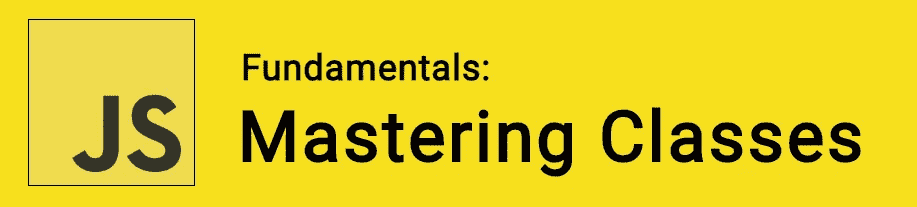
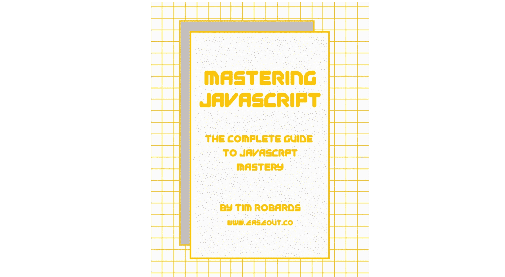

# JavaScript 基础:掌握类

> 原文：<https://itnext.io/javascript-fundamentals-mastering-classes-38e7668023be?source=collection_archive---------2----------------------->



我们在 ECMAScript 2015 中引入了 JavaScript 类，它们通常被描述为 JavaScript 现有原型继承结构上的*语法糖*。因此，虽然类*没有*为 JavaScript 引入新的继承模型，但它们确实提供了语法上的简单性。这种简单性可以帮助我们产生更少的易错代码。

🤓*想了解最新的 web 开发吗？*🚀*想要将最新消息直接发送到您的收件箱？
🎉加入一个不断壮大的设计师&开发者社区！*

**在这里订阅我的简讯→**[**https://ease out . EO . page**](https://easeout.eo.page/)

# 类就像函数！

类与函数非常相似。很像既有函数表达式又有函数声明的函数，类有两个组成部分:**类表达式**和**类声明**。

# 类声明

让我们看看如何使用**类声明**来定义一个类。我们在类名后面使用了`class` 关键字:

```
class Image {
  constructor(height, width) {
    this.height = height;
    this.width = width;
  }
}
```

## 提升

**函数声明**和**类声明**的一个重要区别是函数声明被提升，而类声明没有。您首先需要声明您的类，然后访问它，否则像下面这样的代码将抛出一个`ReferenceError`:

```
const p = new Image(); // ReferenceErrorclass Image{}
```

# 类别表达式

一个**类表达式**是定义类的另一种方式。类表达式可以是命名的，也可以是未命名的。请注意，命名类表达式的名称是局部于类体的。(因此可以通过该类的`name`属性来检索):

```
// An unnamed class expression
let Image = class {
  constructor(height, width) {
    this.height = height;
    this.width = width;
  }
};
console.log(Image.name);
// output: "Image"// A named class expression
let MyImage = class Image {
  constructor(height, width) {
    this.height = height;
    this.width = width;
  }
};
console.log(MyImage.name);
// output: "Image"
```

*注:*类**表达式**受到与之前在类声明部分描述的相同的提升限制。

# 构造器

`constructor`方法是 JavaScript 中的一个特殊方法，我们用它来创建和初始化一个用`class`创建的对象。我们只能在一个类中使用一个名为“constructor”的方法。

我们的构造函数可以使用`super`关键字来调用超类的构造函数(在本文后面会有更多的介绍！).

# 实例属性

实例属性必须在我们的类方法中定义:

```
class Image {
  constructor(height, width) {    
    this.height = height;
    this.width = width;
  }
}
```

如果我们希望使用静态类端属性和原型数据属性，这些属性必须在类体声明之外定义:

```
Image.staticWidth = 50;
Image.prototype.prototypeWidth = 55;
```

# 字段声明

虽然语法仍被认为是实验性的(许多浏览器尚未采用)，但公共和私有字段声明也是值得了解的——因为您经常会开发一个 Babel 来为您转换语法。

## 公共字段声明

让我们用 JavaScript 字段声明语法重温一下我们的例子:

```
class Image {
  height = 0;
  width;
  constructor(height, width) {    
    this.height = height;
    this.width = width;
  }
}
```

不同之处在于我们的字段已经预先声明。所以我们的类定义变得更加自文档化，并且字段总是存在。

*注意:*字段可以声明有或没有默认值！

## 私有字段声明

当我们使用私有字段时，定义可以细化如下:

```
class Image {
  #height = 0;
  #width;
  constructor(height, width) {    
    this.#height = height;
    this.#width = width;
  }
}
```

私有字段(用`#`声明)不能在类外引用，只能在类体内引用。这确保了你的类的用户不能依赖于内部，因为内部可能会随着版本的改变而改变。

*注意:*私有字段以后不能通过赋值来创建。它们只能在字段声明中预先声明。

# 使用'`extends'`的子类

我们可以使用`extends`关键字和*类声明*或*类表达式*来创建一个类作为另一个类的子类。

```
class Vehicle{ 
  constructor(name) {
    this.name = name;
  }

  sound() {
    console.log(`${this.name} makes a sound.`);
  }
}class Car extends Vehicle{
  constructor(name) {
    super(name); // call the super class constructor and pass in the name parameter
  } sound() {
    console.log(`The ${this.name} tooted its horn!`);
  }
}let c = new Car('Volkswagen');
c.sound(); // The Volkswagen tooted its horn!
```

如果子类中存在构造函数，那么在使用“this”之前，需要先调用 super()。

基于函数的“类”也可以扩展:

```
function Vehicle (name) {
  this.name = name;  
}Vehicle.prototype.sound = function () {
  console.log(`${this.name} makes a sound.`);
}class Car extends Vehicle{
  speak() {
    console.log(`The ${this.name} tooted its horn!`);
  }
}let c = new Car('Volkswagen');
c.sound(); // The Volkswagen tooted its horn!
```

*注意:*类不能扩展常规对象！如果你想从一个对象继承，使用`Object.setPrototypeOf()`:

```
const Vehicle = {
  sound() {
    console.log(`${this.name} makes a sound.`);
  }
};class Car{
  constructor(name) {
    this.name = name;
  }
}let c = new Car('Volkswagen');
c.sound(); // Volkswagen makes a sound.
```

# 种类

如果你想从数组类`MyArray`中返回`Array`对象。您可以使用“物种”模式来实现这一点，该模式允许您覆盖默认的构造函数。

如果使用像`map()`这样的方法，它将返回默认的构造函数。然后你会希望这些方法返回一个父`Array`对象，而不是`MyArray`对象。`Symbol.species` 让你这样做，就像这样:

```
class MyArray extends Array {
  // Overwrite species to the parent Array constructor
  static get [Symbol.species]() { return Array; }
}let a = new MyArray(1,2,3);
let mapped = a.map(x => x * x);console.log(mapped instanceof MyArray); // false
console.log(mapped instanceof Array);   // true
```

# “超级”关键词

`super`关键字用于调用超类的相应方法。这是基于原型的继承的一个优势。让我们看一个例子:

```
class Volkswagen { 
  constructor(name) {
    this.name = name;
  }

  sound() {
    console.log(`${this.name} makes a sound.`);
  }
}class Beetle extends Volkswagen {
  sound() {
    super.sound();
    console.log(`${this.name} toots it's horn.`);
  }
}let b = new Beetle('Herbie');
b.sound(); 
// Herbie makes a sound.
// Herbie toots it's horn.
```

# 混合食品

*混音版*是类的模板。一个 ECMAScript 类只能有一个超类，所以从工具类的多重继承是不可能的。该功能必须由超类提供。

在 ECMAScript 中，可以使用一个将超类作为输入、将该超类扩展为输出的子类来实现混合功能:

```
let calculatorMixin = Base => class extends Base {
  calc() { }
};let randomizerMixin = Base => class extends Base {
  randomize() { }
};
```

使用这些混合的类可以写成这样:

```
class First { }
class Second extends calculatorMixin(randomizerMixin(First)) {
```

***你准备好让你的 JavaScript 技能更上一层楼了吗？*** *今天就开始用我的新电子书吧！无论你是想学习你的第一行代码，还是想扩展你的知识面并真正学习基础知识..*[*JavaScript 精通完全指南*](https://gum.co/mastering-javascript) *带你从零到英雄！*



*现已上市！👉*[https://gum.co/mastering-javascript](https://gum.co/mastering-javascript)

# 结论

今天就到这里吧！我们已经深入研究了 JavaScript 类，包括类声明、类表达式、构造函数、实例属性、字段声明、扩展、种类、超级和混合。

我希望这篇文章对你有用！你可以在 Medium 上[关注我](https://medium.com/@timothyrobards)。我也在[推特](https://twitter.com/easeoutco)上。欢迎在下面的评论中留下任何问题。我很乐意帮忙！

# 关于我的一点点..

嘿，我是提姆！👋我是一名开发人员、技术作家和作家。如果你想看我所有的教程，可以在我的个人博客上找到。

我目前正在撰写我的[自由职业完整指南](http://www.easeout.co/freelance)。坏消息是它还不可用！但是如果这是你可能感兴趣的东西，你可以[注册，当它可用的时候会通知你👍](https://easeout.eo.page/news)

感谢阅读🎉