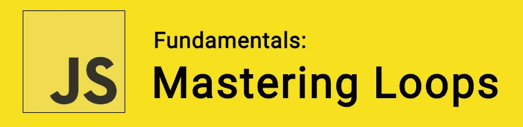

# JavaScript 基础:掌握循环

> 原文：<https://itnext.io/javascript-fundamentals-mastering-loops-6788687a9293?source=collection_archive---------0----------------------->



在 JavaScript 中，当我们需要一种简单的方法来处理重复时，我们使用循环。在本文中，我们将看看在代码中创建循环的所有不同方法——我们将考虑每种方法的优缺点。

🤓*想与 web dev 保持同步吗？*🚀想要最新的新闻直接发送到你的收件箱吗？
🎉加入一个不断壮大的设计师&开发者社区！

**在这里订阅我的简讯→**[**https://ease out . EO . page**](https://easeout.eo.page/)

思考循环的一种方式可以是向机器人发出命令。您可以告诉它采取 10 个步骤，而不是发出 10 个单独的命令，我们可以创建一个循环:

```
let i;
for (i = 0; i < 10; i++) {
  document.write("Take one step!\n");
} 
```

这是一个`for`循环的例子。起初这可能会令人困惑——但是我们将在下一节中对其进行分解！在本文中，我们将回顾许多不同种类的循环语句，例如:`for`、`do...while`、`while`、`break statement`、`continue statement`、`for...in`、&、`for...of`。值得注意的是，尽管它们在语法上有所不同，但循环本质上都做同样的事情:多次重复一个动作。这种情况决定了哪种类型的环路最适合。

# `the for`循环

正如我们在上面的例子中看到的，一个`for`循环将会重复，直到我们的条件评估为假。逻辑结构是这样的:

```
for ([initialExpression]; [condition]; [incrementExpression])
  statement
```

我们首先初始化`initialExpression`，它通常初始化一个或多个循环计数器，但是语法甚至允许更复杂的表达式，比如变量。我们接下来评估我们的`condition`，如果*为真*，循环语句将执行。如果*为假*，循环终止。

然后`statement`执行。当我们希望执行多个语句时，我们使用一个块语句(`{ ... }`)将它们组合在一起。如果存在，则执行更新表达式`incrementExpression`。控制然后返回评估`condition`。

现在让我们回到之前的例子:

```
let i;
for (i = 0; i < 10; i++) {
  document.write("Take one step!\n");
}
```

这里我们可以看到我们的`for`语句正在计算 10 步。变量`i`将确保我们从零开始初始化。然后它会检查`i`是否小于我们指定的数字，在我们的例子中是 *10* 。`i++`是每次循环后将`i`加 1 的计数。所以我们的循环知道什么时候结束！

# `do...while`声明

将重复`do...while` 语句，直到条件评估为*假*。结构是这样的:

```
do
  statement
while (condition);
```

这是不言自明的，`statement`总是在检查条件之前执行一次。然后再次返回，直到 while 条件返回假。我们可以执行多个语句，使用一个 block 语句(`{ ... }`)将它们分组。如果`condition`为*真*，该语句再次执行。每次执行结束时，都会检查条件。当条件返回*假*时，执行停止，控制转到`do...while`之后的语句。

让我们看一个例子:

```
let i = 0;
do {
  i += 1;
  console.log(i);
} while (i < 10);
```

这里我们的`do`循环至少迭代一次，然后重复直到`i`不再小于 10。

# `while`声明

只要指定的条件评估为*真*，一个`while`语句就执行其语句。其语法如下:

```
while (condition)
  statement
```

如果条件变为*假*，循环内的`statement`停止执行，然后控制传递给循环后的语句。

条件测试发生在循环中的`statement`执行之前。如果条件返回*真*，则执行`statement`并再次测试条件。如果条件返回*假*，执行将停止，控制传递给`while`之后的语句。

和`do...while`一样，我们可以使用 block 语句({ … })将多个语句组合在一起执行。

只要`a`小于三，下面的`while`循环就会迭代:

```
let a = 0;
let b = 0;while (a < 3) {
  a++;
  b+= a;
}
```

这里，随着每次迭代，循环增加`a`并将该值加到`b`。因此，`a`和`b`取以下值:

*   第一次循环后:`a` = 1，`b` = 1
*   而第二遍:`a` = 2、`b` = 3
*   而第三遍:`a` = 3、`b` = 6

第三遍完成后，条件`a < 3`不再为*真*，因此我们的循环在此终止！

**注意:**当您第一次开始使用循环时，您可能会意外地创建一个*无限循环*。这是循环条件从不评估为*假的时候。*以下`while`循环中的语句永远执行，因为条件永远不会为假:

```
while (true) {
  console.log('Hi there!');
}
```

注意:如果你运行这段代码，请注意它可能会使你的浏览器崩溃！！所以，如果你想看看会发生什么，确保你已经备份了你打开的标签。

# `labeled`声明

您可以给任何语句附加一个`label`作为标识符，这样您就可以在程序的其他地方引用它。例如，您可以使用一个标签来标识一个循环，然后使用`break`或`continue`语句来指示一个程序是应该中断循环，还是继续执行(我们将在下面看一下)。

```
label :
   statement
```

`*label*`的值可以是您喜欢的任何值(JavaScript 保留字除外)。然后你提供`*statement*`来执行。

例如，你可以用标签`totalLoop`来标识一个`while`循环。

```
totalLoop:
while (total == true) {
   doSomething();
}
```

# `break`声明

我们使用`break`语句来终止一个循环或者`switch`，或者与一个带标签的语句结合使用。

*   当您使用不带标签的`break`时，它会立即终止最内层的`while`、`do-while`、`for`或`switch`，并将控制权转移给下面的语句。
*   当您将`break`与标签一起使用时，它会终止指定的带标签语句。

一个`break`语句看起来像这样:

```
break [*label*];
```

例如，让我们循环遍历一个数组，直到找到值为:`foundMe`的元素的索引

```
for (let i = 0; i < a.length; i++) {
  if (a[i] == foundMe) {
    break;
  }
}
```

让我们使用 break 和一个带标签的语句:

```
let x = 0;
let z = 0;
endLoops: while (true) {
  console.log('Outer loops: ' + x);
  x += 1;
  z = 1;
  while (true) {
    console.log('Inner loops: ' + z);
    z += 1;
    if (z === 10 && x === 10) {
      break endLoops;
    } else if (z === 10) {
      break;
    }
  }
}
```

# `continue`声明

我们使用`continue`语句来重启`while`、`do-while`、`for`或`label` 语句。

*   当您在没有标签的情况下使用`continue`时，它会终止最内层的`while`、`do-while`或`for`语句的当前迭代，并继续执行下一次迭代的循环。这与`break`语句形成对比，因为`continue`不会完全终止循环的执行。在`while`循环中，它跳回该条件。在`for`循环中，它跳到`initial-expression`。
*   当您将`continue`与标签一起使用时，它适用于用该标签标识的循环语句。

一个`continue`语句看起来像这样:

```
continue [*label*];
```

例如，下面的代码块显示了一个带有`continue`语句的`while`循环，该语句将在`i`的值为 3 时执行。因此`n`取值为 1、3、7 和 12。

```
let i = 0;
let n = 0;while (i < 5) {
  i++;
  if (i == 3) {
    continue;
  }
  n += i;
  console.log(n);
}// 1,3,7,12 let i = 0; 
let n = 0; while (i < 5) { 
  i++; 
  if (i == 3) { 
     // continue; 
  } 
  n += i; 
  console.log(n);
}// 1,3,6,10,15
```

# `for...in`声明

一个`for...in`语句在一个对象的所有可枚举属性上迭代一个指定的变量。对于每个不同的属性，JavaScript 执行指定的语句。语法如下:

```
for (variable in object) {
  statements
}
```

以下函数将一个对象和该对象的名称作为其参数。然后，它遍历对象的所有属性，并返回一个列出属性名称及其值的字符串。

```
function get_names(obj, obj_name) {
  let result = '';
  for (let i in obj) {
    result += obj_name + '.' + i + ' = ' + obj[i] + '<br>';
  }
  result += '<hr>';
  return result;
}
```

对于具有属性`lunch`和`dinner`的对象`food`，`result`将是:

```
food.lunch = Sandwich
food.dinner = Lasagna
```

*注意:*鉴于`for...in`是为迭代对象属性而构建的，所以不推荐使用数组——在数组中索引顺序很重要。对于数组，最好使用更传统的`for`循环。

# `for...of`声明

一个`for … of`语句创建一个循环，该循环遍历可迭代的对象，比如`Array`、`Map`、`Set`、`arguments`等等。语法是这样的:

```
for (*variable* of *object*) {
  *statement* }
```

以下示例显示了`for...of`弧线和`for … in`弧线之间的区别。`for...in`遍历属性名，`for...of`遍历属性值:

```
let arr = [10, 20, 30];
arr.greet = 'hello';for (let i in arr) {
   console.log(i); // logs "0", "1", "2", "greet"
}for (let i of arr) {
   console.log(i); // logs 10, 20, 30
}
```

***你准备好让你的 JavaScript 技能更上一层楼了吗？*** *今天就开始用我的新电子书吧！无论你是想学习你的第一行代码，还是想扩展你的知识面并真正学习基础知识..*[*JavaScript 掌握完全指南*](https://gum.co/mastering-javascript) *带你从零到英雄！*


*现已上市！👉*[https://gum.co/mastering-javascript](https://gum.co/mastering-javascript)

# 结论

就是这样！我们已经了解了许多不同的循环语句，例如:`for`、`do...while`、`while`、`labeled statement`、`break statement`、`continue statement`、`for..in`、&、`for...of`。我们已经看了很多例子，强调了每种循环的理想用例。无论我们选择使用哪种语句，我们现在都可以很好地为我们的程序添加逻辑和推理。

我希望这篇文章对你有用！可以[跟着我](https://medium.com/@timothyrobards)上媒。我也在[推特](https://twitter.com/easeoutco)上。欢迎在下面的评论中留下任何问题。我很乐意帮忙！

# 关于我的一点点..

嘿，我是提姆！👋我是一名开发人员、技术作家和作家。如果你想看我所有的教程，可以在我的个人博客上找到。

我目前正在构建我的[自由职业者完整指南](http://www.easeout.co/freelance)。坏消息是它还不可用！但是如果你对它感兴趣，你可以[注册，当它可用时会通知你](https://easeout.eo.page/news)👍

感谢阅读🎉