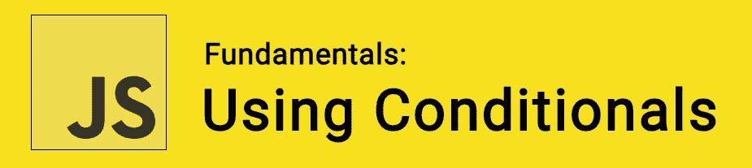

# JavaScript 基础:使用条件

> 原文：<https://itnext.io/javascript-fundamentals-using-conditionals-ce707939a388?source=collection_archive---------7----------------------->



当我们想在程序中引入逻辑和做出决定时，我们使用**条件句**。有了条件，我们可以控制代码的行为——通过确定代码片段是否可以运行。

例如，当使用天气应用程序时，如果天气晴朗，我们可以看到太阳图像，或者如果下雨，我们可以看到雨云图像。现在让我们看看如何在代码中实现条件..

🤓想要了解最新的 web 开发吗？
🚀想要最新的新闻直接发送到你的收件箱吗？
🎉加入一个不断壮大的设计师&开发者社区！

**在这里订阅我的简讯→**[**https://ease out . EO . page**](https://easeout.eo.page/)

# if/else 语句

最常见的条件语句类型是`if`和`else`语句。语法看起来像这样:

```
if (condition) {
  run this code if the condition is true
} else {
  run this code instead
}
```

我们使用`if`，后跟一组包含我们的**条件**的括号。该条件将使用比较运算符来测试我们的条件的计算结果是`true`还是`false`，并返回结果。

如果结果是`true`，将执行下面一组花括号中的代码。这个部分中的代码可以是我们喜欢的任何代码。

如果结果是`false`，包含在我们的`else`语句后面的花括号中的代码将会执行。

让我们来看一个例子:

```
if (hour < 12) {
  notify = "It is AM";
} else {
  notify = "It is PM";
}
```

在我们上面的代码中，如果`hour`小于 12，我们的`notify`变量将被设置为*“它是 AM”*。否则`hour`大于 12，将设置为*“是 PM”*。

# 否则如果

当然，我们经常会有两个以上的选择！为了考虑这些额外的选择，我们使用`else if`。我们在我们的`if () {}`和`else {}`语句之间放置了额外的块。让我们调整一下前面的例子，看看这是一个动作:

```
if (hour < 12) {
  notify = "It is Morning";
} else if (hour < 19){
  notify = "It is Afternoon";
} else {
  notify = "It is Evening";
}
```

# 比较运算符

为了测试条件语句中的条件，我们使用了**比较运算符**。这些运算符如下:

*   `===`和`!==` —测试一个值是否等于另一个值。
*   `<`和`>` —测试一个值是否小于或大于另一个值。
*   `<=`和`>=` —测试一个值是否小于或等于另一个值，或者大于或等于另一个值。

在条件语句中进行比较时，一个非常常见的模式是测试布尔值(`true`和`false`)。当作为条件语句测试时，任何不是`false`、`undefined`、`null`、`0`、`NaN`或空字符串(`''`)的值实际上都将返回`true`。这意味着你可以很容易地使用一个变量名来测试它是否是`true`，或者它是否存在(即它不是未定义的)。)比如:

```
let snack = 'Cheetos';if (snack) {
  console.log('I have Cheetos!');
} else {
  console.log('No Cheetos this time..');
}
```

# 嵌套 if/else

有时候你会想将一个`if/else`语句嵌套在另一个语句中——这样做没问题！让我们看一个例子:

```
if (snack === 'Cheetos') {
  if (hungerLevel > 5) {
    console.log('My hunger level is' + hungerLevel + ' and I have Cheetos. So I will eat them!');
  } else if (hungerLevel <= 5) {
    console.log('My hunger level is' + hungerLevel + ' and even though I have Cheetos. I\'m not that hungry so I won\'t eat them yet!');
  }
}
```

# 逻辑运算符:与、或与非

我们还可以测试多个条件，而不需要编写嵌套的`if/else`语句，我们用逻辑运算符来实现:

**和:** `&&` -允许你将两个或更多的表达式链接在一起。每个表达式都必须计算为`true`，整个表达式才能返回`true`。

让我们用 AND 重写前面的例子:

```
if (snack === 'Cheetos' && hungerLevel > 5) {
  console.log('My hunger level is' + hungerLevel + ' and I have Cheetos. So I will eat them!');
} else if (snack === 'Cheetos' && hungerLevel <= 5) {
  console.log('My hunger level is' + hungerLevel + ' and even though I have Cheetos. I\'m not that hungry so I won\'t eat them yet!');
}
```

只有当`snack === 'Cheetos'` *和* `hungerLevel < 5` 返回`true`时，第一个代码块才会运行。

**或:** `||` -也允许你将两个或更多的表达式链接在一起。他们中的一个或多个必须对`true`求值，以得到返回`true`的整个表达式。

让我们看一个使用 OR 的例子:

```
if (trafficLightIsGreen || carStatus === 'working') {
  console.log('You should commence driving.');
} else {
  console.log('Might be an issue.');
}
```

**非:**`!`——可以用来否定一个表达式。让我们把它和上面例子中的 OR 结合起来:

```
if (!(trafficLightIsGreen || carStatus === 'working')){
  console.log('You should commence driving.');
} else {
  console.log('Might be an issue.');
}
```

在这个例子中，我们的 OR 语句返回`true`，但是 NOT 操作符将对其求反，因此整个表达式现在返回`false`。

在条件语句中使用逻辑 OR 运算符时，一个常见的错误是试图陈述一次要检查其值的变量，然后给出一个可能返回 true 的值列表，用`||` (OR)运算符分隔。例如:

```
if (x === 10 || 20 || 30 || 40) {
  // run this code
}
```

在这种情况下，`if(...)`内的条件将总是评估为真，因为 20(或任何其他非零值)总是评估为真。这个条件实际上是说“如果 x 等于 10，或者 20 是真的——它总是这样”。这在逻辑上不是我们想要的！要实现这一点，您必须在每个 OR 操作符的任意一端指定一个完整的测试:

```
if (x === 10 || x === 20 || x === 30 || x === 40) {
  // run this code
}
```

# switch 语句

语句在启用条件代码方面做得很好，但它们并不总是处理所有场景的最佳方式。当您有几个选项，并且每个选项都需要运行合理数量的代码时，它们就非常有用。当条件复杂时(例如多个逻辑操作符)，它们也很有用。

如果您只想将变量设置为某个选择的值，或者根据条件打印出特定的语句，那么语法可能会有点低效，尤其是在您有大量选择的情况下。

这就是我们应该考虑使用`switch`语句的时候了！—它们将单个表达式/值作为输入，然后在许多选择中寻找，直到找到与该值匹配的一个，并执行相应的代码。让我们看一个例子:

```
switch (new Date().getDay()) {
  case 0:
    day = "Sunday";
    break;
  case 1:
    day = "Monday";
    break;
  case 2:
    day = "Tuesday";
    break;
  case 3:
    day = "Wednesday";
    break;
  case 4:
    day = "Thursday";
    break;
  case 5:
    day = "Friday";
    break;
  case 6:
    day = "Saturday";
}
```

我们使用关键字`switch`，后跟一组包含表达式的括号。接下来是关键字`case`，接下来是表达式/值的选择，接下来是冒号。然后，如果选择与表达式匹配，我们将包含一些要运行的代码。最后一个`break`声明。

如果前面的选择与表达式/值匹配，浏览器将停止执行此处的代码块，并继续执行出现在 switch 语句下的任何代码。我们可以根据需要包含任意多的其他案例！

# 三元运算符

在本文的最后一部分，让我们来看一下**三元运算符**。这是一小段测试条件的语法，如果是`true`，返回一个值/表达式，如果是`false`，则返回另一个值/表达式——这在某些情况下很有用，并且比`if/else`块占用的代码少得多。伪代码如下所示:

```
( condition ) ? run this code : run this code instead
```

让我们看一个简单的例子:

```
let age = 25;
let beverage = (age >= 18) ? "Beer" : "Apple Juice";
console.log(beverage); // "Beer"
```

如果 `age`是`true`，顾客可以买一瓶啤酒，如果不是，我们只能卖给他们苹果汁。

***你准备好让你的 JavaScript 技能更上一层楼了吗？*** *今天就开始用我的新电子书吧！无论你是想学习你的第一行代码，还是想扩展你的知识面并真正学习基础知识..*[*JavaScript 掌握完全指南*](https://gum.co/mastering-javascript) *带你从零到英雄！*


*现已上市！👉*[https://gum.co/mastering-javascript](https://gum.co/mastering-javascript)

# 结论

就是这样！我们已经了解了如何在代码中使用条件来做决定。通过使用 if、else 和 switch 语句，结合比较、逻辑和三元运算符——我们已经准备好将逻辑引入我们的程序！

我希望这篇文章对你有用！你可以在 Medium 上[关注我](https://medium.com/@timothyrobards)。我也在[推特](https://twitter.com/easeoutco)上。欢迎在下面的评论中留下任何问题。我很乐意帮忙！

# 关于我的一点点..

嘿，我是提姆！👋我是一名开发人员、技术作家和作家。如果你想看我所有的教程，可以在我的个人博客上找到。

我目前正在撰写我的[自由职业完整指南](http://www.easeout.co/freelance)。坏消息是它还不可用！但是如果这是你可能感兴趣的东西，你可以[注册，当它可用的时候会通知你👍](https://easeout.eo.page/news)

感谢阅读🎉