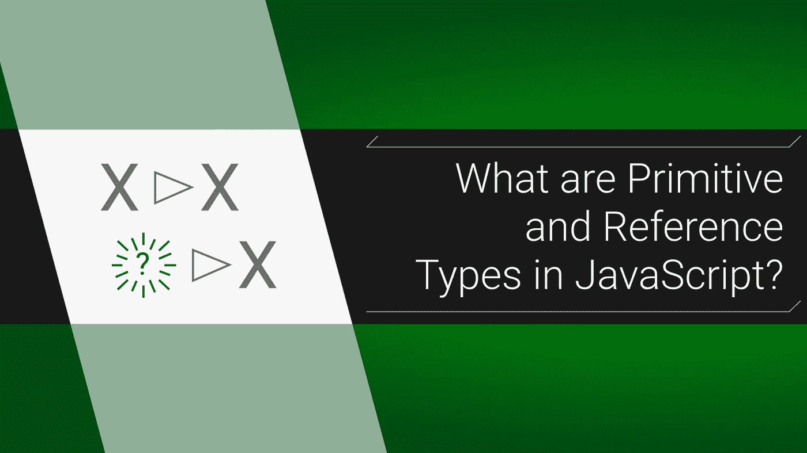
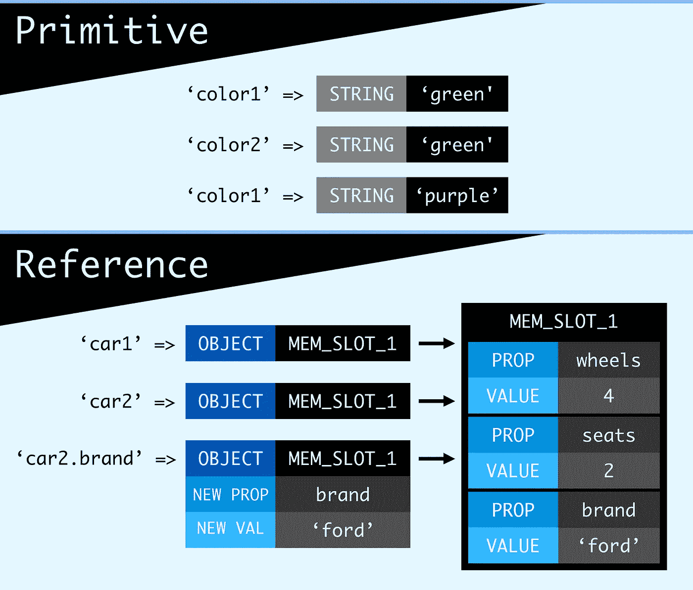

# JavaScript 中的原语和引用类型是什么？

> 原文：<https://itnext.io/javascript-interview-prep-primitive-vs-reference-types-62eef165bec8?source=collection_archive---------4----------------------->

## 理解 JavaScript 如何处理不同的数据



在 JavaScript 面试中，他们可能会问你是否理解*原语*和*引用*数据类型之间的区别。幸运的是，这个主题是计算机科学中少数几个名字可以解释一切的主题之一。数据类型存储信息有两种方式:作为内存中的一个槽，或者作为对内存中某个位置的一个槽的引用。你能猜出哪个是哪个吗？

# 首先:原始类型

原始数据类型有:数字、字符串、布尔、未定义和 null(还有[符号](https://www.keithcirkel.co.uk/metaprogramming-in-es6-symbols/)，所以检查一下这些)。基本上，如果它存储一个简单的数据，它就被简单地存储了。当你用这种类型设置一个变量时，这个变量就是那个精确的值，仅此而已。如果你改变了这个值，这个变量就会变成一个新值。

# 下一步:引用类型

这意味着两个引用类型是对象和数组(技术上来说是一个，[，因为数组是对象](https://stackoverflow.com/questions/5048371/are-javascript-arrays-primitives-strings-objects))。创建对象时，该值不会直接赋给变量。相反，对该值的引用*被设置。变量所知道的只是对象在内存中的位置，而不是对象本身。*

# 用家务隐喻来解释它

假设你需要提醒自己去洗碗。如果你要原始地储存它，你会拿一张纸，写下“洗碗”但是如果你的室友已经做过了呢？现在你的任务是倒垃圾。因为它是原始储存的，你只要拿起那张纸，擦掉“洗碗”并写下“倒垃圾”

为了通过参考来保存你的杂务，你的室友会保留一份所有杂务的清单。当你需要知道还剩下什么或者划掉一个的时候，你问他们，然后*他们*访问列表。你自己没有名单，你只是知道去哪里找。隐喻说够了，让我们看一些代码。

# 复制值的代码才是最重要的

当复制或传递值时，这些都会真正发挥作用。看看这段复制原始值的代码:

```
let **color1** = *'green'*;
let **color2** = **color1**;
**color1** = '*purple'*;**console**.log(**color1**);
*// 'purple'*
**console**.log(**color2**);
*// 'green'*
```

`color1`被赋予字符串值`‘green’`，这意味着变量`color1`本质上与字符串`'green'`相同。当我们用`color1`给`color2`赋值时，就好像我们真的给它赋值了一个字符串值。所以当我们重新分配`color1`的值时，它对`color2`完全没有影响。这两种价值观永远只是储蓄字符串，它们之间没有持久的债券。引用类型不是这种情况。看:

```
let **car1** = {
  *wheels*: 4,
  *seats*: 2,
};
let **car2** = **car1**;
**car1**.*brand* = *'ford'*;**console.**log(**car1**.brand);
*// 'ford'*
**console**.log(**car2**.brand);
*// 'ford'*
```

哼。我们从未给`car2`分配品牌资产，但它有一个。尽管情况看起来与我们的原始示例相同，但行为是相反的。那是因为`car1`从未被赋予对象的*值*，只有*引用*到它。因此，如果您更改`car1`，将会改变内存中`car2`正在查看的同一个位置:



# 解决参考问题

通过添加那个`brand`属性，我们永久地改变了原始对象。这就是所谓的突变，当我们不小心超过预期目标时，这并不好。为了解决这个问题，我们只需要创建一个对*新*对象的*新*引用。这样，每个变量都将指向自己的对象，不会有任何重叠。最常见的方法是使用 [Object.assign 或 spread 操作符](https://thecodebarbarian.com/object-assign-vs-object-spread.html)。为简洁起见，我们使用一个跨页:

```
let **car1** = {
  *wheels*: 4,
  *seats*: 2,
};
let **car2** = {...**car1**};
**car1**.brand = *'ford'*;**console.**log(**car1**.brand);
*// 'ford'*
**console**.log(**car2**.brand);
*// undefined*
```

# 最后一件事

对象是可变的，意味着它们可以改变([除非你冻结它](https://developer.mozilla.org/en-US/docs/Web/JavaScript/Reference/Global_Objects/Object/freeze))。然而，原始类型是不可变的。看，你实际上不能把数字`1`变成`2`，你只是替换了这个值。这意味着我们没有改变我们的“绿色”字符串，我们只是直接用新字符串“紫色”替换它这是一个偷偷摸摸的小技术问题，但现在你知道了！祝你面试顺利，一如既往，

大家编码快乐，

麦克风

*最新文章:* [如何用 React 钩子构建一个动态的、可控的表单](https://medium.com/@mikecronin92/how-to-build-a-dynamic-controlled-form-with-react-hooks-2019-b39840f75c4f)