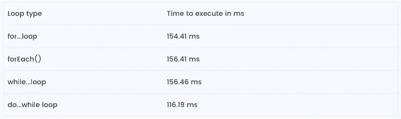

# JavaScript 循环比较和性能

> 原文：<https://itnext.io/javascript-loops-comparison-and-performance-e4e29db87455?source=collection_archive---------4----------------------->


[Duomly —编程在线课程](https://www.duomly.com)

本文最初发表于:[https://www . blog . duomly . com/for-loop-while-loop-do-while-loop-and-other-JavaScript-loops-comparison-and-performance/](https://www.blog.duomly.com/for-loop-while-loop-do-while-loop-and-other-javascript-loops-comparison-and-performance/)

循环在软件开发中起着至关重要的作用，它们被用来迭代数组或其他可迭代的元素。在 Javascript 中，我们有几种不同类型的循环。有时，我们会混淆在特定情况下应该使用哪个循环，以及哪个循环对我们的性能来说是最好的。
在这篇文章中，我将比较 Javascript 中的循环，描述它们的优缺点，测试它们的速度。

# for…循环和。forEach()

JavaScript 中最常见也是最常用的循环，它在代码块中循环指定的次数。让我们来看看 for…loop 的代码语法:

```
for (let i = 0; i <= 20; i++) {
    console.log(‘www.duomly.com’);
}
```

它由三个元素组成，用分号分隔。首先，我们需要用**初始化器**初始化开始循环的变量:让 I = 0；下一个元素是**测试条件**，它检查代码将执行多少次:i < = 20，最后一个元素是 **updater** ，它在每次迭代结束时被调用，以增加或减少循环的计数器。这个循环非常灵活，我们可以在我们决定的任何点运行它，也可以在任何点停止它，这也不难理解。for…loop 的缺点是不适合任何一种数据，如果理解不好，很容易搞砸。性能:现在让我们简单地测试一下 for…循环在不同浏览器中的速度。我将在 Chrome、Safari 和 Firefox 中调用以下代码来检查循环速度:

**性能:**

现在让我们简单测试一下 for…循环在不同浏览器中的速度。我将在 Chrome、Safari 和 Firefox 中调用以下代码来检查循环速度:

```
var counter = 1000;
var t0 = performance.now();
for (let i = 0; i < counter; i++) {
    console.log(‘www.duomly.com’);
}
var t1 = performance.now();
console.log(“For…loop ” + (t1 – t0) + ” milliseconds.”);
```

**测试结果:**

铬合金:154.41 毫秒

火狐:243.56 毫秒

Safari: 13 毫秒

在 for…loop 的情况下，还值得一提的是它可以与。forEach()数组方法。让我们来看看它是如何工作的:

```
var array = [10, 20, 30, 40];
array.forEach((item, index) => { console.log(item) });
```

正如你在上面的例子中看到的。forEach()方法也遍历了一个数组，但是这里我们没有指定 condition 或者 updater，这里我们遍历了给定的数组，我们可以返回每一项。让我们检查一下这个方法的性能:

```
var array = Array.from(Array(1000).keys(), n => n + 1);
var t0 = performance.now();
array.forEach((item, index) => { console.log(‘www.duomly.com’); });
var t1 = performance.now();
console.log(“.forEach() ” + (t1 — t0) + ” milliseconds.”);
```

**测试结果:**

铬合金:156.41 毫秒

火狐:180 毫秒

Safari: 12 毫秒

作为我们测试的结果，我们可以看到。在 Firefox 和 Safari 浏览器中，forEach()方法比 for 循环快，但在 Chrome 中，它需要多花大约 3ms。

# while…循环

While…loop 非常类似于 for…loop，用于重复代码块，直到条件为假。当执行 while 循环时，首先评估条件，因此，如果条件在第一次迭代时为假，则有可能根本不会调用代码块。让我们来看看 while 循环语法:

```
var counter = 20;
var i = 0;
while (i < counter) {
   console.log(‘www.duomly.com’);
   i++
}
```

while 循环也由测试条件、要执行的代码和更新程序组成。while 循环的主要优点是，它可以运行很长时间，直到满足条件，但另一方面，它很容易忘记，如果我们不提供条件，将产生错误的结果，最终将出现无限循环，并将导致应用程序冻结。性能:我们来看看 while loop 能有多快。同样，我将基于以下代码在 Chrome、Firefox 和 Safari 上测试它:

```
var counter = 1000;
var i = 0;
var t0 = performance.now();
while(i < counter) {
    console.log(‘www.duomly.com’);
    i++;
}
var t1 = performance.now();
console.log(“While…loop ” + (t1 – t0) + ” milliseconds.”);
```

**测试结果:**

铬合金:156.46 毫秒

火狐:243.60 毫秒

Safari: 18 毫秒

# do…while 循环

Do…while 是另一种循环，它的工作方式与 while 循环几乎相同，但有一个小的区别，首先执行代码块，然后检查条件。让我们来看看 do while 循环的语法:

```
var counter = 1000;
do {
    console.log(‘www.duomly.com’);
    i++;
} while (i < counter);
```

正如您在上面的代码片段中看到的，首先我们有要执行的代码，它将至少运行一次，在第一次条件检查之前。在 do{}里面我们也有更新程序，下面有一个条件测试。这个循环的最大优点是，即使条件已经为假，代码也可能至少执行一次。性能:让我们测试另一个流行的 Javascript 循环的速度。我将再次在 Chrome、Firefox 和 Safari 三种浏览器上测试它，代码如下:

```
var t0 = performance.now();
var counter = 1000;
var i = 0;
do {
    console.log(‘www.duomly.com’);
    i++;
} while (i < counter);
var t1 = performance.now();
console.log(“Do…while loop ” + (t1 – t0) + ” milliseconds.”);
```

**测试结果:**

铬合金:116.19 毫秒

火狐浏览器:189.71 毫秒

Safari: 18 毫秒

# 对于…在循环中

For…in 循环是 Javascript 中的另一个 For 循环，它允许遍历对象属性，代码块将对每个属性执行一次。让我们看一下代码示例:

```
var person = {
    name: ‘Peter’,
    age: 19,
    city: ‘London’,
}for (let item in person) {
    console.log(‘key: ‘, item, ‘value: ‘, person[item]);
}
```

正如您在示例中看到的，循环中的代码被调用的次数与我们在对象中拥有的属性一样多。在这种循环中没有更新器和条件测试。这种循环的最大优点是可以遍历对象，而这在其他循环中是不可能的。

# for…of 循环

For…of loop 是 ES6 引入的一个新循环，它还允许迭代具有[Symbol.iterator]属性的可迭代集合。它可以与数组或字符串一起使用。让我们看一下代码示例:

```
var string = ‘Duomly’;for (let char of string) {
    console.log(char)
}
```

# 绩效总结

在本文中，我测试了三个流行的循环和一个数组方法的性能，分别是 for 循环、while 循环、do…while 循环和。forEach()方法。我在三种不同的浏览器中，用相似的代码进行了测试，执行次数相同。现在让我们来看一看我们得到的所有数据的摘要。



[Duomly —编程在线课程](https://www.duomly.com)

所有循环都在 Chrome 浏览器中进行了测试。从表中我们可以看到 do…while 循环是最快的。For 循环是第二快的。forEach()方法是测试环境中最慢的方法。

# 结论

在本文中，我描述了 Javascript 编程语言中五种不同的循环，并测试了其中三种的性能。其他两个循环以不同的方式工作，所以比较不可靠。循环的使用在软件开发中非常普遍，但是作为开发人员，我们需要记住正确的实现和避免嵌套循环，因为它对性能有不好的影响。此外，在 while 循环的情况下，重要的是要注意在某些时候需要为假的条件，以免破坏代码。要掌握 Javascript 循环知识，请加入我们在 www.duomly.com[的 Javascript 课程。](http://www.duomly.com.)小心你的循环，好好编码。


[Duomly —编程在线课程](https://www.duomly.com)

感谢您的阅读。

文章由我们的队友安娜提供。