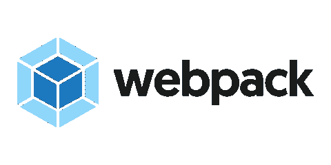

# JavaScript 新闻(2018 年 2 月)

> 原文：<https://itnext.io/javascript-news-february-2018-20d9666d28f3?source=collection_archive---------6----------------------->

[*点击这里在 LinkedIn* 上分享这篇文章](https://www.linkedin.com/cws/share?url=https%3A%2F%2Fitnext.io%2Fjavascript-news-february-2018–20d9666d28f3)

二月即将过去，这意味着是时候让 [DHTMLX 团队](https://dhtmlx.com/)与你分享 JavaScript 世界最有趣的新闻和更新了。这个月你可能会错过一些东西。PPO，StackOverflow 最受欢迎的收藏。Webpack 4 快了 98%。提升 React 应用的性能。在 Vue 中创建可重用的过渡。这些以及我们今天的其他新闻。好吧，我们走。

# 新的开发工具和更新

## PPO，一个小而有用的 Utils 库

ppo utils 库的开发者收集了最广泛使用和最有用的函数，可以简化你的日常开发程序。据作者所说，大部分代码来自 StackOverflow。因此，我们在这种情况下处理的是来自全世界开发者的最高分答案的汇编。

工具集分为几个部分。有用于处理日志的实用程序，一些允许检查移动设备使用什么平台的检测实用程序，用于处理 cookies 的工具，一些有用的数学函数，等等。看起来像一个简单而有用的库，包含了几乎在每个 JavaScript 项目中广泛使用的无处不在的函数。

## 网络包 4

[webpack](https://webpack.js.org/) 是一个模块捆绑器，允许捆绑浏览器中使用的 JavaScript 文件。它可以通过纱线和 NPM 包装经理。

据开发者称，新版本的 webpack 比之前的版本快了 98%。构建性能报告是在测试 webpack 4.0 测试版期间从社区收集的。收集的信息让开发者有机会发现加载器和插件中的一些阻塞错误，并立即修复。

名为*模式*的新属性有两种选择:*开发*或*生产。*该属性允许选择针对**构建规模**(生产模式)或**构建时间**(开发模式)优化的默认值。

开发者已经弃用并移除了 CommonsChunkPlugin。取而代之的是，你可以使用一组默认的 API，名为 *optimize.splitChunks* 。从现在开始，您将能够使用自动生成的共享块。

实现的 **WebAssembly 支持**允许使用任何本地 WebAssembly 模块的*导入*和*导出*。可以编写导入 Rust、C++、C 和其他 WebAssembly 宿主 lang 文件的加载器。从 4.0 版本开始，不再支持 Node.js 4。要了解更多关于新的更新，你可以[查看这篇文章](https://medium.com/webpack/webpack-4-released-today-6cdb994702d4)。

## dhtmlxDiagram 2.0 发布

[DHTMLX 图表库](https://dhtmlx.com/docs/products/dhtmlxDiagram/)允许创建简单的可配置图形和图表，用于分层结构数据的可视化。

这个库的新版本显著扩展了可用的功能。1.x 版仅允许创建组织结构图。从 2.0 版开始，您可以创建流程图、框图、树形图、决策图、活动图、网络图和其他类型的图表。开发人员提供了使用各种形状和连接器的可能性，因此您可以按照自己的方式配置图表的外观。

由于性能的提高，图表渲染速度提高了 2 倍。新的 API 更加灵活和清晰。导出功能支持 PDF 和 PNG 格式。从 2.0 版开始，您可以向图节点添加自定义工具栏，这将允许用户执行一些有用的操作。更多详情，可以查看[新功能](https://dhtmlx.com/blog/meet-major-update-of-dhtmlxdiagram-version-2-0/)详细描述。

## CanJS 4.0

CanJS 是一组客户端 JavaScript 架构库，旨在构建复杂的 web 应用程序。

4.0 版的目的是简化本库的工作，增强开发人员对应用程序的理解。开发人员增加了新的调试功能。现在，您可以检查有状态值发生了什么变化，或者有状态值发生了什么变化。您还可以跟踪任何事件的根源。CanJS 4.0 允许通过自动挂载组件来简化开发过程。Stache 模板也得到了简化。更多信息，可以查看[详细更新描述](https://www.bitovi.com/blog/canjs-4.0)。

## 反应-简单-地图 0.11

[react-simple-maps](https://www.react-simple-maps.io/) 是一个 react 组件库，允许使用 d3-geo 和 topojson 创建 SVG 地图。使用这个库，您可以构建一个简单的地图，进行投影并添加经纬网，添加标记和注释等。

在这个库的新版本中，开发者已经实现了对旋转球体的适当支持。在早期版本的 react-simple-maps 中可以创建简单的球体。但是在 0.11 版本中增加了*<zoomablelobe/>*组件，允许将球体带到下一个级别。它支持自定义平移和缩放，并允许在页面上创建整洁的交互式地球仪。react-simple-maps 新版本中实现的另一个功能是正确支持艾伯斯美国投影。你可以在这里获得更多关于[新功能的信息。](https://medium.com/@zimrick/new-globe-and-albers-usa-support-in-react-simple-maps-v-0-11-9acd2957734d)

# 有用的提示和文章

## 提高 React 应用程序性能的四个库

当我们谈论 web 应用程序时，性能就是一切。在一个快速变化的世界里，没有人能在你的应用程序加载之前多等一秒钟。因此，你必须使用所有可能的解决方案来提高你的应用程序的性能。由于 React 是当时最流行的框架之一，如果您将它作为主要的开发工具，学习一些新的技巧将会很有帮助。

在他的文章中，约翰·哈纳[描述了 JavaScript 库](https://javascriptreport.com/four-libraries-to-improve-the-performance-of-your-react-app/)，这些库可以提升你的 React 应用的性能。有一些通用信息和代码示例有助于理解一切是如何工作的。除此之外，他提到了 React 框架的一些有趣的替代方案。

## 在 Vue 中创建可重用的过渡

如果说还有比 react 更炒作的，那就是 Vue.js 框架。当时，它是发展最快的 JavaScript 框架之一。如果你想在 JavaScript 市场上拥有竞争优势，更仔细地观察它将是一个好主意。如果你想从一些实际的东西开始，我们可以向你推荐克里斯蒂·乔拉的文章，这篇文章解释了如何用 Vue 创建可重用的转场。这份详细且描述良好的指南对有经验的 Vue 开发者和刚开始学习的人都有帮助。