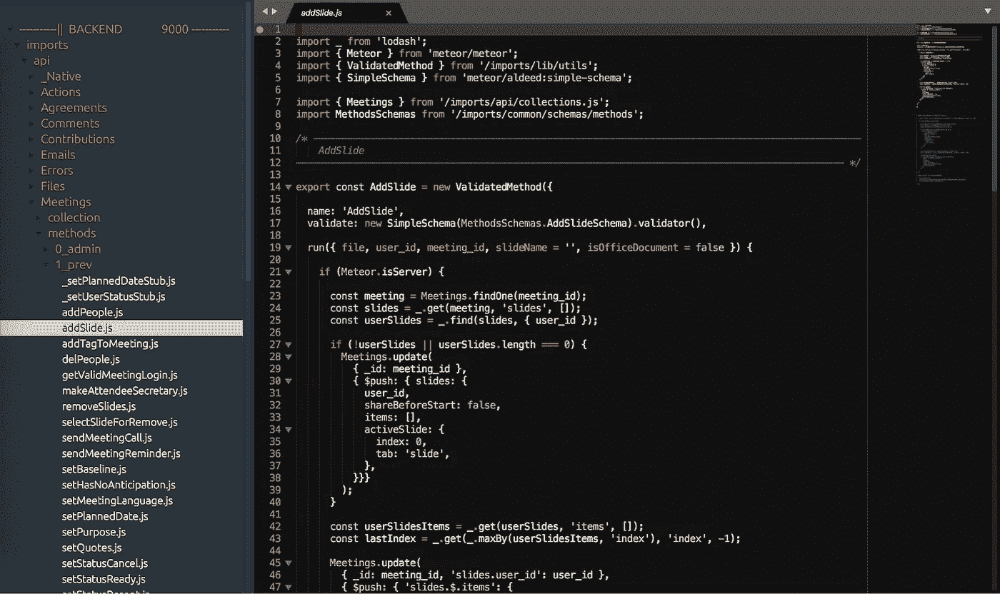
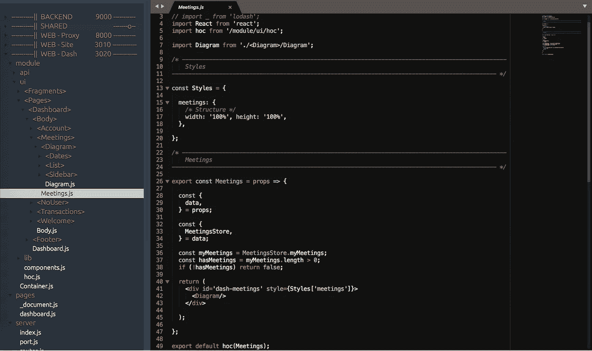
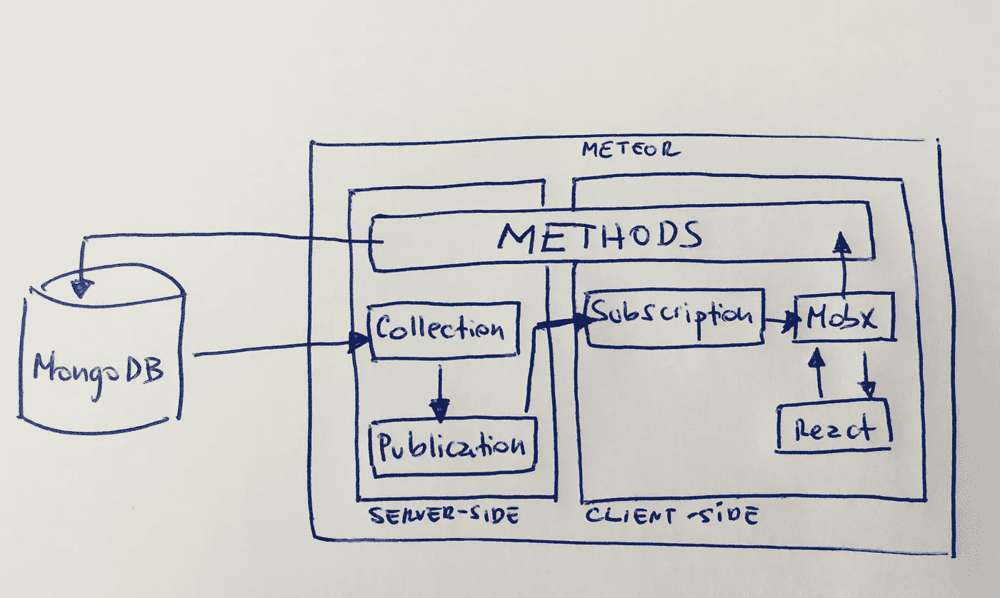
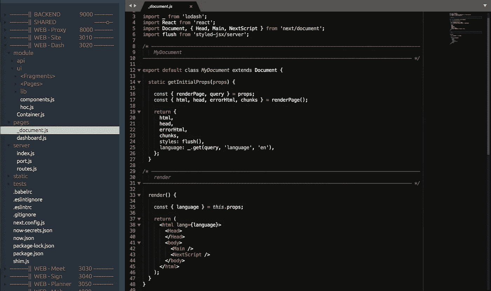
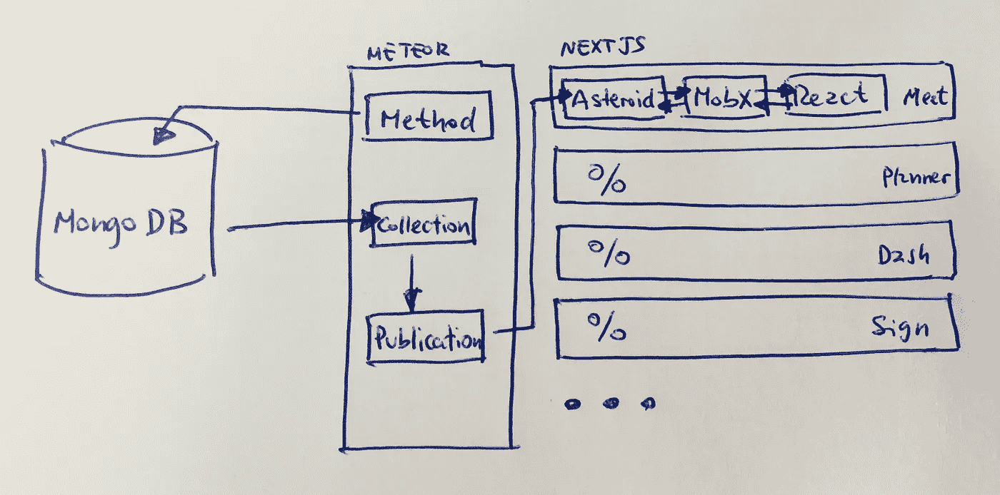

# Javascript 完美伙伴:React、MobX、Next & Meteor

> 原文：<https://itnext.io/javascript-perfect-partners-react-mobx-next-meteor-2583d91abd51?source=collection_archive---------2----------------------->

## 适用于大多数 web 应用程序的最小但完整的架构

*这篇文章展示了我从 2016 年到 2018 年在“javascript 疲劳”的框架海洋中的旅程，以及我对我所能找到的最佳合作伙伴的结论。*

> 我是 timefic.com[的创始人，这是一款管理高效会议的中型“单页”网络应用程序，因此我需要像当今许多网络应用程序一样，应对应用程序内部实时更新的一些挑战。](https://www.timefic.com)

👉如果你是一个全栈式的 web 开发者，一个“自己动手”的创业者或者只是对技术好奇，继续读下去吧！

**我们将在这里介绍:**

*   最初的做法:万物流星！
*   输入 React 和 MobX
*   NextJS:分割整体。
*   额外收获:你可能需要的外部服务。

# 最初的做法:万物流星！

Meteor.js 中的方法定义

我玩流星已经快 3 年了，我仍然很喜欢它。如果没有 Meteor，几乎不可能在 Javascript 实时应用程序的世界中起步。

是的，3 年前我对 Javascript 一无所知:对我来说，它肯定是 Java，但“脚本”😜说真的，我需要从头开始学习！但我并不孤单，我指望 Youtube 的巨大宝贵帮助和下一个将改变世界的超级项目的动力…

[**流星**](https://www.meteor.com/) 给你很多开箱即用的东西:

*   MongoDb 访问可以从客户端调用的集合和方法(服务器端)。
*   具有反应性的发布(服务器端)和订阅(客户端):服务器中的任何变化都会实时通知所有需要该数据的客户端。
*   模板语言(Blaze)可以轻松构建嵌入了服务器数据的网页。
*   自动构建系统和热重新加载:你改变一个文件，你可以立即在你的页面上看到改变。

**简而言之**:一切都“在一个地方”，我需要用“魔法”来完成工作。我惊讶于我可以用这个工具走多远。

> **一个提示**:我无法抗拒站在技术的前沿，即使是一个完全的新手*😄*，所以回到 2016 年，我在玩 CSS 预处理器(手写笔是我的选择)和 HTML 预处理器(我喜欢 jade)，最终回到旧的 CSS 和 HTML，因为我意识到这个“优雅的代码”并没有让我更有效率:原因是什么？如果你遵循一个标准，你就有更多的选择来避免花费数小时去挖掘矩阵的深度… *😝*

直到我了解了[的反应](https://reactjs.org/)。

我需要承认，我对 React 感兴趣只是因为它是 2016 年新的性感热潮:我没有任何好的理由说它比 Blaze 好。像(我想)大多数经验不足的开发人员一样，我是根据知情人的意见来做出判断的。很公平:我认为这是正确的心态，但请记住，有一天你可能会有自己的想法。

# 输入 React 和 MobX

带有 MobX 的无状态 React 组件(但是是隐藏的)😉

我已经告诉过你了:我没有任何特别的原因就离开了 Blaze。我刚刚读到为什么 React 很棒，我发现了一个很大的社区，这对我来说就足够了。

今天，我可以说这是一个幸运的选择，因为:

*   这是高度声明性的:这意味着如果将来不再有 React，我仍然可以用另一个框架从我的代码中制作 HTML。
*   **组件就是 Javascript** :你可以在你的组件中制作“任何东西”，它不像模板语言那样有任何限制。
*   **你可以(也应该)把它们分成小块**:这本身不是 React 特性，但 React 鼓励这样做。分而治之。
*   **避免状态和全局**:你可以让 99%的应用都是无状态的组件(相同的输入，相同的输出),避免 CSS 全局样式或预处理程序，只需将你的样式内联到你的组件中，并放在同一个文件中:这非常方便。我再也看不到自己去一个 CSS 文件中查看一些 BEM 术语来找到我需要的组件的正确样式。简直疯了！

但是，故事并没有到此结束。React Components 需要数据，对吗？

**该是** [**MobX**](https://github.com/mobxjs/mobx) 的时候了:掌管你 app 所有数据(和状态)的人。

但是我为什么需要它呢？以下是我的理由:

*   **任何应用都是关于数据的**:最后，漂亮的按钮、动画和好的设计都是很好的东西，但是不要忘记你的应用是关于数据的。数据进来，数据被验证。数据被转换、积累、格式化和消费。数据来自用户、服务器或外部 api。*一个设计良好的应用程序的秘密是一个设计良好的数据结构和名字*。
*   **定义存储**:存储是一个将数据保存在一起的对象。它允许你思考你的应用程序的数据和逻辑。例如，在 Timefic 中，Meetings 模块有以下存储:*动作、协议、评论、投稿、会议、消息、人、标签、主题、交易、电子邮件、提醒、时钟、幻灯片、状态和流*。如果所有这些数据都直接在 React 组件中，我的应用程序将会非常“复杂”，因为事情是交错的……(请停止阅读这篇文章，现在就来看这个关于里奇·希基的[精彩演讲😀 ),](https://www.youtube.com/watch?v=34_L7t7fD_U)
*   **注意依赖关系**:一个商店可能会使用另一个商店来为 React 组件计算或准备数据，例如， *Actions* 商店需要 *People* 商店来显示负责该动作的人的图像。再次强调:您可以将两个商店都传递到 React 组件中，但是在很多用例中，一个商店需要另一个商店，这实际上是所有应用程序的一种模式。*小心:永远不要定义循环依赖，如果你有循环依赖，你可能需要将存储分成两部分。*

我从未使用过 *Redux* 或其他反应式库来管理状态。但是我可以说，我的 React 组件和存储看起来非常直接和清晰。这并不容易实现:我在使用 MobX 时，没有在我的应用程序中引用任何 Mobx，但有一个例外(一个高阶组件)。

说真的:我在 Meetings 模块上有 346 个组件，只有一个说:**从‘mobx’导入{ observable，computed }**或**从‘mobx-react’导入{ observer }；**

## 那么，到目前为止，这个架构看起来怎么样？

React 和 MobX inside Meteor app with MongoDB

虽然 Blaze 不再被使用，但该应用程序仍然到处都是流星，这意味着一个单一的单片应用程序，但这是什么问题？

对我来说，这在两个方面成了问题:

*   **难以推理关于**。虽然“所有的东西都在手边”很方便，但当我们处理小事时，我们的大脑工作得更好。管理 5 个 10 人的团队比管理一个 50 人的团队简单。每当我在寻找一个文件或作出一个改变时，它的影响会超出我对系统的理解。
*   **构建时间长**。如果我记得不错的话，我在 Meteor 1.3 中，仍然有很长的构建和重新构建时间(超过一分钟)。事实上，这是促使我“绝望地”寻找替代方案的导火索。

结果是另一次“旅行”,但我必须说我又做了一次幸运的选择👌。

# NextJS:分割整体。

NextJS 中的页面:React 组件形式的应用程序入口点

所以，下一步是 [NextJS](https://github.com/zeit/next.js/) 😉

客户端没有 Meteor 意味着要解决以下问题:

*   **实时通信**:流星闪耀的地方在于提供开箱即用的反应式发布/订阅机制。所以，如果客户没有 Meteor，我需要自己做出反应…
*   **路由**:如果流星不再是网络服务器，怎么才能到达我的站点？
*   服务器端渲染:我希望我的页面搜索引擎友好，加载速度快，所以这是我需要的另一个 Meteor 特性。
*   **热代码重新加载**:在任何更改之后，我需要我的应用程序立即运行新代码(几秒钟，而不是一分钟)。
*   **部署**:我所知道的关于部署的唯一一件事就是著名的 Meteor 对他们所提供的服务(名为 [Galaxy](https://www.meteor.com/hosting) )的一个命令行部署。所以另一个一定是给我的。

你已经知道答案: [NextJS](https://github.com/zeit/next.js/) 。

有了这个框架，除了第一个需求:我的应用程序的反应数据，它能够覆盖所有的需求。解决办法？使用一个可以通过 websockets 与 Meteor 通信的 DDP 库，并在任何变化时通知 NextJS app:[AsteroidJS](https://github.com/mondora/asteroid)。

> Asteroid 是一个小的 NPM 包(小就是好…)，它完成了我描述的工作:它可以通过 DDP 协议连接到 Meteor，与服务器端的发布和方法对话，然后告诉订阅的客户端任何感兴趣的变化，并允许他们调用方法。

将所有客户端代码迁移到 Next 后，我脸上挂着灿烂的笑容:一切正常，但现在，当我在编辑器上按 save 时，嘣！5 秒钟，更改就在浏览器中了👏 👏 👏

## 下一个“合乎逻辑”的想法

> 如果我可以将我的前端应用程序拆分成小应用程序会怎么样？

这真是一个意外收获，当我开始迁移前端时，我没有想到这一点，但一会儿我想起了“可怕”的词**微服务**并开始为这一架构重构制定最终(实际上是下一个)计划。

我将没有一个 NextJS 应用程序，但有 6 个！因此，与其拥有一个庞大的组件结构、大量的数据存储和“一切都是交错的”(你看到我推荐的[视频](https://www.youtube.com/watch?v=34_L7t7fD_U)了吗？)

我会把我的应用程序分成这样:

*   **网站**(首页)
*   **仪表盘**(每个 app 都需要一个仪表盘)
*   **见面**(会议室本身)
*   **登录**(该模块用于登录和创建账户)
*   **策划者**(创建会议的向导)和，
*   **Mob** (专为移动优化的首页小版本)。

有一个重要的问题需要解决:*如果一个组件、一个函数或一个定义需要在许多应用程序中使用，该怎么办？没有免费的好处，总是有得有失。*

我用一种，你必须说，不那么优雅的暴力方法解决了这个问题，但这是我迄今为止发现的最好的方法:我创建了一个名为“ **shared** 的文件夹，并在我的笔记本电脑中安装了一个 autosync 实用程序，这样每当我在那个目录中更改某些内容时，所有应用程序都会获得该文件的最新版本，并在本地访问。

## 那么，建筑现在看起来怎么样？

流星只作为后端，个人前端 NextJS 应用与 React 和 MobX

# 额外收获:您可能需要的外部服务:

由于您无法独自完成所有工作，因此以下是您完成应用程序可能需要的一些典型服务:

*   **MongoDB 托管**:我还没有扩展我的应用，但是到目前为止 [mLab](https://mlab.com/) 对我来说做得很好。
*   **图片 CDN** :您的用户和您自己都需要上传图片。不要用你的服务器，用 CDN。更简单，便宜，快捷。我是 [Cloudinary](https://cloudinary.com/) 的快乐顾客。
*   电子邮件递送服务:你不能只是发送电子邮件，它们需要来自一个可信的来源，并为你提供一些数据。备选方案很多，我选择了 [Sendgrid](https://sendgrid.com/) ，因为它很容易与 Meteor 集成。
*   **流服务**:想不通过你的服务器在客户端之间通信？到目前为止我发现 [PubNub](https://www.pubnub.com/) 非常好！
*   WebRTC 服务:刚刚开始探索那里有什么，但是 [Temasys](https://temasys.io/) 或 [Agora.io](https://www.agora.io/en/) 中的一个可能会胜出。
*   **其他服务** : [Updown.io](https://updown.io/) (监控你的网站可用性) [GoogleSuite](https://gsuite.google.com/) (你想要一封有你域名的邮件对吗？)和 [Dynu](https://www.dynu.com/) (DNS 服务)

**遗言:**

我决定写这篇文章，这是我在🕺的第一篇文章，因为我认为它可以帮助那些考虑创业或致力于编写下一个将改变世界的 web 应用程序的人！

来自智利🇨🇱的欢呼