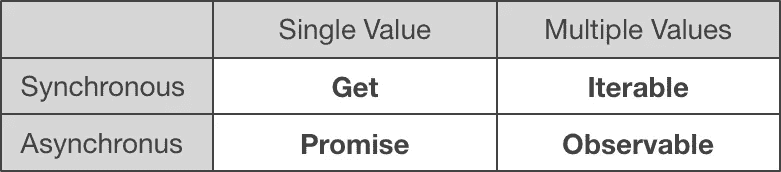

# JavaScript 承诺 vs. RxJS 观察值

> 原文：<https://itnext.io/javascript-promises-vs-rxjs-observables-de5309583ca2?source=collection_archive---------0----------------------->

## 比较 JavaScript 异步编程技术

不久前，我写了一篇关于 JavaScript promises 和 Node.js 的文章，在这篇文章中，我比较了在 **ES6** 中引入的原生 JavaScript **promises** 和由 [**RxJS**](https://rxjs-dev.firebaseapp.com/) 库提供的 **observables** 。

重点是强调承诺和可观察的差异和相似之处。目标是让你更容易理解那些你已经知道的承诺(反之亦然)。出于这个原因，我不在本文中讨论 RxJS 操作符，因为对于承诺来说，没有什么可以与这些操作符相比。

请注意，本文基于 2018 年 4 月 24 日[发布的最新版本 RxJS 的 **RxJS 6** 。](https://github.com/ReactiveX/rxjs/blob/master/CHANGELOG.md#600-2018-04-24)

# 内容

## [JavaScript 中的异步编程](#ca20)

*   [**回调**](#f41a)
*   [**承诺**](#1430)
*   [**异步/等待**](#2404)
*   [**RxJS 可观测量**](#7056)

## [**承诺与可观察到的事物**](#62e1)

*   [**创作**](#192d)
*   [**【创建(带错误处理)**](#e3be)
*   [**用法**](#0b4b)
*   [**用法(带错误处理)**](#3c8e)
*   [**创作+使用:例**](#5cb9)
*   [**单值与多值**](#aebe)
*   [**急切 vs .**](#19c4)
*   [**不可撤销与可撤销**](#77f3)
*   [**多播与单播**](#8838)
*   [**异步处理程序与同步处理程序**](#1b97)


[艾瑞克·佩雷斯](https://unsplash.com/photos/AQ6urd0B3xc?utm_source=unsplash&utm_medium=referral&utm_content=creditCopyText)在 [Unsplash](https://unsplash.com/search/photos/view?utm_source=unsplash&utm_medium=referral&utm_content=creditCopyText) 上拍照。

# JavaScript 中的异步编程

首先，让我们回忆一下承诺和可观察性是怎么回事:处理异步执行。JavaScript 中有不同的方法来创建异步代码。最重要的如下:

*   [**回调**](#f41a)
*   [**承诺**](#1430)
*   [**异步/等待**](#2404)
*   [**RxJS**](#7056)

下面分别简单介绍一下。

## 复试

这是异步编程的老式经典方法。您将一个函数作为参数提供给另一个执行异步任务的函数。当异步任务完成时，执行函数调用回调函数。

这种方法的主要缺点发生在当你有多个链接的异步任务时，这需要你在回调函数内的回调函数内定义回调函数…这叫做[**回调地狱**](http://callbackhell.com/) 。

## 承诺

在[**ES6**](https://www.ecma-international.org/ecma-262/6.0/)【2015】中引入了承诺，允许比回调更可读的异步代码。

回调和承诺的主要区别在于，使用回调，你**告诉执行函数**当异步任务完成时做什么，而使用承诺，执行函数返回一个特殊对象给你(承诺)，然后你**告诉承诺**当异步任务完成时做什么。

实际上，这看起来像这样:

```
const promise = asyncFunc();promise.then(result => {
    console.log(result);
});
```

也就是说，与提供一个函数引用作为`asyncFunc`的参数不同(就像回调一样)，`asyncFunc`立即向您返回一个承诺，然后您向这个承诺提供异步任务完成时要采取的动作(通过它的`[then](https://developer.mozilla.org/en-US/docs/Web/JavaScript/Reference/Global_Objects/Promise/then)`方法)。

## 异步/等待

Async/await 已经在 [**ES8**](https://www.ecma-international.org/ecma-262/8.0/) (2017)中引入。这个技巧应该列在*承诺*下，因为它只是处理承诺的语法糖。然而，这是一个真正值得一看的语法糖。

基本上，你可以声明一个函数为`async`，这允许你在函数体中使用`await`关键字。关键字`await`可以放在计算结果为*承诺*的表达式前面。关键字`await`暂停`async`函数的执行，直到承诺被解决。当这种情况发生时，整个`await`表达式计算出承诺的结果值，然后`async`函数继续执行。

此外，`async`函数本身也返回一个承诺，该承诺在函数体执行完成时被解析。

让我们通过下面的例子来看看这在实践中是怎样的:

```
function asyncTask(i) {
    return **new Promise**(resolve => resolve(i + 1));
}**async** function runAsyncTasks() {
    const res1 = **await** asyncTask(0);
    const res2 = **await** asyncTask(res1);
    const res3 = **await** asyncTask(res2);
    return "Everything done"
}runAsyncTasks().then(result => console.log(result));
```

`asyncTask`函数实现一个异步任务，该任务接受一个参数并返回一个结果。该函数返回一个承诺，该承诺在异步任务完成时得到解决。这个函数没有什么特别的，它只是一个返回承诺的普通函数。

另一方面,`runAsyncTasks`函数被声明为`async`,这样`await`关键字就可以在函数体中使用。这个函数调用`asyncTask`三次，每次参数必须是前面调用`asyncTask`的结果(即我们链接了三个异步任务)。

第一个`await`关键字使`runAsyncTasks`的执行停止，直到`asyncTask(0)`返回的承诺得到解决。然后，整个`await asyncTask(0)`表达式计算出已解析承诺的结果值，并分配给`res1`。此时，`asyncTask(res1)`被调用，第二个`await`关键字导致`runAsyncTasks`的执行再次停止，直到`asyncTask(res1)`返回的承诺被解决。这一直持续到最后执行完`runAsyncTasks`函数体中的所有语句。

如上所述，`async`函数返回一个承诺本身，当函数体的执行完成时，这个承诺用函数的返回值来解决。因此，换句话说，`async`函数本身就是一个异步任务(通常管理其他异步任务的执行)。这可以在最后一行中看到，我们在返回的承诺上调用`then`函数来打印出`async`函数的返回值。

如果您在`runAsyncTasks`函数中的每个赋值语句后添加日志语句，那么输出将如下所示:

```
1
2
3
Everything done
```

我声称 async/await 只是承诺的语法糖。如果这是真的，那么我们必须能够用纯粹的承诺来实现上面的例子。是的，我们可以，看起来是这样的:

```
function asyncTask(i) {
    return new Promise(resolve => resolve(i + 1));
}function runAsyncTasks() {
    **return asyncTask**(0)
        .**then**(res1 => { **return** **asyncTask**(res1); })
        .**then**(res2 => { **return** **asyncTask**(res2); })
        .**then**(res3 => { return "Everything done"; });
}runAsyncTasks().then(result => console.log(result));
```

这段代码相当于 async/await 版本，如果您在匿名函数体中添加适当的日志语句，那么它会产生与 async/await 版本相同的输出。

唯一改变的是`runAsyncTasks`功能。它现在是一个常规函数(不是`async`)，它使用`then`来链接`asyncTask`(而不是`await`)返回的承诺。

我认为 async/await 版本比 promise 版本可读性更好，也更容易理解，这一点不用多说。事实上，async/await 的主要创新是允许编写看起来像同步代码的异步代码。

## RxJS 可观测量

首先，RxJS 是[**react vex**](http://reactivex.io/)项目的 JavaScript 实现。ReactiveX 项目旨在为不同的编程语言提供异步编程的 API。

react vex 的基本范例是四人帮的 [**观察者模式**](https://en.wikipedia.org/wiki/Observer_pattern)**(react vex 甚至用完成和错误通知扩展了观察者模式)。因此，所有 ReactiveX 实现的核心抽象是可观察的**。你可以在这里阅读更多关于 react vex[的基本概念。](http://reactivex.io/intro.html)****

****ReactiveX API 以各种编程语言实现。如前所述， **RxJS** 是 ReactiveX 的 JavaScript 实现。除此之外，还有，例如， **RxJava** (Java)、 **RxKotlin** (Kotlin)、 **Rx.rb** (Ruby)、 **RxPY** (Python)、 **RxSwift** (Swift)、**Rx.NET**(c#)实现，还有很多更多(此处见概述)。****

****这意味着，如果你理解了 RxJS 中的可观测量，那么你也理解了 RxJava 或 Rx.NET 或任何其他实现中的可观测量，你可以使用这些库，而不必学习新概念。****

****所以，现在我们知道 RxJS 是什么，但是**什么是可观测？让我们试着从两个维度来描述它，并与其他已知的抽象进行比较。尺寸为**同步/异步**和**单值/多值**。******

**关于一个**可观测的**，我们可以说以下是真实的:**

*   ****发射多倍数值****
*   ****异步发出其值(“推送”)****

**让我们将这与我们刚刚在上一个小节中介绍的**承诺**进行对比:**

*   ****发出单值****
*   ****异步发出其值(“推送”)****

**最后，我们来看一个**可迭代**。这是一种抽象，存在于许多编程语言中，可用于遍历集合数据结构(如数组)的所有元素。对于 iterable，以下情况成立:**

*   ****发出多个值****
*   ****同步发出其值(“拉”)****

**注意，对于 s *同步/拉取*和*异步/推取*，我的意思是:**同步/拉取**意味着客户端代码*从抽象中请求*一个值，并且*阻塞*直到这个值被返回。**异步/推送**意味着抽象*通知*客户端代码正在发出一个新值，客户端代码*处理*这个通知。**

**如果我们沿着维度图形化地排列这些抽象，我们会得到下面的图片(取自 [ReactiveX](http://reactivex.io/intro.html) ):**

****

**注意，在一些编程语言中，承诺被称为*未来*(例如在 Java 中)。**

**请注意，我们还没有提到 **Get** ，但这仅代表普通的数据访问操作，如常规的函数调用。**

**看上图，我们可以说一个*可观察的*对于一个*可重复的*就像一个*承诺*对于一个*得到*的操作。或者说*承诺*类似于*异步 get* 操作，而*可观察*类似于*异步可迭代*。**

**我们也可以说，承诺和可观察之间的主要区别是，承诺只发出一个值，而可观察发出多个值。**

**但是让我们更详细地看一下。通过一个简单的 **get** 操作，例如一个函数调用，调用代码请求一个单一的值，然后等待或阻塞，直到函数返回这个值(调用代码*拉取*这个值)。**

**另一方面，有了**承诺**，调用代码也请求单个值，但是它不会阻塞，直到值被返回。它只是开始计算，然后继续执行自己的代码。当 promise 完成值的计算时，它将值发送给调用代码，然后调用代码处理该值(该值被*推送到*调用代码)。**

**现在，让我们来看看一个**可迭代的**。在许多编程语言中，我们可以从一个集合数据结构中创建一个 iterable，比如一个数组。iterable 通常有一个`next`方法，它从集合中返回下一个未读的值。然后调用代码可以重复调用`next`来读取集合的所有值。每个`next`调用基本上都是一个同步阻塞 *get* 操作，如上所述(调用代码反复*拉*值)。**

**一个**可观测的**把这个可测量的东西带到了异步世界。像 iterable 一样，observable 计算并发出一串值。然而，与 iterable 不同，对于 observable，调用代码不会同步地*拉取*每个值，而是 observable 异步地*将每个值(一旦可用)推送到调用代码。为此，调用代码向可观察对象提供一个处理函数，在 RxJS 中称为`next`，然后可观察对象为它计算的每个值调用这个函数。***

**一个可观察对象发出的值可以是任何东西:数组的元素、HTTP 请求的结果(如果一个可观察对象只发出一个值也可以，不一定总是多个值)、用户输入事件，比如鼠标点击，等等。这使得 observables 非常灵活。此外，由于可观察对象也只能发出单一值，因此可观察对象可以做承诺可以做的一切，但反之则不成立。**

**除此之外，ReactiveX observables 提供了大量所谓的**运算符**。这些是可以应用于可观察对象的函数，以便修改一组发射值。常见的运算符类别有*组合*、*过滤器*和*转换*。**

**例如，有一个`map`操作符，我们可以配置如下:`map(value => 2 * value)`，然后我们可以将这个操作符应用于一个可观察对象。其效果是，可观察对象发出的每个值在被推送到调用代码之前都要乘以 2。**

**RxJS 中操作员的完整列表可在处[找到。然而，在这篇文章中，我不讨论操作符，因为这篇文章的重点是比较承诺和可观察的，而承诺没有任何东西可以和可观察的操作符相比。](https://rxjs-dev.firebaseapp.com/api?query=operators)**

**下面是一个简短的代码示例，展示了 RxJS 可观察对象的创建和使用(创建和使用可观察对象的语法将在下一节解释):**

```
// Creation
constobservable = newObservable(observer => {
  for(leti = 0; i < 3; i++) {
    observer.next(i);
  }
});// Usage
observable.subscribe(value => console.log(value));
```

**这就结束了我们对 JavaScript 异步编程技术的概述。我们已经看到有**回调**，这是老式的，**承诺**，可以用来异步获取单个值，**异步/等待**，这是承诺的语法糖，以及 RxJS **可观察值**，可以用来异步获取值流。**

**在下一节中，我们将特别强调承诺和可观察到的事物之间的异同。**

# **承诺与观察**

**在这一节中，我们将承诺和可观察到的事物放在一起比较，并强调它们的不同和相似之处。**

**注意，如果您想要运行下面包含 observables 的代码示例，您必须安装并导入 RxJS 库。**

**您可以按如下方式安装 RxJS:**

```
npm install --save rxjs
```

**您可以在代码文件中导入`Observable`构造函数(这就是这些例子所需要的),如下所示:**

```
import{ Observable } from'rxjs';
```

**但是，如果您使用 Node.js，您必须以如下不同的方式进行导入(因为 Node.js 还不支持`import`语句):**

```
const { Observable } = require('rxjs');
```

**以下所有代码片段都省略了这些导入语句。**

## **创造**

**让我们看看如何创造一个承诺与如何创造一个可观察的。为了简单起见，我们将首先忽略错误，只考虑承诺和可观察到的“成功”执行。我们将在下一小节中介绍错误。**

**注意，承诺和可观察性都有两面性:**创造**和**使用**。承诺/可观察是首先需要由某人*创造*的对象。在它被创建之后，它通常被传递给使用它的其他人。创建定义了承诺/可观察的行为和发出的值，使用定义了对这些发出的值的处理。**

**一个典型的用例是承诺/可观察值由 API 函数*创建*并返回给 API 的用户。API 的用户然后*使用*这些承诺/可观察到的。所以，如果你使用一个 API，你通常只需要*使用*承诺/可观察到的东西，而如果你是一个 API 的作者，你也必须*创建*承诺/可观察到的东西。**

**在下文中，我们将首先看看承诺/可观察的*创造*，我们将在随后的[小节](#0b4b)中看看它们的*用法*。**

****承诺:****

```
new Promise(executorFunc);function executorFunc(resolve) {
    // Some code...
    resolve(value);
}
```

**为了创建一个承诺，你调用`[Promise](https://developer.mozilla.org/en-US/docs/Web/JavaScript/Reference/Global_Objects/Promise)`构造函数，并把一个所谓的*执行函数*作为参数传递给它。创建承诺时，系统会调用 executor 函数，并将其作为参数传递给一个特殊的`resolve`函数(您可以随意命名该参数，只需记住 executor 函数的第一个*参数是 resolve 函数，您必须像这样使用)。***

**当您调用 executor 函数体中的`resolve`函数时，承诺被转换为*已履行*状态，并且您作为参数传递给`resolve`函数的值被“发出”(承诺被解析)。**

**然后，这个发出的值将被用作*未完成的*函数的参数，您将它作为第一个参数传递给承诺的*用法*方的承诺的`then`函数，我们将在后面的中看到[。](#0b4b)**

****可观测量:****

```
new Observable(subscriberFunc);function subscriberFunc(observer) {
    // Some code...
    observer.next(value);
}
```

**为了创建一个可观察对象，您调用`[Observable](https://rxjs-dev.firebaseapp.com/api/index/class/Observable)`构造函数，将一个所谓的*订户函数*作为参数传递给它。每当一个新用户订阅该可观察对象时，系统就调用订阅者函数。订户函数获得一个*观察者*对象作为参数。这个对象有一个方法`next`，当这个方法被调用时，*会发出*你作为参数从可观察对象传递给它的值。**

**注意，调用`next`后，订阅者函数保持运行，还可以再调用`next`很多次。这是与 promises 的一个重要区别，在 promises 中，调用`resolve`后，executor 函数被终止。承诺最多可以发出一个值，而可观察值可以发出任意数量的值。**

## **创建(带错误处理)**

**上面的例子还没有显示承诺和可观察的全部能力。错误可能发生在承诺/可观察的执行过程中，这两种技术都提供了向“使用”它们的代码指出这种错误的方法。**

**下面用错误处理能力扩展了上面的解释。**

****承诺:****

```
new Promise(executorFunc);function executorFunc(resolve, reject) {
    // Some code...
    resolve(value);
    // Some code...
    reject(error);
}
```

**传递给`Promise`构造函数的 executor 函数实际上获得了第二个参数，即`reject`函数。`reject`功能用于指示承诺执行中的错误。当你调用它时，executor 函数被中止，承诺转移到*拒绝*状态。**

**在使用方面，这将导致*on 被弹出的*函数(您可以将其传递给`catch`方法)被执行。**

****可观测量:****

```
new Observable(subscriberFunc);function subscriberFunc(observer) {
    // Some code...
    observer.next(value);
    // Some code...
    observer.error(error);
}
```

**作为参数传递给订阅者函数的 observer 对象实际上还有一个方法:`error`方法。调用此方法会向可观察对象的订阅者指示一个错误。**

**与`next`不同，调用`error`方法也会终止订户函数，从而终止可观察对象。这意味着`error`在一个可观察对象的生命周期内最多只能被调用一次。**

**`next`和`error`仍然不是全部的真相。传递给订阅者函数的 observer 对象还有一个方法:`complete`。其用法如下所示:**

```
new Observable(subscriberFunc);function subscriberFunc(observer) {
    // Some code...
    observer.next(value);
    // If there is an error...
    observer.error(error);
    // If all successful...
    observer.complete();
}
```

**当一个可观察对象成功“完成”时，应该调用`complete`方法。完成意味着没有更多的工作要做，也就是说，所有的值都已经发出。像`error`方法一样，`complete`方法终止了订阅者函数的执行，这意味着`complete`方法在一个可观察对象的生命周期内最多只能被调用一次。**

**注意，建议调用可观察执行的`conplete`方法，但不是强制的。**

## **使用**

**在介绍了的*创造*和可观察到的之后，现在让我们看看它们的*用法*。使用 promise 或 observable 意味着“订阅”它，这又意味着用 promise 或 observable 注册一个处理函数，该函数将为每个发出的值(promise 的一个值，observable 的任意多个值)调用。**

**处理函数的注册是通过 promise 或 observable 对象的特殊方法来完成的。这些方法分别是:**

*   ****许诺:** `[**then**](https://developer.mozilla.org/en-US/docs/Web/JavaScript/Reference/Global_Objects/Promise/then)`**
*   ****可观察:** `[**subscribe**](https://rxjs-dev.firebaseapp.com/api/index/class/Observable#subscribe-)`**

**在下文中，我们将展示这些方法在承诺和可观察方面的基本用法。同样，我们将首先考虑忽略错误处理的基本情况，然后在下一小节中添加错误处理。**

**请注意，在下面的代码片段中，我们假设承诺或可观察对象已经存在。因此，如果您想运行代码，您必须在它前面加上一个 promise 或 observable creation 语句，例如:**

*   **`const promise = new Promise(/*...*/);`**
*   **`const observable = new Observable(/*...*/)`**

****承诺:****

```
promise.then(onFulfilled);function onFulfilled(value) {
    // Do something with value...
}
```

**给定一个 promise 对象，我们调用这个对象的`then`方法，并传递给它一个 *onFulfilled* 函数作为参数。*on completed*函数采用单个参数。这个参数就是承诺的结果值，也就是已经传递给承诺内部的`resolve`函数的值。**

****可观测量:****

**使用一个可观察对象意味着订阅它，这是通过一个可观察对象的`subscribe`方法来完成的。使用`subscribe`方法实际上有两种等效的方式。在下文中，我们将介绍这两者:**

***备选方案 1:***

```
observable.subscribe(nextFunc);function nextFunc(value) {
    // Do something with value...
}
```

**在这种情况下，我们调用一个可观察对象的`subscribe`方法，并传递给它一个 *next* 函数作为参数。这个*下一个*函数接受一个参数。每当可观察对象发出一个值时，该参数就是当前发出的值。**

**换句话说，每当可观察对象的内部订户函数调用`next`方法时，您的*下一个*函数将被调用，其值将被传递给`next`(从而将值从可观察对象发送到您的处理函数)。**

***选项 2:***

```
observable.subscribe({
    next: nextFunc
});function nextFunc(value) {
    // Do something with value...
    console.log(value);
}
```

**第二个选项可能看起来有点奇怪，但实际上它更好地显示了幕后发生的事情。**

**在这种情况下，我们调用`subscribe`不是用函数作为参数，而是用一个对象。该对象有一个属性，带有一个名为`next`的键和一个函数值。这个函数不是别的，就是我们上面的老*下一个*函数。**

**其他都保持不变，我们只是在一个对象内部传递下一个函数，而不是直接作为参数。但是为什么我们要在将处理函数传递给`subscribe`方法之前将它包装在一个对象中呢？**

**这样可以传递给`subscribe`的对象实际上是实现了`[Observer](https://rxjs-dev.firebaseapp.com/api/index/interface/Observer)`接口的对象。也许你还记得，当我们在前面的小节中创建 observables 时，我们曾经定义了一个订阅者函数，这个订阅者函数有一个我们称之为`observer`的参数。特别是，我们使用了这样的代码:**

```
new Observable(subscriberFunc);function subscriberFunc(observer) {
    // Some code...
    observer.next(value);
}
```

**subscriber 函数的`observer`参数直接对应我们上面传递给`subscribe`的对象(实际上，传递给`subscribe`的对象在传递给 subscriber 函数之前，先从类型`[Observer](https://rxjs-dev.firebaseapp.com/api/index/interface/Observer)`转换为`[Subscriber](https://rxjs-dev.firebaseapp.com/api/index/class/Subscriber)`，`Subscriber`实现`Observer`接口)。**

**因此，使用选项 2，我们已经创建了一个对象，它形成了将被传递到可观察对象的订阅者函数中的实际对象的基础，而使用选项 1，我们仅仅提供了将被用作该对象的方法的函数。**

**使用这两个选项中的哪一个是个人喜好和编码风格的问题。请注意，如果使用选项 2，下一个函数*的*的对象属性键必须被强制调用*。这由该对象需要实现的`[Observer](https://rxjs-dev.firebaseapp.com/api/index/interface/Observer)`接口决定。***

## **用法(带错误处理)**

**像以前一样，我们现在扩展使用示例，以包括错误处理。在这种情况下，错误处理意味着提供一个特殊的处理函数来处理由承诺或可观察到的潜在错误(除了处理从承诺或可观察到的“常规”值的“常规”处理函数之外)。**

**对于承诺和可观察值，在两种情况下都会发出错误:**

1.  **promise 或 observable 实现分别调用`reject`函数或`error`方法(参见上面的)。**
2.  **promise 或 observable 实现用关键字`throw`抛出一个错误。**

**让我们看看如何处理承诺和可观察到的这些类型的错误。**

****承诺:****

**实际上有两种方法来处理从承诺发出的错误。第一个使用了`then`方法的第二个参数，第二个使用了方法链接。在接下来的文章中，我们将介绍这两种方法。**

***选项 1(*`*then*`*的第二个自变量):***

```
promise.then(onFulfilled, onRejected);function onFulfilled(value) {
    // Do something with value...
}function onRejected(error) {
    // Do something with error...
}
```

**promise 的`then`方法接受第二个函数参数，这是被抛出的函数的*。当 promise 的 executor 函数调用`reject`函数时，或者当 promise 的 executor 函数抛出一个带有`throw`关键字的错误时，就会调用这个函数。***

**提供一个 *onRejected* 函数允许你处理这样的错误。如果您不提供它，那么错误仍然可能发生，但是您的代码不会处理它们。**

***选项 2(方法链接):***

**第二个选项使用了一个链式`[**catch**](https://developer.mozilla.org/en-US/docs/Web/JavaScript/Reference/Global_Objects/Promise/catch)` 方法，看起来是这样的:**

```
promise.then(onFulfilled).catch(onRejected);function onFulfilled(value) {
    // Do something with value...
}function onRejected(error) {
    // Do something with error...
}
```

**也就是说，我们并没有将*未完成的*和*未完成的*函数都提供给`then`方法，而是只将*未完成的*方法提供给`then`，然后调用`then`返回的承诺的`catch`方法，并将*未完成的*函数传递给这个`catch`方法。注意，在这种情况下，我们调用`catch` on(并由`then`返回)的承诺与初始承诺相同。**

**使用`catch`的第二个选项实际上比第一个选项更常见。它利用了重要的**链接**承诺的能力。对承诺链的讨论超出了本文的范围，但是例如，在这里的[中有所描述。](https://developer.mozilla.org/en-US/docs/Web/JavaScript/Reference/Global_Objects/Promise/then#Chaining#Chaining)**

**关于链接需要注意的重要一点是`then`和`catch`总是返回一个承诺，这允许在同一个语句中重复调用这些方法，如上所示。返回的承诺要么与上一个承诺相同，要么是新的承诺。后一种情况允许嵌套的异步任务(如果我们使用回调，这将导致回调地狱)在没有任何嵌套形式的情况下被“简单地”处理。顺便说一下，这是承诺相对于回调的主要优势之一。**

**另一个值得一提的是，`catch`实际上并没有什么特别之处。事实上，`catch`方法只是对`then`方法的某种调用的语法糖。特别是，调用`catch`时将 *onRejected* 函数作为它唯一的参数相当于调用`then`时将`undefined`作为第一个参数，将 *onRejected* 作为第二个参数。**

**因此，以下两个语句是等价的:**

```
promise.then(onFulfilled).catch(onRejected);
promise.then(onFulfilled).then(undefined, onRejected);
```

**因此，我们可以在概念上将`then`和`catch`的链简化为`then`的纯链，这使得有时更容易对它们进行推理。**

****可观测量:****

**正如上一小节已经提到的，有两种方法可以调用一个可观察对象的`subscribe`方法。一个使用对象(实现`Observer`)作为参数，另一个使用函数作为参数。**

**下面我们将介绍这两种风格。**

***选项 1(函数参数):***

```
observable.subscribe(nextFunc, errorFunc);function nextFunc(value) {
    // Do something with value...
}function errorFunc(error) {
    // Do something with error...
}
```

**与前一小节中没有错误处理的情况的唯一区别是，我们将第二个函数参数传递给了`subscribe`方法。第二个参数是 *error* 函数，每当可观察对象的订阅者函数调用其传递的观察者参数的`error`方法，或者用`throw`抛出错误时，都会调用这个函数。**

***选项 2(对象自变量):***

```
observable.subscribe({
    next: nextFunc,
    error: errorFunc
});function nextFunc(value) {
    // Do something with value...
}function errorFunc(error) {
    // Do something with error...
}
```

**这里与没有错误处理的情况的唯一区别是我们传递给`subscribe`方法的对象中的额外的`error`属性。该属性的值是错误处理函数。**

**实际上还有第三个函数可以传递给`subscribe`方法:`complete`(我们在前面的小节中已经提到过)。这个函数既可以作为第三个参数传递给`subscribe`(选项 1)，也可以作为 observer 对象中名为`complete`的附加属性传递给`subscribe`(选项 2)。**

**此外，这三个函数中每一个的规范都是可选的。如果您不提供它，那么将不会对相应的事件执行任何操作。总而言之，这给了你以下几种调用`subscribe`的方法:**

1.  ****带函数参数:**一个、两个或三个函数。**
2.  ****带对象参数:**包含可选函数属性`next`、`error`和`complete`的对象。**

## **创建+使用:示例**

**在这一小节中，我们将把上一小节中的所有概念应用到一个实际的例子中，我们用承诺和可观察性来实现这个例子。**

**您可以在任何 JavaScript 引擎上运行这些示例。对于可观察的例子，只需记住首先安装 RxJS 库，并在源代码文件的顶部添加适当的`import`或`require`语句，如本节的[简介](#62e1)中所述。**

****承诺:****

```
// Creation
const promise = new Promise(executorFunc);function executorFunc(resolve, reject) {
    const value = Math.random();
    if (value <= 1/3.0)
        resolve(value);
    else if (value <= 2/3.0)
        reject("Value <= 2/3 (reject)");
    else
        throw "Value > 2/3 (throw)"
}// Usage
promise.then(onFulfilled).catch(onRejected);function onFulfilled(value) {
    console.log("Got value: " + value);
}function onRejected(error) {
    console.log("Caught error: " + error);
}
```

**这段代码创建了一个 promise，它生成一个介于 0 和 1 之间的随机数。如果该数字小于或等于 1/3，则用该值解析承诺(该值为“已发出”)。如果该数字大于 1/3 但小于或等于 2/3，则拒绝该承诺。最后，如果这个数字大于 2/3，JavaScript 关键字`throw`会抛出一个错误。**

**该程序有三种可能的输出:**

***输出 1:***

```
Got value: 0.2109261758959049
```

***输出 2:***

```
Caught error: Value <= 2/3 (reject)
```

***输出 3:***

```
Caught error: Value > 2/3 (throw)
```

**当承诺被定期解决时，输出 1 出现(使用`resolve`功能)。这使得`onFulfilled`处理函数以解析后的值执行。**

**当承诺被明确拒绝(使用`reject`函数)时，输出 2 出现。这将导致`onRejected`处理器功能被执行。**

**最后，当在执行承诺的过程中出现错误时，会出现输出 3。与明确拒绝承诺一样，这会导致执行`onRejected`处理函数。**

**在上面的代码中，我们使用了相对冗长的语法，因为我们使用了命名函数。使用匿名函数是很常见的，这使得代码更加简洁。在这方面，我们可以将上面的代码等价地重写如下:**

```
// Creation
const promise = new Promise((resolve, reject) => {
    const value = Math.random();
    if (value <= 1/3.0)
        resolve(value);
    else if (value <= 2/3.0)
        reject("Value <= 2/3 (reject)");
    else
        throw "Value > 2/3 (throw)"
});// Usage
promise
    .then(value => console.log("Got value: " + value))
    .catch(error => console.log("Caught error: " + error));
```

**现在让我们用 observables 实现同一个例子。**

****可观测量:****

```
// Creation
const observable = new Observable(subscriberFunc);function subscriberFunc(observer) {
    const value = Math.random();
    if (value <= 1/3.0)
        observer.next(value);
    else if (value <= 2/3.0)
        observer.error("Value <= 2/3 (error)");
    else
        throw "Value > 2/3 (throw)"
    observer.complete();
}// Usage
observable.subscribe(nextFunc, errorFunc, completeFunc);function nextFunc(value) {
    console.log("Got value: " + value);
}function errorFunc(error) {
    console.log("Caught error: " + error);
}function completeFunc() {
    console.log("Completed");
}
```

**这和上面的承诺是同一个例子。如果随机值小于或等于 1/3，则可观察对象用传递的观察者对象的`next`方法发出该值。如果该值大于 1/3 但小于或等于 2/3，则表明 observer 对象的`error`方法有错误。最后，如果该值大于 2/3，它会抛出一个带有`throw`关键字的错误。在 subscriber 函数的末尾，observer 对象的`complete`方法被调用。**

**这个程序也有三种可能的输出:**

***输出 1:***

```
Got value: 0.24198168409429077
Completed
```

***输出 2:***

```
Caught error: Value <= 2/3 (error)
```

***输出 3:***

```
Caught error: Value > 2/3 (throw)
```

**当一个规则值从可观察对象发出时，输出 1 发生。它导致`nextFunc`处理函数被执行。因为可观察对象的订户函数也调用其主体最末端的`complete`，所以`completeFunc`处理函数也被执行。**

**当可观察对象调用观察者对象的`error`方法时，输出 2 发生。这使得`errorFunc`处理函数被执行。请注意，这也会导致可观察对象的订户函数的执行被中止。因此，订户函数体末尾的`complete`方法不会被调用，这意味着`completeFunc`处理函数也不会被执行。您可以看到这一点，因为没有像输出 1 中那样的`Completed`输出线。**

**如果 observable 的 subscriber 函数抛出一个带有关键字`throw`的错误，就会出现输出 3。这与调用`error`方法的效果相同，即执行`errorFunc`处理函数，中止可观察对象的订阅函数的执行(不调用`complete`方法)。**

**与 promise 示例一样，我们可以用一种等效的更简洁的符号来重写这个示例:**

```
// Creation
const observable = new Observable(observer => {
    const value = Math.random();
    if (value <= 1/3.0)
        observer.next(value);
    else if (value <= 2/3.0)
        observer.error("Value <= 2/3 (error)");
    else
        throw "Value > 2/3 (throw)"
    observer.complete();
});// Usage
observable.subscribe({
    next(value) { console.log("Got value: " + value) },
    error(err) { console.log("Caught error: " + err) },
    complete() { console.log("Completed"); }
});
```

**注意，这里我们使用了`subscribe`方法的另一种用法，它将一个对象作为参数，并将处理函数作为其属性。另一种方法是使用带有三个匿名函数作为参数的`subscribe`方法，但是在一个参数列表中有多个匿名函数通常是不实用和不可读的。然而，这两种用法完全相同，你可以选择你想要的。**

**到目前为止，我们比较了承诺和可观察的创造和使用。在这一节的剩余部分，我们将会看到承诺和可观察到的行为之间的一些额外的区别。**

## **单值与多值**

*   **一个承诺只能发出一个值。之后，它处于*完成*状态，只能用于查询该值，而不能再计算和发出新值。**
*   **一个可观测量可以产生任意数量的值。**

****承诺:****

```
const promise = new Promise(resolve => {
    resolve(1);
    resolve(2);
    resolve(3);
});promise.then(result => console.log(result));
```

**这将打印:**

```
1
```

**只有对 executor 函数中的`resolve`的第一次调用被执行，并解析出值为 1 的承诺。之后，承诺转换为“已履行”状态，结果值不再改变。**

****可观测量:****

```
const observable = new Observable(observer => {
    observer.next(1);
    observer.next(2);
    observer.next(3);
});observable.subscribe(result => console.log(result));
```

**这将打印:**

```
1
2
3
```

**对订户函数中的`observer.next`的每次调用都会生效，并导致发出一个值和执行处理程序函数。**

## **渴望与懒惰**

*   **承诺是**急切的**:一旦创建了承诺，就会调用 executor 函数。**
*   **可观察对象是**惰性的**:只有当客户端订阅可观察对象时，才会调用订阅者函数。**

****承诺:****

```
const promise = new Promise(resolve => {
    console.log("- Executing");
    resolve();
});console.log("- Subscribing");
promise.then(() => console.log("- Handling result"));
```

**这将打印:**

```
- Executing
- Subscribing
- Handling result
```

**如您所见，在任何人订阅该承诺之前，executor 函数已经被执行了。**

**如果根本没有人签署承诺，遗嘱执行人的职能甚至会被执行。如果您输出最后两行，您可以看到这一点:输出仍然是`— Executing`。**

****可观测量:****

```
const observable = new Observable(observer => {
    console.log("- Executing");
    observer.next();
});console.log("- Subscribing");
observable.subscribe(() => console.log("- Handling result"));
```

**这将打印:**

```
- Subscribing
- Executing
- Handling result
```

**如您所见，subscriber 函数仅在创建了对可观察对象的订阅之后执行。**

**如果您输出最后两行，那么将不会有任何输出，因为订阅者函数将永远不会被执行。**

**由于可观察对象在定义时不被执行，只有在其他代码使用时才被执行，所以也被称为**声明性** (你*声明*一个可观察对象，但它是*使用时才执行*)。**

## **不可取消与可取消**

*   **一旦您用`then`“订阅”了一个承诺，那么您传递给`then`的处理函数将被调用，无论如何。一旦承诺开始执行，就不能告诉承诺取消调用结果处理函数。**
*   **用`subscribe`订阅一个可观察对象后，可以随时通过调用`subscribe`返回的`[Subscription](https://rxjs-dev.firebaseapp.com/api/index/class/Subscription)`对象的`unsubscribe`方法来取消这个订阅。在这种情况下，您传递给`subscribe`的处理函数将不再被调用。**

****承诺:****

```
const promise = new Promise(resolve => {
    setTimeout(() => {
        console.log("Async task done");
        resolve();
    }, 2000);
});promise.then(() => console.log("Handler"));// Oops, can't prevent handler from being executed anymore.
```

**这将打印(2 秒钟后):**

```
Async task done
Handler
```

**一旦我们调用了`then`，我们就无法阻止传递给`then`的处理函数被调用(即使我们有 2 秒钟的时间这么做)。因此，2 秒钟后，当承诺被解析时，处理程序被执行。**

****可观测量:****

```
const observable = new Observable(observer => {
    setTimeout(() => {
        console.log("Async task done");
        observer.next();
    }, 2000);
});subscription = observable.subscribe(() => console.log("Handler"));
subscription.unsubscribe();
```

**这将打印(2 秒钟后):**

```
Async task done
```

**我们订阅了可观察对象，向它注册了一个处理函数，但紧接着我们又取消了对可观察对象的订阅。效果是 2 秒钟后，当可观察对象发出它的值时，我们的处理函数被*而不是*调用。**

**注意`Async task done`还是打印的。取消订阅本身并不意味着可观察对象正在执行的任何异步任务被中止。取消订阅只是实现了对订阅者函数中的`observer.next`(以及`observer.error`和`observer.complete`)的调用不会触发对您的处理函数的调用。但是其他一切仍然运行，好像你不会调用`unsubscribe`。**

## **多播与单播**

*   **承诺的执行者功能只执行一次(在创建承诺时)。这意味着对一个给定的 promise 对象的所有对`then`的调用只是“接入”正在执行的 executor 函数，并最终获得结果值的副本。因此，promises 执行**多播**，因为相同的执行和结果值用于多个“订户”。**
*   **可观察对象的订阅者函数在每次调用该可观察对象上的`subscribe`时执行。因此，observables 执行**单播**，因为每个订户都有单独的执行和结果值。**

****承诺:****

```
const promise = new Promise(resolve => {
    console.log("Executing...");
    resolve(Math.random());
});promise.then(result => console.log(result));
promise.then(result => console.log(result));
```

**这将打印(例如):**

```
Executing...
0.1951561731912439
0.1951561731912439
```

**如您所见，executor 函数只执行一次，结果值由两个`then`订阅共享。**

****可观测量:****

```
const observable = new Observable(observer => {
    console.log("Executing...");
    observer.next(Math.random());
});observable.subscribe(result => console.log(result));
observable.subscribe(result => console.log(result));
```

**这将打印(例如):**

```
Executing...
0.5884515904517829
Executing...
0.7974144930327094
```

**如您所见，subscriber 函数是为每个订户单独执行的，每个订户都获得自己的结果值。**

## **异步处理程序与同步处理程序**

*   **承诺的处理函数异步执行**。也就是说，它们是在主程序或当前函数中的所有代码都执行完之后执行的。****
*   ****观察值的处理函数同步执行**。也就是说，它们在当前函数或主程序的流程中执行。******

********承诺:********

```
**console.log("- Creating promise");
const promise = new Promise(resolve => {
    console.log("- Promise running");
    resolve(1);
});console.log("- Registering handler");
promise.then(result => console.log("- Handling result: " + result));console.log("- Exiting main");**
```

****这将打印以下输出消息序列:****

```
**- Creating promise
- Promise running
- Registering handler
- Exiting main
- Handling result: 1**
```

****首先创建承诺，然后直接执行(因为承诺是*急切的*，参见上面的)。承诺也是立马解决。之后，我们通过调用它的`then`方法用承诺注册一个处理函数。此时承诺已经被解决(即处于*已履行*状态)，然而，此时我们的处理函数是**而不是**被执行。相反，首先执行主程序中所有剩余的代码，只有在之后的*才会调用我们的处理函数。*****

****这是因为承诺的履行(或拒绝)是作为一个**异步**事件来处理的。这意味着，当一个承诺被解决(或拒绝)时，相应的处理函数将作为一个单独的项放入 JavaScript [事件队列](/javascript-promises-with-node-js-e8ca827e0ea3#95d0)。这意味着只有在事件队列中所有先前的项都被执行后，处理程序才会被执行，在我们的例子中，有一个这样的先前项，它是主程序。****

******可观测量:******

```
**console.log("- Creating observable");
const observable = new Observable(observer => {
    console.log("- Observable running");
    observer.next(1);
});console.log("- Registering handler");
observable.subscribe(v => console.log("- Handling result: " + v));console.log("- Exiting main");**
```

****这将打印以下输出消息序列:****

```
**- Creating observable
- Registering handler
- Observable running
- Handling result: 1
- Exiting main**
```

****首先，创建可观察对象(但它还没有被执行，因为可观察对象是*懒惰的*，见上面的，然后我们通过调用可观察对象的`subscribe`方法向它注册一个处理程序。此时，可观察对象开始运行，并立即发出它的第一个也是唯一的值。现在我们的处理函数**被**执行，最后主程序退出。****

****与 promises 不同，handler 函数是在主程序还在运行的时候运行的。这是因为 observables 的处理函数在当前执行的代码中被同步调用**，而不是像 promises 的处理函数那样作为异步事件。******

# ******结论******

******在本文中，我们首先介绍了 JavaScript 中不同的异步编程技术，其中最重要的是:******

*   ******[**回调**](#f41a)******
*   ****[**承诺**](#1430)****
*   ****[**异步/等待**](#2404)****
*   ****[T22【RxJS】可观测量 ](#7056)****

****然后，我们并排比较了承诺和可观察到的情况。特别是，我们强调了以下方面的差异和相似之处:****

*   ****[**创作**](#192d)****
*   ****[**用法**](#0b4b)****
*   ****[**单值与多值**](#aebe)****
*   ****[**急切 vs .**](#19c4)****
*   ****[**不可撤销与可撤销**](#77f3)****
*   ****[**多播与单播**](#8838)****
*   ****[**异步处理程序与同步处理程序**](#1b97)****

# ****参考****

*   ****[**https://www . academind . com/learn/JavaScript/callbacks-vs-promises-vs-rxjs-vs-async-waits/**](https://www.academind.com/learn/javascript/callbacks-vs-promises-vs-rxjs-vs-async-awaits/)****
*   ****[**https://medium . com/@ mpodlasin/promises-vs-observables-4c 123 c 51 Fe 13**](https://medium.com/@mpodlasin/promises-vs-observables-4c123c51fe13)****
*   ****[**http://reactivex.io/intro.html**](http://reactivex.io/intro.html)****