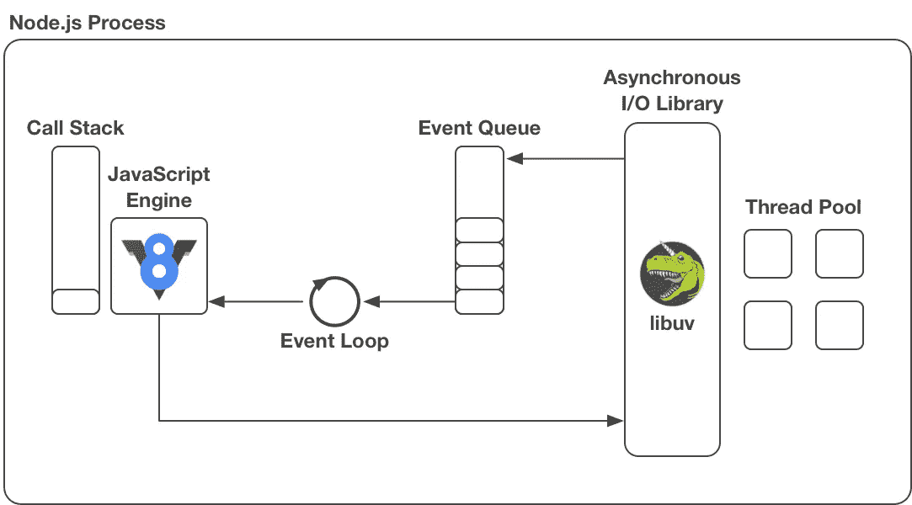

# JavaScript 承诺使用 Node.js

> 原文：<https://itnext.io/javascript-promises-with-node-js-e8ca827e0ea3?source=collection_archive---------0----------------------->

在本文中，我将通过简短的 Node.js 示例程序来解释如何使用 JavaScript promises。

我还将解释什么是异步任务，以及它们如何在 JavaScript 中用承诺和回调来实现。

因为我使用 Node.js 程序作为例子，所以我也将简要解释 Node.js 是什么以及它是如何工作的。

最后，在整篇文章中，我将承诺的使用与回调在 JavaScript 中实现异步任务的更传统的使用进行了比较。

# 内容

*   [**什么是承诺？什么是异步任务？**](#4029)
*   [**什么是 Node.js？**](#199b)
*   [**带有承诺的简单异步任务**](#b7e6)
*   [**带承诺的链式异步任务**](#9482)
*   [**创造承诺**](#cc7d)


曼努埃尔·萨多在 [Unsplash](https://unsplash.com/search/photos/node?utm_source=unsplash&utm_medium=referral&utm_content=creditCopyText) 上拍摄的照片

# 什么是承诺？什么是异步任务？

承诺和回调是 JavaScript 中实现**异步任务**的两种机制。如果调用者只是“开始”任务，然后在任务运行时继续做其他工作，那么任务就是异步的。当任务完成时，调用者会得到通知，这样它就可以中断当前的执行，并对任务的结果做任何事情。

这与**同步任务**形成对比，在这种情况下，调用者只需等待任务完成，然后才继续执行。

通常，程序包含同步和异步任务。自然，持久的“慢”任务很适合异步任务(非常快的任务可以同步实现)。最慢的任务通常是输入输出(I/O)任务。I/O 任务是访问外部设备的任务，如硬盘或网络。在 JavaScript 中，I/O 任务通常是异步实现的。

当您在程序中启动一个异步任务时，您必须以某种方式定义当这个任务完成时要做什么。传统上，这是通过一个**回调函数**来完成的，您可以将它作为一个参数传递给启动异步任务的函数。该功能将在任务完成时执行。

最近，有另一种方法来定义异步任务完成后要采取的动作:**承诺**。在已经于 2015 年 6 月出版的 [ECMA-262 标准第六版](http://www.ecma-international.org/ecma-262/6.0/) (ES6)中已经引入了承诺。

这篇文章的目的是通过例子来解释承诺的用法。注意，承诺可以作为回调函数的替代，用承诺可以做的事情也可以用回调函数来做。但是承诺更加专业，允许更干净的代码。在本文中，当我们比较承诺的使用和回调的使用时，这一点也会变得很明显。

异步是 JavaScript 的核心。JavaScript **运行时环境**专门用于异步任务的执行。它们具有处理异步任务的特殊功能。这也适用于特定的 JavaScript 运行时环境 **Node.js** 。但是 Node.js 到底是什么？

# Node.js 是什么？

简单来说，Node.js 是一个针对 JavaScript 的*独立* **运行时环境**。这意味着，Node.js 可以在您的计算机上作为独立的进程执行 JavaScript 代码。我们可以说 Node.js 之于 JavaScript 就像 JVM 之于 Java 字节码，或者说 Python 解释器之于 Python。

这个的特别之处在于*独立*部分。因为，传统上 JavaScript 引擎是专门嵌入到网络浏览器中的。这意味着，您只能在 web 浏览器中显示的网站的上下文中执行 JavaScript 代码。Node.js 是第一批独立于 web 浏览器并在自己的进程中运行的 JavaScript 引擎之一。

Node.js 使 JavaScript 用于通用应用成为可能。今天，用 Node.js 构建的最常见的应用程序类型是 web 服务器。但是原则上 Node.js 可以用来构建任何类型的应用程序。

## 它是如何工作的？

Node.js 有以下三个主要成分:

*   **JavaScript 引擎**
*   **异步输入输出库**
*   **事件循环**

在下面，我将解释每一个概念。下面是内部 Node.js 架构的概述:



Node.js 的内部工作方式

**JavaScript 引擎:**

JavaScript 引擎是一种读取 JavaScript 代码并使其在机器上执行的软件。

今天大多数 JavaScript 引擎执行**实时(JIT)编译**，也就是说，在程序执行的同时，JavaScript 语句被编译成机器代码。这使得它们介于经典超前(AOT)编译器(如 C 语言的`gcc`)和经典解释器(如 Ruby 或 Python 的解释器)之间。这里有一个[视频](https://www.youtube.com/watch?v=p-iiEDtpy6I)解释了 JavaScript 引擎是如何工作的。

重要的是要记住，JavaScript 引擎的工作是获取 JavaScript 的一个语句或函数，并让它在机器上执行。

Web 浏览器包含一个 JavaScript 引擎，Node.js 也是，Node.js 使用的 JavaScript 引擎是 Google 开发的**[**Chrome V8**](https://developers.google.com/v8/)(或简称 V8)。**

****异步输入输出库:****

**一个 JavaScript 引擎对于一个完整的运行时环境是不够的。异步实现的慢速操作，如磁盘访问或网络请求，不是由 JavaScript 引擎本身执行，而是交给专门的异步 I/O 库执行。Node.js 使用的库叫做 [**libuv**](https://libuv.org/) 。**

**libuv 维护一个工作线程池**,从 JavaScript 引擎接收的 I/O 任务在这个池中执行。线程池的默认大小是 4，最大大小是 128，可以在 Node.js 启动时通过设置`UV_THREADPOOL_SIZE`环境变量来改变(参见 [docs](http://docs.libuv.org/en/v1.x/threadpool.html) )。****

**请注意，线程池*中的线程可能*阻塞(例如，等待磁盘访问)，但这不会阻塞运行在自己线程中的 JavaScript 引擎。如果线程池中的所有线程都很忙，并且有来自 JavaScript 引擎的新任务到达，那么这些新任务只是由 libuv 进行排队，一旦一个工作线程空闲，它们就会被处理。**

**当 JavaScript 引擎将一个 I/O 任务传递给 libuv 时，它还向运行时注册与该任务相关联的**回调**。这个回调将在任务完成时执行(我们稍后将详细了解这是如何发生的)。这意味着，传递给 libuv 的每个任务都必须有一个与之相关联的回调。这个回调函数是作为参数传递给异步函数的回调函数。**

**现在让我们看看当 libuv 完成一个任务时，这个回调会发生什么。**

****事件循环:****

**事件循环与**事件队列**协同工作。事件队列只是 JavaScript 函数的队列。为了清楚起见，让我们调用事件队列中的函数*事件*。当 libuv 完成一项任务时，运行时会将相关的回调放入事件队列中。**

**注意，事件队列常用的替代名称是*任务队列*或*消息队列*。但它们都是一样的东西。**

**现在到**事件循环**:事件循环位于事件队列和 JavaScript 引擎之间。简单地说，事件循环的工作就是将事件从事件队列“铲”到 JavaScript 引擎中执行。**

**但是事件循环不是盲目地这样做，而是根据以下规则:**

*   **如果 JavaScript 引擎当前已经在执行一个事件，那么事件循环将等待，直到 JavaScript 引擎完成该事件的执行。**
*   **JavaScript 引擎一空闲，事件循环就将事件队列头部的事件传递给 JavaScript 引擎。如果事件队列当前为空，但仍有未完成的异步任务，那么事件循环将一直等待，直到新事件被放入事件队列。**

**第一点通常用**调用栈**来解释。与大多数运行时一样，Node.js 也维护一个调用栈，以便于函数的执行。当一个函数被调用时，一个由函数的返回地址和局部变量组成的“堆栈帧”被推到堆栈上，当函数返回时，堆栈帧被从堆栈中移除。**

**只要调用堆栈不为空，就意味着 JavaScript 引擎仍在执行一个事件。当调用堆栈为空时，这意味着 JavaScript 引擎已经执行完它的最后一个事件(之前由事件循环传递给它)，这意味着 JavaScript 引擎已经准备好从事件循环接收下一个事件。**

**从这个事实出发，Node.js 总是在处理新事件之前“清空堆栈”，并且在执行任何其他事件之前，所有事件[“运行完成”](https://developer.mozilla.org/en-US/docs/Web/JavaScript/EventLoop#Run-to-completion)。**

**这里有一个很好的 [**视频**](https://www.youtube.com/watch?v=8aGhZQkoFbQ) 解释了事件循环是如何工作的。**

**注意，上面的视频不是专门关于 Node.js 的，而是关于 web 浏览器中的 JavaScript 运行时。然而，Node.js 实际上非常类似于 web 浏览器的 JavaScript 运行时。最大的区别可能是 Node.js 使用 libuv，而 web 浏览器运行时使用浏览器提供的 API 来执行异步 I/O 任务。事件循环在 Node.js 和 web 浏览器 JavaScript 运行时中的工作方式非常相似。**

## **主程序是如何执行的？**

**到目前为止，我们已经讨论了作为回调的“事件”,当相应的异步任务完成时，这些事件被放入事件队列。但是一个程序的“主代码”呢？或者一个完全不使用异步任务和回调的程序？**

**例如，下面的程序:**

```
var n = 1 + 1;
console.log("The answer is " + n);
```

**是如何执行的？嗯，一个程序的主代码可以看作是一个特殊函数`main()`的主体，当程序启动时，这个函数作为第一个事件放入事件队列。因此，事件循环会立即将其传递给 JavaScript 引擎，JavaScript 引擎会将其作为第一个事件执行。**

**这也解释了 JavaScript 经常出现的一个重要现象。考虑以下程序:**

```
myLog("Start of main");setTimeout(() => myLog("I'm the setTimeout callback"), 0);for (i = 0; i < 1000000000; i++) {}myLog("End of main");
```

**它的输出:**

```
$ node app.js
12:26:35.423 Start of main
12:26:38.662 End of main
12:26:38.665 I'm the setTimeout callback
```

**您可以看到，尽管我们为`setTimeout`回调设置了 0 毫秒的延迟，但这个回调仅在 3 秒钟后执行，在主程序中的所有其他语句都已执行之后。**

**原因是在 JavaScript 引擎已经开始执行`main`事件之后，`setTimeout`回调导致一个新事件被放入事件队列(注意，`setTimeout`为 libuv 创建一个异步任务，该任务将在设置的延迟到期时完成，从而创建一个新事件，由回调函数组成，并被放入事件队列)。**

**回调事件几乎会在主程序调用`setTimeout`后立即进入事件队列(延迟设置为 0 毫秒)。它将位于事件队列的最前面，等待被执行。但是事件循环对此无能为力。JavaScript 引擎仍在执行`main`事件，事件循环别无选择，只能等到 JavaScript 引擎完成`main`事件(及其冗长的`for`循环)的执行后，才能将`setTimeout`回调事件传递给 JavaScript 引擎。**

**这就是`setTimeout`不是*保证延迟*而是*最小延迟*的原因。这个也在[这里](https://developer.mozilla.org/en-US/docs/Web/JavaScript/EventLoop#Adding_messages)解释。**

**在对 Node.js 和事件循环如何工作进行了冗长的讨论之后，让我们回到文章的主题:**承诺**。**

# **简单的异步任务和承诺**

**异步函数返回承诺。然后，通过向该承诺提供回调函数来定义任务完成时要做什么。这与回调的传统用法形成对比，在传统用法中，回调函数直接传递给异步函数。**

**我们将用一个例子来说明`amqplib`模块的异步 API 函数。`amqplib`是 AMQP 消息队列服务器的客户端库，例如 [RabbitMQ](http://www.rabbitmq.com/) 。**

**这个库有一个很好的特性，所有的 API 函数都有基于承诺的版本和基于回调的版本。因此，我们可以方便地比较承诺的使用和回调的使用。**

**下面列出的第一个程序只是尝试与本地机器上的 AMQP 服务器建立连接:**

```
var amqp = require('amqplib');amqp.connect("amqp://localhost").then(onSuccess).catch(onFailure);function onSuccess(result) {
  myLog(result.toString());
}function onFailure(err) {
  myLog(err.toString());
}myLog("I'm here");
```

**注意，上面的清单中省略了`myLog`函数的定义，但是可以在文章末尾的[附录](#df35)中找到。**

**`amqp.connect`函数返回一个承诺。然后我们对这个承诺调用`then`，在连接建立成功的情况下向它传递回调函数，然后我们调用`catch`函数，在连接建立失败的情况下向它传递另一个回调函数。稍后我会更详细地解释`then`和`catch`的用法。**

**顺便说一下，一份承诺文件可以在这里找到。**

**现在，在没有运行 AMQP 服务器的情况下，让我们执行这个程序:**

```
$ node app.js
12:11:13.580 I'm here
12:11:13.595 Error: connect ECONNREFUSED 127.0.0.1:5672
```

**我们可以在输出中看到两件事。首先，无法建立连接(调用了`onFailure`函数，而不是`onSuccess`函数)。这仅仅是因为我们的本地机器上没有运行 AMQP 服务器。稍后，我们将启动一个 RabbitMQ 服务器，然后再次运行该程序。**

**其次，我们可以看到，`myLog("I'm here")`语句在构成`onFailure`函数体的`myLog(err.toString())` 语句之前 15 毫秒被执行。让我们来看看为什么这一系列事件是这样的。**

## **这是怎么回事？**

**Node.js 使用一个运行 JavaScript 引擎的主线程。如上所述，同步任务由主线程直接执行。另一方面，异步任务由主线程传递给异步 I/O 库 libuv。之后，主线程继续执行程序中的下一条语句。**

**同时，工作线程执行提交给 libuv 的任务。任务一完成，相关的回调就作为一个新事件被放入事件队列，最终由事件循环传递给主线程中的 JavaScript 引擎。**

**创建一个承诺基本上是向 libuv 发布一个异步任务，一个承诺的`then`函数向与这个承诺关联的异步任务注册一个回调。**

**因此，当我们执行上述程序时，会出现以下步骤序列:**

1.  **主线程执行`amqp.connect`。这导致一个适当的 *connect* 任务被传递给 libuv 进行异步执行。此后，`amqp.connect`完成并返回一个承诺。**
2.  **来自 libuv 线程池的工作线程现在可以开始执行连接任务。**
3.  **主线程执行`amqp.connect`返回的承诺的`then`函数，并将提供的`onSuccess`函数注册为 *connect* 任务的回调(针对任务*成功*的情况)。`then`函数返回另一个承诺。**
4.  **主线程执行`then`返回的承诺的`catch`函数，并将提供的`onFailure`函数注册为 *connect* 任务的另一个回调(针对任务*失败*的情况)。`catch`函数返回另一个承诺(但是在我们的例子中没有进一步使用)。**
5.  **主线程执行`myLog("I'm here")`(打印`I'm here`到控制台)。**
6.  *****大约 15 毫秒，主线程空闲，事件队列为空，所以什么也没发生。*****
7.  **一个工作线程完成了*连接*任务(它失败了)，这导致运行时将`onFailure`函数放入事件队列。**
8.  **主线程执行`onFailure`功能(将`Error connect ECONNREFUSED ...`打印到控制台)。**
9.  **Node.js 进程终止。**

## **关于“`catch" and "then"`的一个注记**

**`catch(onFailure)`函数只是`then(undefined, onFailure)`的语法糖。也就是说，`catch`只是另一个第一个参数设置为`undefined`的`then`函数(参见[文档](https://developer.mozilla.org/en-US/docs/Web/JavaScript/Reference/Global_Objects/Promise/catch))。**

**撇开`catch`不谈，我们可以谈谈`then`以及调用它的方式。**

**`then`函数有两个参数，其中第二个参数是可选的。第一个参数是当`then`被调用的承诺为**【履行】**时要调用的回调函数，第二个(可选)参数是当承诺为**【拒绝】**时要调用的回调函数(参见[文档](https://developer.mozilla.org/en-US/docs/Web/JavaScript/Reference/Global_Objects/Promise/then))。**

**注意，这两个函数参数都是单参数函数，就像我们上面定义的`onSuccess`和`onFailure`一样。**

**因此，`then`的典型调用如下所示:**

```
then(onSuccess, onFailure)
```

**但也可以这样称呼:**

```
then(onSuccess)
```

**或者像这样:**

```
then(undefined, onFailure)
```

**正如我们已经看到的，最后一次调用相当于:**

```
catch(onFailure)
```

**第一种情况，`then(onSuccess, onFailure)`非常清楚:如果承诺*中的任务成功*(即承诺“完成”)，则调用`onSuccess`，如果任务*失败*(即承诺“拒绝”)，则调用`onFailure`。**

**同样，在第二种情况下，`then(onSuccess)`，如果承诺兑现，则调用`onSuccess`。但是如果承诺被拒绝了呢？那么实际上没有回调代码被执行(承诺拒绝没有被处理)。正如我们将在后面看到的，如果`then`函数被*链接*，这实际上可能是一个期望的行为。**

**第三种情况，`then(undefined, onFailure)`，相当于`catch(onFailure)`，如果拒绝承诺，则调用`onFailure`。但是如果承诺兑现了呢？同样，不执行回调代码(不处理承诺履行)。同样，如果`then`函数是链式的，这可能是有用的。**

**在上面的清单中，我们有下面一行:**

```
amqp.connect("amqp://localhost").then(onSuccess).catch(onFailure);
```

**有了这个新知识，我们看到下面这条线是等价的:**

```
amqp.connect("amqp://localhost").then(onSuccess).then(undefined, onFailure);
```

**我们也可以像这样通过一次调用`then`来实现相同的行为:**

```
amqp.connect("amqp://localhost").then(onSuccess, onFailure);
```

**[文件](https://developer.mozilla.org/en-US/docs/Web/JavaScript/Reference/Global_Objects/Promise/then#Chaining)推荐使用`then(onSuccess)`和`catch(onFailure)`而不是`then(onSuccess, onFailure)`。**

## **允许履行承诺**

**用`rabbitmq-server`在本地机器上启动 RabbitMQ 服务器，然后再次运行程序:**

```
$ node app.js
12:14:59.448 I'm here
12:14:59.505 [object Object]
```

**现在连接成功了。与之前相反，现在调用了`onSuccess`，而不是`onFailure`，在通过调用`amqp.connect`启动连接建立之后至少 57 毫秒。**

**如果您现在导航到`[http://localhost:15672/#/connections](http://localhost:15672/#/connections,)`上的 RabbitMQ 管理 UI，您应该在那里看到打开的连接。**

**日志输出中打印的`[object Object]`实际上是一个`amqplib`对象，它表示一个到 AMQP 服务器的开放连接，它可以用于`amqplib`的进一步 API 函数，例如，用于创建一个[通道](http://www.squaremobius.net/amqp.node/channel_api.html#model_createChannel)。**

## **使用匿名函数**

**在上面的例子中，我们使用明确命名的函数`onSuccess`和`onFailure`作为`then`和`catch`函数的参数。**

**在这些情况下，更常见的是使用匿名函数(尽管通常可读性较差)。在这种情况下，程序应该是这样的:**

```
var amqp = require('amqplib');amqp.connect("amqp://localhost")
  .then(result => myLog(result.toString()))
  .catch(err => myLog(err.toString()));myLog("I'm here");
```

**这完全等同于上面带有命名回调函数的版本。**

## **承诺与回访**

**`amqplib`模块对 API 中的每个函数都有一个基于承诺和基于回调的版本。要导入基于回调的函数，我们只需要`amqplib/callback_api`而不是`amqplib`。**

**在基于回调的版本中，`connect`函数有两个参数:一个 AMQP URI 和一个[错误优先回调](http://fredkschott.com/post/2014/03/understanding-error-first-callbacks-in-node-js/)函数。让我们用基于回调的 API 函数重写上面的程序:**

```
var amqp = require('amqplib/callback_api');amqp.connect("amqp://localhost", callback);function callback(err, result) {
  if (err)
    myLog(err.toString());
  else
    myLog(result.toString());
}myLog("I'm here");
```

**无论有没有运行 RabbitMQ 服务器，您都可以运行这个程序:其行为与最初基于 Promise 的版本完全相同。**

**现在，为了完整起见，让我们用匿名函数而不是命名函数重写基于回调的版本:**

```
var amqp = require('amqplib/callback_api');amqp.connect("amqp://localhost", (err, result) => {
  if (err)
    myLog(err.toString());
  else
    myLog(result.toString());
});myLog("I'm here");
```

**我们在这里已经可以看到，基于回调的版本比基于承诺的版本稍微不那么简洁。但是对于更复杂的任务，这种差异会更明显，我们将在下一节中看到。**

# **带承诺的链式异步任务**

**如果我们必须执行一系列异步任务，并且限制一个任务只能在前一个任务完成时开始，那么承诺，尤其是承诺链，就变得非常有用。这导致了嵌套的回调，因为我们在其他回调中有回调的定义。**

**例如，为了完整地设置一个 RabbitMQ 服务器，我们可能需要执行以下任务。**

1.  **建立到 RabbitMQ 服务器的*连接***
2.  **(1)完成后，在此连接上创建一个*通道***
3.  **当(2)完成时，在该通道上创建一个*队列***

**以下是我们如何通过连锁承诺来实现这一点:**

```
var amqp = require('amqplib');amqp.connect("amqp://localhost")
  .then(onConnSuccess)
  .then(onChannelSuccess)
  .then(onQueueSuccess)
  .catch(onFailure);function onConnSuccess(connection) {
  myLog("Connection: " + connection.toString());
  return connection.createChannel()
}function onChannelSuccess(channel) {
  myLog("Channel: " + channel.toString());
  return channel.assertQueue("my_queue");
}function onQueueSuccess(queue) {
  myLog("Queue: " + queue.toString());
}function onFailure(err) {
  myLog(err.toString());
}myLog("I'm here");
```

**如您所见，每个任务都有一个成功回调函数，其中前两个函数启动一个新的异步任务，并将结果承诺返回到承诺链中。**

**`then`是内部设置的，允许回调函数返回一个承诺，该承诺应用于链中的后续`then`，依此类推。如果回调函数返回一个非承诺值，那么当前的承诺就用这个值“解决”了，也就是履行了。关于`then`返回值的详细信息可以在 [**文档**](https://developer.mozilla.org/en-US/docs/Web/JavaScript/Reference/Global_Objects/Promise/then#Return_value) 中找到。总而言之，这种复杂的设计允许如上所示的承诺链。**

**在链的末端有一个单独的`catch(onFailure)`函数(你知道它与`then(undefined, onFailure)`相同)。一旦链中的任何先前承诺被拒绝，就调用该函数。这意味着，如果链中较早的承诺被拒绝，那么后续的`then`功能不会被执行，而是直接跳到`catch`。这就是为什么，如前所述，如果一些`then`只处理完成，而不处理拒绝，而另一些`catch`只处理拒绝，而不处理完成，那么链接是有用的。**

**让我们看看这在实践中是如何工作的。如果我们没有运行 RabbitMQ 服务器并运行上述程序，我们会得到以下结果:**

```
$ node app.js
18:26:28.509 I'm here
18:26:28.548 Error: connect ECONNREFUSED 127.0.0.1:5672
```

**这里执行的惟一一个回调是`onFailure`，带有连接承诺的错误对象。正如所料，没有一个`then`回调被执行。**

**现在，让我们用`rabbitmq-server`启动一个 RabbitMQ 服务器，并再次运行程序:**

```
$ node app.js
18:35:35.337 I'm here
18:35:35.362 Connection: [object Object]
18:35:35.368 Channel: [object Object]
18:35:35.371 Queue: [object Object]
```

**正如我们所看到的，现在所有`then`的回调函数都按顺序执行，创建一个连接，然后是一个通道，然后是一个队列。另一方面，不执行`catch`，因为没有任务失败。**

**在`[http://localhost:1567](http://localhost:15672/)`上检查您的 RabbitMQ 服务器，您应该看到已经创建了一个连接、一个通道以及一个队列。**

## **承诺与回访**

**凡是用承诺可以做到的，也可以用回电来做到。因此，让我们看看如何用回调(使用`amqplib` API 的“回调版本”)编写上述程序:**

```
var amqp = require('amqplib/callback_api');amqp.connect("amqp://localhost", connCallback);function connCallback(err, connection) {
  if (err)
    myLog(err.toString());
  else {
    myLog("Connection: " + connection.toString());
    connection.createChannel(channelCallback);
  }
}function channelCallback(err, channel) {
  if (err)
    myLog(err.toString());
  else {
    myLog("Channel: " + channel.toString());
    channel.assertQueue("my_queue", null, queueCallback);
  }
}function queueCallback(err, queue) {
  if (err)
    myLog(err.toString());
  else {
    myLog("Queue: " + queue.toString());
  }
}myLog("I'm here");
```

**基于承诺的版本比基于回调的版本更简洁，我认为可以说它也更具可读性。**

## **使用匿名函数**

**让我们看看当我们使用匿名函数时，基于承诺的版本和基于回调的版本是什么样子的。**

****无极版本:****

```
var amqp = require('amqplib');amqp.connect("amqp://localhost")
  .then(connection => {
    myLog("Connection: " + connection.toString());
    return connection.createChannel()
  })
  .then(channel => {
    myLog("Channel: " + channel.toString());
    return channel.assertQueue("my_queue");
  })
  .then(queue => {
    myLog("Queue: " + queue.toString());
  })
  .catch(err => {
    myLog(err.toString());
  });myLog("I'm here");
```

****回调版本:****

```
var amqp = require('amqplib/callback_api');amqp.connect("amqp://localhost", (err, connection) => {
  if (err)
    myLog(err.toString());
  else {
    myLog("Connection: " + connection.toString());
    connection.createChannel((err, channel) => {
      if (err)
        myLog(err.toString());
      else {
        myLog("Channel: " + channel.toString());
        channel.assertQueue("my_queue", null, (err, queue) => {
          if (err)
            myLog(err.toString());
          else {
            myLog("Queue: " + queue.toString());
          }
        });
      }
    });
  }
});myLog("I'm here");
```

**在这里，承诺相对于回调函数的优势变得非常明显。**

**对于回调，我们必须定义嵌套的匿名回调定义，我们最终会陷入“回调地狱”。此外，我们必须检查`if/else`语句中的错误，这些错误会进一步增加可读性。**

**另一方面，对于 promises，我们对所有匿名函数都有一个固定的嵌套深度，错误作为链的元素来处理(通过`catch`函数)。**

**这种增加的可读性和减少的错误倾向是承诺相对于回调的主要优势。**

# **创造承诺**

**以上所有讨论都是关于*使用*承诺。在每种情况下，承诺都是由 API 函数创建的，我们只是使用它。**

**然而，如果您必须为自己创建一个具有承诺能力的异步函数，那么您必须知道如何创建承诺。**

**例如，假设我们想要创建一个基于承诺的`setup`函数，它结合了上面的*连接*、*通道*和*队列*任务。该函数应该返回一个承诺，调用者应该能够这样做:**

```
setup().then(onSetupSuccess).catch(onSetupFailed);
```

**在这个例子中，`onSetupSuccess`是一个调用方定义的回调函数，用于整个设置(即连接*和*通道*和*队列的创建)成功的情况，而`onSetupFailed`是一个调用方定义的回调函数，用于任何这些任务失败的情况。**

**可以通过以下方式创建承诺，如文档中的[这里的](https://developer.mozilla.org/en-US/docs/Web/JavaScript/Reference/Global_Objects/Promise#Creating_a_Promise)所述:**

```
new Promise(executor);
```

**在这种情况下，`executor`是对所谓的**执行器函数** *的引用。当你创建一个承诺时，你必须定义这个执行者函数。***

**executor 函数必须具有以下签名:**

```
function executor(resolve, reject)
```

**也就是说，它必须有两个参数，并且这两个参数都是函数引用。别担心，你不需要定义这些函数。但是你必须在 executor 函数的主体中调用这些函数。**

**特别是，当您想要“履行”承诺时，也就是当异步任务成功时，您必须调用`resolve`函数。而你要“拒绝”承诺的时候，也就是异步任务失败的时候，就得调用`reject`函数。**

**最后，要创建启用承诺的异步函数，该函数必须简单地返回一个适当设置的承诺。**

**让我们看看这在实践中是怎样的。下面是一个定义和使用如上所述的`setup`函数的程序:**

```
var amqp = require('amqplib');setup()
  .then(() => myLog("Setup succeeded"))
  .catch(err => myLog("Setup failed: " + err));function setup() {
  return new Promise(setupExecutor);
}function setupExecutor(resolve, reject) {
  amqp.connect("amqp://localhost")
    .then(connection => {
      return connection.createChannel()
    })
    .then(channel => {
      return channel.assertQueue("my_queue");
    })
    .then(queue => {
      resolve();
    })
    .catch(err => {
      reject(err);
    });
}myLog("I'm here");
```

**如果我们在没有运行 RabbitMQ 服务器的情况下执行这个程序，我们会得到以下输出:**

```
$ node app.js
16:50:10.447 I'm here
16:50:10.463 Setup failed: Error: connect ECONNREFUSED 127.0.0.1:5672
```

**在运行 RabbitMQ 服务器的情况下:**

```
$ node app.js
16:51:25.815 I'm here
16:51:25.890 Setup succeeded
```

**可以再查一下[**http://localhost:15672/**](http://localhost:15672/)**，连接、通道、队列应该都在。只需调用启用承诺的`setup`函数就可以完成所有事情。我们已经成功地创建了一个新基于承诺的异步函数，该函数又包含三个相互依赖的异步任务。****

****和往常一样，将函数引用参数定义为**匿名函数**比命名函数更常见。在这种情况下，程序应该是这样的(只有`setup`函数发生了变化):****

```
**var amqp = require('amqplib');setup()
  .then(() => myLog("Setup succeeded"))
  .catch(err => myLog("Setup failed: " + err));function setup() {
  return new Promise((resolve, reject) => {
    amqp.connect("amqp://localhost")
      .then(connection => {
        return connection.createChannel()
      })
      .then(channel => {
        return channel.assertQueue("my_queue");
      })
      .then(queue => {
        resolve();
      })
      .catch(err => {
        reject(err);
      });
  });
}myLog("I'm here");**
```

****注意，这里我们的 promise 的 executor 函数的实现使用了异步的基于 promise 的函数本身(`amqplib` API 函数)。****

****然而，没有什么能阻止我们使用基于回调的异步函数来实现 promise executor 函数。仅仅因为我们定义了一个承诺，并不意味着我们也必须用承诺实现承诺中的所有异步操作。****

****如果我们愿意，我们可以使用`amqplib`的基于**回调的 API** 函数来实现我们的承诺执行器函数。在这种情况下，程序应该是这样的:****

```
**var amqp = require('amqplib/callback_api');setup()
  .then(() => myLog("Setup succeeded"))
  .catch(err => myLog("Setup failed: " + err));function setup() {
  return new Promise((resolve, reject) => {
    amqp.connect("amqp://localhost", (err, connection) => {
      if (err)
        reject(err);
      else {
        connection.createChannel((err, channel) => {
          if (err)
            reject(err);
          else {
            channel.assertQueue("my_queue", null, (err, queue) => {
              if (err)
                reject(err);
              else {
                resolve();
              }
            });
          }
        });
      }
    });
  });
}myLog("I'm here");**
```

****然而，如上所述，我认为基于承诺的版本比基于回调的版本更具可读性是不言而喻的。****

# ****附录:myLog 函数****

```
**function myLog(msg) {
  console.log(getTime() + " " + msg);
}function getTime() {
  var d = new Date();
  return d.toLocaleTimeString('en-GB') + "." + d.getMilliseconds();
}**
```