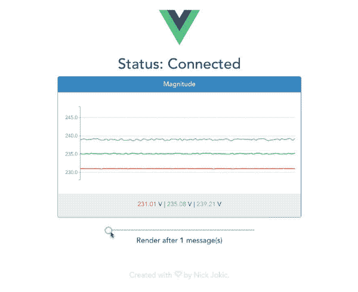
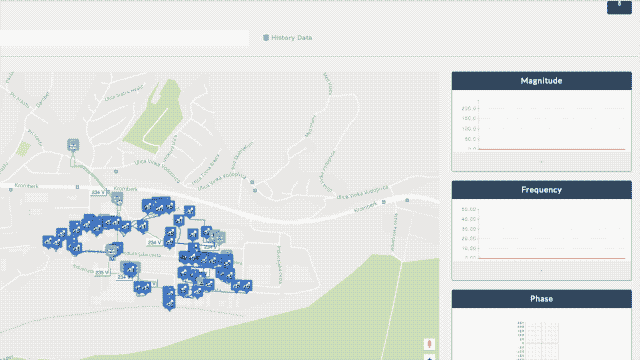

# JavaScript:高频流的实时可视化

> 原文：<https://itnext.io/javascript-real-time-visualization-of-high-frequency-streams-d6533c774794?source=collection_archive---------2----------------------->

> **TL；博士**——我建立了一个 web 应用程序，可视化高频实时数据流。该应用程序是对真实世界物联网项目的模拟，使用 MQTT 和 socket . io。[查看最后一部分，在您的本地机器上设置应用程序。](https://medium.com/p/d6533c774794#ad5d)
> 
> **我讲的主要话题:**可视化高频数据流；最小化 CPU 负载的实用优化技术…
> 
> [点击这里在 LinkedIn 上分享这篇文章](https://www.linkedin.com/cws/share?url=https%3A%2F%2Fitnext.io%2Fjavascript-real-time-visualization-of-high-frequency-streams-d6533c774794%3Futm_source%3Dmedium_sharelink%26utm_medium%3Dsocial%26utm_campaign%3Dbuffer)

# 最终结果

全栈 Express+Vue 2 应用程序，演示了使用 MQTT 消息协议可视化高频数据流。该滑块展示了在 [**优化**](https://medium.com/p/d6533c774794#2567) 一节中描述的优化技术。



你可以尝试最终的应用。细节在最后一节。

你有:

*   需要在 web 环境中可视化的快速实时数据流？(例如物联网传感器数据)
*   使用 JavaScript 时关于高频实时图表的性能问题？

**别再看了！好吧，你应该这么做，但在这篇文章之后。**

我将通过一些理论和实际例子展示我是如何处理这类数据可视化问题的。我将用一个您可以在本地试用的工作项目来完成这篇文章。但是首先，如果你仍然想知道为什么/什么时候这可能有用，一定要看看背景故事。

# 简介和简短的背景故事

先自我介绍一下*(因为这是我的第一篇中文)*。我的名字是**尼克·乔基奇**，我是一名刚从斯洛文尼亚毕业的计算机&信息科学毕业生。我目前的任务是学习和吸收尽可能多的新知识。

尼克，这个关于**“网络浏览器中的高频实时数据可视化”**的想法是从哪里来的？*(耶，我知道你在想什么)*

## 实时数据的重要性及其对您的影响

让我们从 2 年前说起。大学期间，我在[*joef Stefan Institute*](https://www.ijs.si/ijsw/V001/JSI)(斯洛文尼亚最大的研究所)通信系统部当学生。

当时，该部门正在开展名为 [*SUNSEED*](http://sunseed-fp7.eu/) 的欧洲研究项目，其重点是探索可持续和稳健的智能配电网络。

我作为一名全栈开发人员开始从事这个项目。我被指派从头开始创建一个 web 应用程序，**使配电系统操作员能够实时监控配电网的状态**。**实时观察对于有效管理至关重要**，确保未来网络的平稳运行，检测网络异常，最终意味着**提高电能质量**。

*我就不深究电信方面了。到目前为止，您应该已经感受到了实时数据(可视化)的重要性。*

**主要功能如下:**



**演示:**我为 SUNSEED 项目开发的应用程序的一部分。

**主要应用功能:**配电系统操作员可以选择不同的 SE *(状态估计)*和 PMU *(相量测量单元)*流，并实时查看输入数据。

**小问题是这些数据流的频率约为 50 赫兹(每秒 50 条消息)。**

> “那么，如何使用 JavaScript 在折线图中有效地呈现每秒 50 个数据点(或更多)呢？”…

# 使用 JavaScript 库呈现实时图表的常见方式

我想到的第一件事是浏览网页和书籍，看看类似的高频问题是否已经用 JavaScript 解决了。遗憾的是(或者说谢天谢地)，没有任何成果。这迫使我探索了一点点*字节*更多:)

*在下面的例子中，我使用的是基于*[***D3 . js***](https://d3js.org/)SVG*的图表库。*

如果您曾经在网上搜索过关于 JavaScript 库的实时图表，您可能会发现类似的例子:

使用黄包车. js 更新间隔为 1s 的实时图表。

是的，1000 毫秒的更新间隔。工作正常。

没问题，**我们把 updateInterval 变量修改为 20** (模拟 50 Hz 的流)**，**应该可以！

使用黄包车. js 更新间隔为 20 毫秒的实时图表

如果你在一台现代机器上，很有可能一切都相当顺利。启动你的任务管理器，看看 CPU 的使用情况。现在，使用多个多系列折线图尝试相同的方法，并仔细观察应用程序的 CPU 使用情况…

让我们花一点时间思考一下表象下发生了什么。

…

## **图表每隔** ≈ **20 ms** 即≈ **每秒渲染 50x！**

这显然会导致性能问题。那么我们如何解决这个问题呢？*创造性拯救！*

# 最佳化

## 为了减少 CPU 负载，我们必须降低图表渲染函数执行的频率。

## **神奇的想法:**

如果我们试图仅在已经插入了 **N** 个数据点(但尚未重新呈现)之后才呈现图表，会怎么样？

理论上，如果 **streamFrequency=50 Hz** 且 **N=5** ，这意味着图表渲染函数在一秒钟内被调用 10x 每≈100 ms。

让我们试试这个！

使用 N=5 的黄包车. js 优化实时图表，更新间隔为 20 毫秒。

## **结果:**

*   (+)如果我们对比一下前后的 CPU 使用情况，可以看到 CPU 在负载下是远远少的。
*   (-)代价是平均刷新率为 10Hz，这使得可视化看起来不太流畅。如果 Y 轴的最小-最大间隔较大，当可视化数据流的输入值彼此类似**或**时，这种影响被最小化。

# 自己试试吧！

我准备了 2 个 GitHub repos [**服务器**](https://github.com/NickJokic/mqtt-realtime-chart-server) 和 [**客户端**](https://github.com/NickJokic/mqtt-realtime-chart-client) 供你试用！

为了使应用程序尽可能像真实世界一样，我们将使用 [**Moquette**](https://github.com/andsel/moquette) 设置一个简单的 MQTT 代理来监听端口 1883。这将模拟真实世界的物联网数据流。服务器端将在这个 MQTT 代理上发布和订阅主题，以便发送和接收数据。服务器收到来自 MQTT 主题的消息后，将使用 Socket.io 将它们转发给客户机。

# **安装:**

## 先决条件

请确保您的计算机上已经下载/安装了这些软件:

*   节点. js
*   npm
*   [Moquette (MQTT 代理)](https://github.com/andsel/moquette/tree/rel_0.8)(或任何其他监听端口 1883 的 MQTT 代理)

如果使用 Moquette，一定要安装 **Java JDK** (用 **JDK 8** ) *测试)。在我的机器上与 JDK9 和 JDK10 不兼容。*

## 安装和运行

您将需要 3 个终端实例来运行这个项目。

**1。割草:**

*   下载 [Moquette](https://github.com/andsel/moquette/tree/rel_0.8) (在“1 分钟设置”下点击 [**BinTray**](https://bintray.com/artifact/download/andsel/generic/distribution-0.8-bundle-tar.tar.gz) 链接)
*   开放端子 1
*   运行:

```
cd bin
./moquette.sh(If you’re on Windows, run the last command as):
.\moquette.bat
```

**2。服务器**

*   下载[mqtt-实时图表-服务器](https://github.com/NickJokic/mqtt-realtime-chart-server)
*   开放端子 2
*   在根文件夹中解压缩并运行:

```
npm install
npm start
```

**3。客户端**

*   下载[mqtt-实时-图表-客户端](https://github.com/NickJokic/mqtt-realtime-chart-client)
*   开放端子 3
*   在根文件夹中解压缩并运行:

```
npm install
npm start
```

客户端编译完成后，您会在应用程序当前运行的终端*(例如*[*http://localhost:8080)*](http://localhost:8080))中看到链接。使用浏览器导航到该链接。

如果一切顺利，您应该会看到数据频率在 50 Hz 左右的实时图表！现在，您可以通过更改滑块值来探索所讨论的优化技术。在这样做的时候，不要忘记留意任务管理器中的 CPU 使用情况。

## 感谢您阅读这篇文章！

这是我的第一篇文章，显然我还在不停地学习。

这只是对这个主题的一个小的改动，因为我觉得这篇文章已经够长了。更多的事情可以讨论: SVG 与 Canvas 的实时性，JavaScript 图表库的比较，不同的图表类型…

如果您有任何问题、建设性的批评、想法或知识要分享→请随意！:)

*和平&爱情，*

尼克·乔基奇