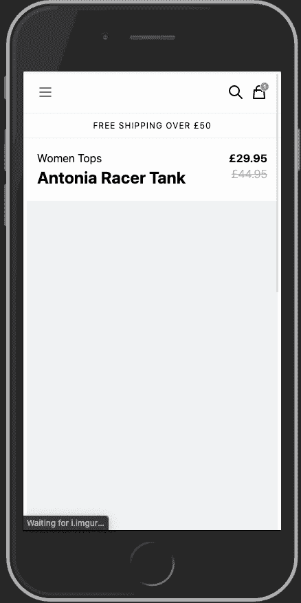
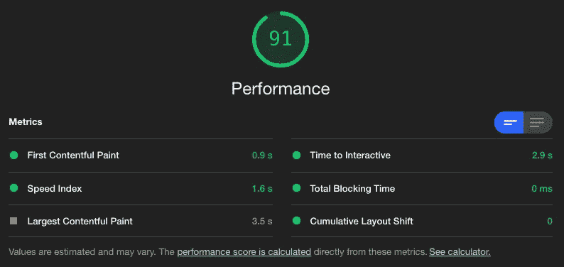
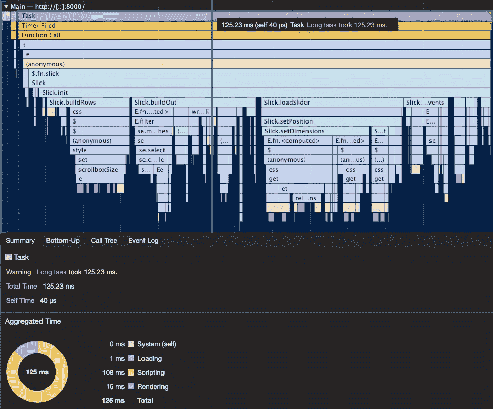
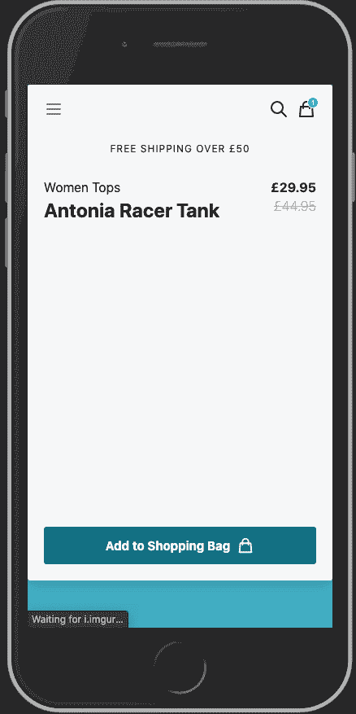
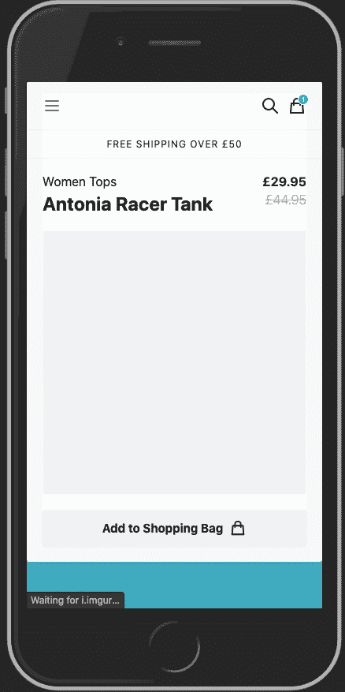
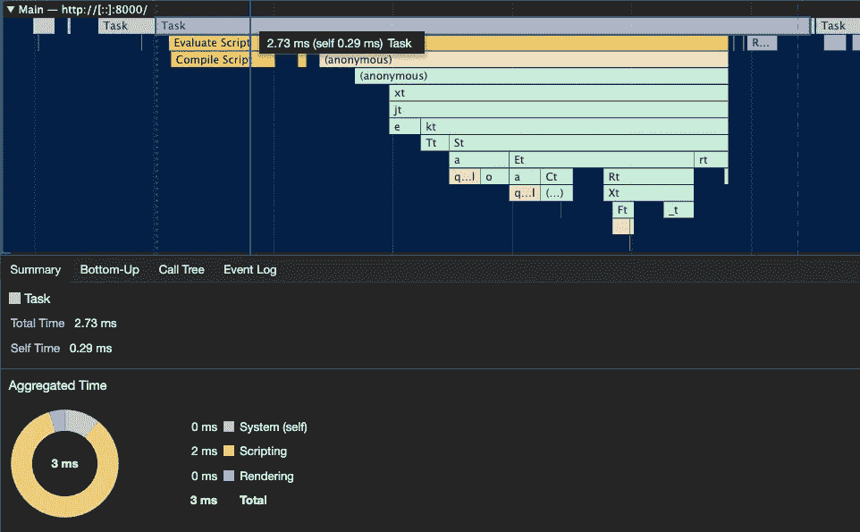
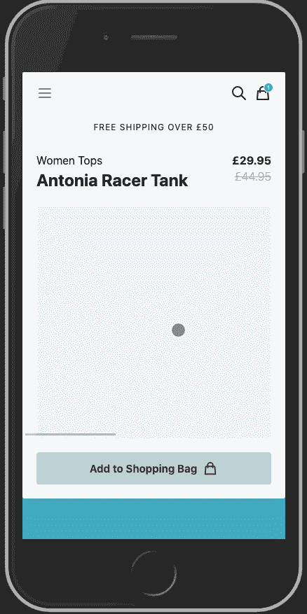
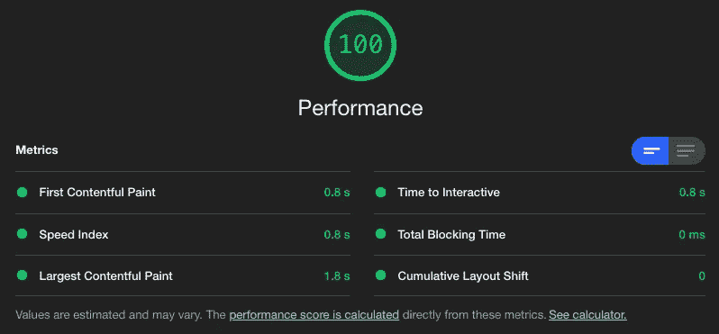

# Javascript 滑块会扼杀你的网站性能

> 原文：<https://itnext.io/javascript-sliders-will-kill-your-website-performance-5e4925570e2b?source=collection_archive---------0----------------------->


照片由 Vincentas Liskauskas 拍摄

滑块(或旋转木马)是目前几乎所有网站中最常见的元素，不管你对它们的感觉如何，它们都可以提供一种便捷的方式来显示信息，尤其是在屏幕尺寸有限的情况下。

在电子商务网站中，用例的范围从展示特色产品、横幅、促销、产品图库，应有尽有！这些坏男孩在野外并不缺乏，尽管他们的有效性有点争议，这是用户习惯看到的事情之一，所以它为大多数人提供了低摩擦的体验。


使用滑块在 asos.com[和](https://www.asos.com/)输入样式

幸运的是，对于我们这些前端开发人员来说，有数百个基于 Javascript 的滑块可供选择，不幸的是，它们中的大多数都有相同的缺点:**它们的性能很差**，请相信我，因为我已经使用了所有的滑块，每一个都是。

# 他们不可能都那么坏！

是时候运行一些测试了，让我们创建一个非常简单的 slider 实现来显示产品图片列表，几乎每个电子商务商店都有这样或那样的形式，所以尽管外观会有所不同，但作为一个例子来使用还是很常见的。


超级简单的产品图库滑块

正如你所看到的，它非常简单，一次只有一张幻灯片，没有箭头，没有导航指示器或任何花哨的东西。我所做的只是显示下一张或上一张图片的一部分，向用户提供一些反馈，让他们知道他们可以左右滑动来查看更多内容。

# 顶级竞争者

我不想花时间测试每一个 javascript 滑块，所以我选择了这些年来最适合我的 5 个:

1.  [光滑的滑块](https://kenwheeler.github.io/slick/)
2.  [猫头鹰旋转木马](https://owlcarousel2.github.io/OwlCarousel2/)
3.  [轻飘飘](https://flickity.metafizzy.co/)
4.  [Keen-slider](https://keen-slider.io/)
5.  [Glider.js](https://nickpiscitelli.github.io/Glider.js/)

所有这些滑块都有一些重要的共同点，它们提供了最基本的 CSS 样式来使它们工作，除此之外的任何定制都取决于你。这对我来说是一个关键的特性，因为我倾向于大量定制滑块，所以我必须覆盖的越少越好，你也不希望在你的滑块需要的额外的 JS 之上包含一堆 CSS。

我不会深入讨论很多实现细节，但是如果你想了解更多，请随意查看每个库的文档，它们都很不错。

# 光滑的

当谈到在 web 上实现功能丰富的滑块时，Slick 是我的首选，它几乎拥有世界上的所有功能，一个非常简单的 API 和动画非常流畅，因为它支持开箱即用的 CSS 转换，所以让我们尝试一下。

我们需要做的就是用一个`script`标签包含这个库，所需的 CSS，并像这样初始化它:

```
$(function () {
    $('.js-slider').slick({
        centerMode: true,
        centerPadding: '15px',
        arrows: false,
        infinite: false,
    });
})
```

再简单不过了，让我们看看我们的资源是什么样的:

*   **JS** : 126 Kb
*   **CSS** : 4.9 Kb

马上我们可以看到一个最大的缺点，slick 本身就很大( **42.4 kb** minified)，但我们还需要 jQuery。除此之外，如果你已经在使用 jQuery，这不是一个大问题，但库本身的大小是需要考虑的。

核心网络重要指标呢？为此，我将在模拟的**快速 3G** 连接上进行测试，并使用 **4x CPU 减速**进行所有测试:

*   **总阻塞时间(TBT)**:0 毫秒
*   **第一幅内容丰富的画(FCP)** : 1989ms
*   **最大含量油漆(LCP)**:2789 毫秒
*   **内容布局偏移(CLS)** : 0.1344
*   **互动时间(TTI)**:2939 毫秒

在我们的测试中，我们可以立即看到所有这些 JS 的影响，在屏幕上看到任何有意义的东西几乎需要 **2 秒**和几乎 **3 秒**才能交互。滑块加载时，布局也会发生一些变化:



滑动滑块布局偏移

只用几行 CSS 就可以很容易地解决这个问题，我们只需要确保我们的图像在脚本被解析和执行之前和之后具有相同的样式，在这种情况下，只需要做以下事情:

```
.gallery > .slide:not(:first-child) {
    display: none;
}.gallery > .slide:first-child {
    padding: 0 20px;
}
```

这样，我们隐藏了除了第一张幻灯片之外的所有内容，并在 Slick 加载后添加填充。Slick 将向我们的幻灯片添加额外的包装元素，因此直接子选择器(>)将使样式仅在加载之前应用。


改进 CLS 的光滑滑块

很好，没有布局变化，通过隐藏额外的幻灯片，浏览器将为这些图像分配较低的优先级，这将提高我们的 **FCP** 指标:

*   **总阻塞时间(TBT)**:0 毫秒
*   **第一幅令人满意的画(FCP)**:1356 毫秒*(下降 31)*
*   **最大含量涂料(LCP)**:2568 毫秒*(下降 8)*
*   **内容布局移位(CLS)** : 0 *(减少 100)*
*   **互动时间(TTI)**:2746 毫秒*(减少 6%)*

这些都是非常好的改进，但当你运行谷歌灯塔时，它们看起来并不那么好:



使用 Slick 的谷歌灯塔评分

> 所有需要做的就是 **jQuery** 和 **Slick** 在一个几乎没有任何 HTML 或 CSS 的超级基础页面上将**的分数降低 9 分**。

想想看，大多数网站(特别是电子商务网站)都有比这多得多的东西，所以当你正确看待它时，你会开始意识到如果不减少一些脂肪，就没有机会达到那个甜蜜的分数 **100** 。

但是为什么！？你可能会问，让我们分析一下我们的页面负载，看看它看起来怎么样:



光滑页面加载性能配置文件

Chrome DevTools profiler 可能很吓人，但通常你关心的是行应该短，堆栈跟踪应该浅，较长的行意味着任务花费太长时间，较深的堆栈跟踪意味着函数不断调用其他函数，这会使任务变慢。请记住，在他们开始对我们大喊大叫之前，谷歌只给我们每项任务最多 100 毫秒的时间，所以我们需要充分利用这一点。

我们还看到在**编写** (JS 执行/黄色)和**布局**(在屏幕上放置东西/紫色)上花费了大量时间，很可能是因为 Slick 需要运行大量计算来知道在屏幕上哪里放置幻灯片以及如何排列它们。

现在让我们继续。

# 猫头鹰旋转木马

另一个广受欢迎的项目，Owl Carousel 有着和 Slick 相似的特性，但是它有点小，这对于网络性能来说是一件好事，所以让我们来看看。

和之前一样，我们只需要添加一些 CSS，JS `script`标签，然后像这样初始化它:

```
$(function () {
    $('.js-slider').owlCarousel({
        center: true,
        stagePadding: 15
    });
});
```

我们还需要在 HTML 中添加一些类，除非我们自定义初始化选项。现在让我们检查一下我们的主要资源:

*   **JS** : 117 Kb *(减少 7)*
*   **CSS** : 6.8 Kb *(增加 38%)*

因此，与 Slick 相比，我们的 JS 更少，但 CSS 更多，这可能看起来像一个糟糕的交易，但请记住，不是所有的字节都被平等对待，脚本的[成本比浏览器的任何其他资源都更重要](https://v8.dev/blog/cost-of-javascript-2019)，因此在许多情况下，以样式或图像为代价减少 javascript 将产生更好的性能结果，如下所示:

*   **总阻塞时间(TBT)**:0 毫秒
*   **第一个满意的油漆(FCP)**:1324 毫秒*(下降 33%)*
*   **最大含量涂料(LCP)**:2545 毫秒*(下降 8)*
*   **内容布局偏移(CLS)** : 0.1295 *(减少 3%)*
*   **互动时间(TTI)**:2376 毫秒*(减少 19%)*

这些结果比 Slick 的第一次实现要好，但我们仍然有一些布局偏移问题:


Owl 旋转木马布局移位

出于某种原因，Owl Carousel 决定完全隐藏滑块，直到它完成加载。就像我们之前需要的那样，我们只需要几行 CSS 就可以解决这个问题，我们最终可以获得更好的结果:



改进 CLS 的猫头鹰转盘

现在，让我们再次看看我们的指标:

*   **总阻塞时间(TBT)**:0 毫秒
*   **第一个内容丰富的油漆(FCP)**:1330 毫秒*(减少 2%)*
*   **最大含量涂料(LCP)** : 2396ms *(下降 6)*
*   **内容布局移位(CLS)** : 0
*   **互动时间(TTI)**:2357 毫秒*(减少 14%)*

比起我们改进了的 **CLS** 滑溜溜的版本要好得多，特别是当涉及到 **TTI** 的时候。性能报告与 Slick 的非常相似，因此这里没有什么新内容。

# 轻佻

Flickity 和 Owl Carousel 都有非常相似的结果，在我的测试中，这些指标只是略有不同，所以我认为不值得深入讨论。

继续前进…

# 敏锐滑块

Keen Slider 是网络上最受欢迎的滑块的更新替代产品，它没有提供大量的功能，但它非常轻量级，没有依赖性，这使它非常适合我们简单的产品图库传送带。

让我们看看它在资源方面是如何比较的:

*   **JS** : 10.3 Kb *(减少 91%)*
*   **CSS** : 3.7 Kb *(减少 24%)*

这只是 Owl Carousel 的 JS 的十分之一，Slick 的 CSS 的四分之三。

*   **总阻塞时间(TBT)**:0 毫秒
*   **第一次内容丰富的绘画(FCP)**:1275 毫秒*(减少 3%)*
*   **最大含量涂料(LCP)**:1667 毫秒*(下降 34)*
*   **内容布局偏移(CLS)** : 0.2456 *(增加 89%)*
*   **互动时间(TTI)**:1740 毫秒*(减少 26%)*

考虑到最终结果几乎相同，这是相当显著的改进:


敏锐的滑块布局变化

像我们的其他例子一样，我们也有一些布局上的变化，但是用一些 CSS 修改起来非常简单，最终结果甚至更好:



具有改进的 CLS 的敏锐滑块

这次改变后，大多数指标都是一样的，但是没有任何布局变化，我们最终实现了可接受的用户体验。

我们可以在页面负载上运行一个快速配置文件，以查看性能提升来自哪里，下面是我们运行时间最长的任务(初始化滑块)的摘要:



Keen Slider 页面加载性能配置文件

正如你所看到的，几乎没有什么工作要做，大部分时间都花在了**编写脚本**上，几乎没有什么**布局**工作。

> Keen Slider 需要 2.73 毫秒来渲染我们的滑块，相比之下 Slick 需要**125.23 毫秒**来做同样的事情。

# **Glider.js**

到目前为止，Glider 采用了一种非常不同的方法，它仍然是一个非常轻量级的库，但它的主要区别在于使用 CSS 滚动行为而不是 CSS 变换来制作幻灯片过渡动画。你可以把它想象成一个带有`overflow: auto`的`div`,上面还撒了一些 JS，以允许箭头、导航和其他常见的滑块功能。

正因为如此，它提供的选项甚至比 Keen Slider 还要少，所以你不能做任何花哨的自动滚动、无限幻灯片、自定义放松等等，这让我想知道:**如果我们只用 CSS 实现 gallery slider 并完全去掉 JS 会怎么样？**

# 纯 CSS 方法

到目前为止，我们已经使用 Javascript 来呈现我们简单的产品图片库，如果我们愿意做出一些让步，我们可以将脚本减少到零。

我们可以使用几个 CSS 特性，使构建我们的滑块变得轻而易举: **CSS Grid** 处理布局， **CSS Scroll Snap** 控制滚动体验。

令人惊讶的是，只需要下面几行 CSS 代码就可以实现几乎与 JS 相同的结果:

```
.gallery {
    display: grid;
    grid-gap: 10px;
    grid-auto-flow: column;
    grid-auto-columns: calc(100% - 20px);
    padding-left: 20px;
    scroll-snap-type: x mandatory;
    overflow: auto;
}.slide {
    scroll-snap-align: center;
}.slide:last-child {
    position: relative;
}.slide:last-child::after {
    content: '';
    position: absolute;
    top: 0;
    width: 20px;
    height: 100%;
}
```

使用 **CSS 网格**我们可以将我们的图像定位在一行中，并调整它们的大小，以便部分显示下一个和上一个图像，使用`overflow: auto`我们可以实现水平滚动，使用 **CSS 滚动捕捉**我们可以控制图像捕捉到中心，以便始终可以看到完整的图像。

`:last-child`的技巧是在滑块的末端留出一些空间，因为即使有额外的填充，浏览器也不会在滚动容器的末端增加额外的滚动空间，这样可以防止图像到达屏幕边缘。



仅 CSS 画廊滑块

最终结果与我们想要的非常相似，只是有一些小缺点:

*   水平滚动条:你可以用 CSS 隐藏它，但我不介意，因为它提供了一种非侵入式的额外反馈。
*   **当试图滚动到最后一张幻灯片的末尾时，没有“橡皮筋”效应:**我愿意过没有它的生活。

除此之外，你还可以获得一些额外的**辅助功能**不费吹灰之力，一些 JS 滑块就能提供一定程度的键盘导航，但以我的经验来看，它远没有这个好:


仅 CSS 画廊键盘导航

当然，最终的性能指标要比基于 JS 的同类产品好得多:

*   **JS** : 0 Kb *(100%减少)*
*   **CSS** : 3.5 Kb *(减少 5%)*
*   **总阻塞时间(TBT)**:0 毫秒
*   **第一幅内容丰富的画(FCP)**:1284 毫秒
*   **最大含量涂料(LCP)**:1380 毫秒*(下降 17)*
*   **内容布局移位(CLS)** : 0
*   **互动时间(TTI)**:1358 毫秒*(减少 22%)*

这里有趣的是，在屏幕上呈现内容所花费的时间保持一致，但是一旦我们的第一个图像加载完毕，页面就完全交互了。无需等待下载、解析和执行昂贵的 JS 计算，我们终于可以对难以捉摸的分数 **100 打招呼了。**



带有仅 CSS 滑块的 Lighthouse 乐谱

如果你想玩玩代码，这里有一个 Codepen 中的工作示例:[https://codepen.io/javiervd/pen/qBNgPjN](https://codepen.io/javiervd/pen/qBNgPjN)👨🏾‍💻

# 摘要

重要的是要知道，这是一个非常简单的滑块实现，如果你需要更多的功能，这显然是不够的，但这个练习的主要收获是问自己:

1.  你真的需要滑盖吗？如果没有，你可以节省额外的代码，用不同的方式显示你的内容(例如:网格、区块等)
2.  如果你这样做了，你能只使用 CSS 吗？你真的需要那个滑块每 5 秒自动滚动一次吗？(很烦 BTW)
3.  **如果没有，可以用 keen slider 或者 Glider.js 吗？**它们会让你走得更远，而不会对性能造成巨大影响。

滑块可以很棒，但是不值得在它们上面浪费你的性能预算，特别是当它可以用来取代像状态管理器或前端框架这样的库的时候。

[1]:我可能没有使用所有的 JS 滑块。