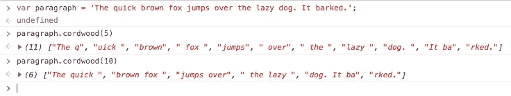

# JavaScript:将字符串分割成相等的长度

> 原文：<https://itnext.io/javascript-split-a-string-into-equal-lengths-848eb811f383?source=collection_archive---------2----------------------->

找出提取预定长度的子字符串以及任何余数的最简单方法。


[Barrett Ward](https://unsplash.com/@barrettward?utm_source=unsplash&utm_medium=referral&utm_content=creditCopyText) 在 [Unsplash](https://unsplash.com/s/photos/cut-boards?utm_source=unsplash&utm_medium=referral&utm_content=creditCopyText) 上拍摄的照片

不管你编码了多长时间，你总会发现自己有一些看似简单的任务，而你的工具箱里却没有现成的解决方案。

如果你在 StackOverflow 或 MDN 上找不到一个让你*【doh】*继续工作的快速答案，那么你可能只能自己编码了。就我个人而言，我喜欢那些时刻。这是我作为一名程序员的生活目标。

## 任务

我有一个任意长度的 JavaScript 字符串，我需要像积木一样把它分成相等的长度，并保留任何余数。

随着最近语言的巨大进步，似乎已经有了一个字符串方法，不是吗？我们可以在给定的分隔符上拆分一个字符串，并得到一个子字符串数组。为什么不按给定的长度分割，并选择性地取回剩余部分呢？

直到有人意识到我们只需要一个声明性的方法来完成这个任务，我想找到最简单的方法来完成它。

## 蛮力

这几乎从来都不是最好的答案，但我们经常使用蛮力方法，这样我们就可以继续做更重要的事情。世界上 80%的技术可能都是基于这一理念。*快去快回。*

```
// Split string into piecesconst max_size = 10;
const str_1 = str.slice(0, max_size);
const str_2 = str.slice(max_size, max_size * 2);
const str_3 = str.slice(max_size * 2, max_size * 2 + max_size);
const str_4 = str.slice(max_size * 2 + max_size);

assert.equal(`${str_1}${str_2}${str_3}${str_4}`, str);
```

呃。*为什么不好？*

首先，它假设知道原始字符串的长度。它知道只有三个相等的长度加上一个余数。更长的字符串需要更多的代码行。此外，这只是 fugly 和难以阅读。

不过，它确实让我通过了单元测试。但是今天，我真的需要这么做。可重复地，用任意长度的字符串。

## 更好的解决方案

蛮力之后的下一步通常是细化。我可以把上面的变成一个循环，把切片参数变成可读性更好的变量。我还需要计算循环的次数。然后检查是否有余数。

此时，整个事情开始变得有些乏味和沉闷。不管我用什么方法，我都要有至少和强力方法一样多的代码行。我想如果是这样的话，至少我可以试着优雅地做这件事。

*以下是我想到的:*

使用正则表达式`yardstick`重复匹配长度为`max_size`的任何字符，将它们放入数组`pieces`。将所有这些片段的总长度放入变量`accumulated`中，并通过获取字符串长度的`modulo`和`accumulated`来确定是否有余数。如果有模，那么从字符串中切下最后一位，并把它推到`pieces`数组上。

```
const max_size = 10;
const yardstick = new RegExp(`.{${max_size}}`, 'g'); // /.{10}/g;
const pieces = str.match(yardstick);
const accumulated = (pieces.length * max_size);
const modulo = str.length % accumulated;
if (modulo) pieces.push(str.slice(accumulated));
```

## 砰。把它提高一个等级！

也许你需要在整个应用程序中这样做，而不想在任何地方都包含它。也许你想在许多应用程序中使用它。为什么不把它作为原型方法添加到 String 中呢？

我们将坚持“积木”的比喻，并采用 polyfill 风格，确保它适用于旧的浏览器(例如，使用`var`而不是`const`)。

```
if (!String.prototype.cordwood) {
  String.prototype.cordwood = function(cordlen) {
  if (cordlen === undefined || cordlen > this.length) {
    cordlen = this.length;
  }
  var yardstick = new RegExp(`.{${cordlen}}`, 'g');
  var pieces = this.match(yardstick);
  var accumulated = (pieces.length * cordlen);
  var modulo = this.length % accumulated;
  if (modulo) pieces.push(this.slice(accumulated));	
  return pieces;
 };
}
```



我们的 String.cordwood 函数正在运行

以上 GitHub [要点](https://gist.github.com/cliffhall/46275ed4d8270b5330e6b58e00ea5e9c)如下。

如果你对此有更好的解决方案，我很想听听。否则，我希望这能帮助其他人更快地开始他们的工作。