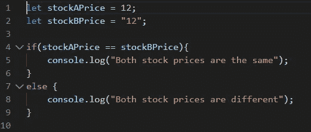
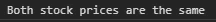
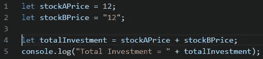
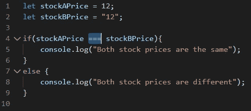
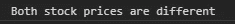
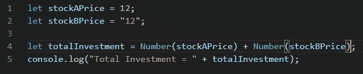
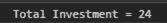

# JavaScript 类型强制(隐式转换)以及为什么要使用“===”并避免“==”。

> 原文：<https://itnext.io/javascript-type-coercion-implicit-conversion-and-why-to-use-and-avoid-ea9a38ecc777?source=collection_archive---------1----------------------->

# JavaScript 中什么是类型强制？

类型强制是值从一种数据类型到另一种数据类型的自动或隐式转换。例如，将字符串值转换为等效的数字值。这也称为类型转换。

类型强制很有用，但会导致不一致。

让我们举个小例子，

## **类型强制的结果不一致**

> 示例:1
> 
> 类型强制的好处

在上面的例子中，我们正在比较两只股票的价格，并将输出写入控制台。

*stock price 是数字，stock price 是字符串。*

在 if 条件中，*if(stock aprice****= =****stockBPrice)，*我们比较的是数值和字符串值。

为了比较这两个值，我们使用双等号(==)，*这种*相等比较称为抽象相等比较。抽象比较是使用类型强制完成的，这意味着 JavaScript 将尝试自动转换类型以产生结果。

在上面的例子中，JavaScript 将把字符串值转换成数字值，然后进行比较。下面是 if 条件的输出。

要阅读更多关于 JavaScript 如何执行抽象等式比较的内容，请查看[http://ecma-international.org/ecma-262/5.1/#sec-11.9.3](http://ecma-international.org/ecma-262/5.1/#sec-11.9.3)

到目前为止，我们已经看到了类型强制的好处。

> 示例:2
> 
> 无意的类型强制

在上面的代码片段中， *stockAPrice 是数字，stockBPrice 是字符串。*

现在，如果我们决定每种股票买一个数量，让我们试着把它们加起来，算出总投资。

*let total investment = stock aprice+stockBPrice；*

在上面的语句中，我们将数字和字符串值相加。这与我们在前面的例子中做的等式比较非常相似，但是 JavaScript 的类型强制行为不同。下面是上述代码片段的输出，

在这种情况下，它将数字值转换成字符串值(*与等式比较*相反)，我们得到串联的字符串。我们期望加法，即 *totalInvestment = 24。*

根据上面两个例子，我们看到类型强制产生不一致的结果。

**避免类型强制的不一致结果**

现在让我们看看如何避免类型强制，

> 示例:1
> 
> 将抽象相等比较更改为严格相等比较(将“==”替换为“===”)

我们修改了例 1。

*stock price 是数字，stock price 是字符串。*

在 if 条件中，*if(stock aprice****==****stockBPrice)，*我们在比较数值和字符串值但是我们用“===”替换了“= =”。

为了比较这两个值，我们使用 ***三重等号*** (===)，*这种*相等比较称为严格相等比较。只有当值具有相同的类型和相等的值时，严格比较才会返回 true。下面是输出，

要阅读更多关于如何严格执行相等比较的内容，请查看[http://ecma-international.org/ecma-262/5.1/#sec-11.9.6](http://ecma-international.org/ecma-262/5.1/#sec-11.9.6)

> 示例:2
> 
> 显式转换类型

在上面的代码片段中， *stockAPrice 是数字，stockBPrice 是字符串。*

为了找出总投资额，我们需要将它们相加，但现在为了避免类型强制，我们将显式地将它们转换为数值。通过提供显式类型，我们指示 JavaScript 不应用自动类型转换，而是使用我们显式定义的类型。在我们的例子中，它是数字。

输出以下显式转换后，

我们得到了预期的输出，而不是连接。

结论:

*   避免“==”，使用“===”。双等号(==)执行抽象的相等比较，三等号(===)执行严格的相等比较。
*   在执行算术运算时，不要特别依赖 JavaScript 的自动类型转换。必要时提供显式类型转换。
*   要阅读更多关于抽象等式比较如何执行的内容，请阅读[http://ecma-international.org/ecma-262/5.1/#sec-11.9.3](http://ecma-international.org/ecma-262/5.1/#sec-11.9.3)
*   要了解更多关于如何执行严格的相等比较，请阅读[http://ecma-international.org/ecma-262/5.1/#sec-11.9.6](http://ecma-international.org/ecma-262/5.1/#sec-11.9.6)

感谢阅读。点击查看我的博客[。](https://fullstackdeveloperparag.wordpress.com/)

请让我知道您的反馈或任何改进建议。