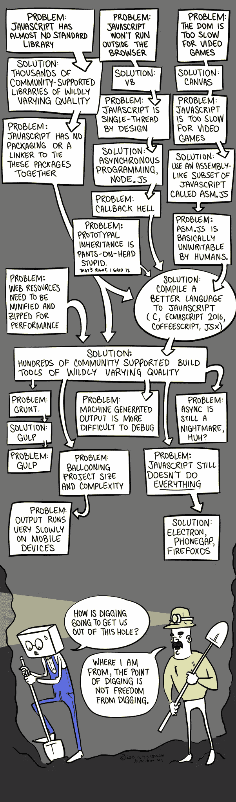

# JavaScript vs Pharo

> 原文：<https://itnext.io/javascript-vs-pharo-d4fbf15578ee?source=collection_archive---------1----------------------->


avaScript 正在接管 IT 世界。因为网络的普及，它正在被取代。web 开发人员的数量非常多。因此，这些开发者正在将 JavaScript 推向各种你不会想到它有用的领域…桌面、移动、服务器、物联网、机器人等等。

不幸的是，从本质上讲，JavaScript 是一种有严重缺陷的语言。它充满了黑暗的角落，陷阱和陷阱。它是一种庞大而复杂的语言 ECMAScript 的最新版本有超过 800 页的语言规范。

你知道吗，有一种更简单、更好的语言，完全可以和 JavaScript 媲美。它被称为 [Pharo](http://pharo.org) ，Smalltalk 的现代变体。我们来比较一下这两者…

## **简单、简洁、优雅**

Pharo 比 JavaScript 简单得多。它包含所有六个保留字。完整的语法可以放在明信片上！


用 JavaScript 肯定做不到这一点！

15 分钟就能学会整个语言:[用 ProfStef](https://amber-lang.net/learn.html) 学习 Smalltalk。用 JavaScript 肯定做不到这一点！

Pharo 非常简洁优雅。这里有一些精彩的一行程序示例:

```
"Compute difference in days between two dates"
('2014-07-01' asDate - '2013/2/1' asDate) days"Set up an HTTP server that returns the current timestamp"
(ZnServer startDefaultOn: 8080) 
  onRequestRespond: [ :request | 
    ZnResponse ok: (ZnEntity with: DateAndTime now printString) ]"Split a string on dashes, reverse the order of the elements and join them using slashes"
$/ join: ($- split: '1969-07-20') reverse"Sum of the primes up to 64"
(Integer primesUpTo: 64) sum"Extract a Unix format timestamp from the 5th to 8th byte of a byte array given in hex"
DateAndTime fromUnixTime:
  ((ByteArray readHexFrom: 'CAFEBABE4422334400FF') 
      copyFrom: 5 to: 8) asInteger"Return the weekday of a date"
'2013/5/7' asDate dayOfWeekName"Save the HTML source of a web page to a file"
'[http://www.pharo.org](http://www.pharo.org%27/)' asUrl saveContentsToFile: 'page.html'"Count the number of, or show the leap years between two years"
(1914 to: 1945) count: [ :each | Year isLeapYear: each ].
(1895 to: 1915) select: [ :each | Year isLeapYear: each ]."Encode the same string using Latin1, UTF-8 and UTF-16"
#(latin1 utf8 utf16) collect: [ :each | 
  (ZnCharacterEncoder newForEncoding: each)
    encodeString: 'Les élèves Français' ]
```

Pharo 代码读起来几乎像洋泾浜英语！JavaScript 在你最好的日子里读起来不像英语。

## **面向对象编程**

Pharo 从上到下完全是面向对象的。它在这方面的清晰性和一致性是任何其他语言都无法比拟的。

另一方面，JavaScript 本质上是一种过程语言，带有一些面向对象的功能。此外，这种能力不是基于使用*类*的传统面向对象概念，而是基于*原型*的概念。原型非常少见——只有另外两种重要的语言使用原型，Self 和 Lua。这是有充分理由的:原型是不可伸缩的。当你扩展到数万行的时候，基于原型的软件会在它自身的重量下崩溃。

最新版本的 JavaScript 确实有“类”，但它们只不过是原型的语法糖。

## **功能编程**

JavaScript 经常因其功能性而被吹捧。但是尽管是纯面向对象的语言，Pharo 在这方面也是相当有能力的。Pharo 在它的“块”中有一个可爱的实现。所以，事实上，它能做 JavaScript 能做的一切，在功能上。Pharo 的类库包含许多函数构造。

## **IDE(集成开发环境)**

Pharo 有一个可爱的内置实时编码 IDE，和语言本身一样简单易用。实时编码允许你在程序*运行时检查和修改程序中的代码和数据！这种强大的技术实际上消除了传统的编辑-编译-测试-调试循环，这种循环已经困扰了开发人员半个多世纪。根据 Namcook Analytics 进行的一项研究，这就是为什么 Pharo (Smalltalk)是世界上最具生产力的通用编程语言的主要原因。*

JavaScript 可以勉强做一些“实时编码”，但远没有那么方便和强大。

## **生产力和开发的便利性**

Namcook Analytics 告诉我们，Pharo (Smalltalk)的生产率是 JavaScript 的两倍。这是平均值。在许多情况下，Pharo 的效率会高得多，有时是原来的五倍！

简单明了，Pharo 更易于编程。这种语言及其开发环境实际上不会给开发人员带来任何认知负担。

## **生态系统**

JavaScript 有一个庞大的库生态系统。这是 Pharo 的一个弱点。尽管如此，Pharo 是不可思议的多才多艺。它被用于许多不同种类的应用。例如，Pharo 非常适合 web 开发，这要归功于 [Seaside web 框架](http://seaside.st/)和[茶壶微框架](https://github.com/zeroflag/Teapot)。

Pharo 非常适合前端开发，多亏了 [PharoJS](https://pharojs.github.io/) 。

感谢[博学](https://github.com/PolyMathOrg/PolyMath)和 [Roassal](http://agilevisualization.com/) ，Pharo 对数据科学很有帮助。

Pharo 有利于虚拟现实:

Pharo 擅长物联网和嵌入式编程。参见[了解如何编程](https://medium.com/learn-how-to-program/latest)。

Pharo 用于编写虚幻游戏引擎的脚本:

Pharo 被用来[抗击埃博拉！](http://ummisco.github.io/kendrick/)

Pharo 用于 16 个国家的[大规模药物数据可视化](http://mutabit.com/offray/blog/en/entry/sdv-infomed)。

Pharo 用于[自然语言处理。](https://github.com/mark-watson/nlp_smalltalk)

Pharo 用于[机器学习](https://biosmalltalk.github.io/web/)和[神经网络处理](https://medium.com/towards-data-science/single-layer-perceptron-in-pharo-5b13246a041d)。

总的来说，Smalltalk 是通用的。美国联合军方使用 Smalltalk 编写了一个名为 JWARS 的*百万行*战斗模拟器。它实际上胜过了美国空军用 C++编写的一个名为 STORM 的模拟程序。哇哦。太令人兴奋了！

JP 摩根用 Smalltalk 编写了他们的大型金融风险管理系统，名为 Kapital。

[Orient Overseas Container Lines 使用 Smalltalk 开发了他们的 IRIS-2 航运管理系统。](http://www.cincomsmalltalk.com/main/successes/shipping/orient-overseas-container-lines-ltd/)

如果 Pharo 因其生态系统而处于不利地位，它似乎肯定不会减慢它的速度。

需要注意的是，绝大多数 JavaScript 的库基本上都是垃圾。它们是由脚本小子和相对缺乏经验的程序员编写的。因此，与来自 C++、C#、Java 和 Ruby 的更加专业和健壮的集合相比，JavaScript 的生态系统并不那么令人印象深刻。

## **元编程**

由于 Pharo 是完全反射性的，[它拥有可与 Lisp 相媲美的卓越的元编程能力！换句话说，Pharo 具有很好的可扩展性。此外，与 Lisp 不同，Pharo 的代码扩展读起来就像 Pharo！你不需要为你的 DSL(特定领域语言)学习新的语法。](https://medium.com/smalltalk-talk/lisp-smalltalk-and-the-power-of-symmetry-8bd96aaa0c0c)

另一方面，JavaScript 使用符号、反射和代理对象，具有更加严格和笨拙的元编程能力。

## **JavaScript 雷区**

JavaScript 是语言设计的灾难。JavaScript 充斥着黑暗角落、陷阱和陷阱。参见[JavaScript 雷区](https://walkercoderanger.com/blog/2014/02/javascript-minefield/)。

它是这个星球上极少数会因为语法错误而无声地失败的编程语言之一！这是有意的，因为 Brendan Eich 希望 JavaScript 非常宽容错误，以免干扰用户与其软件的交互。

多年来，JavaScript 一直是人们的笑柄。例如，参见[窟](https://www.destroyallsoftware.com/talks/wat)。

