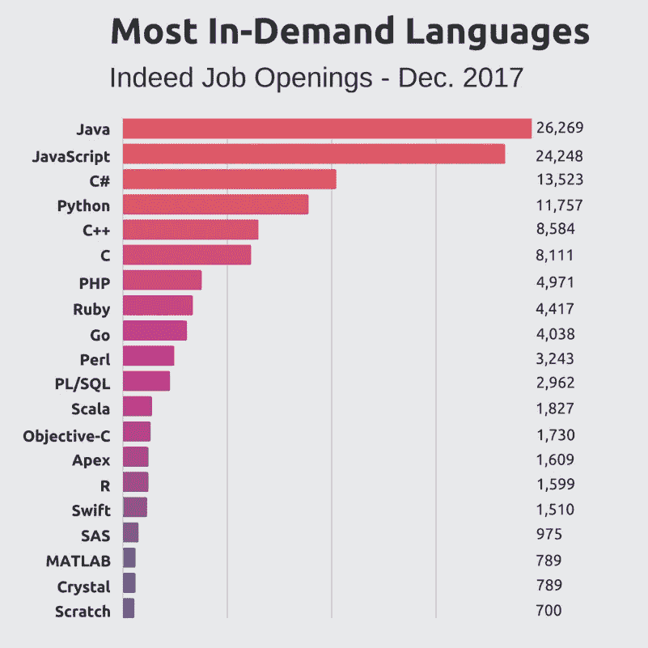

# JavaScript 向导:提示和技巧

> 原文：<https://itnext.io/javascript-wizard-tips-and-tricks-1b91025a0d62?source=collection_archive---------2----------------------->

2017 年，职位空缺中需求第二大的语言是 JavaScript，仅次于 Java。

事实上，如果你想获得一个理想的软件工程师的安全职位，知道如何使用这种流行语言是非常有益的。
如果你已经在那里了，学习一些 JavaScript 的隐藏角落可以帮助你避免不时的头痛😉

2017 年末，[Indeed.com](https://www.indeed.com/)发布的职位空缺中最受欢迎的语言列表。[ [来源](https://stackify.com/popular-programming-languages-2018/)

在本文中，我将介绍 8 个您可能没有听说过的简洁的 JavaScript 技巧和窍门。
本文既适合 JavaScript 新手，也适合有中级经验的人。

# 1.数字

在 JavaScript 中解析数字时，您可能已经见过并使用过全局函数`parseInt()`和`parseFloat().`

JavaScript 正慢慢远离上述的全局函数，转而支持使用模块。
`parseInt()`和`parseFloat()`都属于`Number`对象，可以像`Number.parseInt()`一样调用

在 JavaScript 中，所有的数字都是相同的数据类型“number ”,都是浮点型的。更具体地说，JavaScript 使用了[双精度浮点格式](https://en.wikipedia.org/wiki/Double-precision_floating-point_format)。
`Number`对象是用`Number()`构造函数创建的，从字符串中解析数字的最简单方法(如果不需要使用基数)是将字符串作为参数传递给构造函数。

`const num = Number('42.5')`

此外，`Number`对象有一组方便的函数，用于处理数字和数学运算。

下面是一些正在使用的函数的例子

# 2.求幂运算 `infix operator`

当您需要对某个数字进行其他数字的幂次运算时，您可能已经习惯于使用`Math.pow(a, b)`
从 ECMAScript 2016 (ES7)开始，您现在可以使用取幂中缀运算符`**`来代替。

# 3.真/假布尔转换

在 JavaScript 中，任何值都可以在布尔上下文中计算。
如果一个值被评估为*真*，则称其为*真*否则称其为*假*。

在布尔上下文中，以下值将始终被评估为**假**。

*   `false`
*   `null`
*   `undefined`
*   `0`
*   `''`或`""`(空弦)
*   `NaN`

在布尔上下文中，其他任何内容都将被评估为**真**。

有时我们想把一个非布尔值转换成布尔值。
我们可以使用`!!`操作符来完成，也称为 *not-not 操作符。*

注意`!!`本身不是逻辑运算符，而是两个`!`运算符顺序使用的组合。
第一个`!`将在一个布尔上下文中计算它后面的值，将它强制转换成一个布尔值并取反它。第二个`!`将否定这个布尔值，产生将真值/假值转换成其布尔值表示的预期效果。

另一种方法是使用`Boolean`对象。

*注意:对于非布尔值，使用* `Boolean` *作为函数，而不是创建* `Boolean` *对象的新实例。*

# 4.对象.条目

也许你已经知道可以使用`Object.keys()`返回一个包含对象键名的列表。当你想要像这样迭代一个对象时，这很方便

但是您可能没有意识到，您可以使用`Object.entries()`来返回一个包含键值名和对象值的*条目列表*。

如果您自己还没有弄明白，您当然也可以像这样使用`Object.values()`返回一个只包含值的列表

# 5.对象上的 Rest 运算符

在 ES6 中，引入了 rest 和 spread 运算符。
它们有非常不同的效果，但都是通过设置三个点来使用`...`

*   **扩展操作符**允许将 iterables 扩展为单个参数/元素。
*   **Rest 操作符**将所有剩余的元素收集到一个 iterable 中。

rest 操作符可以应用于数组和对象，如果使用正确，这将是一个强大的工具。

通过在对象上结合析构和 rest 操作符，我们可以很容易地从对象中提取出想要的属性，将对象中剩余的属性留给自己。

当我们想清除一个对象的某些属性时，这也是非常方便的。
无需遍历整个对象并创建一个新的干净对象。

如果你想阅读更多关于 spread 和 rest 操作符的内容，我建议你阅读 Hugo Di Francesco 的文章:[用 ES6 在 JavaScript 中递归，析构和 rest/spread](https://hackernoon.com/recursion-in-javascript-with-es6-destructuring-and-rest-spread-4b22ae5998fa) 。

# **6。最后**

在 JavaScript 中，承诺已经成为一件大事。
由于这个主题的整体性超出了本文的范围，我想把重点放在一个新的函数上；已经被添加到 JavaScript Promises 中作为一个实例方法，可以用在扩展中

`finally()`被调用时没有任何价值，无论一个承诺被解决或拒绝都被调用。即无论如何都要执行。

它也可以与 ES7 *异步/等待*一起使用。

如果你想更全面地了解 JavaScript 的承诺，我建议你阅读 Gokul N K 的文章:[理解 JavaScript 中的承诺](https://hackernoon.com/understanding-promises-in-javascript-13d99df067c1)。

# 7.等待…的

当我们谈到承诺这个话题时，我想提一下另一个非常有用的特性。
全新的*等待...来自 ES8 的*特性让我们异步迭代承诺列表。
循环的*for await…将有效地等待承诺解决，然后继续下一次迭代。*

注意迭代中的每个*消息*是承诺的解析值，而不是承诺本身。在这种情况下，我们也可以确定我们会以正确的顺序记录承诺。

*NB。这是一个实验性的功能，预计将来会有所改变。
而且这在 IE 和 Edge 中还不支持，Node.js 中的支持未知。*

# 8.平面地图

`flatMap()`是另一个用于执行一级阵列扁平化的 ES8 提案。使用`map()`和`reduce()`可以实现相同的行为，但是使用`flatMap()`更简单，可读性更好。

在另一个例子中，使用`flatMap()`会更加方便。在这里，我们从句子列表中生成一个单词列表。

**就是这样！
我希望您喜欢阅读，如果您有任何问题或反馈，请随时在下面发表评论。
如果你喜欢这篇文章，请鼓掌👏扣几下吧！**