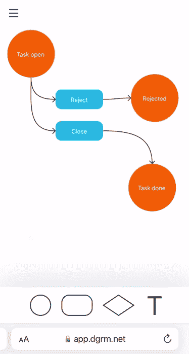
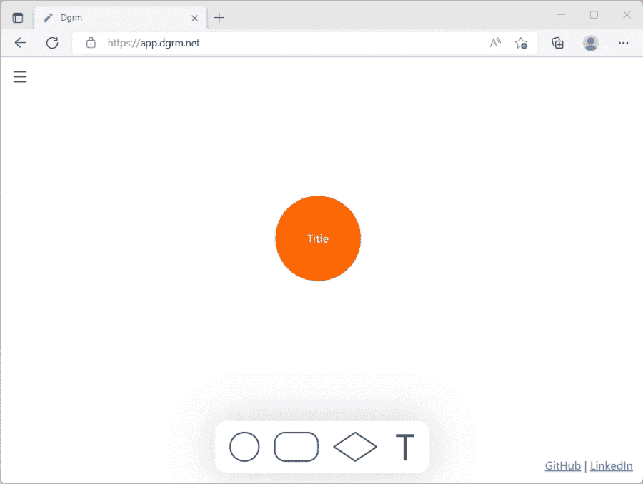
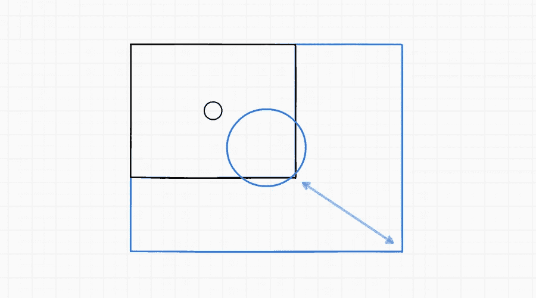
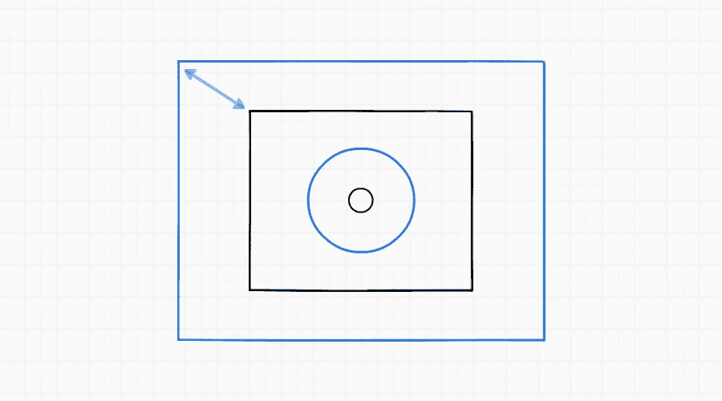
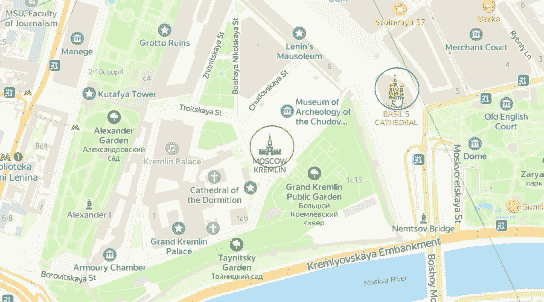

# JavaScript:像 SVG/HTML 地图一样缩放

> 原文：<https://itnext.io/javascript-zoom-like-in-maps-for-svg-html-89c0df016d8d?source=collection_archive---------2----------------------->



*图一。放大 dgrm.net 流程图编辑器*

【dgrm.net】T2|[GitHub](https://github.com/AlexeyBoiko/DgrmJS)

如何在[dgrm.net](https://dgrm.net/)流程图编辑器中进行缩放。

你可以缩放

*   鼠标滚轮，
*   触摸屏设备
*   两个手指放在手机和平板电脑上。

一个现成的 SVG 缩放功能为您的项目包括在内。

# 缩放算法

SVG 和 HTML 有伸缩性。[HTML 中的缩放](https://developer.mozilla.org/en-US/docs/Web/CSS/transform-function/scale)。

仅仅改变规模是不够的。图像会滑走。
放大时，屏幕中央的圆圈向右下方滑动。



*图二。错误:放大时，屏幕中心的圆圈向右滑动。*



*图 3。放大时，屏幕中心的圆圈向右滑动—方案。*

黑色矩形是屏幕。蓝色是放大的图像。
放大的圆圈在放大图像的中心，但是已经相对于屏幕滑动。

需要缩放和移位，那么图像的中心就不会离开。



*图 4。放大并向左上方移动。圆圈保持在屏幕的中心。*

在图 4 中，图像的中心没有滑走。但是地图不是这样工作的。地图没有缩放到中心。地图相对于光标放大。光标所指的地方不会相对于屏幕移动。

地图中心的建筑倒下了。它以红色突出显示。光标下的建筑保持不变。用蓝色突出显示。



*图 5。地图不是缩放到中心，而是相对于光标。光标所指的地方不会相对于屏幕移动。*

缩放功能应该移动图像，使光标下的点保持不变。

```
/**
 * [@param](http://twitter.com/param) {SVGGraphicsElement} svgEl
 * [@param](http://twitter.com/param) {Point} fixedPoint
 *                this point will not change position while scale
 * [@param](http://twitter.com/param) {number} scale
 * [@param](http://twitter.com/param) {number} nextScale
 */
export function svgScale(svgEl, fixedPoint, scale, nextScale) {
    const position = svgPositionGet(svgEl);

    svgPositionSet(svgEl, {
        x: nextScale / scale * (position.x - fixedPoint.x) +     
           fixedPoint.x,
        y: nextScale / scale * (position.y - fixedPoint.y) + 
           fixedPoint.y
    });

    ensureTransform(svgEl, SVGTransform.SVG_TRANSFORM_SCALE)
        .setScale(nextScale, nextScale);
}
```

*清单 1。缩放功能。移动图像，使固定点保持不变。
在*[*GitHub*](https://github.com/AlexeyBoiko/DgrmJS/blob/e6d6a13c6294e79058f605ff1609c3f08ee5cf27/src/diagram/infrastructure/svg-utils.js)*上有辅助函数 svgPositionGet、svgPositionSet、ensureTransform。*

# 使用鼠标滚轮和触摸板缩放

订阅鼠标滚轮事件“滚轮”。用两个手指在触摸板上挤压没有单独的事件。收缩使用相同的“轮子”事件。

对于滚轮，刻度以 0.25 的增量变化，而对于触摸板，刻度以 0.05 的增量变化。选择这些值，以便:

*   鼠标滚轮不需要长时间扭转
*   触摸板上的图像没有跳动

```
// 'svg' is type of {SVGSVGElement}
let scale = 1;
// mouse wheel, trackpad pitch
svg.addEventListener('wheel', /** [@param](http://twitter.com/param) {WheelEvent} evt */ evt => {
    evt.preventDefault();

    // calc nextScale

    const delta = evt.deltaY || evt.deltaX;
    const scaleStep = Math.abs(delta) < 50
        ? 0.05  // touchpad pitch
        : 0.25; // mouse wheel

    const scaleDelta = delta < 0 ? scaleStep : -scaleStep;
    const nextScale = scale + scaleDelta; // 'scale' is prev scale

    // calc fixedPoint
    const fixedPoint = { x: evt.clientX, y: evt.clientY };

    // scale
    // 'svgEl' is element to scale
    svgScale(svgEl, fixedPoint, scale, nextScale);
    scale = nextScale;
});
```

*清单 2。订阅鼠标滚轮事件。触摸触摸板触发相同的事件。完整代码参见*[*【GitHub】*](https://github.com/AlexeyBoiko/DgrmJS/blob/e6d6a13c6294e79058f605ff1609c3f08ee5cf27/src/diagram-extensions/scale-feature.js)*。*

# 用两个手指在手机和平板电脑上缩放

对于手指缩放，固定点是手指之间的中点。音阶的变化取决于手指间距离的变化。

您还需要考虑图像可以同时缩放和移动。

```
// calc nextScale

// distance between fingers
const distanceNew = Math.hypot(
    firstFinger.x - secondFinger.x,
    firstFinger.y - secondFinger.y);

// 'distance' is previous distance between fingers
// 'scale' is previous scale
const nextScale = scale / distance * distanceNew;

// calc fixedPoint
const fixedPoint = {
    x: (firstFinger.x + secondFinger.x) / 2,
    y: (firstFinger.y + secondFinger.y) / 2
};

// scale
// 'svgEl' is element to scale
svgScale(svgEl, fixedPoint, scale, nextScale);
scale = nextScale;

// don't forget to also move the canvas behind your fingers
```

*清单 3。对于手指缩放，固定点是手指之间的中点。音阶的变化取决于手指间距离的变化。完整代码见*[*GitHub*](https://github.com/AlexeyBoiko/DgrmJS/blob/e6d6a13c6294e79058f605ff1609c3f08ee5cf27/src/diagram-extensions/scale-feature.js)*。*

# 关于 dgrm.net 的其他文章

*   [JavaScript SVG 图表编辑器 3.9 KB(开源库)](https://medium.com/codex/javascript-svg-diagram-editor-which-weighs-6-5-less-than-bootstrap-open-source-library-b753feaaf835)
*   [JavaScript 图表编辑器，从 PNG 图像(开源)呈现图表](https://medium.com/codex/javascript-diagram-editor-that-renders-diagrams-from-png-images-open-source-d1de0f053088)
*   [SVG 的 JavaScript 文本编辑器](https://medium.com/codex/javascript-text-editor-for-svg-6881f670d432)
*   [流程图编辑器 UI](https://medium.com/@alexey-boyko/flowchart-editor-ui-a8face0729d0)

# 如何支持该项目

*   开始使用流程图编辑器[Dgrm.net](https://dgrm.net/)。告诉我你的想法。评论，私信，在 [GitHub](https://github.com/AlexeyBoiko/DgrmJS) 上。我什么都读，我会保留一份提议清单。
*   告诉你的朋友。
*   在 [GitHub](https://github.com/AlexeyBoiko/DgrmJS) 上给个星。