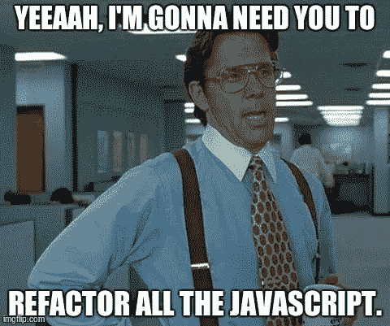
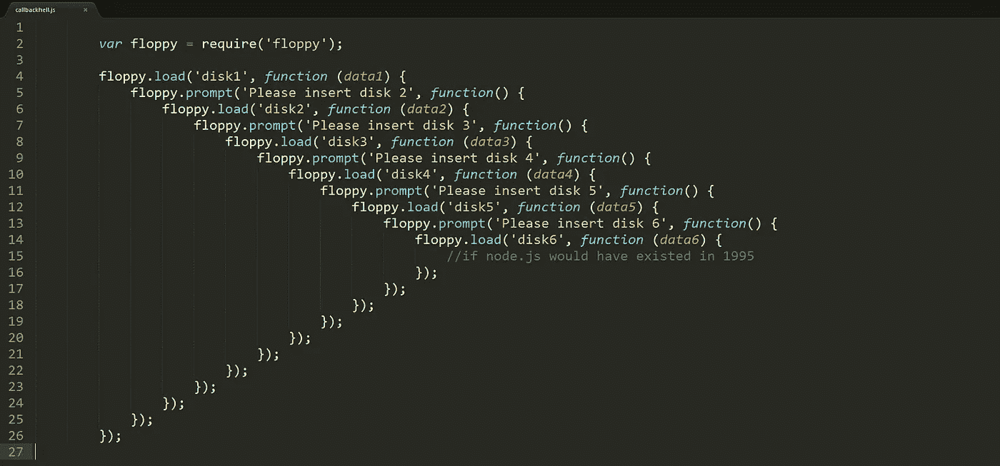
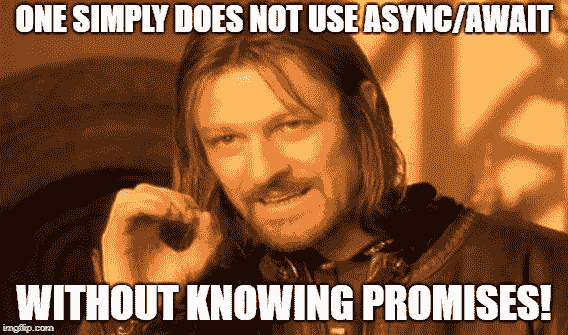

# JavaScript 的异步/等待与承诺:大辩论

> 原文：<https://itnext.io/javascripts-async-await-versus-promise-the-great-debate-6308cb2e10b3?source=collection_archive---------0----------------------->

# 做好准备，你们正在步入雷区



# 引发这场大火的火花

几周前的一天，在工作中，我正在做自己的事情，写一些 React 代码，提交拉请求，而我团队中的另一个开发人员实际上向我们的代码库扔了一颗手榴弹。

他问了一个看似温和的问题，关于为什么我们在 JavaScript 中继续使用[承诺](https://developer.mozilla.org/en-US/docs/Web/JavaScript/Reference/Global_Objects/Promise)而不是更新的 ECMAScript 17 版本 [async /await](https://developer.mozilla.org/en-US/docs/Web/JavaScript/Reference/Statements/async_function) 。🚨乍一看，这似乎是足够无辜的。

让我告诉你，通常情况下，我完全支持在 JavaScript 中使用新的热门技术(特别是当它内置在语言中并且大多数现代浏览器都支持[——看看你持续的不遵从性，Internet Explorer)，但是即使我听说过 async/await 的伟大之处，我也没有真正使用过它。](https://caniuse.com/#search=async)

我真的没有看到 async/await 的任何好处超过使用承诺——它们最终都完成了同样的事情:以高性能、一致的方式处理异步数据调用。


所有的承诺，所有的时间。

我喜欢承诺，我对`.then()`的语法、`.catch()`的错误处理以及所有这些都很满意，切换需要重写我们的应用程序当前进行的许多异步调用。因此，在我根除团队以传统承诺形式编写的所有艰苦工作之前，我想找到一些超越“这是 ES7，它是更新的”的理由，以跳转到 async/await。

所以，我开始学习。

> 今天，我将比较在 JavaScript 应用程序中选择 promises 或 async/await 来满足异步数据需求的好处(和个人偏好)。

# JavaScript 异步数据处理(或缺乏异步数据处理)简史

在我详细介绍 promises 和 async/await 之前，我想回到 JavaScript 的一个黑暗时代，那时异步数据获取是一个更大的问题，较少的解决方案被称为[回调](https://javascript.info/callbacks)。

## AJAX 和回调

AJAX 代表异步 JavaScript 和 XML，回调是 JavaScript 中处理异步调用的一种 OG 方式。归结起来，就是当一个函数应该在另一个函数已经执行完之后**执行的时候——因此得名‘回调’。**

**简单来说就是回调**

第一个函数通常会返回第二个函数需要执行某种操作的数据，与 Java 等多线程语言不同，单线程的 [JavaScript 事件循环](https://developer.mozilla.org/en-US/docs/Web/JavaScript/EventLoop)会将第一个函数推送到调用堆栈并执行它，一旦完成其请求，就从调用堆栈中弹出该函数调用，并继续运行，同时将队列中等待的其他操作推送到调用堆栈(这使用户界面看起来不像是冻结的)。然后，当来自另一个服务器的响应(异步数据)返回时，它被添加到队列中，当事件循环看到堆栈为空时，它最终会将该响应推送到调用堆栈，调用堆栈会将该响应作为回调函数执行。

虽然这篇文章不是关于回调的，所以我不会讲太多细节，但是这里有一个例子说明了带有回调函数的 JavaScript 事件是什么样子的。

**传统 JavaScript 回调示例**

```
// the original function to callfunction orderFood(food, callback) {
  alert(`Ordering my ${food} at the counter.`);
  callback();
}// the callback once the order's upfunction alertFoodReady(){
  alert(`Order's ready for pickup`);
}// calling the function and adding the callback as the second 
// parameter**orderFood('burger', alertFoodReady);**
```

这是一个非常简单的例子，公平地说，它只显示了“快乐之路”——回调起作用时的路径，食物已经准备好，可以拿走了。

这里没有涉及到错误处理，也没有举例说明当有很多很多的异步依赖项嵌套在一起时会发生什么。这被 JavaScript 开发人员亲切地称为“回调地狱”或“末日金字塔”。

## 回调地狱

下面是回调地狱的一个例子。这是一场噩梦，不要试图否认。当多个函数需要来自其他函数的数据来完成它们的工作时，就会发生这种情况。



回调地狱的一个完美例子:一个回调，在一个回调中，在另一个回调中永恒。

如果你想错误地处理它，或者试图在混乱中添加一些新功能，请便。

然而，我不会做任何事情，所以让我们同意 AJAX 和回调曾经是处理异步数据的一种方式，但它们不再是事实上的方式。接下来我会向你们展示更好的解决方案。让我们继续承诺。

# 承诺承诺

Mozilla 在定义承诺方面做得非常好，所以我将使用他们的定义作为对承诺的第一次介绍。

> 一个`[Promise](https://developer.mozilla.org/en-US/docs/Web/JavaScript/Reference/Global_Objects/Promise)`是一个对象，代表一个异步操作的最终完成或失败…本质上，一个承诺是一个返回的对象，你给它附加回调，而不是把回调传递给一个函数。— Mozilla Docs，使用承诺

下面是另一个名为`createAudioFileAsync()`的异步回调函数的例子。它接受三个参数:`audioSettings`、一个`successCallback`和一个`failureCallback`。

**传统 JavaScript 回调示例**

```
function successCallback(result) {
  console.log("Audio file ready at URL: " + result);
}

function failureCallback(error) {
  console.log("Error generating audio file: " + error);
}

createAudioFileAsync(audioSettings, successCallback, failureCallback);
```

仅仅一个异步数据调用就需要很多函数和代码。

这是同样的功能的简写，当它被转换成承诺时。

**带有回调的 JavaScript Promise 示例**

```
createAudioFileAsync(audioSettings)
  .then(successCallback, failureCallback);
```

你觉得这样更好吗？对我来说它看起来更好。但是等等，还有更多。成功和失败回调都在`.then()`内，可以改为:

**现代 JavaScript Promise 示例**

```
createAudioFileAsync(audioSettings)
  .then(successCallback)
  .catch(failureCallback);
```

即使这样，也可以通过将原来的`successCallback()`和`failureCallback()`功能替换为 ES6 箭头功能来再次现代化。

**ES6 箭头功能承诺示例**

```
createAudioFileAsync(audioSettings)
  .then(result => console.log(`Audio file ready at URL: ${result}`)
  .catch(error => console.log(`Error generating audio file: ${error}`);
```

这现在看起来是一个小的改进，但是一旦你开始将承诺链接在一起，或者在前进之前等待多个承诺解决，在最后有一个单独的`.catch()`块来处理任何内部出错的事情，是非常方便的。继续读下去，我会告诉你的。

## 承诺优于回访

除了更清晰的语法之外，承诺比回调更有优势。

*   在异步操作成功或失败后，添加了`[then()](https://developer.mozilla.org/en-US/docs/Web/JavaScript/Reference/Global_Objects/Promise/then)`甚至*的回调将被调用，如上。*
*   通过多次调用`[then()](https://developer.mozilla.org/en-US/docs/Web/JavaScript/Reference/Global_Objects/Promise/then)`可以添加多个回调。每个回调都按照它们被插入的顺序一个接一个地执行(这就是我前面提到的链接)。
*   在失败后，可以将事件*链接在一起，即`catch`，这对于完成新的动作是有用的，即使在动作链失败后也是如此。*
*   `Promise.all()`返回一个单个的`[Promise](https://developer.mozilla.org/en-US/docs/Web/JavaScript/Reference/Global_Objects/Promise)`,当作为可迭代对象传递的所有承诺都已解析时，或者当可迭代对象不包含承诺时，该单个的【】解析。回调做不到这一点。
*   承诺通过捕捉所有错误，甚至抛出的异常和编程错误，解决了回调末日金字塔的一个根本缺陷。这对于异步操作的功能组合至关重要。

要备份某个时刻，通常需要背靠背执行两个或更多异步操作，其中每个后续操作在前一个操作成功时开始，并带有前一个步骤的结果。这可以通过[承诺链](https://javascript.info/promise-chaining)来实现。

在过去，当回调相互依赖信息时，我们进入了回调地狱。见下文(也请注意，必须为每次回调添加的倍数`failureCallbacks`)。

**传统的嵌套回调链示例**

```
doSomething(function(result) {
  doSomethingElse(result, function(newResult) {
    doThirdThing(newResult, function(finalResult) {
      console.log('Got the final result: ' + finalResult);
    }, failureCallback);
  }, failureCallback);
}, failureCallback);
```

随着承诺链的引入，这个“末日金字塔”变成了你在下面看到的样子(见最后一个`failureCallback`实例的改进)。

**新承诺链示例**

```
doSomething()
.then(function(result) {
  return doSomethingElse(result);
})
.then(function(newResult) {
  return doThirdThing(newResult);
})
.then(function(finalResult) {
  console.log('Got the final result: ' + finalResult);
})
.catch(failureCallback);
```

随着 ES6 arrow 函数的出现，下一个例子中的代码变得更加紧凑。

**ES6 箭头功能承诺链示例**

```
doSomething()
.then(result => doSomethingElse(result))
.then(newResult => doThirdThing(newResult))
.then(finalResult => {
  console.log(`Got the final result: ${finalResult}`);
})
.catch(failureCallback);
```

不错吧。

注意，对于箭头函数，`return`语句不需要传递结果，而是通过[隐式返回](https://developer.mozilla.org/en-US/docs/Web/JavaScript/Reference/Functions/Arrow_functions)返回结果。

同样地，有时你需要两个或更多不相关的承诺来解决所有问题，然后再继续前进，这就是`[Promise.all()](https://developer.mozilla.org/en-US/docs/Web/JavaScript/Reference/Global_Objects/Promise/all)`成为神赐的地方。

**Promise.all()例**

```
var promise1 = Promise.resolve(3);
var promise2 = 42;
var promise3 = new Promise(function(resolve, reject) {
  setTimeout(resolve, 100, 'foo');
});Promise.all([promise1, promise2, promise3]).then(function(values) {
  console.log(values);
});
// expected output: Array [3, 42, "foo"]
```

只需将这三个承诺作为数组传递给`Promise.all()`，该承诺会一直等待，直到这三个承诺都解决了，然后才进入语句的`.then()`部分。

我希望看到试镜能优雅地做到这一点。

## 承诺 FTW？

这就是我的团队在 React 应用程序中编写的那种代码。它干净、简洁、易读(在我看来)，我看不出有什么问题。然后我研究了异步等待。

# ECMAScript 17 的新热点:异步/等待


异步/等待的承诺。看到我做了什么吗？😏

我再一次向 Mozilla 寻求 async 和 await 的最简洁的定义。

> `**async function**`声明定义了一个**异步函数**，它返回一个`[AsyncFunction](https://developer.mozilla.org/en-US/docs/Web/JavaScript/Reference/Global_Objects/AsyncFunction)`对象。异步函数是通过事件循环异步操作的函数，使用隐式的`[Promise](https://developer.mozilla.org/en-US/docs/Web/JavaScript/Reference/Global_Objects/Promise)`返回结果。但是使用异步函数的代码的语法和结构更像是使用标准的同步函数…
> 
> 一个`async`函数可以包含一个`[await](https://developer.mozilla.org/en-US/docs/Web/JavaScript/Reference/Operators/await)`表达式，该表达式暂停异步函数的执行并等待传递的`Promise`的解析，然后恢复`async`函数的执行并返回解析后的值。— Mozilla Docs，异步函数

虽然这对您来说可能有意义，但我通常从查看代码中受益，以真正了解它的要点。这里有几个代码示例，这样您就可以自己看到不同之处了。

**基于承诺的示例**

这里有一个基于承诺的`fetch()`电话的例子。

```
function logFetch(url) {
  return fetch(url)
    .then(response => response.text())
    .then(text => {
      console.log(text);
    }).catch(err => {
      console.error('fetch failed', err);
    });
}
```

好吧，对我来说这很简单。

**异步/等待示例**

这是同一个调用的异步/等待版本。

```
async function logFetch(url) {
  try {
    const response = await fetch(url);
    console.log(await response.text());
  }
  catch (err) {
    console.log('fetch failed', err);
  }
}
```

这看起来也很容易理解，但是更加简洁。

## 异步/等待承诺的优点

这有什么大不了的？

> 实际上，这似乎可以归结为 async/await 实际上是承诺的语法糖，*因为它仍然使用承诺。*



到头来都是承诺！

不过，对语法的改变是它对许多人的吸引力开始变得明显的地方。

*   使用异步函数的代码的语法和结构更像是使用标准的同步函数。
*   在上面的例子中，`logFetch()`函数的行数是相同的，但是所有的回调都消失了。这使得它更容易阅读，特别是对于那些不太熟悉承诺的人。
*   另一个有趣的花絮是，你的任何事情`await`都要经过`Promise.resolve()`(对我们来说，通常是`.then(result)`承诺的解析)，所以你可以安全地`await`非本地承诺。那很酷。
*   您可以安全地将 async/await 与`Promise.all()`结合起来，在继续前进之前等待多个异步调用返回。

为了展示另一个更复杂的 async/await 示例(更好地展示了新语法的可读性)，这里有一段返回最终结果大小的流代码。

**第二个** **基于承诺的例子**

```
function getResponseSize(url) {
  return fetch(url).then(response => {
    const reader = response.body.getReader();
    let total = 0;

    return reader.read().then(function processResult(result) {
      if (result.done) return total;

      const value = result.value;
      total += value.length;
      console.log('**Promise-Based Example**', value);

      return reader.read().then(processResult);
    })
  });
}
```


我，第一眼看到上面的代码。

它看起来相当优雅，但是在你最终理解它在做什么之前，你必须盯着代码看很久。这是同样的代码，但是使用了 async/await。

**第二个异步/等待示例**

```
async function getResponseSize(url) {
  const response = await fetch(url);
  const reader = response.body.getReader();
  let result = await reader.read();
  let total = 0;

  while (!result.done) {
    const value = result.value;
    total += value.length;
    console.log('Data received', value);
    // get the next result
    result = await reader.read();
  }

  return total;
}
```

好了，现在我对 async/await 语法的可读性有了更好的理解。这些代码更容易阅读，我同意这一点。事实上，我可以把它和`Promise.all()`结合起来，这也很棒。

> 但是，要改变整个代码库中所有基于承诺的调用，我需要对开发人员来说更有说服力，而不仅仅是可读性……我需要冷酷的、硬的、性能驱动的好处。


说服我重构一切。

## 银弹时刻:当 Async/Await 赢得胜利

这里有一篇[文章](https://v8.dev/blog/fast-async)真正改变了我的想法，它来自一个团队，该团队实际构建并维护了运行我所有 Chrome 浏览器的 JavaScript V8 引擎。

> 这篇文章总结了如何对 ECMAScript 规范进行一些微小的更改，并删除两个时间微标记，实际上让"`**async**` **/** `**await**` **"在所有 JavaScript 引擎中胜过现在手写的 promise 代码，"**。

是的，你没看错。**V8 团队做出了改进，使得 async/await 函数运行*比 JavaScript 引擎中的传统承诺*更快。**

这就是我需要的所有证据。它在浏览器中实际运行速度更快？帮我报名吧。

# 结论

承诺和异步/等待完成同样的事情。它们使得检索和处理异步数据变得更加容易。它们消除了对回调的需要，简化了错误处理，减少了无关代码，使等待多个并发调用返回变得容易，并且使在调用之间添加额外代码变得轻而易举。

我对重写我们所有使用 async/await 的传统承诺是否值得持观望态度，*直到*我(从 JavaScript V8 运行时引擎的维护者那里)得知**他们实际上已经** **更新了引擎，以更好地处理 async/await 调用，而不是承诺。**

如果我们的应用程序可以从简单的代码语法变化中获得性能提升，我会像这样赢得任何一天。我的最终目标始终是更好的最终用户体验。

过几周再来看看，我会写关于 JavaScript、ES6 或其他与 web 开发相关的东西，所以请关注我，这样你就不会错过了。

感谢您的阅读，我希望这有助于您做出更明智的决定:您更喜欢哪种语法风格:promises 还是 async/await，这样您就可以在代码库中使用一致的异步数据处理策略。如果你觉得有帮助，请与你的朋友分享！

如果你喜欢读这篇文章，你可能也会喜欢我的其他博客:

*   [用更漂亮的& ESLint](/keep-code-consistent-across-developers-the-easy-way-with-prettier-eslint-60bb7e91b76c) 保持开发人员之间的代码一致
*   [通过设置同步](/settings-sync-with-vs-code-c3d4f126989),将您的 VS 代码配置轻松带到任何地方
*   [ESLint 如何让我成为更好的 React 开发人员](/how-eslint-makes-me-a-better-react-developer-237fb14c00ae)

**参考资料和更多资源:**

*   JavaScript Promises，MDN Docs:[https://developer . Mozilla . org/en-US/Docs/Web/JavaScript/Reference/Global _ Objects/Promise](https://developer.mozilla.org/en-US/docs/Web/JavaScript/Reference/Global_Objects/Promise)
*   使用承诺，MDN Docs:[https://developer . Mozilla . org/en-US/Docs/Web/JavaScript/Guide/Using _ Promises](https://developer.mozilla.org/en-US/docs/Web/JavaScript/Guide/Using_promises)
*   Promise.all()，MDN Docs:[https://developer . Mozilla . org/en-US/Docs/Web/JavaScript/Reference/Global _ Objects/Promise/all](https://developer.mozilla.org/en-US/docs/Web/JavaScript/Reference/Global_Objects/Promise/all)
*   Async Await，MDN Docs:[https://developer . Mozilla . org/en-US/Docs/Web/JavaScript/Reference/Statements/async _ function](https://developer.mozilla.org/en-US/docs/Web/JavaScript/Reference/Statements/async_function)
*   AJAX，W3Schools Docs:【https://www.w3schools.com/php/php_ajax_intro.asp 
*   JavaScript 事件循环，MDN Docs:[https://developer . Mozilla . org/en-US/Docs/Web/JavaScript/Event Loop](https://developer.mozilla.org/en-US/docs/Web/JavaScript/EventLoop)
*   回调，JavaScript 信息:[https://javascript.info/callbacks](https://javascript.info/callbacks)
*   V8 开发者博客，更快的异步功能和承诺:[https://v8.dev/blog/fast-async](https://v8.dev/blog/fast-async)