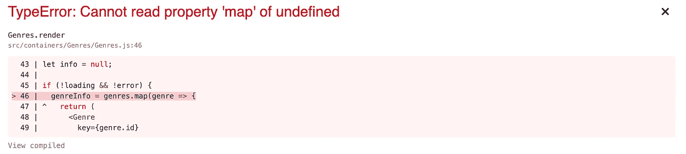

# JavaScript 的可选链接建议

> 原文：<https://itnext.io/javascripts-optional-chaining-proposal-bc9e6e5f2877?source=collection_archive---------0----------------------->

# 吻别那些让你止步不前的未定义的错误


[奥斯汀·施密德](https://unsplash.com/@schmidy?utm_source=unsplash&utm_medium=referral&utm_content=creditCopyText)在 [Unsplash](https://unsplash.com/s/photos/happy-jumping?utm_source=unsplash&utm_medium=referral&utm_content=creditCopyText) 上拍摄的照片

# 介绍

如果您是一名 JavaScript 开发人员，那么当我建立这个场景时，您就会理解我所描述的烦恼。

想象一下:你正在编写代码，构建一些很酷的东西，获取数据和操作对象，突然你看到了错误，可怕的`undefined`错误。您的应用程序会崩溃。很难。😑



每个 JavaScript 开发人员都遇到过的“未定义”错误。

你叹气，翻白眼🙄，并在您的`if / else`语句中添加*另一个*检查，以防止将来出现类似的未定义错误(在这种情况下，它确保`genres`数组的长度大于 0)。

```
if (!loading && !error && *genres.*length) {
  // do something here
} else { 
  // handle if something evaluates to not true in the if statement
}
// program continues on its merry way
```

但是如果有更好的方法呢？

如果在最终得到你想要的数据、好东西、有趣的东西之前，不检查几个对象或对象属性是否存在，而是你可以移动到那个部分*，即使*事物确实评估为`null`或`undefined`？如果你的代码没有在遇到一个未定义的值时就抛出，而不是像预期的那样？

听起来像梦里的东西？好得难以置信？不再是了。

因为 JavaScript 想做到这一点。

这就是我今天想谈论的:可选的链接操作符`?.`提议，它让我们读取位于一个连接对象链*深处的属性的值，而*不必明确验证链中的每个引用是否有效。

# 可选链接运算符

正如我在介绍中提到的， [**可选链接操作符**](https://developer.mozilla.org/en-US/docs/Web/JavaScript/Reference/Operators/Optional_chaining) 是一个提议，目前在[阶段 4](https://tc39.es/process-document/) 中，如果引用评估为`null`或`undefined`并返回一个值`undefined`，而不是抛出一个程序无法继续的错误，则允许某种短路。

当访问链接属性时，当引用可能丢失时，这归结为更短和更简单的表达式。当不能保证需要哪些属性时，在探索对象的内容时，它也非常有用。

## 可选链接运算符(？。)

我知道这听起来有点复杂，但在代码中看到它应该会更清楚。

**与对象属性的可选链接**

以下是访问对象属性时可选链接的示例:

```
const simpleObj = {
  levelOne: {
    levelTwo: 'hello world'
  }
};let nestedProp = simpleObj.levelOne?.levelThree;console.log('There is a not a levelThree prop, it is ', nestedProp); // prints: "There is a not a levelThree prop, it is  undefined"console.log('But the program still goes on.'); // prints: "But the program still goes on."
```

链接操作符实际上只由`?.`组成。如果`?.`运算符左侧的操作数计算结果为`undefined`或`null`，则表达式计算结果为`undefined`。否则，正常触发目标属性访问、方法或函数调用。

您可以将它添加到:

*   一个对象，`a?.b`
*   一个对象表达式，`a?.[x]`
*   一个数组，`a?.[index]` or
*   函数的参数 `a?.b()`。

当引用或函数可能是`undefined`或`null`时，它可以简化通过连接的对象访问值。

## 在可选的链接之前，一切都必须被验证

想想你有多经常处理属性嵌套超过一层的对象，并且你必须每隔验证*。*单个*。*一个。**

如果没有可选的链接，查找深度嵌套的子属性意味着验证两者之间的引用，如下所示:

```
let newSubProperty = obj.prop && obj.prop.subProp;
```

检查`obj.prop`的值为非空且不是`undefined`，然后访问`obj.prop.subProp`的值。这防止了在没有首先检查`obj.prop`的值是否存在的情况下试图访问`obj.prop.subProp`所发生的错误。

我不知道你怎么想，但对我来说，这就像很多额外的、多余的代码。

然而，使用可选的链接操作符(`?.`)，您不必在尝试访问`obj.prop.subProp`之前根据`obj.prop`的状态进行显式测试和短路:

```
let newSubProperty = obj.prop?.subProp;
```

通过使用`?.`操作符，JavaScript 知道在试图访问嵌套的`subProp`之前隐式检查`obj.prop`不是`null`或`undefined`值。如果`obj.prop`*最终评估为`null`或`undefined`，表达式短路并返回一个`undefined`值，程序继续运行。*

*让我们看看更多可选链接操作符的例子。*

***与函数调用的可选链接***

*当试图调用可能不存在的方法时，可以使用可选的链接。当使用的 API 中某个方法可能不可用时，这可能会很有帮助，这可能是因为实现的时间太长，或者是因为某个功能在用户设备上不可用。*

```
*let response = someInterface.customFunction?.();*
```

*通过对函数调用使用可选的链接，如果没有找到方法，表达式将自动返回`undefined`而不是抛出异常。*

*当对表达式使用可选链接时，如果左操作数是`null`或`undefined`，表达式就不会被求值。*

```
*let possibleNull = null;
let value = 0;
let result = possible?.[value++];console.log(value); // 0 as value was not incremented*
```

*即使变量`possibleNull`确实是`null`，变量`result`也没有抛出错误，因为可选的链接操作符已经生效。它只是跳过了函数，继续前进。有用不？*

***与对象表达式的可选链接***

*当使用属性访问器的括号标记通过表达式访问属性时，也可以使用可选的链接运算符。看看这个。*

```
*let nestedProp = myObj?.['prop' + 'Name'];*
```

*我不知道为什么你更喜欢用括号符号而不是点符号，而是你自己的。如果你需要它，它就在那里。*

***使用可选链接访问数组项目***

*具有可选链接的数组很有意思，通过使用可选链接语法，可以尝试通过传递的索引来访问数组中的项，如果数组中不存在该索引，也不会出错。*

```
*let arr = [1,2,3]let arrayItem = arr?.[3];console.log(arrayItem) // prints: undefined*
```

***堆叠可选链***

*另一件值得注意的事情是，您可以在同一个嵌套对象中多次使用可选链接。*

```
*let customer = {
  name: "Sean",
   details: {
    age: 43,
    location: "Trinidad" // detailed address and subscription service frequency is unknown
  }
};let customerSubscription = customer.details?.subscription?.frequency;
console.log(customerSubscription); // prints: undefinedlet customerCity = customer.details?.address?.city;
console.log(customerCity); // prints: undefined*
```

*在两个变量`customerSubscription`和`customerCity`中，值最终都是`undefined`，因为它们都没有在`customer`对象上定义。但是同样，如果是这种情况，也不会抛出错误。*

*您也可以对函数做同样的事情:在函数调用中使用多个可选的链接操作符。像这样:*

```
*let duration = vacations.trip?.getTime?.();*
```

***与无效合并运算符组合***

*这本身就很有用，但是当可选链接与 [**nullish 合并操作符**](https://developer.mozilla.org/en-US/docs/Web/JavaScript/Reference/Operators/Nullish_coalescing_operator) 结合使用时，真正的威力才显现出来。*

*我不会详细介绍这个特性(也在第 4 阶段的建议中)，但简单地说，nullish 合并操作符，写为`??`是一个逻辑操作符，当它的左侧操作数是`null`或`undefined`时，它返回右侧操作数，否则返回左侧操作数。*

*下面是当没有找到默认值时，这两个建议如何一起构建默认值。*

```
*let customer2 = {
  name: "Paige",
  details: { 
    age: 30 // once again a city is not provided on this object
  }
};const customerCity2 = customer2?.city ?? "City not provided";
console.log(customerCity2); // prints: "City not provided"*
```

*由于没有提供`city`属性，并且由于可选的链接操作符的缘故，该属性的计算结果为`undefined`，因此 nullish 合并操作符开始生效并默认为右侧操作数`"City not provided"`，因为左侧操作数的计算结果为`undefined`。*

*试想，如果缺省了一个值，您可以创建自己的缺省值，避免花费大量时间调试由坏数据引起的奇怪错误。多棒啊。依我拙见相当牛逼！😀*

# *结论*

*可选的链接操作符旨在通过消除当对象值或函数不存在时会破坏应用程序的错误，使我们作为 web 开发人员的生活和作为程序员的工作更加简单。*

*由于在撰写本文时该提案仍处于第 4 阶段，因此它还没有得到所有浏览器的完全支持，也没有被标准化为 JavaScript 语言。Chrome、Firefox 和 Opera 支持该功能，Edge、Safari 和 Internet Explorer 不支持。*

*但是因为它已经到了第 4 阶段，所以它被添加到标准 ECMAScript 语法中并得到所有主流浏览器的支持只是时间问题。您可以关注 [Github](https://github.com/tc39/proposal-optional-chaining) 或 [MDN 文档](https://developer.mozilla.org/en-US/docs/Web/JavaScript/Reference/Operators/Optional_chaining)中的建议。*

*更干净，更清晰，更容易维护代码。这是 JavaScript 语言所有这些改进的最终结果，我很高兴看到可选的链接操作符很快成为主流开发。*

*过几周再来看看，我会写更多关于 JavaScript、React、ES6 或其他与 web 开发相关的东西。跟着我，这样你就不会错过了！*

*感谢您的阅读，我希望您能关注可选链接何时获得完全支持，我们可以开始简化代码的空检查和未定义检查，并将其投入生产。这将使 web 开发变得更加容易。*

*如果你喜欢读这篇文章，你可能也会喜欢我的其他作品:*

*   *[使用 ES6 来析构 JavaScript 中深度嵌套的对象&避免未定义的错误破坏你的代码](/using-es6-to-destructure-nested-objects-in-javascript-avoid-undefined-errors-that-break-your-code-612ae67913e9)*
*   *[如何在 React URL 路径中传递多个路由参数](https://medium.com/better-programming/how-to-pass-multiple-route-parameters-in-a-react-url-path-4b919de0abbe)*
*   *[JavaScript 国际方法](/javascript-international-methods-b70a2de09d92)*

# *参考资料和更多资源*

*   *[Github](https://github.com/tc39/proposal-optional-chaining) 上的可选链接建议代码。*
*   *关于 [MDN 文档](https://developer.mozilla.org/en-US/docs/Web/JavaScript/Reference/Operators/Optional_chaining)的可选链接说明文档。*
*   *关于 [MDN 文档](https://developer.mozilla.org/en-US/docs/Web/JavaScript/Reference/Operators/Nullish_coalescing_operator)的 Nullish 合并运算符文档。*