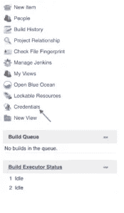
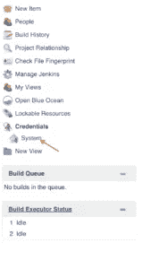
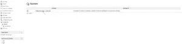
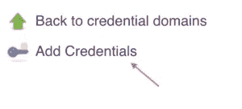
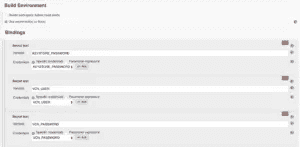
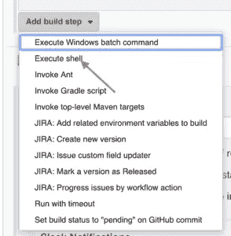

# Jenkins 构建部署管道:如何确保完整性

> 原文：<https://itnext.io/jenkins-build-deployment-pipeline-a-how-to-for-ensuring-integrity-15d1785864a3?source=collection_archive---------6----------------------->

在这篇博客中，我们将简要介绍

*   DevOps 具有很强的安全性
*   DevOps 安全(又名 DevSecOps)中的当前漏洞
*   Jenkins Automation 在构建过程中的角色
*   关于如何将 vChain 公证人工具与您的 Jenkins 构建部署管道集成以确保其完整性的技术演练

# DevOps 管道中的薄弱环节

DevOps 已经被广泛采用了很多年，因为它的好处包括加速软件开发过程。

然而，在 CICD 过程中，当涉及到确保从开发到生产的代码的完整性时，有一个重要的薄弱环节。也就是说，当构建被创建、存储在存储库中，然后被挑选出来部署到生产中时，没有人知道它是否被恶意编辑过。

没有对容器、脚本、集群或任何其他构建组件执行完整性检查。完全有可能有人篡改了构建代码并向其中注入了恶意软件。

不幸的是，如果代码的完整性从未被验证过，就没有办法完全确定您所部署的是您所构建的。(这还是在我们发现代码被破坏之后，我们在这里发布[之前的问题。)](http://www.vchain.us/the-failure-of-the-certificate-revocation-list-crl/)

# 使用 code 公证人保护 DevOps 构建

有了【code 公证人，解决方案就是一个**简单的单步**，你可以 100%确定你的代码就是你离开时的样子。凭借当今的技术，代码完整性不再是一个问题。现在，在将任何东西部署到生产环境之前，可以在构建过程的每个阶段验证所有代码的完整性。

此外，one 公证人的**强大、多层的安全解决方案**的最大优点之一是其无缝集成防止了问题的出现和随后规模的扩大，从而在潜在补丁成本和其他相关损害方面创造了**显著的节约**。

通过将 code 公证人的**分布式账本技术**集成到您的 DevOps 和 Jenkins 构建中，您现在有能力保存发送给任何客户**的所有已发货组件的 **30，000 英尺视图**，其范围可以缩小到无限粒度级别**。

这里是如何简单地设置詹金斯代码建立公证。

# 将 vChain 公证人集成到 Jenkins 构建部署管道中

为了在您的 CI/CD 构建中保持最佳的 DevSecOps 管道，我们开发了一个应用程序，可以持续验证您所有代码的完整性。下面是如何配置 code 公证人来自动签署 Jenkins 的构建的细节。该集成有 3 个主要步骤，也可以称为 10 步流程。3 个主要步骤是:

1.  在 jenkins 中进行系统级配置，以便在系统范围内使用 vcn 凭据
2.  将 vcn 凭证从系统配置绑定到每个构建作业和签名资产的本地环境变量
3.  部署前使用资产参数运行 vcn 验证

步骤 1:系统级配置

在主屏幕上，找到并单击侧栏菜单中的凭据链接，以展开其下的子菜单。



打开子菜单后，继续选择凭证类型，在本例中选择 System。



选择系统后，单击添加域，请注意右侧显示屏显示“全局凭据(无限制)”。单击该链接。



通过选择“添加凭据”选项创建新凭据。



现在您已经打开了凭据创建显示，您需要为您的 vcn 密钥库密码、vcn 用户帐户和 vcn 密码创建凭据条目。


一旦你有了所有的 3 个，你的凭证列表应该看起来像下面这样。


接下来，您需要为您拥有的每个构建作业配置构建作业环境。这个比较简单。您需要做的就是通过设置适当的绑定，将 vcn 凭证从系统配置绑定到本地环境变量。



成功设置绑定后，您将需要添加一个构建作业构建步骤，以便使用 vcn 应用程序对您的代码进行签名。单击“添加构建步骤”下拉菜单，然后选择“执行 shell”



接下来，您需要通过键入以下内容来配置 vcn 签名的构建步骤

```
vcn s -y docker:gcr.io/vchain-ops/vcn:stable  #in the Command field.
```


步骤 3:部署前

最后，您需要通过以下方式配置部署脚本以进行验证:

1.  配置环境变量 VCN _ 用户 VCN _ 密码密钥库 _ 密码
2.  在构建过程中执行以下代码片段

```
vcn verify docker:gcr.io/vchain-ops/vcn:stable || exit 1 
docker-compose up -d
```

仅此而已。现在，您已经准备好让 vChain 公证人为您的所有 Jenkins 构建部署管道提供持续运行的完整性检查，并确保您参与最新的 DevSecOps 最佳实践。

点击下方注册免费 code 公证人非商业许可证，保护您的 Jenkins build deployment pipeline 的完整性。

[**获得 code 公证人免费许可证**](https://dashboard.codenotary.io/auth/signup)

请注意，在您成功完成注册后，我们可能需要 24 小时来激活您的许可证，尽管这通常要快得多。如果您有任何反馈、问题或顾虑，请通过我们的联系页面给我们留言或通过 [**这里**](https://www.codenotary.io/contact/)[**code 公证人. io**](https://CodeNotary.io) 聊天联系我们。

*原载于 2019 年 4 月 24 日*[*https://www . vchain . us*](https://www.vchain.us/jenkins-build-deployment-pipeline-a-how-to-for-ensuring-integrity/)*。*