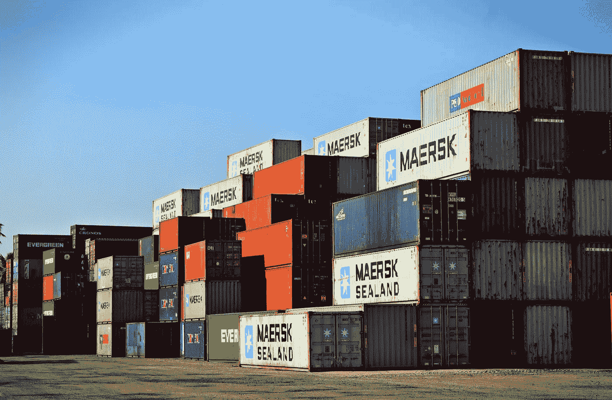

# 詹金斯老了

> 原文：<https://itnext.io/jenkins-is-getting-old-2c98b3422f79?source=collection_archive---------0----------------------->


照片由[rawpixel.com](https://www.pexels.com/@rawpixel?utm_content=attributionCopyText&utm_medium=referral&utm_source=pexels)从[派克斯](https://www.pexels.com/photo/grayscale-photo-of-man-1573823/?utm_content=attributionCopyText&utm_medium=referral&utm_source=pexels)拍摄

在我看来，很长一段时间以来，Jenkins 一直是持续集成(CI)，甚至在某种程度上是持续部署(CD)的唯一对手。然而，经过几年的使用，并与詹金斯斗争，我认为可能是时候继续前进了。像许多其他项目一样，詹金斯成了自身成功的受害者。


詹金斯早在 2005 年就以哈德森的身份开始了人生。它在 2008 年赢得了 Java One 的公爵选择奖。当 Oracle 收购 Sun 时，开源社区决定推出一个新项目 Jenkins，以保持其真正的开源和免费。从那时起，它就一直这样存在着。

我职业生涯的大部分时间都和詹金斯在一起。最初，在 Jenkins 还是 Hudson 时，我是 Jenkins 工件的消费者，现在，我是 Jenkins 的开发运营管理员，在一个庞大的团队中创建和配置了数千个工作。

这些年来，詹金斯成长成熟了许多。但并非一切都好。我发现自己每天都在和詹金斯斗争。虽然在解决我的一些担忧方面取得了一些进展，但其他一些棘手的问题则深入到了詹金斯工作方式的核心。


来自[像素](https://www.pexels.com/photo/houses-businessman-man-hands-110469/?utm_content=attributionCopyText&utm_medium=referral&utm_source=pexels)的[energepic.com](https://www.pexels.com/@energepic-com-27411?utm_content=attributionCopyText&utm_medium=referral&utm_source=pexels)的照片

# 构建配置

詹金斯的核心组成部分是工作。这些是告诉 Jenkins 做什么和如何做的构建配置。

## Web 用户界面

起初一切都是通过用户界面完成的。所有项目都是通过非常易于使用的 web 表单配置的。一开始，这很棒。但是很快就发现这很难备份和维护。同样，随着越来越多的人希望将配置作为代码，这也不太合适。配置大量作业既繁琐又容易出错。维护这些配置更加困难。

## 作业 DSL

接下来是詹金斯的工作 DSL。这是走向配置驱动开发的可喜的一步。Jenkins Job DSL 允许你使用 Groovy 来*编码*你的工作。您可以创建可重用的类和方法来生成 10 个、100 个、1000 个作业，而管理员只需做很少的工作。作为一个额外的好处，我们还可以对作业配置进行源代码控制。

```
def gitUrl = 'git://github.com/jenkinsci/job-dsl-plugin.git'job('PROJ-unit-tests') {
    scm {
        git(gitUrl)
    }
    triggers {
        scm('*/15 * * * *')
    }
    steps {
        maven('-e clean test')
        maven('-B release:prepare release:perform')
        shell('cleanup.sh')
    }
}
```

但是一切都不顺利。Job DSL 有几个关键的缺陷。

从头开始并不总是容易的。种子工作模式很难实现。

测试构建脚本几乎是不可能的。这导致系统管理员在生产中测试配置。此外，尝试新功能也非常困难。如果您希望一个分支的构建不同于其他分支，该怎么办？你可以这样做，但是不太干净。

虽然 DSL 工作是集中维护的，这也是 SA 所喜欢的，但是在配置工作时，它让开发人员感觉像是二等公民。并非所有的工作都属于完全相同的模式。这通常会导致非常复杂的 DSL 脚本。

## 詹金斯管道公司

最近转移到了 [Jenkins Pipeline](https://jenkins.io/doc/book/pipeline/jenkinsfile/) 或者许多人把它们称为 Jenkinsfile，因为构建是从名为 Jenkinsfile 的存储库中的一个特殊文件驱动的。Jenkinsfile 将控制权交还给了开发人员。构建配置与代码一起存储。这允许不同的分支根据该分支中的 Jenkinsfile 配置表现不同。SA 仍然可以维护一组核心功能，开发人员可以将这些功能导入到他们的脚本中，并根据需要进行定制。

```
pipeline {
    agent any 
    stages {
        stage('Build') { 
            steps {
                // 
            }
        }
        stage('Test') { 
            steps {
                // 
            }
        }
        stage('Deploy') { 
            steps {
                // 
            }
        }
    }
}
```

虽然这确实提供了在更加隔离的环境中进行实验的能力，但是它仍然有几个问题。尽管 Jenkinsfile 在技术上是 groovy 的，但是由于严格的安全考虑，您不能做许多您通常认为可以做的 groovy 的事情。这通常会表现为奇怪的错误，比如不能为列表中的每个执行*。我无法告诉你有多少次我在 Jenkinsfile 中编码，只是为了让一些看似良性的东西由于安全脚本权限而爆炸。这就需要有人登录 Jenkins，批准呼叫，然后再次运行作业。冲洗和重复，直到希望的工作完成。最重要的是，白名单不能在外部配置和存储。因此，当您用您的库启动一个新的 Jenkins 实例时，您必须再次审核所有相同的脚本。在剧本失败之前，你不能批准它。所以，祝你好运，确保一切都被正确批准。*

Jenkinsfile 被分成几个阶段。这允许很好地隔离构建思想，如构建、测试、发布等。以前版本的 Jenkins 不允许恢复管道。我很高兴地报告，这个问题似乎已经在 2018 年 4 月的[版本](https://issues.jenkins-ci.org/browse/JENKINS-45455)中得到解决。


来自 [Pexels](https://www.pexels.com/photo/red-and-three-blue-jigsaw-puzzles-1246743/?utm_content=attributionCopyText&utm_medium=referral&utm_source=pexels) 的【rawpixel.com】T2 的照片

## 插件

就其本身而言，詹金斯的核心相当小。但没人能这样管理詹金斯。你需要并且想要插件。外挂太牛逼了！他们允许第三方将新功能写入 Jenkins。我们将各种内容的页面合并在一起。例如，我可以创建一个显示代码覆盖率、单元测试历史、静态代码分析趋势等等的版本。好极了。表面上看是的。

但是插件也有黑暗的一面。

因为插件和插件版本，维护 Jenkins 是一场噩梦。插件被部署到詹金斯。作为单个 Jenkins 主 web 容器的一部分。这意味着它们都共享一个公共的类路径。

我怎么知道我是否会打破什么东西？

很多时候升级 Jenkins 也会改变底层的配置文件。如果您使用 Jenkins Job DSL，那么您必须确保它与您的 Jenkins 版本和所有已安装的插件保持同步。这迫使您拥有多个 Jenkins 实例。但是你不能简单地用詹金斯做传统的金丝雀部署模式。

这最终导致新功能停滞不前，并推迟了升级。


照片由[像素](https://www.pexels.com/photo/batch-books-document-education-357514/?utm_content=attributionCopyText&utm_medium=referral&utm_source=pexels)的 [Pixabay](https://www.pexels.com/@pixabay?utm_content=attributionCopyText&utm_medium=referral&utm_source=pexels) 拍摄

## 文件数据

Jenkins 生成并用于呈现所有这些可爱的构建结果页面的所有数据都存储为文件。很多很多的文件。这使得詹金斯的性能难以置信地受到 IO 束缚。大型管道视图需要几秒钟的渲染时间，这并不罕见。这些大文件也使詹金斯非常内存密集型。很多时候，Jenkins 将这些文件解析为整个 DOM，将文件的全部内容加载到内存中。Jenkins 使用几千兆字节的堆大小并不罕见。事实上，我们的生产 Jenkins 实例有一个 32 GB 的堆来保持运行。

## 记忆

说到内存，因为所有的插件实际上都是加载到 Jenkins 中的代码，所以经常会看到大量的内存泄漏。这不是核心詹金斯的错，但它仍然会关闭服务器。我们现在计划定期重启 Jenkins 实例，以减少内存泄漏。

## 系统 Groovy 脚本

如果您很想使用系统 Groovy 脚本，请不要这样做！你可以轻而易举地把詹金斯搞得一塌糊涂。这是因为该脚本不是一个分叉的进程，而是在 Jenkins 中运行。这是故意的，因为作为一个系统 groovy 脚本，您希望访问 Jenkins 本身和实际运行的类。但这意味着您还可以直接访问运行 Jenkins 的 JVM 和进程。因此，你可以搞乱类路径，堆，甚至把整个事情搞垮(System.exit？)

## 詹金斯构型

虽然作业 DSL 和 Jenkins 文件在作业配置方面有所帮助，但在配置 Jenkins 本身时，它们做得很少。您将需要配置 Jenkins 来连接到您的静态 slaves 或 Mesos 集群，或者设置安全或配置环境变量、构建工具等。Job DSL 有一些库可以用来做这件事，但是它们很难理解，也不可能测试。


来自 [Pexels](https://www.pexels.com/photo/man-wearing-black-and-white-stripe-shirt-looking-at-white-printer-papers-on-the-wall-212286/?utm_content=attributionCopyText&utm_medium=referral&utm_source=pexels) 的[创业股票照片](https://www.pexels.com/@startup-stock-photos?utm_content=attributionCopyText&utm_medium=referral&utm_source=pexels)

## 无法测试

我已经说过一次，两次，一千次了。詹金斯是不可能测试的。谁会使用除了在生产环境中无法测试的编程语言呢？没有人！有些人可能会说，你当然可以测试詹金斯。相信我，我试过了。您如何真正测试它？我们已经尝试启动 Jenkins 的本地实例，但是在实际运行构建时很快就崩溃了。实际配置呢？您需要配置对群集、模拟关键基础架构(如 artifactory 和 DTR)的访问。只是真的很难。最重要的是，你不希望你的测试影响实际的系统。由于缺乏隔离，我们的“测试”多次导致生产问题。

## 升级

我在插件中简单提到了这一点，但是升级是一个真正的问题。当你升级一个插件或者甚至是 Jenkins 本身的时候，要么全有，要么全无。如果你有一个工作需要旧版本的插件，而另一个工作需要新版本的插件，你就陷入了困境。您将需要多个 Jenkins 实例。迁移到新版本并不总是可能的，因为升级插件会导致底层 XML 也发生变化。因此，回滚几乎是不可能的。

## Jenkins Web 用户界面

实际的 web UI 运行在一个被亲切地称为 Jenkins Master 的 web 容器上。你只能拥有其中的一个。它不支持任何类型的集群或故障转移。因此，如果你有一个非常大的开发团队，他们都在攻击 Jenkins，那么这个实例就需要非常强大，并且不断地被监控。



照片由[查纳卡](https://www.pexels.com/@chanaka-318741?utm_content=attributionCopyText&utm_medium=referral&utm_source=pexels)从[派克斯](https://www.pexels.com/photo/cargo-container-lot-906494/?utm_content=attributionCopyText&utm_medium=referral&utm_source=pexels)拍摄

# 模块化

詹金斯的核心问题是它是一个庞然大物。所有的东西都在一起，插件、配置、web ui、Jenkins core，所有的东西都在一个大型的 web 应用程序中。是时候我们开始将我们在自己的生产系统中学到的经验应用到 Jenkins 身上了。Jenkins 需要是一个云原生模块化系统。

## 詹金斯 X

Jenkins X 致力于将 Jenkins 引入 Kubernetes 的云原生环境。尽管我对 Jenkins X 的体验有限，但我仍然觉得它没有解决我对模块化断开组件和简单测试的许多担忧。


照片由 [Pixabay](https://www.pexels.com/@pixabay?utm_content=attributionCopyText&utm_medium=referral&utm_source=pexels) 从[像素](https://www.pexels.com/photo/calm-daylight-evening-grass-267967/?utm_content=attributionCopyText&utm_medium=referral&utm_source=pexels)拍摄

# 我的梦想

我理想的 CI/CD 系统需要:

*   支持作业的某种单元测试
*   完全断开
*   水平可缩放
*   模块化的
*   可扩张的

谢天谢地，似乎有一些东西可能正好符合这个要求。


# Drone.io

[Drone.io](https://drone.io) 是一个基于 docker 容器的 CI/CD 系统。

这和 docker 上的 Jenkins 有什么不同？

每一步都是专注于一件事的不同容器。作业配置文件将一系列容器连接在一起。

```
kind: pipeline
name: defaultsteps:
- name: test
  image: maven:3-jdk-10
  commands:
  - mvn install -DskipTests=true -Dmaven.javadoc.skip=true -B -V
  - mvn test -B
```

为什么这很重要？

现在，我可以在本地机器上运行一个作业，环境与构建系统使用的环境完全相同。每个步骤都被隔离在小容器中，这些容器都有版本控制。这允许我在不影响现有工作的情况下升级和添加新功能。

同样的事情也可以在 Jenkinsfile 中完成。然而，对于 Jenkinsfile 配置，没有简单的本地解释器。另外，Jenkinsfile 在 Jenkins 中运行。因此，即使你能运行这个脚本，你也不能完全复制 Jenkins 会做的事情。有了 drone，我可以非常容易地解释配置并在本地运行所有步骤，因为所有工作都在容器中运行。

## 构建结果元数据

工件和构建元数据呢？还有那些好看的网页？

将任何工件上传到其他存储实例是容器的责任。有点像 S3，艺术工厂。这些都是为处理大量请求和轻松分配负载而构建的。构建元数据也应该被推送到其他度量服务，比如 Casandra。

## 建立网页？

嗯，这确实是个问题。到目前为止，还没有真正的解决方案。您可以为每个构建创建 Maven 站点。这可以以某种不错的格式显示所有的构建结果，供开发人员使用。但是这些只会显示单次运行的结果。创建指标和仪表板仍然需要外部开发。


照片由[rawpixel.com](https://www.pexels.com/@rawpixel?utm_content=attributionCopyText&utm_medium=referral&utm_source=pexels)从[派克斯](https://www.pexels.com/photo/black-and-brown-wooden-wall-decor-1811996/?utm_content=attributionCopyText&utm_medium=referral&utm_source=pexels)拍摄

# 现在怎么办？

我看到 CI/CD 空间中形成了一个空白。有几种不同的框架问世，但大多数都需要你选择一个平台来运行，比如谷歌云构建和 [AWS 管道](https://aws.amazon.com/getting-started/projects/set-up-ci-cd-pipeline/)。像今天这样的詹金斯是行不通的。我只能希望 Jenkins X 能吸取过去的教训，成为我们都渴望的真正的现代 CI/CD 框架。

说清楚。我喜欢詹金斯。我继续使用詹金斯。我想在未来继续使用詹金斯，我希望它能成功。我只是觉得它现在的架构需要针对云世界进行更新。希望，这将是詹金斯 x。