# 詹金斯管道使用黄瓜和多分支管道

> 原文：<https://itnext.io/jenkins-pipelines-889420409510?source=collection_archive---------0----------------------->

## 本文档的目的是提供一个关于如何开始使用管道和多分支管道的简要指南。

[*点击这里在 LinkedIn* 上分享这篇文章](https://www.linkedin.com/cws/share?url=https%3A%2F%2Fitnext.io%2Fjenkins-pipelines-889420409510)

# 要求:

本文档中使用的版本是 Jenkins 2.89.2(。war)用 Java 8。

【https://jenkins.io/doc/pipeline/tour/getting-started/ 

使用的插件(要安装:管理 Jenkins →管理插件→可用):

**管道:声明性—**[**https://plugins.jenkins.io/pipeline-model-definition**](https://plugins.jenkins.io/pipeline-model-definition)

**蓝海—**[**https://plugins.jenkins.io/blueocean**](https://plugins.jenkins.io/blueocean)

**黄瓜报道—**[【https://plugins.jenkins.io/cucumber-reports】T21](https://plugins.jenkins.io/cucumber-reports)

# 詹金斯管道公司:

如果您以前没有使用过 Jenkins Pipelines，我推荐您阅读文档([https://jenkins.io/doc/book/pipeline/](https://jenkins.io/doc/book/pipeline/))。它包括对该技术的完整描述和介绍，以及使用它的好处。

# Jenkins 管道入门:

使用的 Jenkinsfile 如下:

```
pipeline {
    agent any
    stages {stage('testing pipeline'){
          steps{
      echo 'test1'
                sh 'mkdir from-jenkins'
                sh 'touch from-jenkins/test.txt'
                }
        }}
}
```

代号:[https://github.com/mluyo3414/jenkins-test](https://github.com/mluyo3414/jenkins-test)

1.  点击新项目

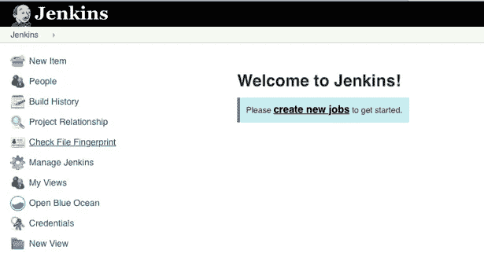

2.命名项目，选择“管道”,然后单击“确定”

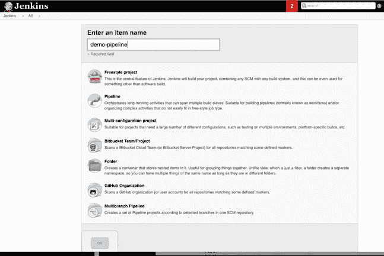

3.创建项目后，将显示配置页面。在“管道”部分，我们可以决定从 SCM 获取 Jenkinsfile，或者在 Jenkins 中创建管道脚本。建议将 Jenkinsfile 放在 SCM 中，这样它就可以移植和维护。

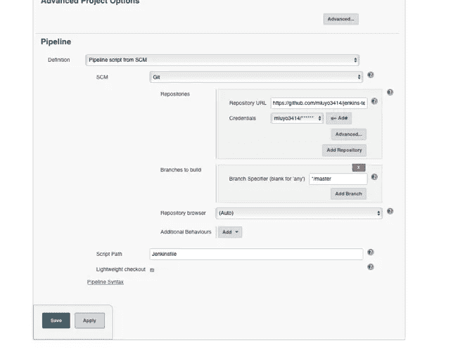

选择的 SCM 是带有简单用户和通行证凭证的 Git(也可以使用 SSH)。默认情况下，Jenkins 将在该存储库中查找 Jenkinsfile，除非在“脚本路径”目录中另有指定。

4.保存作业后，返回作业页面，选择“立即构建”。Jenkins 将触发作业，其中第一步是从 SCM 下拉 Jenkinsfile。它将报告从上次运行以来的任何更改并执行它。

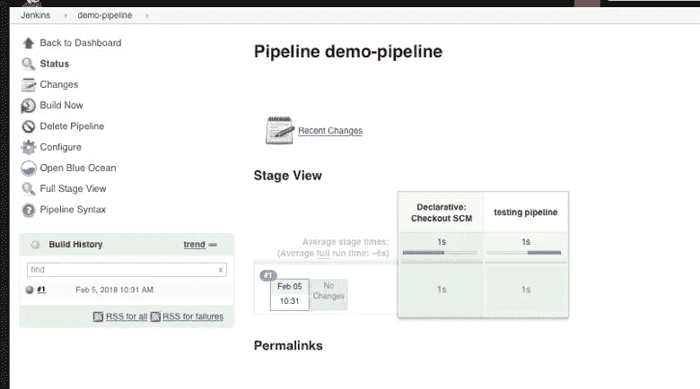

单击舞台会提供控制台信息:

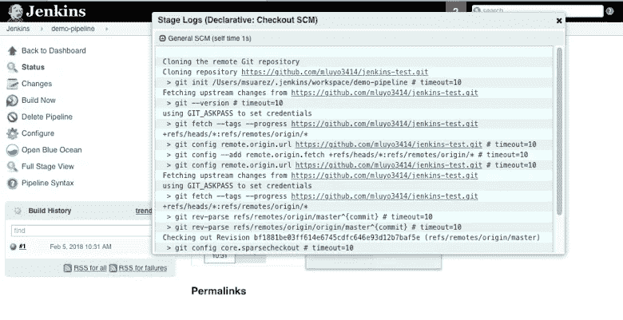

Ocean Blue 为 pipelines 提供了更好的用户界面，可以从作业的主页访问(见上图)。

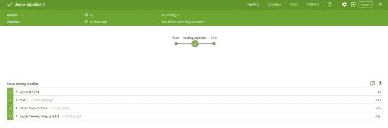

这个简单的管道有一个包含三个步骤的阶段(除了默认阶段:提取 jenkinsFile 的 Checkout SCM)。第一步回显一条消息，第二步将在 jenkins 工作区中创建一个名为 from-jenkins 的目录，第三步在创建的目录中创建一个文件 test.txt。jenkins 工作空间的路径是$user/。Jenkins/执行作业的机器中的工作区(在本例中，作业在任何可用的节点中执行。如果没有连接其他节点，则在安装了 Jenkins 的机器上执行—选中管理 Jenkins ->管理节点)。

另一种创建管道的方法是使用 Ocean Blue 的插件

1.  点击打开蓝色海洋

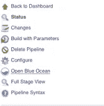

2.单击新建管道

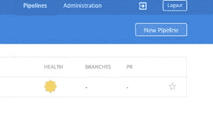

3.选择 SCM 和存储库 URL，将提供一个 SSH 密钥。这需要添加到您的 Git SSH 密钥(在设置→SSH 和 GPG 密钥)。

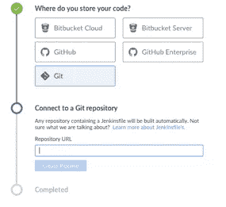

4.Jenkins 将自动检测分支和 Jenkinsfile(如果存在)。它还会触发作业。

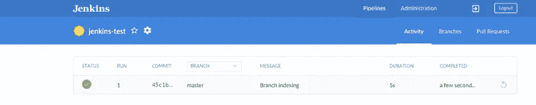

**管道开发**:

下面的 Jenkinsfile 从 Github 仓库触发 cucumber 测试，创建并归档一个 jar，发送电子邮件，并展示使用变量、并行阶段等执行作业的不同方式。演示中使用的 java 项目从 https://github.com/cucumber/cucumber-jvm 的[转移到 https://github.com/mluyo3414/cucumber-jvm 的](https://github.com/cucumber/cucumber-jvm)。Jenkinsfile 的位置是[https://github . com/mluyo 3414/cucumber-JVM/blob/master/examples/Java-calculator/Jenkins file](https://github.com/mluyo3414/cucumber-jvm/blob/master/examples/java-calculator/Jenkinsfile)。由于 Jenkinsfile 不在存储库的顶层目录中，因此必须将配置更改为另一个路径:

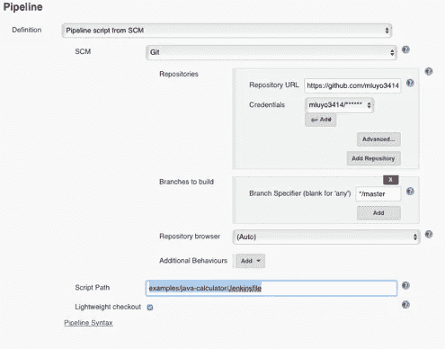

```
pipeline {
    // 1\. runs in any agent, otherwise specify a slave node
    agent any
    parameters {// 2.variables for the parametrized execution of the test: Text and options
        choice(choices: 'yes\nno', description: 'Are you sure you want to execute this test?', name: 'run_test_only')
        choice(choices: 'yes\nno', description: 'Archived war?', name: 'archive_war')
        string(defaultValue: "[your.email@gmail.com](mailto:your.email@gmail.com)", description: 'email for notifications', name: 'notification_email')
    }//3\. Environment variablesenvironment {firstEnvVar= 'FIRST_VAR'secondEnvVar= 'SECOND_VAR'thirdEnvVar= 'THIRD_VAR'}//4\. Stages
    stages {
        stage('Test'){
             //conditional for parameter
            when {
                environment name: 'run_test_only', value: 'yes'
            }
            steps{
                sh 'cd examples/java-calculator && mvn clean integration-test'
            }
        }//5\. demo parallel stage with script
        stage ('Run demo parallel stages') {steps {
        parallel(
        "Parallel stage #1":
                  {
                  //running a script instead of DSL. In this case to run an if/else
                  script{
                    if (env.run_test_only =='yes')
                        {
                        echo env.firstEnvVar
                        }
                    else
                        {
                        echo env.secondEnvVar
                        }
                  }
         },
        "Parallel stage #2":{
                echo "${thirdEnvVar}"
                }
                )
             }
        }
    }//6\. post actions for success or failure of job. Commented out in the following code: Example on how to add a node where a stage is specifically executed. Also, PublishHTML is also a good plugin to expose Cucumber reports but we are using a plugin using Json.

post {
        success {
        //node('node1'){echo "Test succeeded"
            script {
    // configured from using gmail smtp Manage Jenkins-> Configure System -> Email Notification
    // SMTP server: smtp.gmail.com
    // Advanced: Gmail user and pass, use SSL and SMTP Port 465
    // Capitalized variables are Jenkins variables – see [https://wiki.jenkins.io/display/JENKINS/Building+a+software+project](https://wiki.jenkins.io/display/JENKINS/Building+a+software+project)
                mail(bcc: '',
                     body: "Run ${JOB_NAME}-#${BUILD_NUMBER} succeeded. To get more details, visit the build results page: ${BUILD_URL}.",
                     cc: '',
                     from: '[jenkins-admin@gmail.com](mailto:jenkins-admin@gmail.com)',
                     replyTo: '',
                     subject: "${JOB_NAME} ${BUILD_NUMBER} succeeded",
                     to: env.notification_email)
                     if (env.archive_war =='yes')
                     {
             // ArchiveArtifact plugin
                        archiveArtifacts '**/java-calculator-*-SNAPSHOT.jar'
                      }
                       // Cucumber report plugin
                      cucumber fileIncludePattern: '**/java-calculator/target/cucumber-report.json', sortingMethod: 'ALPHABETICAL'
            //publishHTML([allowMissing: false, alwaysLinkToLastBuild: false, keepAll: true, reportDir: '/home/reports', reportFiles: 'reports.html', reportName: 'Performance Test Report', reportTitles: ''])
            }
        //}
        }
        failure {
            echo "Test failed"
            mail(bcc: '',
                body: "Run ${JOB_NAME}-#${BUILD_NUMBER} succeeded. To get more details, visit the build results page: ${BUILD_URL}.",
                 cc: '',
                 from: '[jenkins-admin@gmail.com](mailto:jenkins-admin@gmail.com)',
                 replyTo: '',
                 subject: "${JOB_NAME} ${BUILD_NUMBER} failed",
                 to: env.notification_email)
                 cucumber fileIncludePattern: '**/java-calculator/target/cucumber-report.json', sortingMethod: 'ALPHABETICAL'//publishHTML([allowMissing: true, alwaysLinkToLastBuild: false, keepAll: true, reportDir: '/home/tester/reports', reportFiles: 'reports.html', reportName: 'Performance Test Report', reportTitles: ''])
        }
    }}
```

*   总是检查“管道语法”以了解如何使用 Jenkinsfile 中的不同插件。

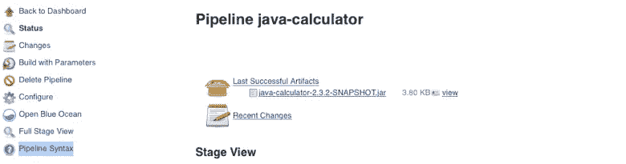

## 发送的电子邮件:

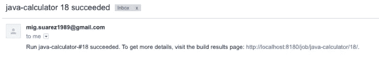

## 存档的 jar:

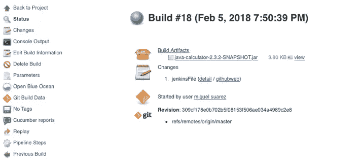

## 此外，在同一页面中，您还可以访问“黄瓜报告”:

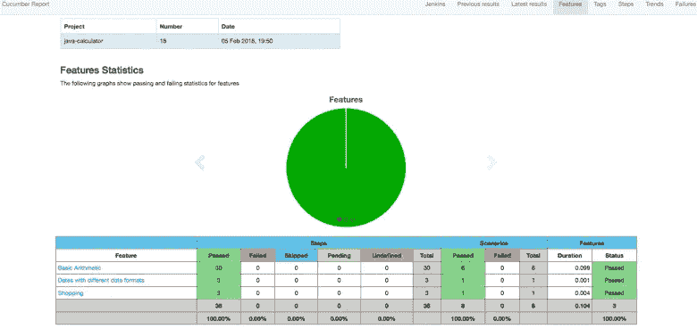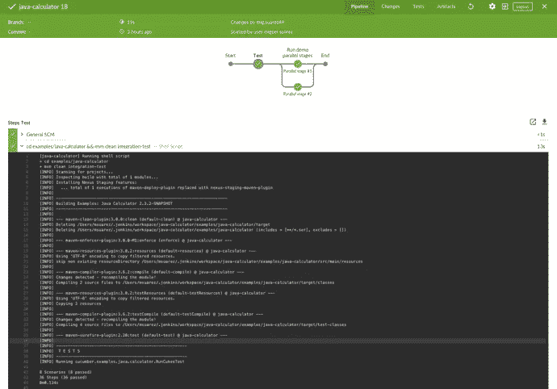

# 关于如何创建多分支管道的说明

[https://Jenkins . io/doc/book/pipeline/multi branch/# creating-a-multi branch-pipeline](https://jenkins.io/doc/book/pipeline/multibranch/#creating-a-multibranch-pipeline)

前面的链接使用 git，并假设已经配置了凭证。如果项目已经有了一个 Jenkinsfile(就像我们在前面的例子中所做的那样)，那么遵循前面的方法也更容易。

如果这是您第一次创建管道，您可以使用 Ocean Blue 执行以下步骤。

1.  开放的海洋蓝

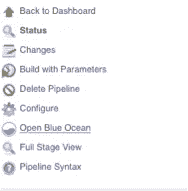

2.选择“新管道”


3.选择“git”并插入 Git 存储库地址。这是一个目前没有 Jenkinsfile 的存储库。将生成一个 ssh 密钥，然后在下一步中必须使用它

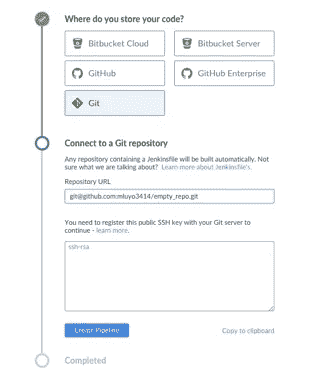

4.去 Github。点击右上角的个人资料头像，选择“设置”。然后从左侧菜单中选择“SSH ang GPG 密钥”并插入 Jenkins 提供的 SSH 密钥。


5.回到 Jenkins，点击“创建管道”。如果项目不包含 Jenkinsfile，那么 Jenkins 会提示您创建一个新的。

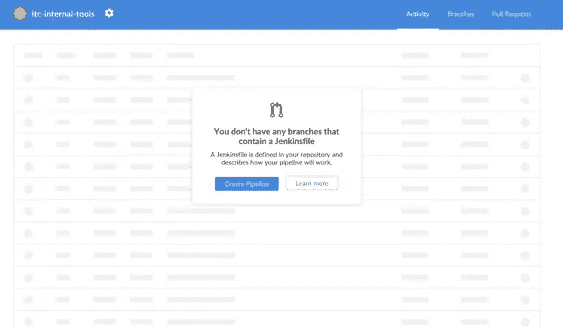

6.单击“创建管道”后，交互式管道图将提示您通过单击“+”添加阶段。您可以添加并行或顺序阶段以及每个阶段的多个步骤。有一个包含不同步骤选项的列表。

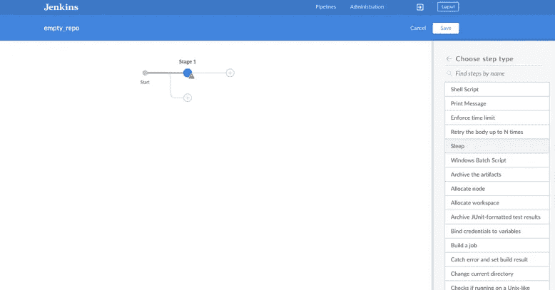

下图包含 3 个阶段。第一个阶段名为“阶段 1”，然后是阶段 2a 和阶段 2b，包含简单的打印消息步骤。您还可以添加环境变量，并指定这个 Jenkinsfile 将在哪个代理中执行。

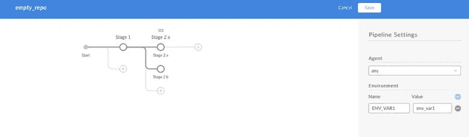

单击“保存”，然后通过单击“保存并运行”提交新的 Jenkinsfile


或者你也可以添加一个新的分支

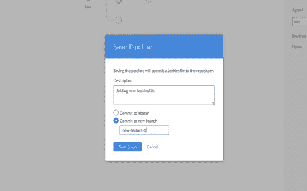

8.然后执行该作业。

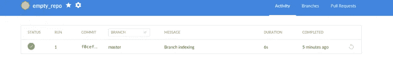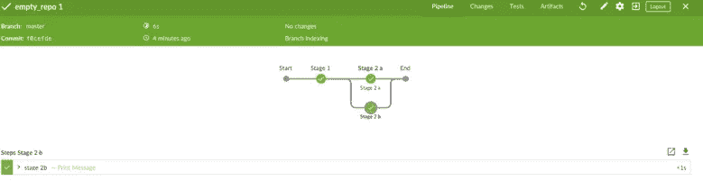

如果添加了新的分支，您将能够在 Github 中看到它

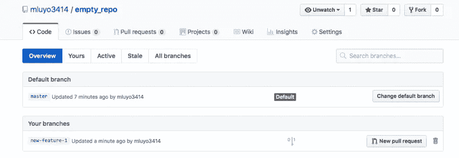

如果项目已经有了一个 Jenkinsfile，那么按照这些步骤开始时附加的链接中提供的说明进行操作会更容易。传统视图中的配置如下所示:

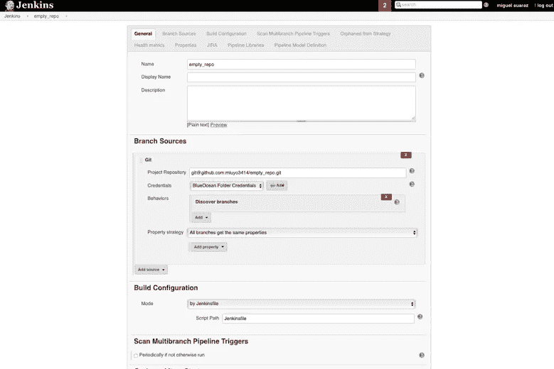

9.如果创建了另一个具有 Jenkinsfile 的分支，则可以通过单击“立即扫描多分支管道”来发现它。在这种情况下，在 Github 中从“master”创建了一个新的分支“new-feature-2”(只有带有 Jenkinsfiles 的分支才会显示在 Jenkins 中)。

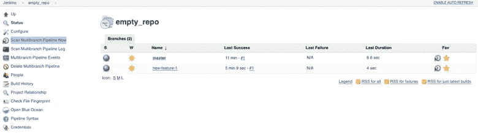

然后经过扫描，新的分支出现在詹金斯身上

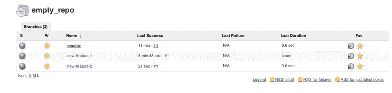

这项新功能是直接使用 Github 创建的，Jenkins 将在执行扫描时检测新的分支。如果新发现的管道在发现时不想执行，则通过在作业的多分支管道主页中单击“配置”来更改设置，并添加属性“抑制自动 SCM 触发”,这样 Jenkins 将只发现新管道，但它们必须手动触发。

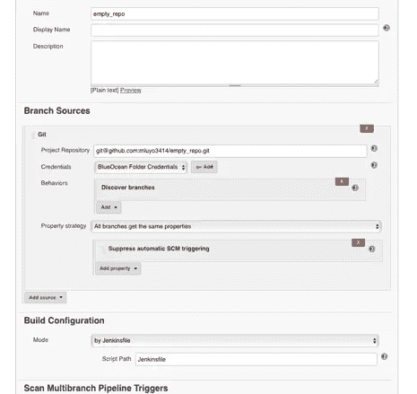