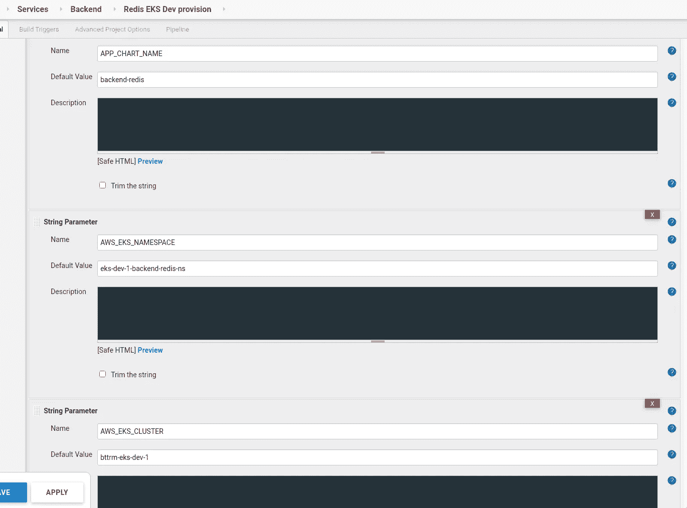
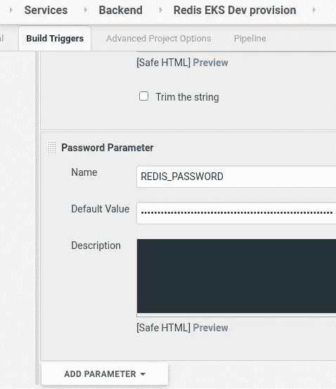
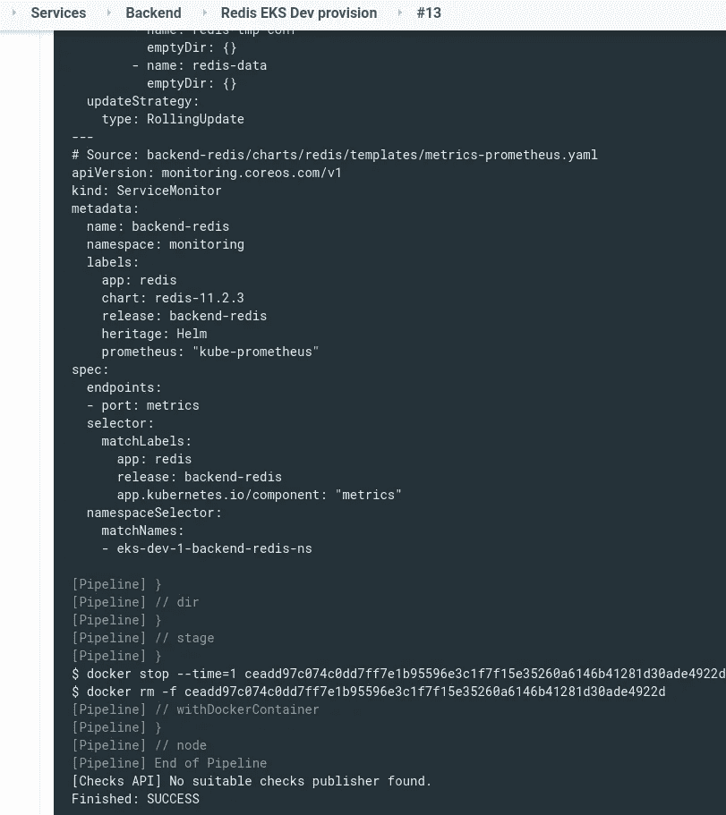

# 詹金斯:Redis 部署和舵子图表值

> 原文：<https://itnext.io/jenkins-redis-deployment-and-helm-subchart-values-633a3e31541c?source=collection_archive---------4----------------------->


任务是创建一个 Jenkins 作业，将 Redis 部署到 Dev/Stage/Prod Kubernetes 集群。

在 [Redis:在 Kubernetes](https://rtfm.co.ua/en/redis-running-master-slave-replication-in-kubernetes/) 中运行主从复制中，我们手动完成了它，看看它是如何工作的，现在是时候自动化它了。

主要问题是如何在部署期间为不同的环境传递参数？我想使用 Bitnami 的现有图表，同时从我们自己的 Helm 图表中部署它，并在每个开发/阶段/生产环境中使用一个`values.yaml`文件。

嗯，我们仍然可以创建我们的掌舵图，并添加 Redis Bitnami 图作为[掌舵依赖关系](https://rtfm.co.ua/helm-dependencies-aka-subcharts-obzor-i-primer/)，并从父图表传递一个`values.yaml`。

这里的文档是[>>>](https://helm.sh/docs/chart_template_guide/subcharts_and_globals/#:~:text=A%20subchart%20is%20considered%20%22stand,be%20accessed%20by%20all%20charts.)。

所以，我们要做的是:

*   父图表— *后端—redis*
*   具有 [bitnami/redis](https://bitnami.com/stack/redis) 依赖性
*   同`env`目录
*   有了`dev`目录
*   里面放着`values.yaml`的文件
*   保留 [Redis 选项](https://rtfm.co.ua/redis-master-slave-replikaciya-i-zapusk-v-kubernetes/#Redis_Options)的位置
*   在詹金斯，它将被部署为`helm install backend-redis -f env/${ENV}/values.yaml`

我们走吧。

# 创建父掌舵图

在我们服务的存储库中创建一个新图表:

```
$ helm create backend-redis
Creating backend-redis
```

删除所有模板文件—我们这里不需要它们:

```
$ rm -rf backend-redis/templates/*
```

为`values.yaml`创建目录:

```
$ mkdir -p backend-redis/env/{dev,stage,prod}
```

从[以前的帖子](https://rtfm.co.ua/redis-master-slave-replikaciya-i-zapusk-v-kubernetes/) ( *Rus* )中复制一个配置:

```
$ cp ~/Temp/redis-opts.yaml backend-redis/env/dev/values.yaml
```

检查其内容:

```
$ head backend-redis/env/dev/values.yaml
global:
  redis:
    password: “blablacar”metrics:
  enabled: true
  serviceMonitor:
    enabled: true
    namespace: “monitoring”
```

好的，只需要从这里删除密码，因为它将在部署过程中从 Jenkins 密码参数中通过`helm install --set`传递。

## 头盔:a `values.yaml`为副车

此外，这里我们需要更改的是在最开始添加一个子图表的名称，这样我们就可以在父图表中使用它，Helm 会将这些值应用到我们的子图表 Bitnami 中的 Redis 图表。

将 *redis* 字添加到文件的开头，并删除`password`的值:

```
redis:
  global:
    redis:
      password: ""

  metrics:
    enabled: true
    serviceMonitor:
      enabled: true
      namespace: "monitoring"

  master:
    persistence:
      enabled: false
    service:
      type: LoadBalancer
      annotations:
        service.beta.kubernetes.io/aws-load-balancer-internal: "true"
...
```

现在，我们可以向父级*后端-redis* 图表添加依赖项，添加 redis 图表:

```
$ helm search repo redis
NAME CHART VERSION APP VERSION DESCRIPTION
bitnami/redis 11.2.3 6.0.9 Open source, advanced key-value store. It is of…
bitnami/redis-cluster 3.2.10 6.0.9 Open source, advanced key-value store. It is of…
stable/prometheus-redis-exporter 3.5.1 1.3.4 DEPRECATED Prometheus exporter for Redis metrics
stable/redis 10.5.7 5.0.7 DEPRECATED Open source, advanced key-value stor…
stable/redis-ha 4.4.4 5.0.6 Highly available Kubernetes implementation of R…
stable/sensu 0.2.3 0.28 Sensu monitoring framework backed by the Redis …
```

让我们使用 *bitnami/redis 11.2.3* ，将`dependencies`添加到父图表的`Chart.yaml`中:

```
...
dependencies:
- name: redis
  version: ~11.2
  repository: "@bitnami"
```

添加存储库:

```
$ helm repo add bitnami [https://charts.bitnami.com/bitnami](https://charts.bitnami.com/bitnami)
```

为测试运行:

```
$ helm install backend-redis . --dry-run -f env/dev/values.yaml --debug
install.go:172: [debug] Original chart version: “”
install.go:189: [debug] CHART PATH: /home/setevoy/Work/devops-kubernetes/projects/backend/services/backend-redis
Error: found in Chart.yaml, but missing in charts/ directory: redis
helm.go:94: [debug] found in Chart.yaml, but missing in charts/ directory: redis
…
```

***“错误:在 Chart.yaml 中找到，但在 charts/directory:redis***”—啊，对，忘了。更新依赖关系:

```
$ helm dependency update
Hang tight while we grab the latest from your chart repositories…
…Successfully got an update from the “equinor-charts” chart repository
…Successfully got an update from the “bitnami” chart repository
…Successfully got an update from the “stable” chart repository
Update Complete. ⎈Happy Helming!⎈
Saving 1 charts
Downloading redis from repo [https://charts.bitnami.com/bitnami](https://charts.bitnami.com/bitnami)
Deleting outdated charts
```

检查子图表的档案:

```
$ ll charts/
total 64
-rw-r — r — 1 setevoy setevoy 64195 Oct 28 16:30 redis-11.2.3.tgz
```

再次运行:

```
$ helm install backend-redis . — dry-run -f env/dev/values.yaml — debug
```

如果一切正常，运行安装程序:

```
$ helm upgrade --install --namespace eks-dev-1-backend-redis-ns --create-namespace --atomic backend-redis . -f env/dev/values.yaml --set redis.global.redis.password=p@ssw0rd --debug
history.go:53: [debug] getting history for release backend-redis
Release “backend-redis” does not exist. Installing it now.
install.go:172: [debug] Original chart version: “”
install.go:189: [debug] CHART PATH: /home/setevoy/Work/devops-kubernetes/projects/backend/services/backend-redis
client.go:108: [debug] creating 1 resource(s)
client.go:108: [debug] creating 9 resource(s)
wait.go:53: [debug] beginning wait for 9 resources with timeout of 5m0s
wait.go:206: [debug] Service does not have load balancer ingress IP address: eks-dev-1-backend-redis-ns/backend-redis
wait.go:329: [debug] StatefulSet is not ready: eks-dev-1-backend-redis-ns/backend-redis-node. 1 out of 2 expected pods have been scheduled…
```

注意，在`--set`中，`password`参数也通过子块的名称传递，然后是块的名称- `redis.global.redis.password`。

检查服务:

```
$ kubectl -n eks-dev-1-backend-redis-ns get svc
NAME TYPE CLUSTER-IP EXTERNAL-IP PORT(S) AGE
backend-redis LoadBalancer 172.20.153.106 internal-a5d0d8f5a5d4a4438a2ca06610886d2f-1400935130.us-east-2.elb.amazonaws.com 6379:30362/TCP,26379:31326/TCP 70s
backend-redis-headless ClusterIP None <none> 6379/TCP,26379/TCP 70s
backend-redis-metrics ClusterIP 172.20.50.77 <none> 9121/TCP 70s 9121/TCP 21s
```

豆荚:

```
$ kubectl -n eks-dev-1-backend-redis-ns get pod
NAME READY STATUS RESTARTS AGE
backend-redis-node-0 3/3 Running 0 37s
backend-redis-node-1 3/3 Running 0 21s
```

并检查 Redis 是否正常工作:

```
$ admin@bttrm-dev-app-1:~$ redis-cli -h internal-a5d0d8f5a5d4a4438a2ca06610886d2f-1400935130.us-east-2.elb.amazonaws.com -p 6379 -a p@ssw0rd info replication
Replication
role:master
connected_slaves:1
slave0:ip=10.3.45.195,port=6379,state=online,offset=15261,lag=1
…
```

酷—现在我们可以添加一个 Jenkins 作业了。

以下是与来自[掌舵人пошаговое·созданиечартаиелокментаиза詹金斯](https://rtfm.co.ua/helm-poshagovoe-sozdanie-charta-i-deplojmenta-iz-jenkins/)岗位( *Rus* )的工作相似的一切。

# Jenkins 部署作业

创建一个 Jenkins 管道作业。

## 因素

添加参数:



Тут будут:

*   `APP_CHART_NAME`:父图表名称
*   `AWS_EKS_NAMESPACE`:要部署到的 Kubernetes 名称空间
*   `AWS_EKS_CLUSTER`:要部署到的 Kubernetes 集群，也用于为`kubectl`生成`.kube/config`
*   `APP_ENV`:用于替代`backend-redis/env/$APP_ENV/values.yaml`中的`verify()`功能调用，参见 [Jenkins:脚本化流水线-生产环境作业确认步骤](https://rtfm.co.ua/en/jenkins-scripted-pipeline-production-environment-job-confirmation-step/)
*   `APP_REPO_URL`:图表的存储库
*   `APP_REPO_BRANCH`:此存储库中的一个分支

我们存储库中的目录结构如下:

```
projects/
└── backend
└── services
└── backend-redis
├── Chart.lock
├── charts
│ └── redis-11.2.3.tgz
├── Chart.yaml
├── env
│ ├── dev
│ │ └── values.yaml
│ ├── prod
│ └── stage
├── templates└── values.yaml
```

使用 Redis 的密码创建密码参数:



## 管道脚本

并编写管道脚本:

```
// ask confirmation for build if APP_ENV == prod
def verify() {

        def userInput = input(
            id: 'userInput', message: 'This is PRODUCTION!', parameters: [
            [$class: 'BooleanParameterDefinition', defaultValue: false, description: '', name: 'Please confirm you sure to proceed']
        ])

        if(!userInput) {
            error "Build wasn't confirmed"
        }
}

// Add slack Notification
def notifySlack(String buildStatus = 'STARTED') {

    // Build status of null means success.
    buildStatus = buildStatus ?: 'SUCCESS'

    def color
    //change for another slack chanel
    def token = 'devops-alarms-ci-slack-notification'

    if (buildStatus == 'STARTED') {
        color = '#D4DADF'
    } else if (buildStatus == 'SUCCESS') {
        color = '#BDFFC3'
    } else if (buildStatus == 'UNSTABLE') {
            color = '#FFFE89'
    } else {
        color = '#FF9FA1'
    }

    def msg = "${buildStatus}: `${env.JOB_NAME}` #${env.BUILD_NUMBER}:\n${env.BUILD_URL}"
    slackSend(color: color, message: msg, tokenCredentialId: token)
}

node {

    try { 

    docker.image('projectname/kubectl-aws:4.1').inside('-v /var/run/docker.sock:/var/run/docker.sock') {

        stage('Verify') {
           switch("${env.APP_ENV}") {
               case "prod":
                   verify()
                   echo "Run job"
                   break;
               default:
                   echo "Dev deploy"
                   break;
            }
        }

        stage('Init') {

            gitenv = git branch: '${APP_REPO_BRANCH}',
                         credentialsId: 'jenkins-projectname-github',
                         url: '${APP_REPO_URL}'

            GIT_COMMIT_SHORT = gitenv.GIT_COMMIT.take(8)
            RELEASE_VERSION = "${BUILD_NUMBER}"
            APP_VERSION = "${BUILD_NUMBER}.${GIT_COMMIT_SHORT}"
            AWS_EKS_REGION = "us-east-2"

            echo "APP_VERSION: ${APP_VERSION}"
            echo "RELEASE_VERSION: ${RELEASE_VERSION}"

            sh "aws eks update-kubeconfig --region ${AWS_EKS_REGION} --name ${AWS_EKS_CLUSTER}"
            sh "kubectl cluster-info"
            sh "helm version"
            sh "helm -n ${AWS_EKS_NAMESPACE} ls "
        }

        // install dependencies
        stage("Helm dependencies") {

            dir("projects/backend/services/${APP_CHART_NAME}") {
                sh "helm repo add bitnami https://charts.bitnami.com/bitnami"
                sh "helm dependency update"
            }
        }

        // lint the chart
        stage("Helm lint") {

            dir("projects/backend/services/") {
                sh "helm lint ${APP_CHART_NAME} -f ${APP_CHART_NAME}/env/${APP_ENV}/values.yaml"
            }
        }

        // just to create --app-version
        stage("Helm package") {

            dir("projects/backend/services/") {
                sh "helm package ${APP_CHART_NAME} --version ${RELEASE_VERSION} --app-version ${APP_VERSION}"
            }
        }

        // --dry-run first, if OK then run install
        stage("Helm install") {

            dir("projects/backend/services/") {
                sh "helm secrets upgrade --install --namespace ${AWS_EKS_NAMESPACE} --create-namespace --atomic ${APP_CHART_NAME} ${APP_CHART_NAME}-${RELEASE_VERSION}.tgz -f ${APP_CHART_NAME}/env/${APP_ENV}/values.yaml --set redis.global.redis.password=${REDIS_PASSWORD} --debug --dry-run"
                sh "helm secrets upgrade --install --namespace ${AWS_EKS_NAMESPACE} --create-namespace --atomic ${APP_CHART_NAME} ${APP_CHART_NAME}-${RELEASE_VERSION}.tgz -f ${APP_CHART_NAME}/env/${APP_ENV}/values.yaml --set redis.global.redis.password=${REDIS_PASSWORD} --debug"
            }
        }

        stage("Helm info") {

            dir("projects/backend/services/") {
                sh "helm ls -a -d --namespace ${AWS_EKS_NAMESPACE}"
                sh "helm get manifest --namespace ${AWS_EKS_NAMESPACE} ${APP_CHART_NAME}"
            }
        }
    }

    // send Slack notification if Jenkins build fails
    } catch (e) {
        currentBuild.result = 'FAILURE'
        notifySlack(currentBuild.result)
        throw e
    }
}
```

松弛通知在[Jenkins:уведомлениевSlackизJenkins 脚本管道](https://rtfm.co.ua/jenkins-uvedomlenie-v-slack-iz-jenkins-scripted-pipeline/)帖子( *Rus* )中有所描述。

运行作业:



检查结果:

```
$ helm -n eks-dev-1-backend-redis-ns ls
NAME NAMESPACE REVISION UPDATED STATUS CHART APP VERSION
backend-redis eks-dev-1-backend-redis-ns 2 2020–10–29 14:19:52.407047243 +0000 UTC deployed backend-redis-13 13.6da15d3e
```

完成了。

*最初发布于* [*RTFM: Linux、DevOps 和系统管理*](https://rtfm.co.ua/en/jenkins-redis-deployment-and-helm-subchart-values/) *。*