# Jenkins:在 Kubernetes 和 Docker 映像构建中运行工人

> 原文：<https://itnext.io/jenkins-running-workers-in-kubernetes-and-docker-images-build-83299a10f3ca?source=collection_archive---------0----------------------->


我们有一个 Jenkins 实例，它在其主机上运行 Docker 容器中的作业。

最终，我们面临一个问题，即当前的 AWS Ec2 实例 t2.2xlarge (8 个 CPU，32 个 RAM)在峰值工作负载期间过载太多——没有足够的 CPU 时间，没有足够的内存。

因此，第一种解决方案可以是继续进行垂直扩展，例如扩展到 c5.9large，并继续在主主机上运行构建，或者将一些工作转移到外部工作人员。

目前，我们有三名这样的工作人员——Android 构建在我们办公室的 PC 上运行，配备了 Android studio，在办公室我们还有一批 MacMini for iOS 构建，此外我们还有 AWS 中的额外 EC2，供我们的 QA 团队运行他们的 UI 自动测试。

现在，让我们添加在 Kubernetes 集群中运行作业的功能。

我们正在使用 AWS 弹性 Kubernetes 服务，在这篇文章中，我们将检查如何为 Jenkins 使用 [Kubernetes 插件](https://github.com/jenkinsci/kubernetes-plugin)。

*   [詹金斯-主人:旋转一个实例](https://rtfm.co.ua/en/jenkins-running-workers-in-kubernetes-and-docker-images-build/#Jenkins-master_spin_up_an_instance)
*   [码头工人安装](https://rtfm.co.ua/en/jenkins-running-workers-in-kubernetes-and-docker-images-build/#Docker_install)
*   [用 Docker 运行 Jenkins】](https://rtfm.co.ua/en/jenkins-running-workers-in-kubernetes-and-docker-images-build/#Running_Jenkins_with_Docker)
*   [Kubernetes 的詹金斯工人](https://rtfm.co.ua/en/jenkins-running-workers-in-kubernetes-and-docker-images-build/#Jenkins_Workers_in_Kubernetes)
*   [詹金斯服务账户](https://rtfm.co.ua/en/jenkins-running-workers-in-kubernetes-and-docker-images-build/#Jenkins_ServiceAccount)
*   [Jenkins ServiceAccount 和 kubeconfig](https://rtfm.co.ua/en/jenkins-running-workers-in-kubernetes-and-docker-images-build/#Jenkins_ServiceAccount_and_kubeconfig)
*   [詹金斯·库伯内特的全权证书](https://rtfm.co.ua/en/jenkins-running-workers-in-kubernetes-and-docker-images-build/#Jenkins_Kubernetes_Credentials)
*   [詹金斯奴隶舱模板](https://rtfm.co.ua/en/jenkins-running-workers-in-kubernetes-and-docker-images-build/#Jenkins_Slaves_Pod_Template)
*   [詹金斯的工作](https://rtfm.co.ua/en/jenkins-running-workers-in-kubernetes-and-docker-images-build/#Jenkins_Job)
*   [库贝内特斯](https://rtfm.co.ua/en/jenkins-running-workers-in-kubernetes-and-docker-images-build/#Docker_in_Docker_via_Docker_in_Kubernetes)码头工人

# 詹金斯大师:旋转一个实例

出于测试目的，让我们用 Ubuntu 20.04 创建一个专用的 AWSес2，在那里添加一个 Docker 并设置一个 Jenkins 主实例。

## Docker 安装

创建一个ес2，用 SSH 连接，安装 Docker:

```
root@ip-10–0–4–6:/home/ubuntu# apt update && apt -y upgrade
root@ip-10–0–4–6:/home/ubuntu# curl [https://get.docker.com/](https://get.docker.com/) | bash
```

和 Docker 作曲。

在 Github 上找到[最新版本](https://github.com/docker/compose/releases)，写的时候是 [1.28.4](https://github.com/docker/compose/releases/tag/1.28.4) ，下载:

```
root@ip-10–0–4–6:/home/ubuntu# curl -L “https://github.com/docker/compose/releases/download/1.28.4/docker-compose-$(uname -s)-$(uname -m)” -o /usr/local/bin/docker-compose]root@ip-10–0–4–6:/home/ubuntu# chmod +x /usr/local/bin/docker-composeroot@ip-10–0–4–6:/home/ubuntu# docker-compose — version
docker-compose version 1.28.4, build cabd5cfb
```

## 用 Docker 运行 Jenkins

在主机上创建一个目录来存储 Jenkins 的数据:

```
root@ip-10–0–4–6:/home/ubuntu# mkdir jenkins_home
```

编写 Docker 撰写文件:

```
version: '3.5'

networks:
  jenkins:
    name: jenkins

services:

  jenkins:
    user: root
    image: jenkins/jenkins:2.249.3

    networks:
      - jenkins
    ports:
      - '8080:8080'
      - '50000:50000'
    volumes:
      - /home/ubuntu/jenkins_home/:/var/lib/jenkins
      - /var/run/docker.sock:/var/run/docker.sock
      - /usr/bin/docker:/usr/bin/docker
      - /usr/lib/x86_64-linux-gnu/libltdl.so.7:/usr/lib/x86_64-linux-gnu/libltdl.so.7
    environment:
      - JENKINS_HOME=/var/lib/jenkins
      - JAVA_OPTS=-Duser.timezone=Europe/Kiev
    logging:
      driver: "journald"
```

运行实例:

```
root@ip-10–0–4–6:/home/ubuntu# docker-compose -f jenkins-compose.yaml up
```

在浏览器中打开其 URL:

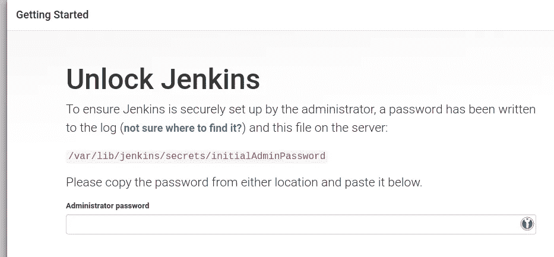

*管理员密码*可以在启动时的 Docker Compose 输出中找到，也可以在容器中的`/var/lib/jenkins/secrets/initialAdminPassword`文件中获得:

```
root@ip-10–0–4–6:/home/ubuntu# docker exec -ti ubuntu_jenkins_1 cat /var/lib/jenkins/secrets/initialAdminPassword
15d***730
```

登录，运行初始安装:

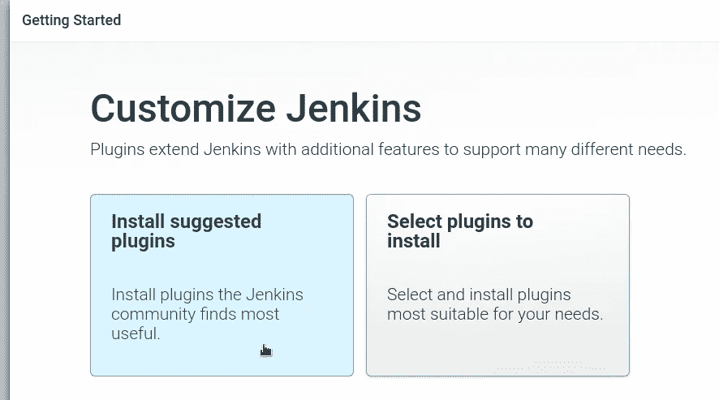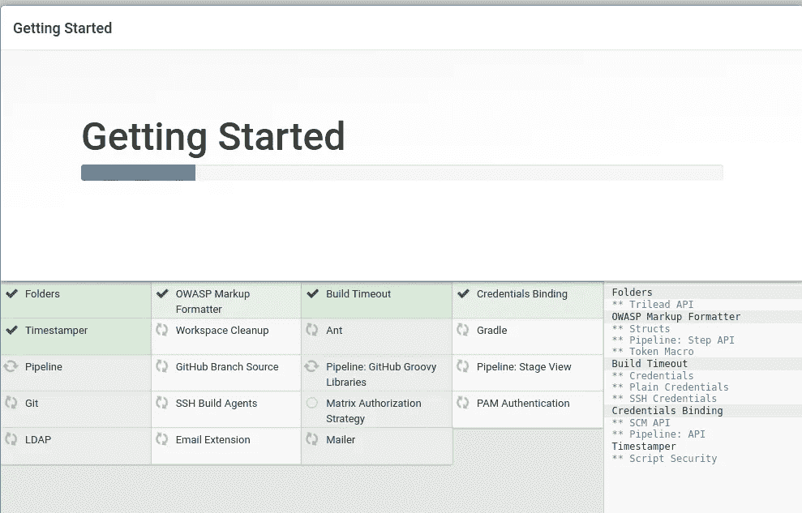

创建用户:

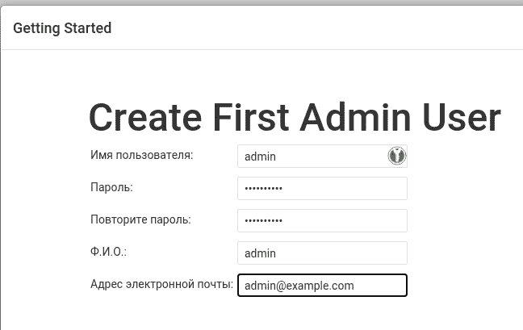

完成它并进入插件。

# Kubernetes 的詹金斯工人

找到 Kubernetes 插件:

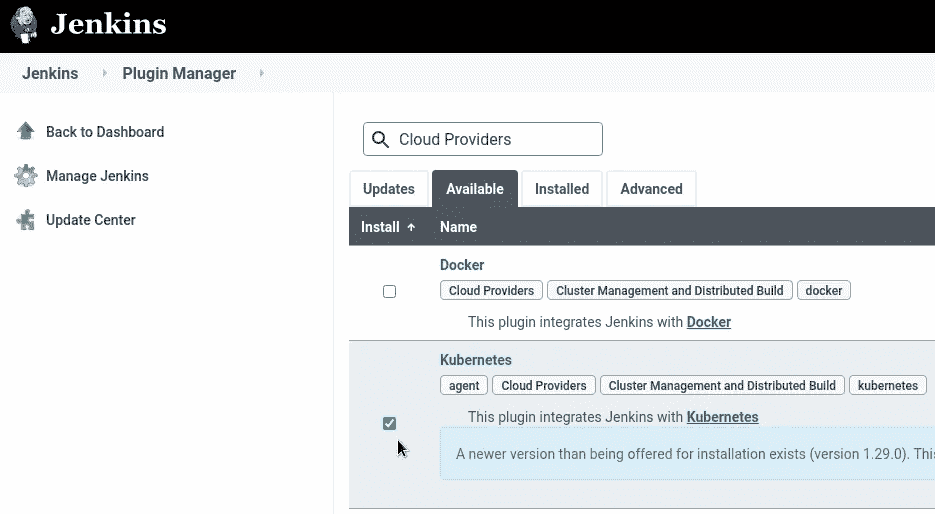

安装后进入*管理节点和云* > *配置云*:

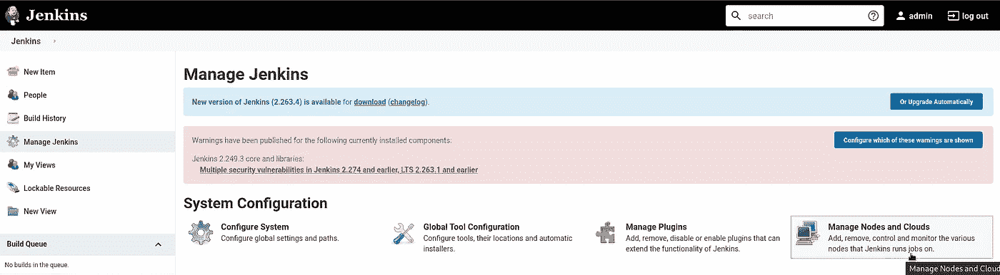

检查 Kubernetes:

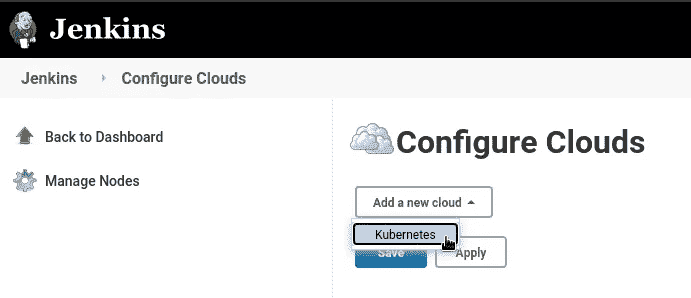

设置集群 API 服务器的 URL 和名称空间:

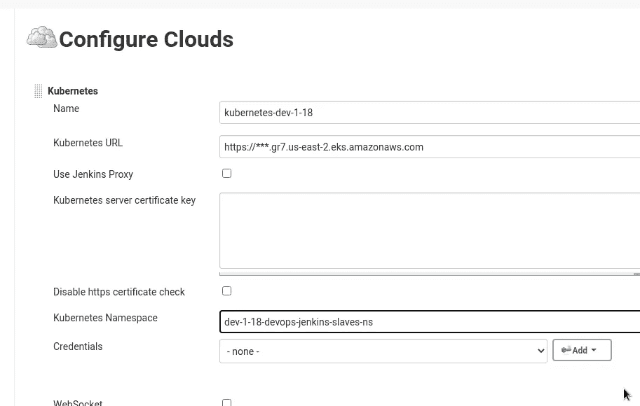

## 詹金斯服务帐户

在集群中，创建一个命名空间和 ServiceAccount，Jenkins 将使用它们进行授权。

在生产设置中，最好通过附加了 IAM-role 的 [EC2 实例概要文件](https://rtfm.co.ua/en/aws-iam-users-keys-rotation-ec2-iam-roles-and-jenkins/)来配置访问。

现在，在我们的*dev-1–18-devo PS-Jenkins-slaves-ns*名称空间中添加一个映射到[默认管理角色](https://kubernetes.io/docs/reference/access-authn-authz/rbac/#user-facing-roles)的 [Kubernetes RoleBinding](https://rtfm.co.ua/en/kubernetes-part-5-rbac-authorization-with-a-role-and-rolebinding-example/) (或者创建您自己的角色——这里的管理只是为了简单起见，因为这是一个 PoC 设置):

```
---
apiVersion: v1
kind: Namespace
metadata:
  name: dev-1-18-devops-jenkins-slaves-ns
---
apiVersion: v1
kind: ServiceAccount
metadata:
  name: jenkins-slaves-service-account
  namespace: dev-1-18-devops-jenkins-slaves-ns
---
apiVersion: rbac.authorization.k8s.io/v1
kind: RoleBinding
metadata:
  name: jenkins-slaves-rolebinding
  namespace: dev-1-18-devops-jenkins-slaves-ns
roleRef:
  apiGroup: rbac.authorization.k8s.io
  kind: ClusterRole
  name: admin
subjects:                                                                                                                                                                     
- kind: ServiceAccount                                                                                                                                                        
  name: jenkins-slaves-service-account
  namespace: dev-1-18-devops-jenkins-slaves-ns
```

部署它:

```
$ kubectl apply -f jenkins-slaves-sa.yaml
namespace/dev-1–18-devops-jenkins-slaves-ns created
serviceaccount/jenkins-slaves-service-account created
rolebinding.rbac.authorization.k8s.io/jenkins-slaves-rolebinding created
```

## 詹金斯服务帐户和 kubeconfig

接下来要做的是生成一个 [kubeconfig](https://rtfm.co.ua/kubernetes-kubectl-i-kubeconfig-obzor-fajla-dobavlenie-klastera-polzovatelya-i-konteksta/) ，它将使用这个 ServiceAccount。

为此，我们需要获得一个 EKS 集群 ARN、它的证书颁发机构、API 服务器的地址以及 ServiceAccount 的一个 [JWT 令牌](https://rtfm.co.ua/en/kubernetes-serviceaccounts-jwt-tokens-authentication-and-rbac-authorization/)。

查找为您的服务帐户创建的密码:

```
$ kubectl -n dev-1–18-devops-jenkins-slaves-ns get sa jenkins-slaves-service-account -o jsonpath=’{.secrets[0].name}’
jenkins-slaves-service-account-token-jsbb7
```

可以在 AWS 控制台中获取证书颁发机构和集群 ARN:

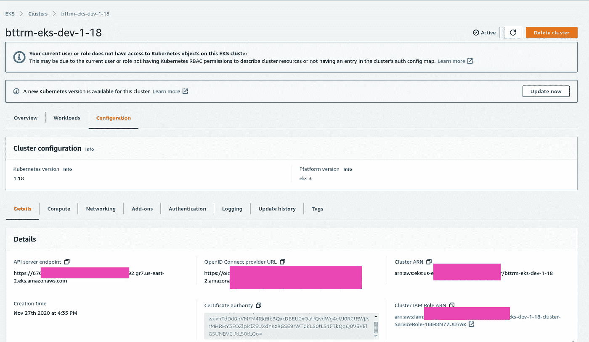

从秘密中获取令牌，用`base64`解密:

```
$ kubectl -n dev-1–18-devops-jenkins-slaves-ns get secret jenkins-slaves-service-account-token-jsbb7 -o jsonpath=’{.data.token}’ | base64 --decode
eyJ…s7w
```

编写一个 [kubeconfig](https://rtfm.co.ua/kubernetes-kubectl-i-kubeconfig-obzor-fajla-dobavlenie-klastera-polzovatelya-i-konteksta/) ，例如一个`jenkins-dev-1-18-kubeconfig.yaml`文件:

```
apiVersion: v1
clusters:
- cluster:
    certificate-authority-data: LS0...LQo=
    server: [https://676***892.gr7.us-east-2.eks.amazonaws.com](https://676***892.gr7.us-east-2.eks.amazonaws.com)
  name: arn:aws:eks:us-east-2:534***385:cluster/bttrm-eks-dev-1-18
contexts:
- context:
    cluster: arn:aws:eks:us-east-2:534***385:cluster/bttrm-eks-dev-1-18
    user: jenkins-slaves-service-account
    namespace: dev-1-18-devops-jenkins-slaves-ns
  name: jenkins-slaves-service-account@bttrm-dev-1-18
current-context: jenkins-slaves-service-account@bttrm-dev-1-18
kind: Config
users:
- name: jenkins-slaves-service-account
  user:
    token: ZXl...N3c=
```

检查它是否工作:

```
$ kubectl -n dev-1–18-devops-jenkins-slaves-ns --kubeconfig ../jenkins-dev-1–18-kubeconfig.yaml auth can-i get pod
yes
```

## Jenkins Kubernetes 证书

回到詹金斯那里，添加一个新的*凭证*:

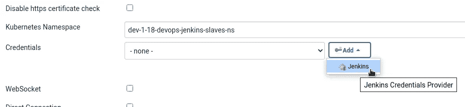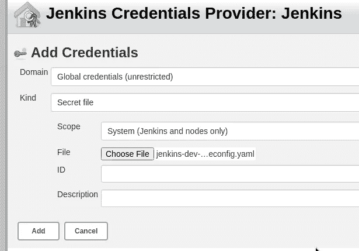

检查其连接—点击*测试连接*，必须看到*连接到 Kubernetes 1.18+* 消息:

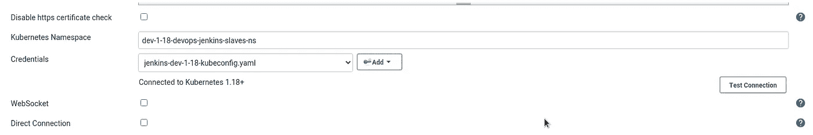

保存设置。

## Jenkins Slaves Pod 模板

转到 *Pod 模板*:

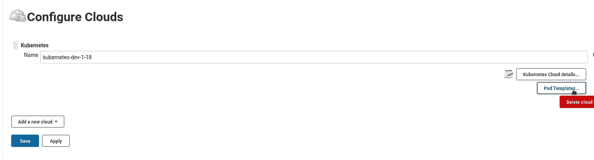

填充 pod 及其默认容器的字段，将`jenkinsci/jnlp-slave`设置为 Docker 图像:

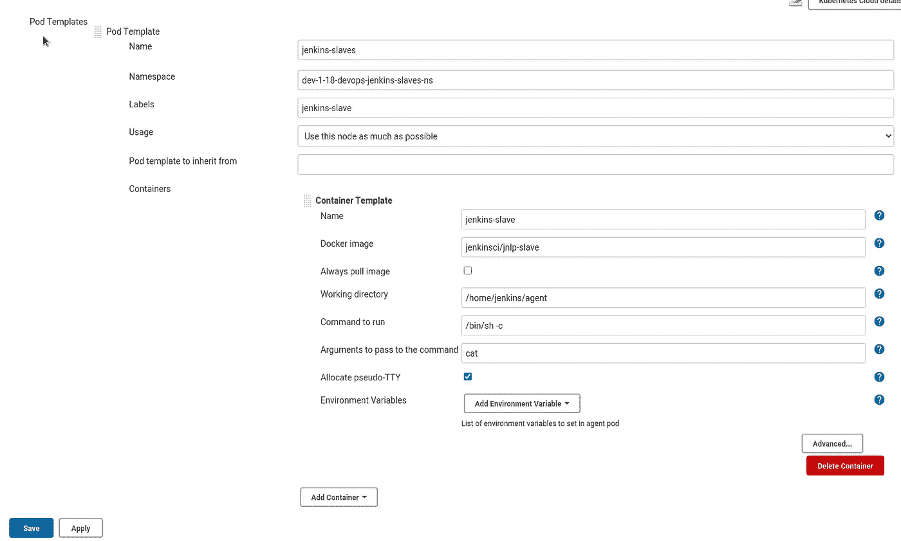

## 詹金斯工作

使用*管道*类型创建一个测试作业:

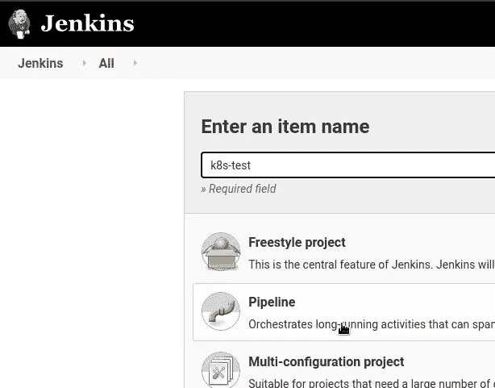

编写管道脚本:

```
podTemplate {
    node(POD_LABEL) {
        stage('Run shell') {
            sh 'echo hello world'
        }
    }
}
```

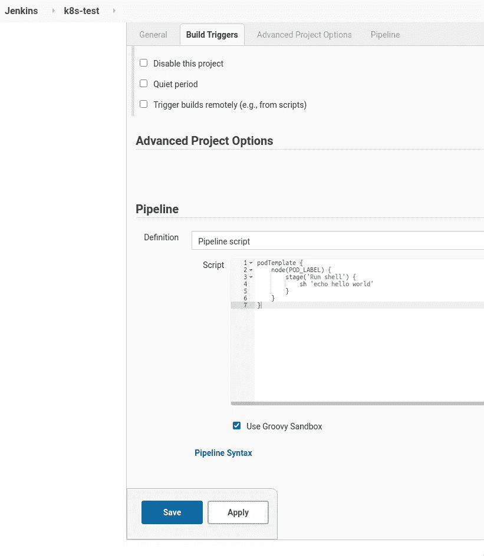

运行作业并检查 Jenkins 的日志:

```
…
jenkins_1 | 2021–02–26 08:36:32.226+0000 [id=277] INFO hudson.slaves.NodeProvisioner#lambda$update$6: k8s-1-b5j7g-glscn-v0tfz provisioning successfully completed. We have now 2 computer(s)
jenkins_1 | 2021–02–26 08:36:32.522+0000 [id=276] INFO o.c.j.p.k.KubernetesLauncher#launch: Created Pod: dev-1–18-devops-jenkins-slaves-ns/k8s-1-b5j7g-glscn-v0tfz
…
```

这个豆荚正在库伯内特星团里创造:

```
$ kubectl --kubeconfig ../jenkins-dev-1–18-kubeconfig.yaml get pod
NAME READY STATUS RESTARTS AGE
k8s-1-b5j7g-glscn-v0tfz 0/1 ContainerCreating 0 12s
```

作业完成:

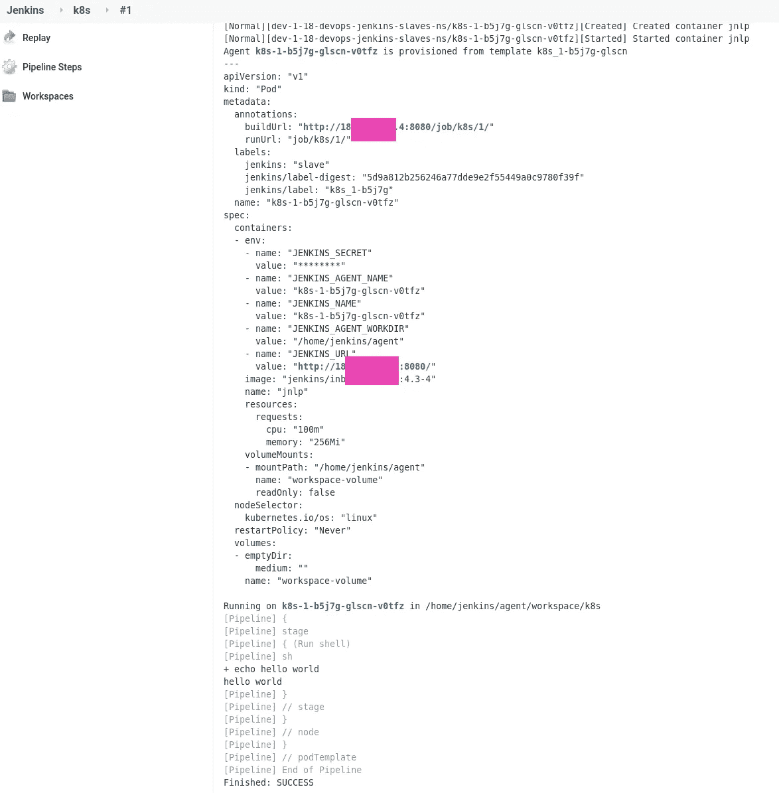

# 码头工人在码头工人通过码头工人在 Kubernetes

我们的 Jenkins 作为 Docker 容器运行，它在 Docker 容器内部运行它的构建。这是我长期以来使用的一个好方法，因为它给了我们一个不在主机系统上安装库的机会，以更可控的方式来设置构建环境，并且我们的开发人员可以按照他们的意愿来配置它们。

所以，现在我们需要认识到这一点——但是是在库伯内特药膏上。

将 [Docker 管道插件](https://plugins.jenkins.io/docker-workflow/)安装到 Jenkins 上；

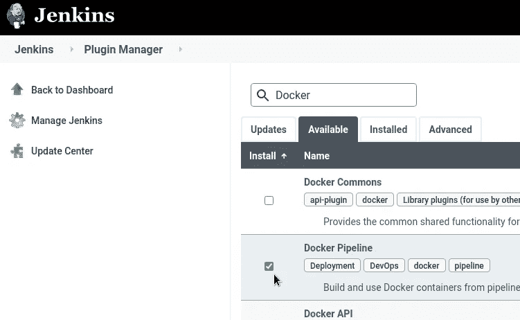

并创建新的管道

这里我们需要另一个 Docker 图像— `[docker.dind](https://hub.docker.com/_/docker?tab=tags&page=1&ordering=last_updated&name=dind)`，为此，我们需要另一个 pod 的模板。

您可以像我们之前一样通过 Jenkins UI 创建它，或者我们可以使用`[podTemplate](https://github.com/jenkinsci/kubernetes-plugin#pod-and-container-template-configuration)`直接在管道中描述它。

例如，让我们构建一个 NGINX 映像:

```
podTemplate(yaml: '''
apiVersion: v1
kind: Pod
spec:
  containers:
  - name: docker
    image: docker:19.03.1-dind
    securityContext:
      privileged: true
    env:
      - name: DOCKER_TLS_CERTDIR
        value: ""
''') {
    node(POD_LABEL) {
        git 'https://github.com/nginxinc/docker-nginx.git'
        container('docker') {
            sh 'docker version && cd stable/alpine/ && docker build -t nginx-example .'
        }
    }
}
```

并运行作业:

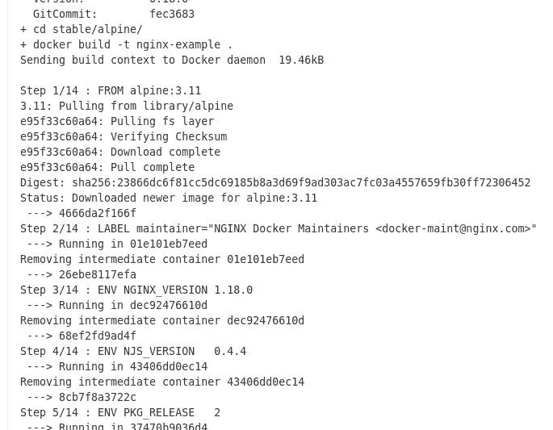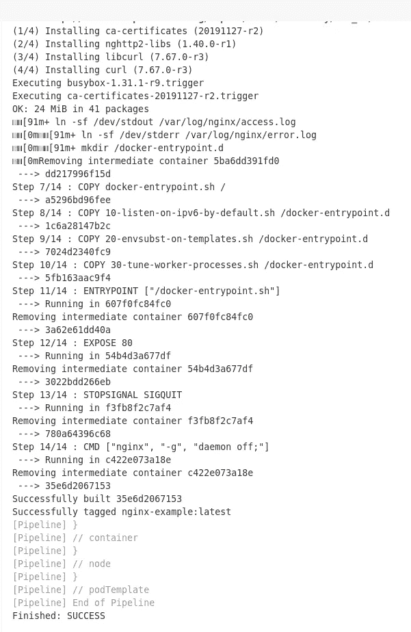

完成了。

# 有用的链接

*   [Kubernetes 插件管道示例](https://github.com/jenkinsci/kubernetes-plugin/tree/master/examples)
*   [Kubernetes 上的 Jenkins —— 构建 Docker 映像(T1)](https://pushbuildtestdeploy.com/jenkins-on-kubernetes-building-docker-images/)

*RTFM: Linux、DevOps 和系统管理* *(T9 )*