# Jenkins:Okta 和用户组的 SAML 认证

> 原文：<https://itnext.io/jenkins-saml-authentication-via-okta-and-users-groups-476a5763257c?source=collection_archive---------0----------------------->

**SAML** — *安全断言标记语言*用于联合认证；当一个我们需要访问的服务(一个*服务提供者*)请求另一个服务(一个*身份提供者*)执行用户认证时。

查看文档[此处> > >](https://www.okta.com/integrate/documentation/saml/) 。

*   *服务提供商* ( **SP** ):是一个需要认证的系统，在我们的例子中是 Jenkins
*   *身份提供者(* **IDP** *)* :是一个存储用户的系统，它将准确地执行身份验证步骤，在我们的例子中是 Okta

他们在认证期间的通信和步骤可以在下一个方案中显示:

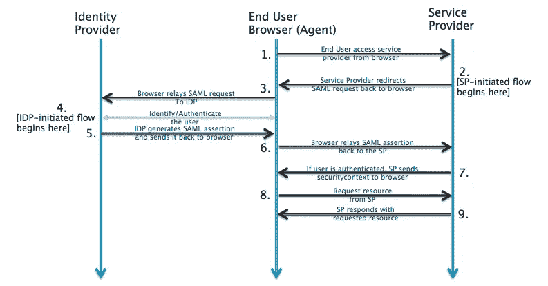

这里:

*   *SAML 请求*:或认证请求，由 SP 创建，用于请求用户的认证
*   *SAML 响应*:将由 IDP 创建，包含关于已通过身份验证的用户的数据，还可能包含一些附加信息，如用户组等

此外，请记住，SAML 身份验证有两种类型:

*   *服务提供者发起的(SP 发起的)*:当用户尝试登录 Jenkins 实例时，服务(在本例中为 Jenkins)向 IDP 提供者执行初始化
*   *身份提供商发起(IDP 发起)*:反之亦然，当 Okta 的用户点击按钮登录 Jenkins 时，IDP 将向 Jenkins (SP)发起请求，以验证该用户

这篇文章主要讲的是*服务提供者发起的，*但是*身份提供者发起的*也可以。

此外，请记住，SP 和 IDP 永远不会直接相互对话，用户的浏览器将充当它们之间的“代理”。

## 服务提供者角色

IDP 为 SP 生成 SAML 响应，然后 SP 必须检查该响应是否来自有效的 IDP，然后解析该响应以获取必要的数据—用户名、组和其他属性。

为此，SP 需要从 IDP 获取下一个信息:

*   国内流离失所者的公共证书
*   *ACS 端点* ( *断言消费者服务 URL* )或“SP 登录 URL”——SP 传递给 IDP 以接收 SAML 回复的端点 URL
*   *IDP 登录 URL*—SP 将向其发送 SAML 请求的 IDP 端点

## Okta 的 Jenkins SAML

将 SAML 集成到 Jenkins 的主要目标是:

*   Okta 的商店用户
*   Okta 的用户被分组
*   Jenkins 将使用基于角色的策略插件，该插件将访问角色分配给不同的组

在 Okta Jenkins 中，SAML 可以通过两种方式进行配置:

1.  通过使用本地 Okta 的应用程序——配置工作较少，但无法将用户组传递给 Jenkins，这将在本文的 [Okta 社区创建的 Jenkins SAML 应用程序](https://rtfm.co.ua/en/jenkins-saml-authentication-via-okta-and-users-groups/#Okta_Community_Created_Jenkins_SAML_application)部分讨论
2.  或者在 Okta 中创建自己的基于 SAML 的应用程序，该应用程序将具有带有用户组字段的自定义属性，这将在本帖的 [Okta 和我们的 Jenkins SAML 应用程序](https://rtfm.co.ua/en/jenkins-saml-authentication-via-okta-and-users-groups/#Okta_and_own_application_for_Jenkins_SAML)部分讨论

采用第一种方式，你将无法使用[基于角色的策略](https://wiki.jenkins.io/display/JENKINS/Role+Strategy+Plugin)插件，但仍然可以使用[基于矩阵的安全](https://wiki.jenkins.io/display/JENKINS/Matrix-based+security)或[矩阵授权策略](https://wiki.jenkins.io/display/JENKINS/Matrix+Authorization+Strategy+Plugin)插件:

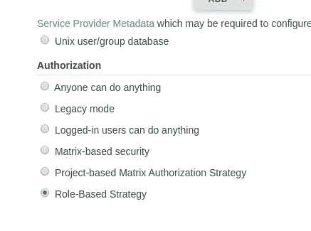

基于角色的插件配置将在接下来的部分中描述，现在在这篇文章中，我们将看到如何以上述两种方式为 Jenkins 配置 Okta 和 SAML。

## Okta 本地 Jenkins SAML 应用程序

Okta 构型

进入 Okta > *添加 app，*找到一个 Jenkins SAML 插件:

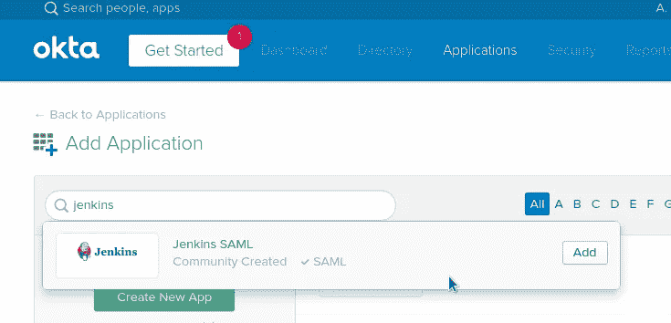

设置 Jenkins 的 URL:

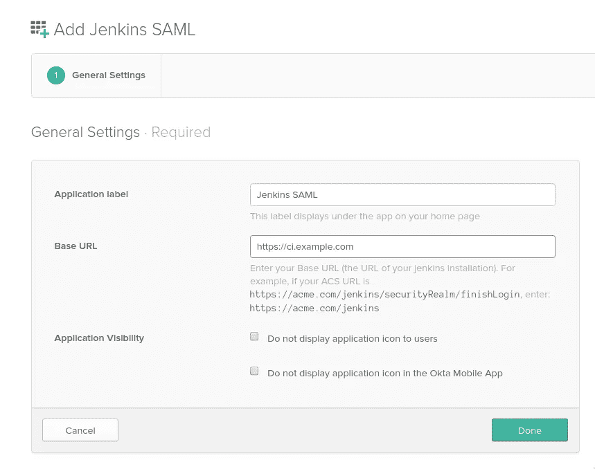

切换到标签上的*符号:*

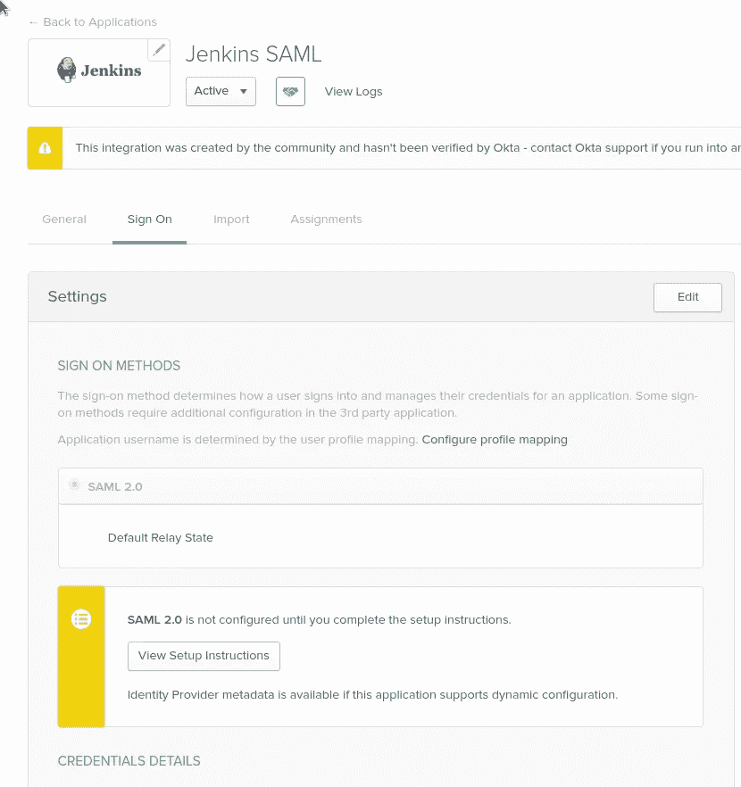

点击*查看设置说明* — Okta 已经生成了所有数据，供我们的 SP (Jenkins)使用:

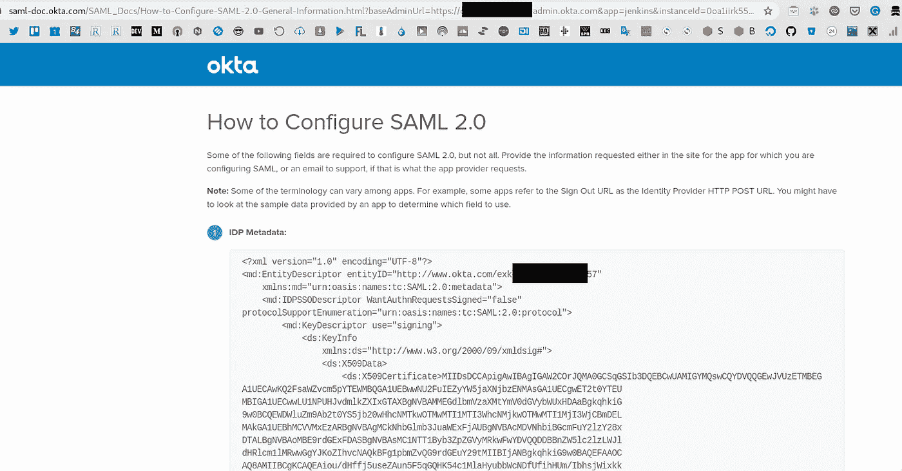

转到*分配*选项卡，将 Jenkins SAML 应用程序添加到所需的 Okta 用户:

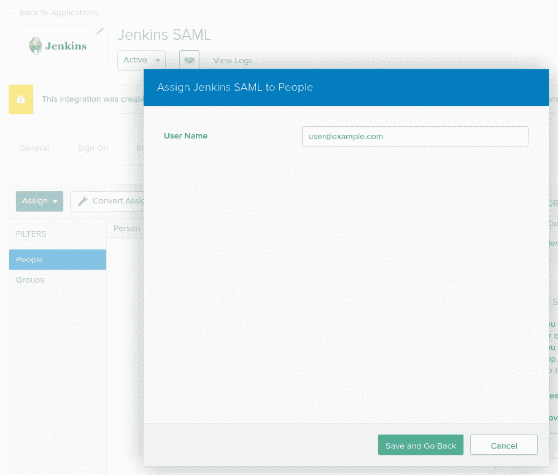

导航到你的詹金斯。

Jenkins 中的 SAML 配置

安装 [SAML 插件](https://wiki.jenkins.io/display/JENKINS/SAML+Plugin):

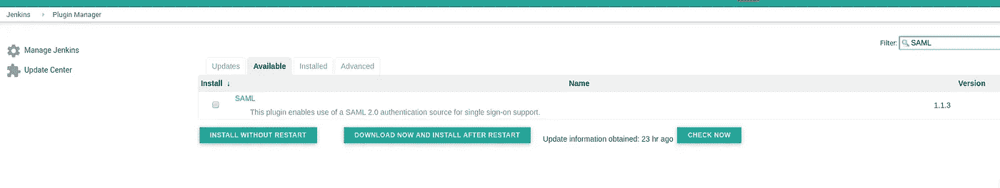

进入*配置全球安全*，将你的认证领域从 *Jenkins 自己的用户数据库*切换到 *SAML* :

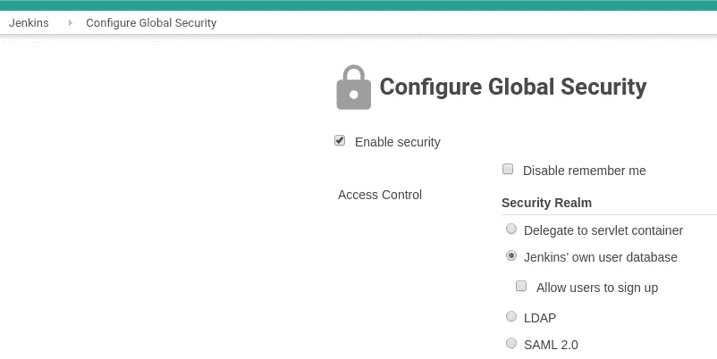

返回 Okta 和元数据页面，复制 *IDP 元数据*内容:

粘贴到 Jenkins 的 SAML 设置:

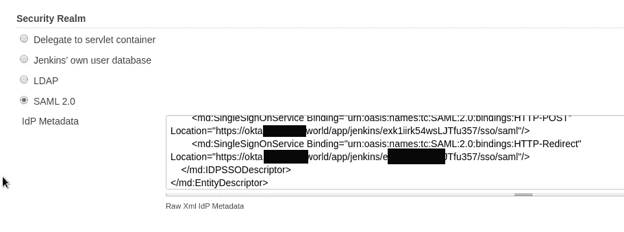

返回您的 Okta，复制到*身份提供者元数据*的链接:

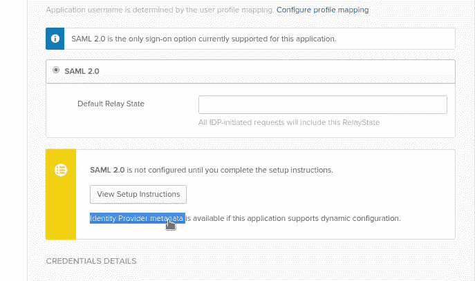

在 Jenkins 中将它设置为 *IDP 元数据 URL* 字段:

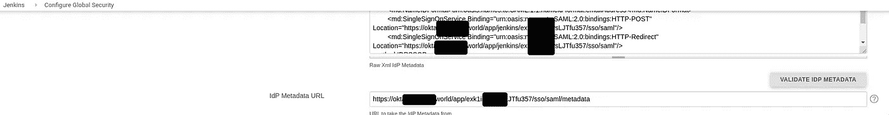

*显示名称属性*和*组属性*保持不变。

现在检查一下:打开你的詹金斯网址——你必须被重定向到俄克拉荷马州:

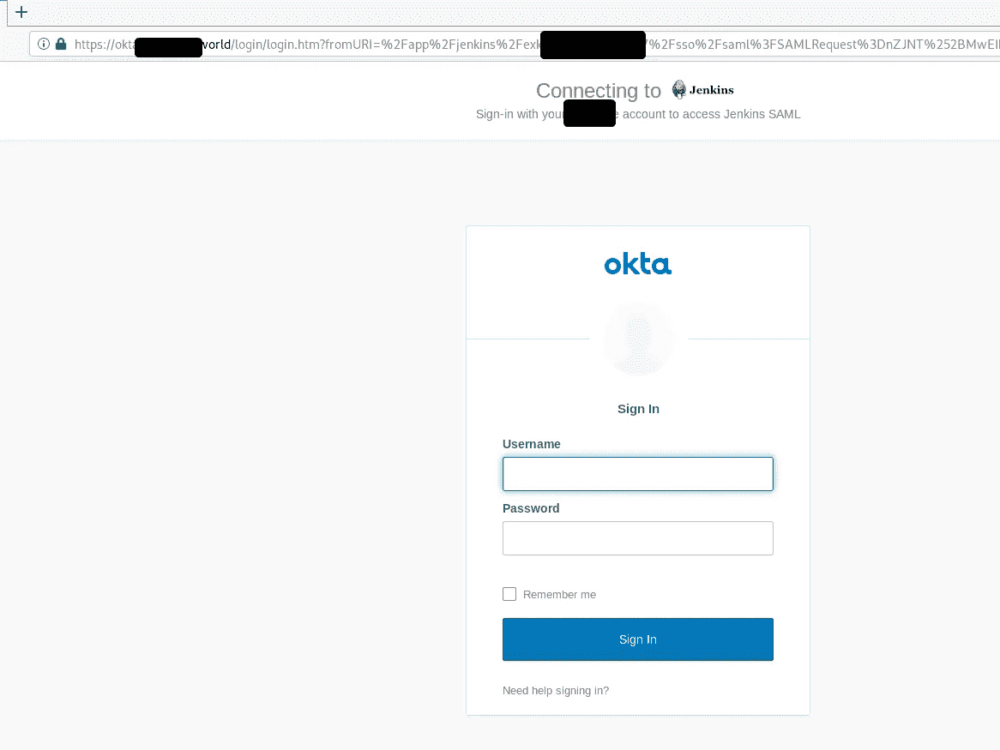

登录，一切都在这里完成。

## Okta 和我们对詹金斯的申请

现在，让我们在 Okta 中添加一个新的应用程序，它将能够将一个用户组传递给 Jenkins，例如一个 *DevOps* 组:

Okta 构型

创建新应用程序:

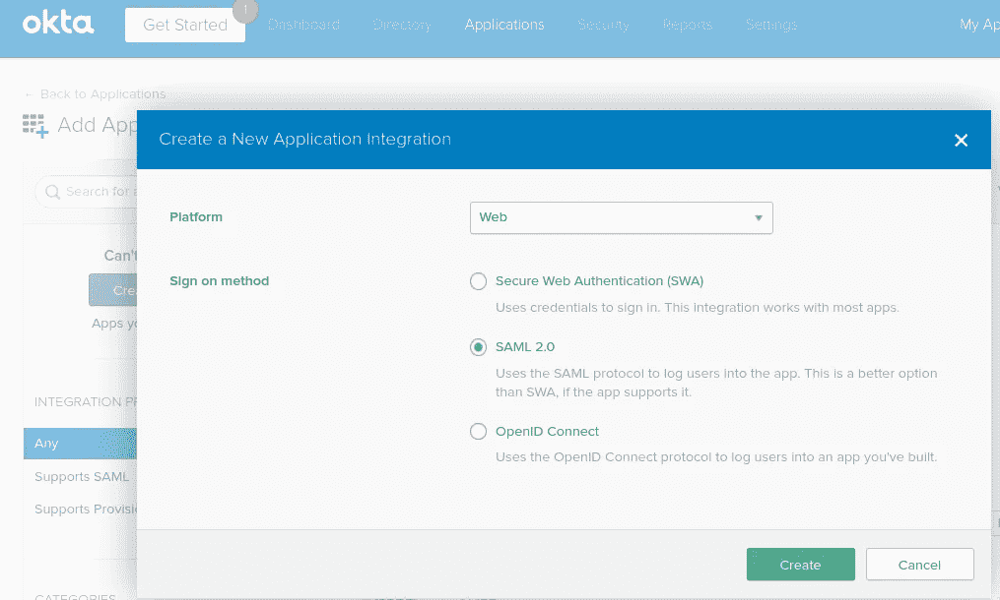

设置其名称、图标:

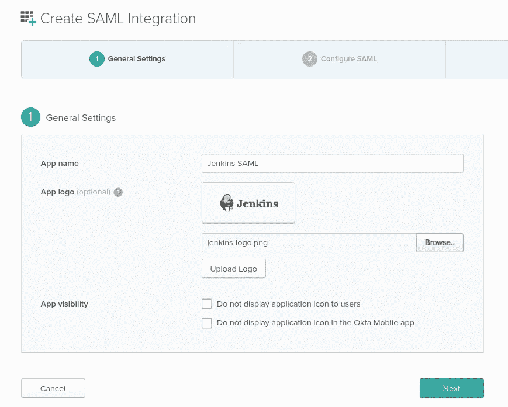

接下来，在*单点登录网址* и *观众 URI (SP 实体 ID)* 设置 *ACS 端点*—[*http://dev.ci.example.com/securityRealm/finishLogin*:](http://dev.ci.example.com/securityRealm/finishLogin:)

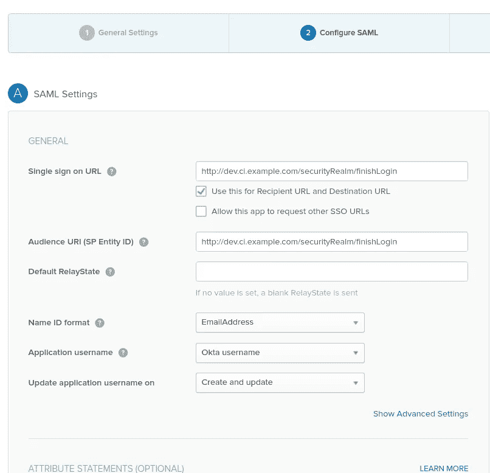

要将用户组从 Okta 传递到 Jenkins，在*组属性语句(可选)*中添加一个新字段:

*   `Name` : *组*
*   `Name format` : *基本*
*   `Filter` - *匹配正则表达式*和值为。*适用于 Okta 的所有团体

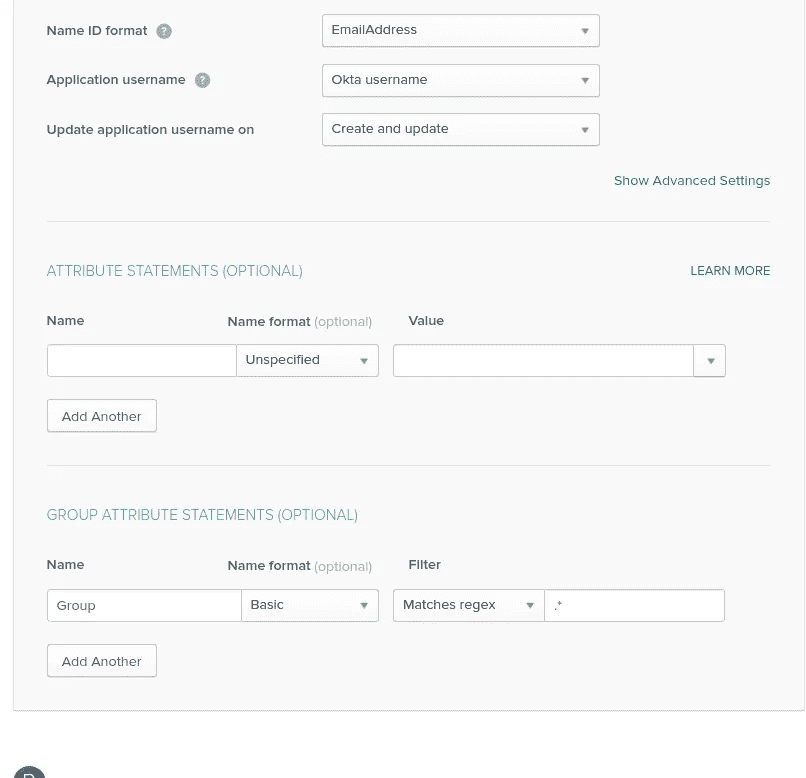

在下一页，设置*我是 Okta 客户添加内部 app* ，*完成*。

不要忘记*任务*。

现在，与之前一样，点击*查看设置说明*，复制 IDP *元数据*并更新 Jenkins 中的*配置全局安全性*设置。

复制到*身份提供者元数据*的链接:

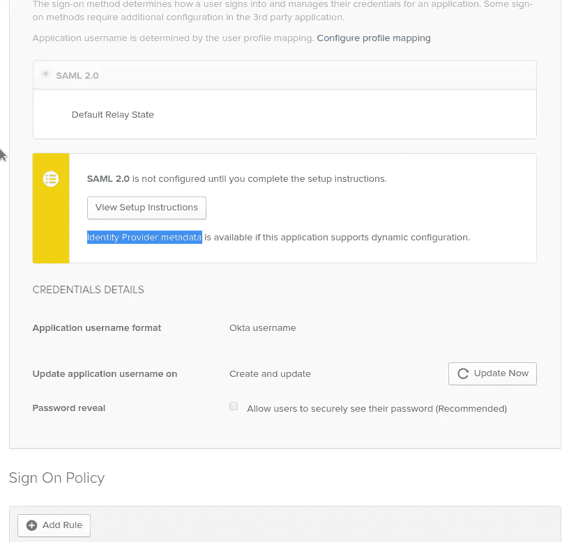

Jenkins 中的 SAML 配置

将此链接设置为 Jenkins 中归档的 *IDP 元数据 URL* :

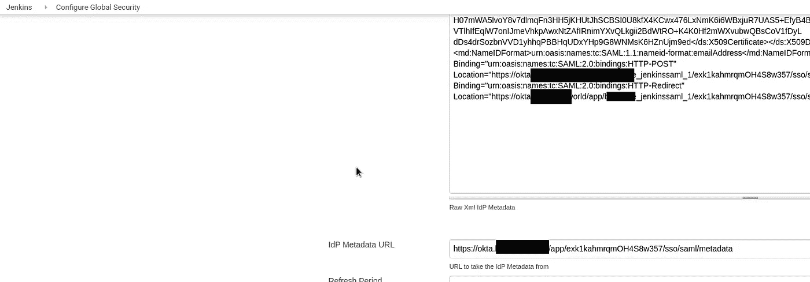

在 Jenkins 中，将*组属性的'* s 值从[*【http://schemas.xmlsoap.org/claims/Group】*](http://schemas.xmlsoap.org/claims/Group)更改为仅“*组”*:

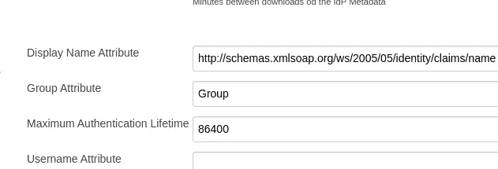

实际上，那都是乡亲。

## 基于角色的安全性

往前一点(将添加另一个关于基于角色的插件配置的帖子)Jenkins 中基于角色的安全性和组的一个例子。

Okta 及其群组中的用户:

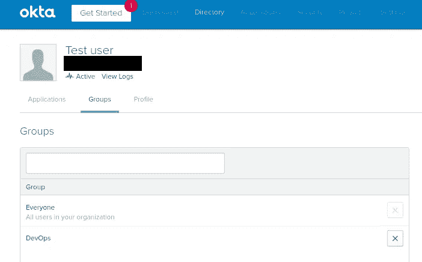

詹金斯的角色:

以及分配有*测试*的组 *DevOps* :

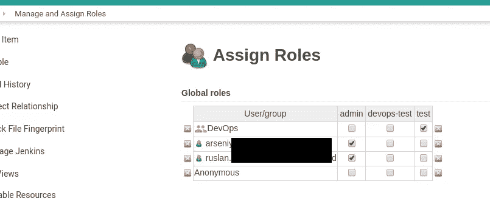

完成了。

## 有用的链接

*   [如何在 Jenkins 中将 OKTA 设置为身份提供者？](https://support.cloudbees.com/hc/en-us/articles/115000105752-How-do-I-setup-OKTA-as-Identity-Provider-in-Jenkins-)
*   [SAML 认证如何工作](https://auth0.com/blog/how-saml-authentication-works/)

*最初发布于* [*RTFM: Linux、DevOps 和系统管理*](https://rtfm.co.ua/en/jenkins-saml-authentication-via-okta-and-users-groups/) *。*