# Jenkins: SAML、Okta、用户组和基于角色的安全插件

> 原文：<https://itnext.io/jenkins-saml-okta-users-groups-and-role-based-security-plugin-4298a1f71a7e?source=collection_archive---------1----------------------->

还是关于 Jenkins 的 Okta 和 SSO 让我们为 Jenkins 配置一个基于角色的安全插件。参见[Jenkins:Okta SSO 和用户组](https://rtfm.co.ua/en/jenkins-saml-authentication-via-okta-and-users-groups/)帖子的第一部分。

总的想法是在 Okta 中定义用户组，当用户登录到 Jenkins 时，Okta 必须通过用户组。

然后，Jenkins 必须根据该用户的组为其分配正确的权限。

## 基于角色的安全插件配置

安装[基于角色的授权策略](https://plugins.jenkins.io/role-strategy)插件本身:

进入*配置全局安全*，将按钮切换到*基于角色的策略*:

进入*管理和分配角色*:

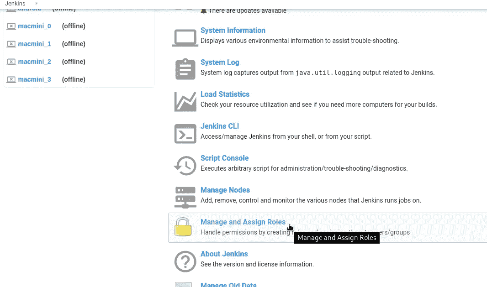

## 创建角色—全局角色

这里的角色分为三个方面:

*   *全局角色*:显然，全局权限的全局角色，如创建/删除视图、作业、总体
*   *项目角色*:基于项目的权限设置——作业受正则表达式限制
*   *代理角色*:詹金斯奴隶/工人/代理权限

如果您现在尝试登录，将会遇到“**缺少整体/读取权限**”错误:

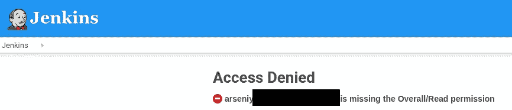

为了避免这种情况，需要创建一个具有*总体读取*权限的全局角色。

转到*管理角色*:

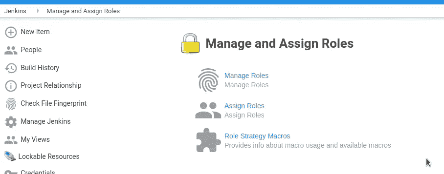

创建一个名为 *read_all* 的新全局角色，并将权限设置为 *Overall — Read* :

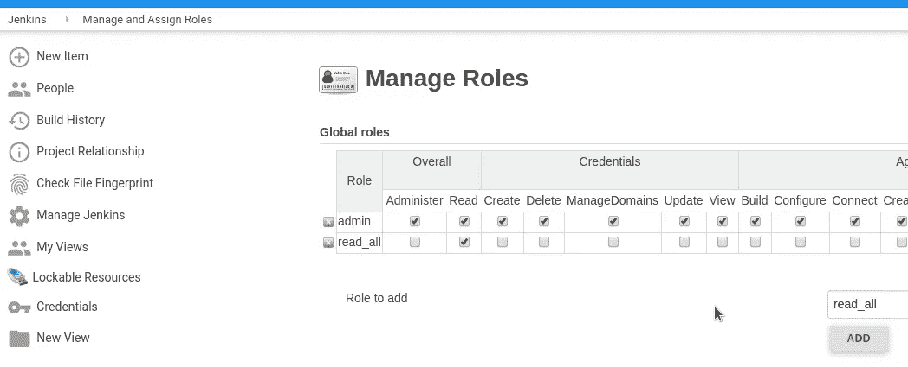

保存。

## 分配角色

例如，让我们来做一个*测试*用户:

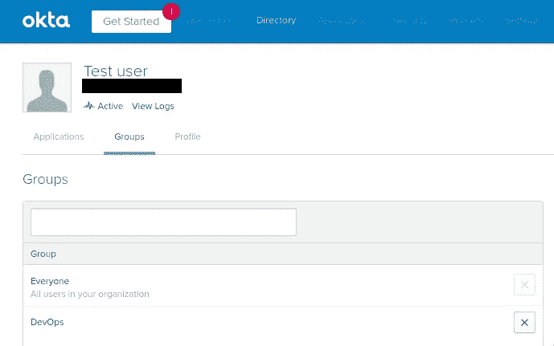

它被分配了两个组——每个人*和开发人员*和开发人员*。*

转到*分配角色*，添加 *Everyone* 组，并将 *read_all* 分配给它:

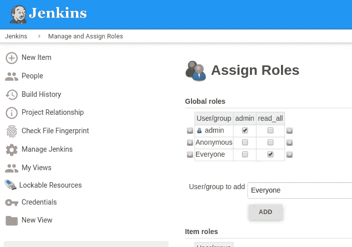

保存并以此用户身份登录:

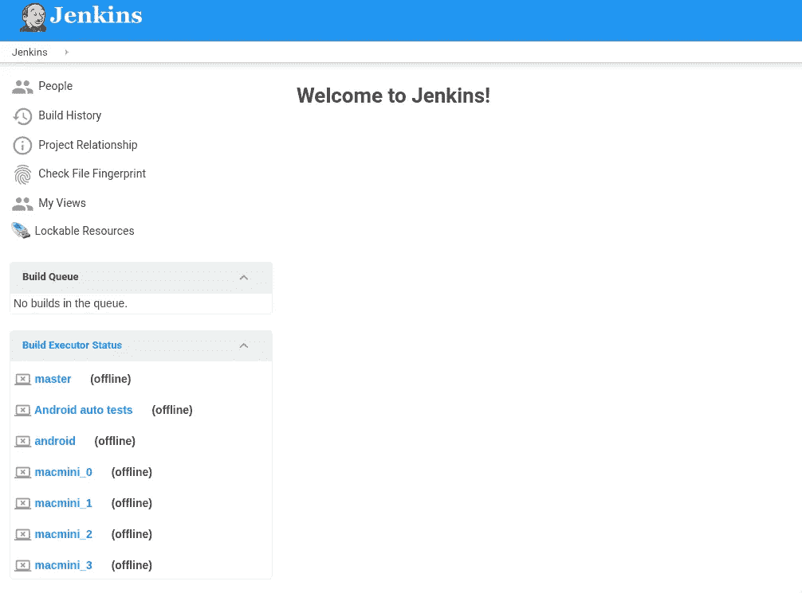

好的—您可以登录，但现在看不到任何作业。

## 项目角色

接下来，需要创建角色来授予对各种作业/视图的访问权限。

例如，我们有一个 *Android* 视图，为我们的 Android 开发人员提供工作:

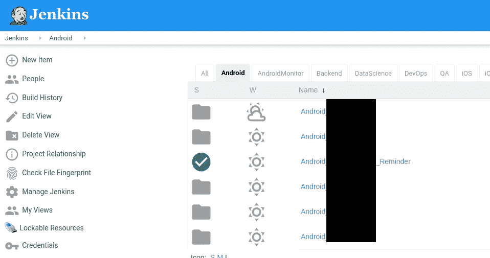

转到*管理角色*，添加一个 *android_developer* 角色，并在*模式*中设置`(?i)android_.*`值——在这里，我们将`(?i)`设置为不区分大小写的搜索，并使用`android_.*`——将选择所有 android 作业:

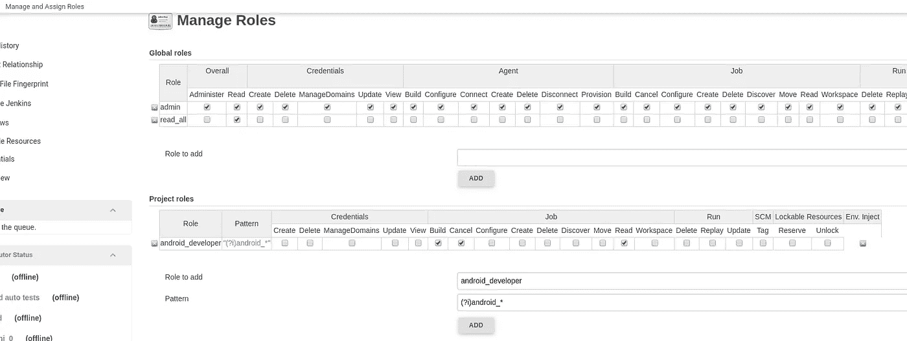

您可以点击一个正则表达式来查看哪些作业将与您在*模式*中设置的过滤器相匹配:

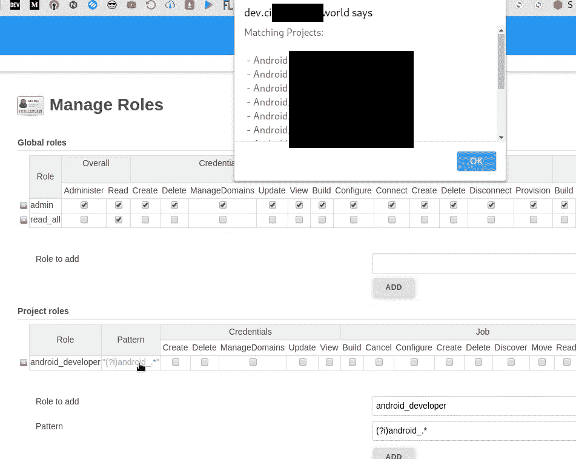

进入*分配角色*，将 *android_developer* 角色附加到 *Android* 组:

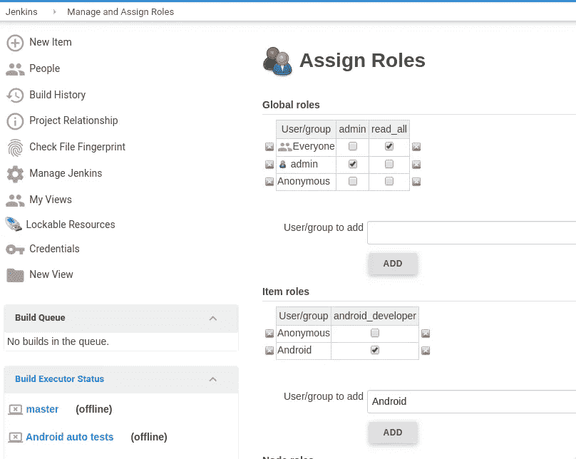

## 奥克塔集团

转到 Okta，将 *Android* 组添加到我们的测试用户:

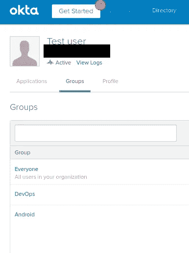

以此用户身份登录:

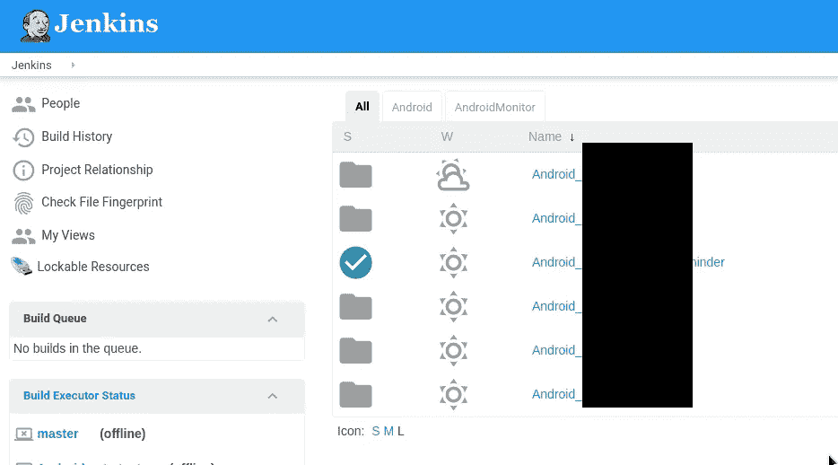

太棒了——我们只能看到 Android 作业和视图。

同样，让我们为 ios 创建另一个角色— *ios_config* ，但这一次—使用*配置*权限:

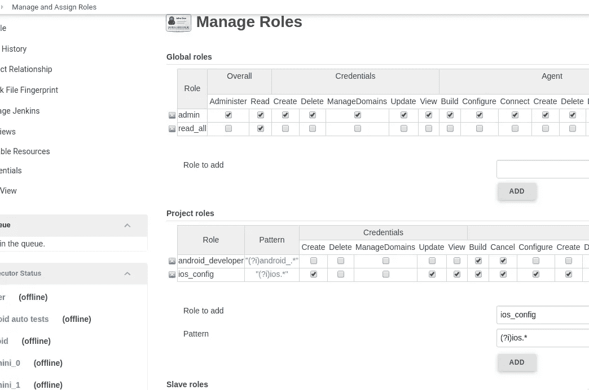

将此角色分配给 *iOS* 组:

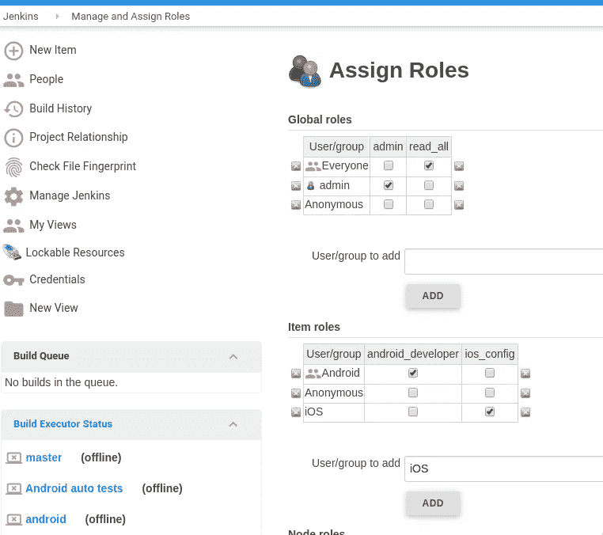

在 Okta 中，将 *iOS* 组连接到*测试用户*:

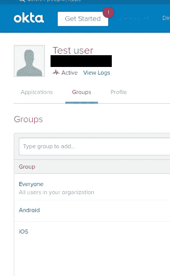

登录后，您将立即看到 iOS 作业:

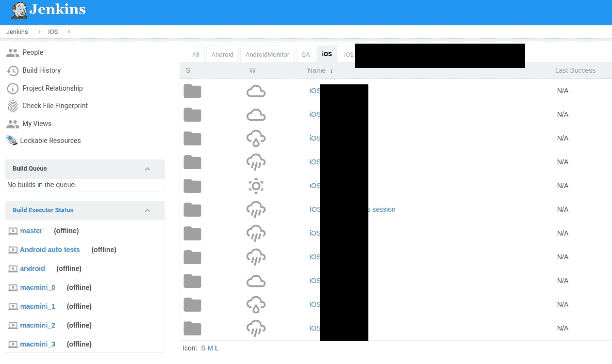

并且*配置*权限正在工作:

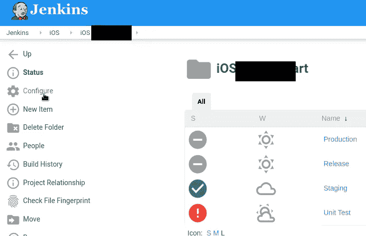

## 支持

您在 Jenkins 中创建的安全领域、组和用户将保存在`config.xml`文件中:

因此，在更改任何 Security Real 设置之前，最好备份该文件。

Готово.

*最初发布于* [*RTFM: Linux、DevOps 和系统管理*](https://rtfm.co.ua/en/jenkins-saml-okta-users-groups-and-role-based-security-plugin/) *。*