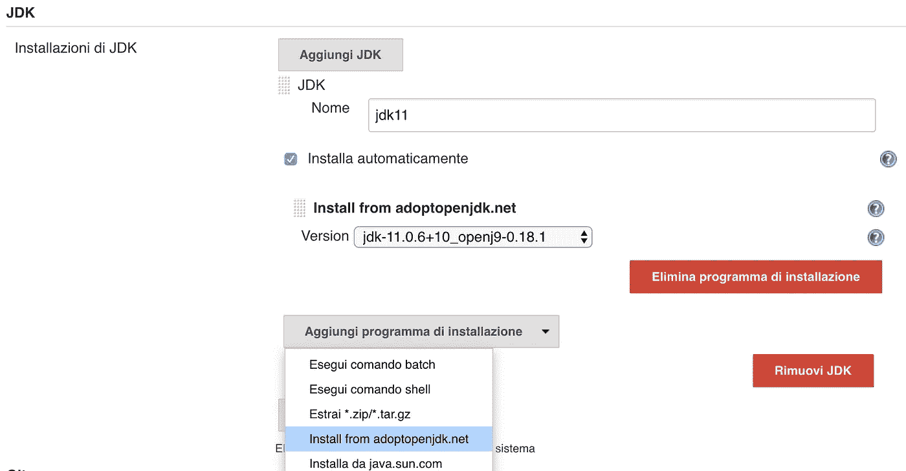
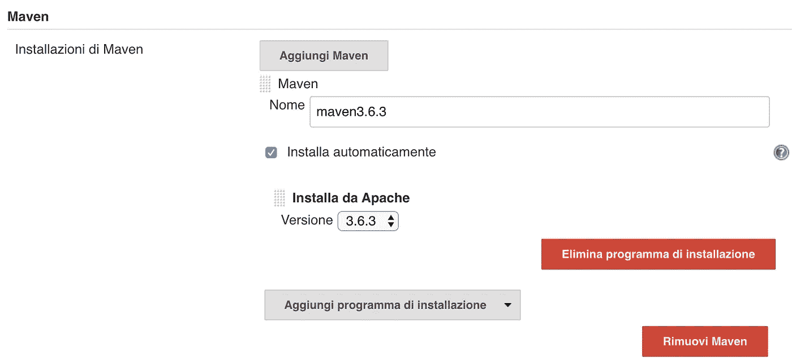
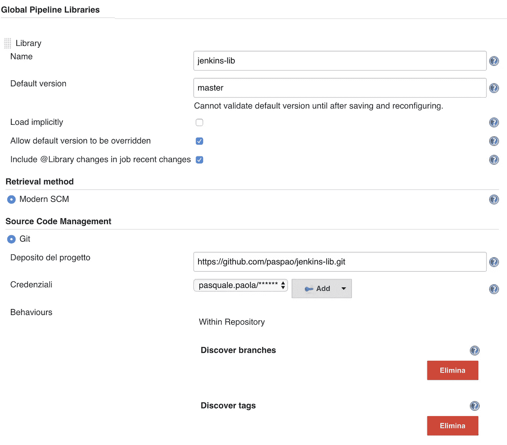
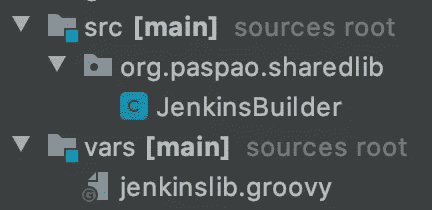

# 詹金斯共享图书馆

> 原文：<https://itnext.io/jenkins-shared-library-f3408ddb3603?source=collection_archive---------5----------------------->


照片由[🇸🇮·扬科·菲利](https://unsplash.com/@itfeelslikefilm?utm_source=medium&utm_medium=referral)在 [Unsplash](https://unsplash.com?utm_source=medium&utm_medium=referral) 上拍摄

IT 界的每个人都知道什么是 CI 及其著名的实现，那就是**詹金斯**。在过去的几年中，DevOps 工程师可以将持续集成链*组织为一个管道，引入一个 **DSL** (领域特定语言)来通过 *Jenkinsfile* 管理它:*

```
pipeline {
    agent any stages {
        stage('Build') {
            steps {
                echo 'Building..'
            }
        }
        stage('Test') {
            steps {
                echo 'Testing..'
            }
        }
        stage('Deploy') {
            steps {
                echo 'Deploying....'
            }
        }
    }
}
```

下面的链接[https://jenkins.io/doc/book/pipeline/jenkinsfile/](https://jenkins.io/doc/book/pipeline/jenkinsfile/)解释了它的语法和特性，但是在这篇文章中，我想用一个实际的例子向你介绍 [Jenkins 共享库](https://jenkins.io/doc/book/pipeline/shared-libraries/)。


如前面的脚本所示，Jenkinsfile 可能变得非常不可读，为了避免这种情况，您可以编写一个库来包装您的作业。让我们从下面的管道开始:

```
pipeline {
    agent any 
    tools {
        jdk 'jdk11'
    }

    stages {
        stage('Checkout') { 
            steps {
                ansiColor('xterm') {
                    checkout scm
                }
            }
        }
        stage('Build') { 
            steps {
                ansiColor('xterm') {
                    withMaven(maven:'maven3.6.3'){
                        sh 'mvn clean package'
                    }
                }
            }
        }

    }
}
```

一个简单的检查和构建已经变得不可读，让我们想想如果你开始添加其他阶段，比如质量或部署步骤，会发生什么。为了简化管道，你可以使用 Jenkins 碎片库，但是让我们从头开始。为了执行前面的管道，您需要在 Jenkins 上安装:

*   JDK11
*   专家
*   [管道 Maven 集成](https://plugins.jenkins.io/pipeline-maven/)

为了安装 JDK11，我还安装了 [AdoptOpenJDK 安装程序](https://plugins.jenkins.io/adoptopenjdk/)，如图所示，现在 Jenkins 可以从 *Global instrument* 部分下载 JDK11(我将标签设置为*‘JDK 11’*)



然后我装了 Maven 3.6.3，贴上了*‘Maven 3 . 6 . 3’*的标签



现在你可以执行前面的管道了…但是我们能不能像下面的代码片段那样用更好的方式写前面的管道呢？

```
@Library('jenkins-lib@1.0.0') _jenkinslib(this, "test")
    .withMavenVersion("maven3.6.3")
    .withJdkVersion("jdk11")
    .execute()
```

是的，我们可以通过詹金斯共享库功能！第一行表示库引用:要引用一个库，您需要通过 Jenkins 全局配置来安装它。通常这个库必须位于 SCM 库，我把我的库放在[这个 github repo](https://github.com/paspao/jenkins-lib/) 上，然后我在 Jenkins 上配置它，命名为*‘Jenkins-lib’*，我还启用了*‘发现标签’*。



现在我可以在 Jenkinsfile 中引用我的库，如**@ Library(' Jenkins-lib @ 1 . 0 . 0 ')**或*@ Library(' Jenkins-lib @ master ')*或简单地通过标签或分支使用特定版本的 *@Library('jenkins-lib')* 。在库符号后面有一个下划线 **_** ，这意味着我们想把所有东西都包含到当前的管道中(否则我们必须放一个特定的*导入*，但这不是我们的情况)。

让我们看看库结构:



我定义了一个 Jenkins 库结构所需要的目录 **vars** ，其中包含一个 groovy 脚本 *jenkinslib.groovy* ，在这个目录中每个。groovy 文件可以被 *Jekinsfile* 引用。在我的例子中，行 *jenkinslib(…)* 是对包含特殊函数*调用(…)* 的 *jenkinslib.groovy* 文件的引用

```
import org.paspao.sharedlib.JenkinsBuilderJenkinsBuilder call(def scriptReference, String projectName) {
    return new JenkinsBuilder(scriptReference,projectName,env['BRANCH_NAME'])
}return this
```

在这个函数中，我简单地用一些初始化参数创建了一个对象 *JenkinsBuilder* ，但是真正的消息是，我正在把我的管道从函数式编程转移到面向对象的编程，这给了管道代码更多的可读性。神奇的是使用 Closure 对象实现的，这个对象(获得 Groovy 定义)*是一个开放的、匿名的代码块，它可以接受参数、返回值并被赋给变量*。