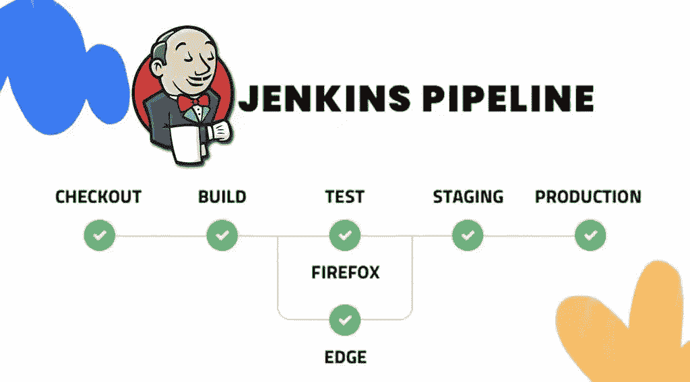

# Jenkins 教程—第 1 部分—管道

> 原文：<https://itnext.io/jenkins-tutorial-part-1-pipelines-bd1397cf5509?source=collection_archive---------3----------------------->

**Jenkins** 是最受欢迎的 CI/CD 平台之一，用于自动化 CI/CD 作业。今天，我打算谈谈詹金斯管道。所以让我们开始吧。

首先，如果您需要在 Kubernetes 上安装 Jenkins stack，请在我的 GitHub 个人资料上关注 [jenkins-stack-kubernetes](https://github.com/ssbostan/jenkins-stack-kubernetes) 。

# 什么是管道？

流水线是一个作业的定义，它有一些分别执行的阶段。每个阶段都有一个步骤部分，其中包括完成该阶段应分别执行的命令。通过管道，我们定义了 Jenkins 应该如何为我们的应用程序完成 CI/CD 流程。可以说，管道运行所有以前由人工运行的进程。

# 脚本管道与声明管道:

Jenkins 支持两种类型的管道定义。
1-用 Groovy 语言编写的脚本管道。2-用 Jenkins DSL 语言编写的声明性管道。
我们打算谈谈更易读、更易学的 Jenkins DSL 语言。此外，在这种 DSL 语言中，我们也可以编写 Groovy 脚本。

# Jenkins 管道语法介绍:

下面是一个基本的管道示例。我们来描述一下。

每个管道都以“管道”开始，每个管道都需要两个强制部分“代理”和“阶段”，它们定义了在哪里运行管道阶段以及应该运行什么来完成管道。每个阶段都应该定义一个唯一的名称，并且它们的“步骤”部分可以包含一个或多个在该阶段中运行的命令。

因此，让我们更深入地描述管道指令…

管道指令:**代理**

该指令指定在何处运行整个管道或特定阶段。

在任何可用的代理上执行管道或特定阶段。

`agent none`用于禁用整个管道的全局代理。相反，我们应该在每个阶段定义代理。这里有一个例子:

`agent label`用于执行整个管道或带有特定标签的节点上的特定阶段。这里有一个例子:

`agent docker`用于执行整个管道或 docker 容器内的特定阶段。这里有一个例子:

上述管道的所有阶段都在 alpine 容器的一个实例中执行。

该指令是一个特殊的 docker 相关指令，用于从项目源代码中的现有 Docker 文件构建 Docker 映像，并在该构建映像的实例中运行整个管道或特定阶段。要使用这个特殊的指令，您应该将 Jenkins 连接到您的源代码库，以便 Jenkins 能够与 Dockerfile 一起获取项目源代码。这里有一个简单的例子:

其他代理存在，但此时此刻，这些描述的代理应该足够了。另一个代理人如 Kubernetes 将在后面描述。

管道指令:**阶段**

`stages`段包含一个或多个`stage`指令。每个阶段都应该有一个唯一的名称。在每个阶段中，我们应该定义包含一个或多个要执行的步骤的`steps`部分。

管道指令:**步骤**

`steps`部分包含一个或多个应该作为该阶段的一项工作来执行的步骤。本节定义了自动化 CI/CD 流程应运行的所有任务。

在下一篇文章中，我将描述可以在`steps`部分运行的基本命令。关注我的个人资料。

关注我的领英[https://www.linkedin.com/in/ssbostan](https://www.linkedin.com/in/ssbostan)