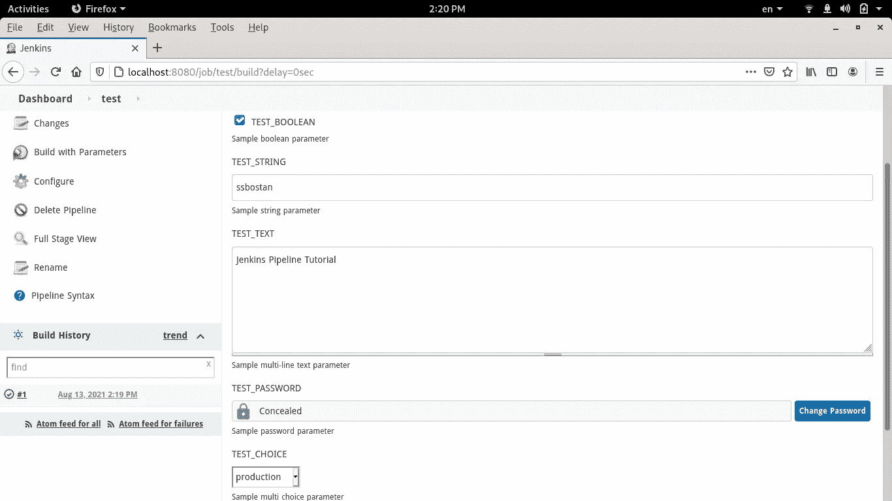

# Jenkins 教程—第 3 部分—参数化管道

> 原文：<https://itnext.io/jenkins-tutorial-part-3-parameterized-pipeline-3898643ac6ad?source=collection_archive---------0----------------------->


在本文中，我将解释如何在 Jenkins 中创建参数化管道。参数化管道允许我们在构建时动态设置所需的参数。在继续阅读之前，如果你还不知道的话，让我们先看看前面的部分。让我们开始吧。

[詹金斯教程—第一部分—管道](/jenkins-tutorial-part-1-pipelines-bd1397cf5509)

[Jenkins 教程—第 2 部分—管道变量](/jenkins-tutorial-part-2-pipeline-variables-5e4783aa2c07)

# 詹金斯管道参数:

可以在管道中定义一组不同的参数。所有这些都应在管道的`parameters`段中定义。

第一次运行管道后，管道菜单中显示**带参数**的构建。从现在开始，当你想要建造的时候，你应该在开始之前设置参数。除了参数定义，您还可以设置它们的默认值。



# 管道参数类型:

Jenkins 支持一系列有用的参数类型。你应该注意到，除了本机参数类型，一些插件可能会添加新的类型。你应该阅读这些插件的文档来了解它们是如何工作的。在这一节中，我将介绍本机参数类型。

**booleanParam** 类型允许您定义布尔参数。您可以为此类型设置默认值。请注意，所有参数都有 description 参数，您可以用它来描述该参数目标的用途。

```
booleanParam(name: "NAME", defaultValue: true, description: "DESCRIPTION")
```

**字符串**类型允许你定义单行字符串。除了 default-value 和 description 之外，它还支持一个额外的参数`trim`来删除输入值两边的空格。

```
string(name: "NAME", defaultValue: "VALUE", trim: false, description: "DESCRIPTION")
```

**文本**允许您定义多行字符串文本。

```
text(name: "NAME", defaultValue: "VALUE", description: "DESCRIPTION")
```

**密码**参数允许您定义构建页面上的密码输入。此类型的值在构建页面和管道控制台上都不显示(隐藏)。

```
password(name: "NAME", defaultValue: "VALUE", description: "DESCRIPTION")
```

**选择**是用一组预定义值定义多选下拉菜单。您可以使用值列表来定义此类型。

```
choice(name: "NAME", choices: ["VALUE1", "VALUE2", "VALUE3"], description: "DESCRIPTION")
```

# 在管道中使用参数值:

可使用**参数**助手访问参数值。除了这种首选方法之外，还可以通过之前的[文章](/jenkins-tutorial-part-2-pipeline-variables-5e4783aa2c07)中描述的环境变量来访问它们。使用`$params.NAME`或`${params.NAME}`语法访问参数值。可以在所有管道阶段中访问参数。

```
echo "Hello $params.NAME"
```

通过使用参数，可以创建动态管线。假设您想要创建一个可以在多种环境下工作的管道，这些环境有不同的配置，或者您想要在构建时提供配置。有了参数化管道，你可以达到这些目标。我们如何做到这一点并制作动态管道将在以后的文章中介绍。

关注我的 LinkedIn[https://www.linkedin.com/in/ssbostan](https://www.linkedin.com/in/ssbostan)