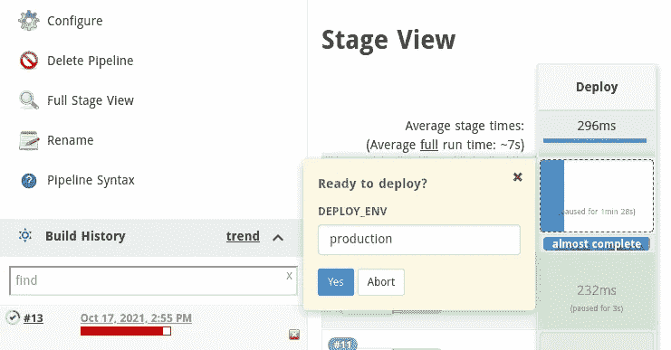

# Jenkins 教程—第 7 部分—交互式管道

> 原文：<https://itnext.io/jenkins-tutorial-part-7-interactive-pipelines-a739b23ac41c?source=collection_archive---------2----------------------->

在 Jenkins 教程的这一部分中，我将讨论一个管道`input`指令，它用于在作业执行期间提示输入。输入指令将导致构建过程暂停，等待直接的人工交互。我们通常将此选项用于 CD、连续交付、管道。如果你没有看之前的文章，我建议你先看看。除了教程的官方 GitHub 库中的一些例子，你还可以看到它们。

 [## GitHub-ssbo stan/Jenkins-教程:完整的 Jenkins CI 教程，参考，牛逼，示例

### 如果你觉得有用，就看星星。Jenkins 系列教程的参考和示例库。版权所有 2021…

github.com](https://github.com/ssbostan/jenkins-tutorial) 

请注意，本教程的所有部分都是在以下定制的 Jenkins 堆栈上实现的。你也可以用它。

 [## GitHub-ssbo stan/jenkins-stack-kubernetes:在 Kubernetes 上部署 Jenkins 的脚本和清单

### 如果你觉得有用，就看星星。在 Kubernetes 上部署 Jenkins containers CI/CD 堆栈的脚本和清单。的…

github.com](https://github.com/ssbostan/jenkins-stack-kubernetes) 

# 为什么以及何时使用输入指令:

正如我前面说过的，输入指令将导致作业暂停，等待直接的人工交互。那么我们为什么需要它呢？在某些情况下，通常在连续交付管道中，我们希望在让它们进入我们的生产环境之前仔细检查一切。在这种情况下，输入指令就是我们需要的东西。input 指令的另一个用途是在构建过程中获取用户值。

您应该注意这个**重要提示**，暂停构建过程将导致 Jenkins 作业执行器处于**忙碌**状态！如果作业执行者的数量有限，就不应该使用 input 指令。我将在以后的文章中解释 Jenkins 云代理，让我们绕过这个限制。

在上面的例子中，显示了输入指令的简单用法。输入指令将在评估工作台的`options`块之后和评估工作台的`agent`和`when`块之前生效。

# 谁可以提交输入:

默认情况下，任何用户都可以提交输入，但是我们可以通过使用 input 指令的 **submitter** 选项来限制提交者。

**提交者**:允许提交该输入的用户或组的逗号分隔列表。默认为任何用户。

**submitterParameter** :如果使用了 submitter 选项，该选项可用于在环境变量中设置提交者用户名。

# 与参数结合的输入:

正如我前面说过的，输入指令的另一个用途是在构建过程中获取用户值。通过使用输入框中的**参数**选项，我们可以要求用户提交值。

要获得更多实际参数，请参见[这篇](/jenkins-tutorial-part-3-parameterized-pipeline-3898643ac6ad)文章。

下面是一个截图示例:

# 管道内的输入步骤:

可以在管道步骤中使用 input 函数来暂停构建或等待用户输入值。输入函数和上面解释的输入指令之间的重要区别是输入函数在`options`、`agent`和`when`块之后执行。

# 最后一句话:

input 指令对于使用云代理的 Jenkins 环境非常有用，我将在以后的文章中介绍云代理。借助 input 指令的强大功能，您可以暂停人工交互的构建过程，或者在构建过程中使用它们来输入值。

关注我的 LinkedIn[https://www.linkedin.com/in/ssbostan](https://www.linkedin.com/in/ssbostan)

如果您觉得本教程有用，请查看下面的资源库:

 [## GitHub-ssbo stan/Jenkins-教程:完整的 Jenkins CI 教程，参考，牛逼，示例

### 如果你觉得有用，就看星星。Jenkins 系列教程的参考和示例库。版权所有 2021…

github.com](https://github.com/ssbostan/jenkins-tutorial)