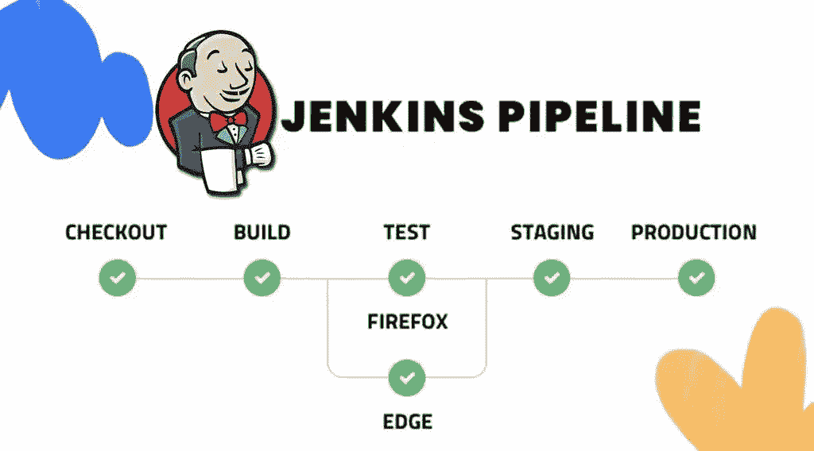

# Jenkins 教程—第 9 部分—基本流水线步骤

> 原文：<https://itnext.io/jenkins-tutorial-part-9-basic-pipeline-steps-eeb1b9ed79f8?source=collection_archive---------1----------------------->



没有步骤和命令，活在管道中是无法完成的。Jenkins[**workflow-basic-steps**](https://plugins.jenkins.io/workflow-basic-steps)插件提供了几个常用的编写管道的步骤/命令。在完整的 Jenkins 教程的这一部分中，我们将深入讨论插件提供的命令。你应该注意到大量的 Jenkins 插件可能会添加一些步骤和命令。所有这些步骤都可以在下面的 Jenkins 堆栈中找到，并将在以后的文章中解释。

[](https://github.com/ssbostan/jenkins-stack-kubernetes) [## GitHub-ssbo stan/jenkins-stack-kubernetes:在…上部署完整的 Jenkins 的脚本和清单

### 如果你觉得有用，就看星星。在 Kubernetes 上部署 Jenkins containers CI/CD 堆栈的脚本和清单。的…

github.com](https://github.com/ssbostan/jenkins-stack-kubernetes) 

# Jenkins 基本流水线步骤:

以下命令可用于流水线的`**steps**`块。除了步骤块，这些命令也可用于`**post**`块的所有条件块。

`**echo**`用于**打印信息**。除了可以用来调用方法的方式之外，下面的代码还显示了 echo 方法。

`**dir**`用于改变当前工作目录。dir 块中存在的任何代码都在该目录中执行。

`**pwd**`用于返回当前工作目录。它接受一个名为 **tmp** 的布尔参数，该参数返回作业工作区的一个临时目录，一个用于存储临时文件的特殊目录。

`**isUnix**`如果正在运行的代理是类似 Unix 的机器(Linux、macOS 等),则返回 True。)如果运行的代理是 Windows，则为 False。

如果给定的文件存在，返回 True。

`**readFile**`读取文件并返回其内容。它还接受一个名为 encoding 的可选参数，用指定的编码算法对文件内容进行编码。编码可用于读取二进制文件。

`**writeFile**`将内容写入给定文件。如果指定了可选参数 encoding，则解码内容，并将解码后的内容写入文件。

`**deleteDir**`删除当前目录，通常是工作空间。它会删除活动路径中的所有文件和子目录。如果你想删除特定的目录，你应该首先 **dir()** 到它并使用 **deleteDir()** 在它的块里面。**删除目录**命令通常用于 post 阶段。

`**catchError**`捕捉错误并继续流水线。流水线的默认行为是，如果在每个步骤中出现任何错误，则整个流水线都会失败。在大多数情况下，您需要继续管道来运行一些命令、发送通知等。catchError 用于实现这一功能。

```
catchError(
    stageResult: "SUCCESS",
    buildResult: "FAILURE",
    catchInterruptions: true,
    message: "Error"
) {
    // your pipeline codes.
}
```

catchInterruptions 用于捕获管道中断，如手动中止管道。默认情况下，如果在管道位于 catchError 块中时中止管道，管道不会中止，其他步骤也将运行。要防止这种行为，请将该参数设置为 false。

`**warnError**`类似于 catchError，但是如果在其块内运行管道时出现任何错误，它会将 stageResult 和 buildResult 设置为不稳定状态。

```
warnError(
    catchInterruptions: true,
    message: "Unstable build message"
) {
    // your pipeline codes.
}
```

`**mail**`用于在管道内部发送邮件。

```
mail(
    subject: "Subject",
    body: "Body",
    from: "jenkins@localhost",
    to: "ssbostan@yahoo.com"
)
```

请注意，您应该在 Jenkins 机器上有一个 SMTP 服务器或一个端口转发器，以便向外部 SMTP 服务器发送请求。

`**unstable**`将阶段结果设置为不稳定。

```
unstable(message: "Your stage is unstable!")
```

`**timeout**`用于设置在其块内执行的命令的执行时间限制。例如，您想运行一个命令来检查“服务可用性、健康检查等”它应该在 30 秒内做出响应。在这种情况下，您必须使用超时命令。该命令的默认单位是分钟，可以更改为纳秒、微秒、毫秒、秒、分钟、小时、天。除了传统的超时方案，它还支持基于活动的超时。通过将 activity 参数设置为 true，可以启用基于活动的方案。

```
timeout(
    time: 15,
    unit: "SECONDS",
    activity: true
) {
    // your pipeline codes.
}
```

如果超时，管道将以中止状态终止。您可以使用 catchError 或 warnError 来捕获它。

`**sleep**`暂停管道指定的时间。默认单位是秒，可以像 timeout 命令一样更改。

```
sleep(10)
sleep(time: 1, unit: "MINUTES")
```

`**retry**`如果在其主体执行期间发生任何异常，重试其主体(最多 N 次)。如果最后一次尝试返回异常，它将以失败状态退出。例如，您想在运行应用程序测试之前检查您的数据库。在这种情况下，您需要类似下面的管道。

# 最后的话:

关于 Jenkins 和 Jenkins 管道，我们有很多东西要学，因为它有很多插件，可以添加各种命令、函数、类等。我将在下一篇文章中解释更多关于 Jenkins、管道指令和命令以及插件的内容。你可以在下面的 GitHub 资源库中找到以前的。祝你好运。

关注我的 LinkedIn[https://www.linkedin.com/in/ssbostan](https://www.linkedin.com/in/ssbostan)

[](https://github.com/ssbostan/jenkins-tutorial) [## GitHub-ssbo stan/jenkins-tutorial:完整的 Jenkins 教程，参考，牛逼，示例

### 如果你觉得有用，就看星星。Jenkins 系列教程的参考和示例库。版权所有 2021…

github.com](https://github.com/ssbostan/jenkins-tutorial)