# 詹金斯-X Istio 弗拉格加那利部署

> 原文：<https://itnext.io/jenkins-x-istio-flagger-canary-deployment-9d5e187c2334?source=collection_archive---------2----------------------->

## 我们使用 Jenkins X 的方式将金丝雀部署到 Kubernetes 集群中

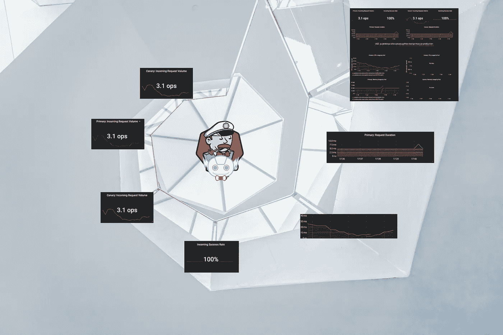

[https://unsplash.com/photos/4NZlogMPIp0](https://unsplash.com/photos/4NZlogMPIp0)

## 部件

1.  [用 GitlabCI+GitOps/人工进近展开金丝雀](https://medium.com/@wuestkamp/kubernetes-canary-deployment-1-gitlab-ci-518f9fdaa7ed?)
2.  [金丝雀部署与阿尔戈推出](https://codeburst.io/kubernetes-canary-deployment-2-argo-rollouts-5e68e99b4fa3?source=friends_link&sk=58557d4fa81ff77382e59e1258c06d61)
3.  [使用 Istio 进行金丝雀部署](/kubernetes-istio-canary-deployment-5ecfd7920e1c?source=friends_link&sk=2be48393ac175a2199bf5d486cb91acf)
4.  (本文)

# 我们在这里做什么？

我们将逐步创建一个 Jenkins X k8s 集群和一个 Python 测试应用程序。您可以跟随或只是阅读，查看图像和结果，了解 JenkinsX+Flagger+Istio Canary 部署工作流，并决定是否值得深入研究。

## 金丝雀部署

[请务必阅读第 1 部分](https://medium.com/@wuestkamp/kubernetes-canary-deployment-1-gitlab-ci-518f9fdaa7ed?source=friends_link&sk=4f3b424099f4f973f634bda75e397254)，其中我们简要解释了什么是金丝雀部署。在那里，我们还展示了如何使用普通的 Kubernetes 资源来实现它们。

## 詹金斯 X

这篇文章假设你已经对 Jenkins X 有所了解，否则你可以在这里做。

## 伊斯迪奥

本文假设您已经知道 Istio 是什么。如果你还不知道，你可以[看看这个](/kubernetes-istio-simply-visually-explained-58a7d158b83f?source=friends_link&sk=378ed718d2d6cfd09e6d23c7616cba81)。为了更好地理解，您还应该阅读第 3 部分,其中我们使用了简单的 Istio 进行 Canary 部署。

## 野生鸢尾花

> Flagger 是一家 Kubernetes 运营商，使用 Istio、Linkerd、App Mesh、NGINX、Contour 或 Gloo 路由实现流量转移，并使用 Prometheus metrics 进行金丝雀分析，从而自动推广金丝雀部署。canary 分析可以用 webhooks 扩展，用于运行验收测试、负载测试或任何其他定制验证。([来源](https://github.com/weaveworks/flagger))

# 创建测试基础设施和应用程序

我们将使用 Jenkins X 命令行工具`jx`创建一个 Kubernetes 集群、Github 存储库和一个 quickstart 应用程序。这对于快速原型制作非常有用。

## 詹金斯 X k8s 星团

首先我们创建一个 Jenkins X 集群，这里我们使用 Gcloud:

```
jx create cluster gke -n jenkinsx --machine-type n1-standard-4
```

你应该选择“无服务器 Jenkins X Pipelines with Tekton”类型，用你的 Github 账户连接所有东西。这将自动为登台和生产环境创建两个 Github 存储库。

接下来，我们安装一些插件:

```
jx create addon istio
jx create addon flagger
jx create addon prometheus
```

如果您遇到 Istio 不工作的问题(我在 Prometheus 中丢失了`istio_requests_total`指标),那么您可以手动安装 Istio:

```
istioctl manifest generate --set values.kiali.enabled=true --set values.tracing.enabled=true --set values.grafana.enabled=true --set values.prometheus.enabled=true > istio.yamlkubectl -f istio.yaml install
```

通过`jx`安装的 Flagger 将自动启用命名空间`jx-production`中的 Istio 边车注入。为了证实这一点:

```
kubectl get ns -L istio-injection
```

将标签`istio-injection: enabled`添加到任何应该注入 Istio sidecar 的名称空间。

## 测试应用程序/快速入门

现在等待命名空间`kube-system`中的`jxing-nginx-ingress-controller`分配一个外部 IP。然后创建一个简单的 python 应用程序:

```
jx create quickstart --project-name python-test
```

选择`python-http`作为类型。但是您可以选择任何内容，因为 Canary 部署适用于每种类型。尽管它应该提供简单的 HTTP 端点用于测试。

Jenkins X 会自动为应用程序创建 Github 存储库。

我修改了生成的`app.py`中的`do_GET`方法，以便返回文本而不是图像:

```
def do_GET(self):
  self.send_response(200)
  self.send_header('Content-type','text/html')
  self.end_headers()
  # Send the html message
  output = 'v1'
  self.wfile.write(output.encode('utf-8'))
  return
```

## 环境

Jenkins X 将默认创建三个环境(`jx get env`):

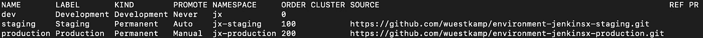

环境有自己的 Git 存储库，其中的一切都是通过 GitOps 配置的。环境实际上被配置为舵图，并通过一个`requirements.yaml`引用安装在其中的所有应用程序+版本。

# 初始部署

当创建新的快速启动应用程序或导入现有应用程序(`jx import`)时，它将在暂存环境中作为版本`0.0.1`发布。这是因为对于分段环境，PROMOTE 设置为 Auto。我们可以将此视为 Jenkins X 自动创建和合并的暂存存储库上的拉请求。我们可以看到所有渠道活动都在进行:

```
jx get activities -w
```

管道成功后，我们可以检查可用的应用程序:

```
jx get applications
```


Jenkins X 自动与 Semver 版本控制一起工作

目前，我们看到版本`0.0.1`已经部署到 staging，还没有投入生产。我们可以通过以下内容来证实这一点:

```
kubectl -n jx-staging get all       # shows the app
kubectl -n jx-production get all    # shows nothing
```

我们应该能够通过提供的 URL 打开访问分期应用程序:

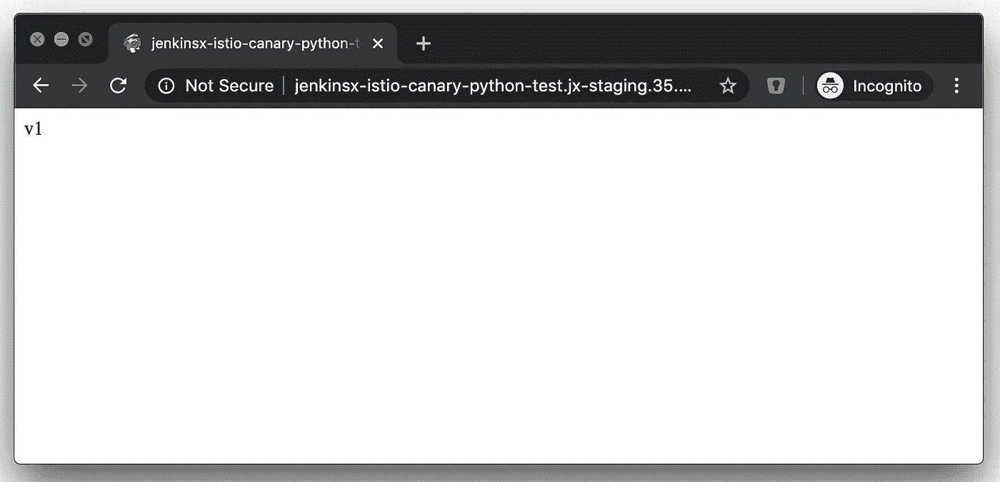

## 提升到生产

(在投入生产之前，我引入了另一个变化，将版本推到了`0.0.2`)

提升到生产环境，其中“提升”可视为“部署”。通过`jx get env`我们可以看到生产需要人工提升，所以我们做:

```
jx promote --version 0.0.2 --env production
```

这将在 Jenkins X production Github 存储库中自动创建一个 Pull 请求。现在`jx get applications`将展示 0.0.2 版本的筹备和生产:

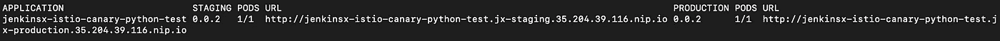

我们还可以通过手动更改生产环境的 repo 中的`requirements.yaml`文件来升级到生产环境。

# 为生产环境启用 Canary

目前，生产或准备阶段的部署不是使用 Canary 完成的，而是通过 Kubernetes 滚动部署完成的。

在我们的 Python 测试应用程序 repo 中，Jenkins X 自动创建了舵图。如果我们打开文件`charts/APP_NAME/values.yaml`,我们可以看到各种 Flagger 金丝雀选项:

```
*# Canary deployments
# If enabled, Istio and Flagger need to be installed in the cluster* **canary:
  enabled:** false
  **progressDeadlineSeconds:** 60
  **canaryAnalysis:
    interval:** "1m"
    **threshold:** 5
    **maxWeight:** 60
    **stepWeight:** 20
    *# WARNING: Canary deployments will fail and rollback if there is no traffic that will generate the below specified metrics.* **metrics:
      requestSuccessRate:
        threshold:** 99
        **interval:** "1m"
      **requestDuration:
        threshold:** 1000
        **interval:** "1m"
  *# The host is using Istio Gateway and is currently not auto-generated
  # Please overwrite the `canary.host` in `values.yaml` in each environment repository (e.g., staging, production)* **host:** acme.com
```

使用上述设置，一个成功的 Canary 部署将需要大约 3 分钟，每个步骤 1 分钟:20%，40%，60%。

尽管默认情况下金丝雀通过`canary: enabled: false`被禁用。

我们可以在每个 Jenkins X 环境中覆盖这些值，我在生产报告`environment-jenkinsx-production.`中就是这么做的。覆盖 Python 应用程序的值是可行的，因为环境存储库本身就是掌舵图，并通过`requirements.yaml`引用所有部署的应用程序。我在回购`environment-jenkinsx-production`中的`env/values.yaml`中添加了以下内容:

```
**...**
**jenkinsx-istio-canary-python-test:**
  **canary:**
    **enabled:** true
    **host:** jenkinsx-istio-canary-python-test.35.204.67.7.nip.io
```

*   域`xxx.IP_ADDRESS.nip.io`将简单地重定向到 IP_ADDRESS。非常适合简单的域名测试
*   `host:`将是 Istio 主机名，通过它可以接受请求。使用`kubectl -n istio-system get svc`查找您的 Istio 网关外部 IP 地址。您需要确保在`host:`下指定的域名重定向到 Istio 网关外部 IP。

在生产环境 repo 中进行更改将自动触发 Jenkins X 中的构建，请检查:`jx get activity`

等到所有活动都成功。我们现在应该看到自动创建的 Istio VirtualService 和 Gateway:

```
kubectl -n jx-production get virtualservices.networking.istio.io,gateways.networking.istio.io
```

> 请注意，第一次升级时，它不会像金丝雀一样工作，因为它需要与以前的版本数据进行比较，但从第二次升级开始，它将会工作。([来源](https://jenkins-x.io/docs/managing-jx/tutorials/progressive-delivery/))

我们现在应该能够在指定的主机`jenkinsx-istio-canary-python-test.35.204.67.7.nip.io`上通过 Istio 访问我们的生产应用程序:

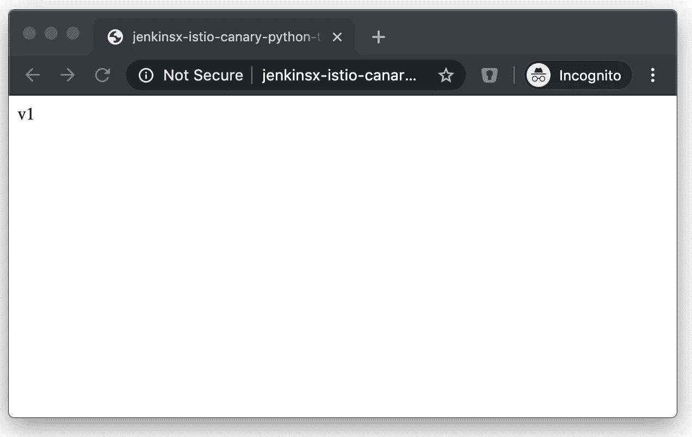

# 打开 Flagger Grafana 仪表板

Flagger 将在`istio-system`名称空间中安装 Grafana，因此我们可以:

```
kubectl port-forward -n istio-system service/flagger-grafana 3000:80
# admin:admin
```

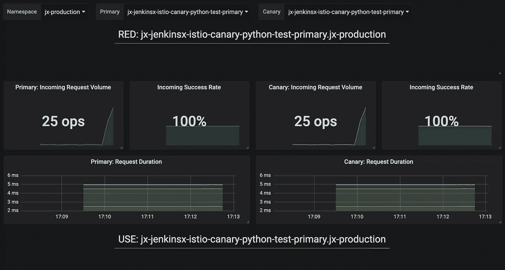

Flagger 配有 Grafana 和仪表板

在 Grafana 中，转到 Istio 仪表板并输入:

*   命名空间:`jx-production`
*   主要:`jx-jenkinsx-istio-canary-python-test-primary`
*   金丝雀:`jx-jenkinsx-istio-canary-python-test-canary`

primary 和 canary 是服务的名称。这些是在部署期间启用 Canary 时自动创建的。

如果您缺少`istio_requests_total`指标，请确保 Istio 安装正确，可以手动安装，而不是通过`jx`安装。

# Flagger Canary 工作流程和分析

在 Python 应用程序的掌舵图中，我们有多个可以配置的设置([查看此处](https://docs.flagger.app/usage/progressive-delivery)了解大多数设置的解释):

```
**canary:
  enabled:** false # false, but we set to true in prod env git repo
  **progressDeadlineSeconds:** 60
  **canaryAnalysis:
    interval:** "1m"
    **threshold:** 5
    **maxWeight:** 60
    **stepWeight:** 20
    *# WARNING: Canary deployments will fail and rollback if there is no traffic that will generate the below specified metrics.* **metrics:
      requestSuccessRate:
        threshold:** 99
        **interval:** "1m"
      **requestDuration:
        threshold:** 1000
        **interval:** "1m"
```

我们应该根据金丝雀的应用需求来调整这些。Flagger 将执行自动指标分析，并且只有在满足要求的情况下才会继续部署。

要查看 Canary 部署的当前状态，请查看 Flagger 资源:

```
kubectl -n jx-production get canaries.flagger.app
```

# 执行金丝雀部署

## 部署变更

现在我们修改应用程序`app.py`来返回不同的 GET 请求文本。在 app repo 中为 master 创建一个 Pull 请求并将其合并。Jenkins X 会自动将其部署到暂存区。

现在，将其手动升级到生产环境，拷贝正在登台运行的版本号。我现在是 0.0.6，因为我在这之间做了一些改变。

```
jx promote --version 0.0.6 --env production
```

监控金丝雀状态:

```
kubectl -n jx-production get events --field-selector involvedObject.kind=Canary --sort-by='{.lastTimestamp}'
```

## 金丝雀从重量 20%开始

```
2m39s       Normal    Synced   Canary   Advance jx-jenkinsx-istio-canary-python-test.jx-production canary **weight 20**
```

我们将生产 Istio 端点置于 while 循环中，这导致 20%的请求到达新版本:

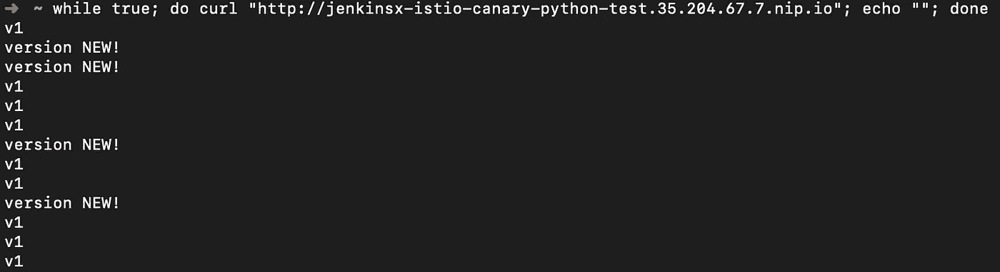

## 金丝雀失败(没有足够的流量)

我们需要确保足够的流量到达端点，否则 Flagger 的 Canary 分析将失败，并启动回滚:

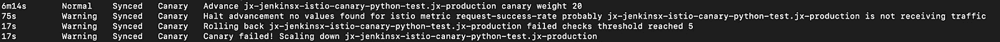

如果没有满足定义的需求，Canary 也会失败。

## 金丝雀重量 40%

如果有足够多的成功流量点击应用程序，Flagger 将提高到 40%:

```
108s        Normal    Synced   Canary   Advance jx-jenkinsx-istio-canary-python-test.jx-production canary **weight 40**
```

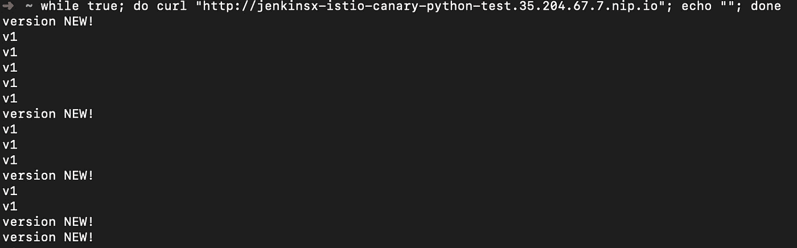

## 金丝雀体重 60%

如果有足够多的成功流量点击应用程序，Flagger 将提高到 60%:

```
60s         Normal    Synced   Canary   Advance jx-jenkinsx-istio-canary-python-test.jx-production canary **weight 60**
```

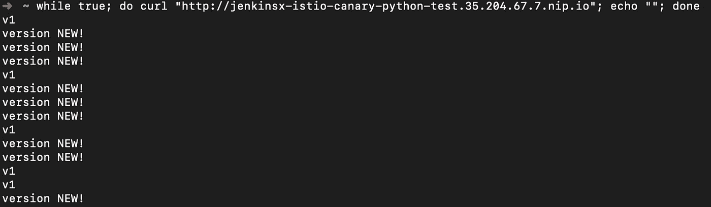

## 金丝雀的成功

```
25s         Normal    Synced   Canary   Routing all traffic to primary
```

所有请求都命中新版本:

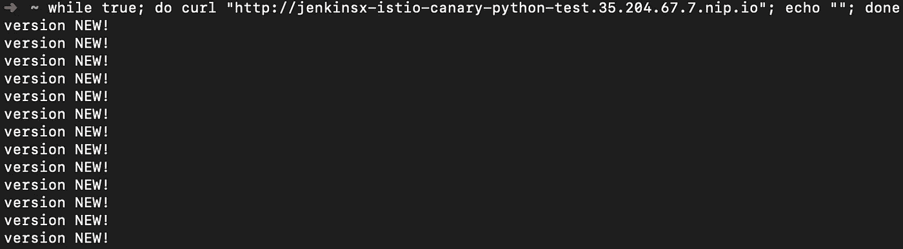

# 概述

Jenkins X 可以相对容易地配置为与 Istio 和 Flagger 一起运行，用于 Canary 部署。我在通过`jx create addon istio`安装 Istio 时遇到了问题，不得不手动安装。

我没有使用过 Flagger 配置，但是使用默认配置似乎很好。我认为，一旦人们对 Jenkins X 及其提议的工作流程有了更多的了解，就会减少大量的手工或重复性工作。

同样，如果没有 Jenkins X，我认为 Flagger 和 Istio 对于 Canary 部署来说是一个强大的组合，我可能很快就会自己探索它。

# 更多/来源

[https://Jenkins-x . io/docs/managing-JX/tutorials/progressive-delivery](https://jenkins-x.io/docs/managing-jx/tutorials/progressive-delivery/)

https://docs.flagger.app/usage/progressive-delivery

# 成为 Kubernetes 认证

[](https://killer.sh)

[https://killer.sh](https://killer.sh)