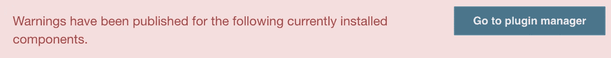
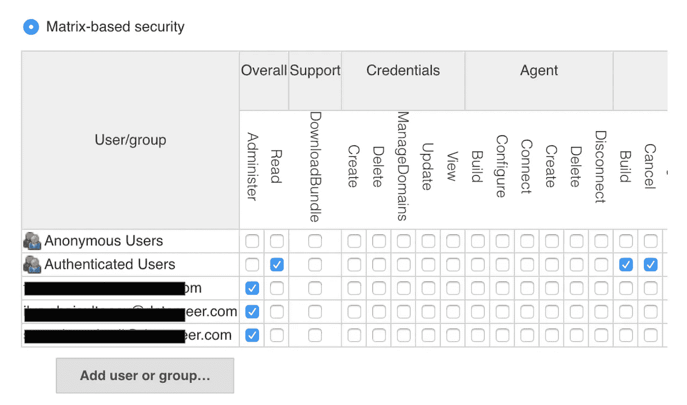
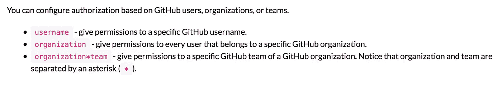

# Jenkins X —管理 Jenkins

> 原文：<https://itnext.io/jenkins-x-managing-jenkins-926f0e0f8bcf?source=collection_archive---------4----------------------->


欢迎回到我关于 Jenkins X 的迷你系列。在上一篇文章中，我讨论了如何在预览环境中启用 TLS。这一次我们将讨论 Jenkins 服务器，以及我们如何在 [Datameer](https://www.datameer.com/) 管理作业和配置的变更和更新。

我承认，写这篇文章花了我太多的时间。主要是因为它有太多的方面和角度，我无法决定正确的结构，经常交换出大量的信息，但半小时后又交换回来。你甚至会发现应用这篇文章中的观点比实际阅读它们要快。

> 还是那句话，没有鸡没有蛋…

我决定采用以下结构，尽量让每个部分都是可选的，让你挑选最适合自己的部分:

1.  **创建 Jenkins 映像**
    本节将向您展示如何创建一个定制的 docker 映像，并将其集成到您当前的 Jenkins X 版本中。
2.  ***奖励部分:*我们如何安全地更新 Jenkins X**
    正如标题所示，这提供了一种无压力的方法来更新和升级 Jenkins X 平台。
3.  **持久插件**
    在这里，我将讨论跨 pod 重启持久化我们的插件更新。
4.  **OAuth for Jenkins(手动)**
    本节将向您展示如何使用 GitHub 或 Google 为 Jenkins 启用 OAuth。我还将探索“基于矩阵的安全性”,以便对用户权限进行更好的控制。
5.  **OAuth for Jenkins(自动)**
    同上，但在 pod 重新启动后仍然存在。
6.  **持续工作**
    我将介绍一种持续工作的方法。

# 1.创造詹金斯形象

Jenkins X 平台已经自带了自己的 [Jenkins docker image](https://github.com/jenkins-x/jenkins-x-image) 和一套很好的插件来帮助你入门。然而，插件是嵌入到映像中的，这意味着它们和映像本身一样古老。



谁没见过这个？

这也意味着，如果 pod 出于任何原因需要重新启动，在活动系统上所做的任何更改都将丢失。这包括:

*   任何插件更新
*   任何附加插件
*   詹金斯的配置有什么变化吗

在这种情况下，我们需要一种方法来保持所有的变化。默认的 Jenkins 映像已经安装了 JCASC 插件,所以这似乎是一个很好的开始。然而，虽然这个插件在后面会有用，我们决定不使用它来添加额外的插件，因为 JCasC 插件是在启动时安装/更新的，这意味着 pod 重新启动的次数会大大增加。

相反，我们决定创造自己的形象。为了让你开始，在 Jenkins X 网站上有一些关于创建自定义图像的信息[。](https://jenkins-x.io/getting-started/config/#jenkins-image)

我的犯罪搭档伊利亚·沙伊斯尔塔诺夫(Ilya Shaisultanov)随后拿出一个詹金斯文件来创建自定义的詹金斯图像。虽然我不能提供完整的文件，但基本上是这样的。

给定一个版本化方案`<upstream-version>-<inhouse-version>`:

*   从
    [https://api.github.com/repos/jenkins-x/jenkins-x-image/tags](https://api.github.com/repos/jenkins-x/jenkins-x-image/tags)获取最新上游版本
*   从我们自己的库获取最新的定制版本:
    `gcloud container images list-tags $DOCKER_IMAGE — format json`
*   确定我们是否需要构建一个新版本
*   如有必要，构建并发布

最初的 docker 文件如下所示:

```
FROM jenkinsxio/jenkinsx:REPLACE_UPSTREAM_VERSIONCOPY plugins.txt /usr/share/jenkins/ref/custom-plugins.txtRUN /usr/local/bin/install-plugins.sh < /usr/share/jenkins/ref/custom-plugins.txt
```

根据 Jenkins X 文档,`plugins.txt`可以包含您希望以下列形式安装的任何附加自定义插件:

```
<plugin-name>:<plugin-version>
```

因此，我们只剩下以下使用 skaffold.yaml 构建 docker 映像的文件:

```
├── Dockerfile         # docker image to build
├── plugins.txt        # any extra plugins to include
└── skaffold.yaml      # skaffold to build and push the image
```

几分钟后，我们有了我们的图像:`my-reg/my-company/jenkins-x-image:0.0.70–1`

为了把这个图像添加到你的詹金斯 X 版本中，我们需要通过把它添加到我们的`myvalues.yaml`中来覆盖默认的舵图表值。这将看起来像:

现在我们已经有了映像，我们需要刷新 Jenkins X 版本。这将在下一节中讨论。

# **我们如何安全刷新詹金斯 X**

打电话给`jx upgrade platform`可能是一项艰巨的任务。

尤其是像我一样，有多个配置不同的集群。我从来不确定`jx`二进制文件会在本地`~/.jx/`目录中找到什么。

以下是你可以采取的一些措施，以最大限度地降低出错的几率:

*   确保您的当前目录包含正确的`myvalues.yaml`
*   创建一个临时目录并运行`export JX_HOME=${JX_TEMP_DIR}`
*   用
    `jx step helm list | grep jenkins-x`找到平台当前发布的版本
*   用当前发布的版本更新，有效地用您新创建的值文件刷新平台:
    `jx upgrade platform --batch-mode --verbose --version ${JX_VERSION} --always-upgrade`

> **注意:**需要`--always-upgrade`选项来强制升级过程

这里有一个小脚本可以做到这一点:

运行脚本并更新平台后，您应该可以使用您的映像看到 Jenkins 部署:

```
$ kubectl get deployments.apps jenkins \
  -oyaml -o'jsonpath={ .spec.template.spec.containers[0].image }my-reg/my-company/jenkins-x-image:0.0.70–1 
```

在下一节中，我们将讨论如何填充`plugins.txt`。

# 持久插件

根据 Jenkins X 文档,`plugins.txt`可以包含你想要安装的任何额外的定制插件。这让我想到…

> "为什么不让它包含所有我的插件？"

在**脚本控制台**页面(`http://JENKINS_URL/script`)运行一个小脚本就可以实现列出所有插件及其各自的版本。在 jenkinsci/docker GitHub 页面上提到了另一种获得插件的方法[，但是我更喜欢这种方式。](https://github.com/jenkinsci/docker#plugin-version-format)

我们的控制台脚本如下所示:

```
Jenkins.instance.pluginManager.plugins.stream().sorted().collect(java.util.stream.Collectors.toList()).each { plugin -> 
    println ("${plugin.getShortName()}:${plugin.getVersion()}")
}
x=""
```

> **注 1:** 结尾的`x=""`是为了避免 groovy 在结尾打印结果而做的一点小改动。抛开它，明白我的意思。
> **注 2:** 插件列表已经排序，使得 git diffs 更容易阅读。

这也可以使用以下脚本自动完成:

列出远程服务器的 Jenkins 插件的脚本

我们现在可以用来自 Jenkins 服务器的所有实际插件来更新`plugins.txt`了。

> **注意:**更新 UI 中插件的实际过程仍然是手动的。
> 
> 然而，在我看来，这是正确的，因为这应该是詹金斯管理员有意识的决定。但是，例如，如果您有一个临时服务器，您总是可以首先更新临时服务器上的插件，测试它们，然后使用临时服务器来提供新映像的列表，以便在生产中使用。

让我们测试一下新的`plugins.txt`，好吗:

*   通过 UI 更新你的 Jenkins 插件，也许添加一个新的插件
*   使用`refresh-plugins.sh`更新您的`plugins.txt`
*   建立新的码头工人形象
*   用新的图像版本更新`myvalues.yaml`
*   使用`refresh-jx-platform.sh`更新您的 Jenkins X 版本
*   重启詹金斯吊舱按:
    `kubectl scale deployment jenkins --replicas 0`
    `kubectl scale deployment jenkins --replicas 1`

> 成功！我的插件是最新的！

所以在添加了刷新脚本和`myvalues.yaml`之后，我们现在有了以下文件:

```
├── my-jenkins-image
│   ├── Dockerfile
│   ├── plugins.txt
│   ├── refresh-plugins.sh
│   └── skaffold.yaml
└── my-jx-platform
    ├── myvalues.yaml
    └── refresh-jx-platform.sh
```

现在来解决认证和许可的问题…

# 詹金斯的 OAuth(手动步骤)

首先，简单介绍一下 OAuth 到底是什么。

OAuth 2.0 规范与*授权*的关系大于*认证*，因此允许第三方服务提供商(在本例中为 Google 或 GitHub)授予用户访问特定资源的权限，在本例中为 Jenkins。OAuth 2.0 的来龙去脉超出了本文的范围，但作为一个初学者，这里有[Takahiko Kawasaki](https://stackoverflow.com/a/33704657/1838659)对 Stackoverflow 的精彩解释。

本节将介绍 Google 和 GitHub 的 OAuth。不管提供者是谁，这一部分的步骤基本上都是相同的:

*   安装合适的 Jenkins 插件
*   创建 OAuth 客户端应用程序
*   使用 OAuth 应用程序配置插件:
    `clientID`
    `clientSecret`
*   配置授权策略

> **专业提示:**如果您在这些步骤中犯了一个错误，并且不知道如何修复它，只需重启 Jenkins pod，您将再次获得您的原始配置，因为没有保存任何内容...还没！

# [谷歌登录插件](https://plugins.jenkins.io/github-oauth)

文档很少，但工作得足够好。在 GitHub 上使用这个插件的一个小缺点是不支持 Google Groups。这意味着所有非标准权限都需要单独应用。这将在下面的身份验证策略一节中进一步解释。

这里有一个很好的帖子解释了如何[安装和配置谷歌登录插件](http://www.tothenew.com/blog/jenkins-google-authentication/)。

没有必要重新发明轮子，嘿🤷‍♂?

# [GitHub 认证插件](https://plugins.jenkins.io/github-oauth)

这个插件似乎更成熟一点，同时支持团队和 GitHub Enterprise。如果你有选择的话，我会推荐你使用这个插件。

同样，这是另一篇解释[如何安装和配置 GitHub OAuth 插件](https://jenkins.io/solutions/github/)的精彩文章。

# 配置“基于矩阵的安全性”

一旦插件配置完成，我们就可以定制我们的“基于矩阵的安全”策略。这里要考虑的主要区别是授权方法，因为这决定了 Jenkins 如何看待用户，以及我们需要在矩阵规则中放置什么。

**“Google OAuth”**根据用户的电子邮件地址授予用户访问权限，因此任何非标准矩阵规则将**需要使用个人电子邮件地址**，如下所示:



> **注意:**认证用户代表那些由您的 Google OAuth 客户端应用程序认证的用户。

**“GitHub OAuth”**另一方面，授权访问基于:

*   个人用户名
*   全球组织
*   组织内的团队

这使得基于团队或组织而不仅仅是个人的角色分配更加容易。以下是插件网站的摘录:



> **注意:**同样，经过身份验证的用户代表那些由您的 GitHub OAuth 客户端应用程序进行身份验证的用户。
> 
> ❗️❗️❗️**——b e w a r e—**❗️❗️❗
> 认证用户可能是指任何登录到 GitHub so️的人，确保你使用不属于你的组织的外部用户进行测试。您可以删除已认证用户的所有权限，并且只允许您的 GitHub 组织或用户访问。

# 完了？有用吗？恭喜你！

现在，您已经为 Jenkins 实例设置了 OAuth，并配置了您的访问和安全权限。让我们快速回顾一下我们所做的工作。我们有:

*   安装了合适的 Jenkins 插件
*   创建了 OAuth 客户端应用程序
*   使用`clientId`和`clientSecret`来配置插件
*   确定了一组规则，姑且称之为`authz_strategy_config`，为“基于矩阵的安全性”微调访问权限

# **OAuth for Jenkins(自动)**

现在我们有了正确的设置，让我们在 pod 重新启动时保持所有的设置。

接下来的步骤将假设我们使用 Google OAuth 方法。GitHub OAuth 所需的任何更改都将在每个部分的底部注明。

## 持久化 OAuth 插件

我们已经在这篇文章的前面讨论了持久化插件，所以，如果你对插件的状态满意，简单地说:

*   拿着单子
*   为 docker 图像更新您的`plugins.txt`

## 应用安全配置

现在，官方的 Jenkins docker 映像为您提供了一种可能性，通过将 groovy 脚本放在`/usr/share/jenkins/ref/init.groovy.d`目录中，您可以添加自己的[定制配置脚本](https://github.com/jenkinsci/docker#setting-the-number-of-executors)。

我们将使用这个特性来添加两个 groovy 脚本(脚本被编号以确保执行的顺序):

*   `**scripts/001SecurityRealm.groovy.override**`
    设置詹金斯的安全领域
*   `**scripts/002AuthStrategy.groovy.override**`
    配置授权策略

> **快速注意上** `***.override***` **后缀。**
> 默认的 docker 图像行为是不会阻止用户界面上的任何改变。需要覆盖后缀来确保文件系统上的任何同名文件总是被 docker 映像中的文件覆盖，因为我们不应该在 UI 中进行更改，对吗？；-)
> 详见[本评论](https://github.com/jenkinsci/docker/issues/563#issuecomment-343433407)。

我们的 docker 文件现在看起来像这样:

```
FROM jenkinsxio/jenkinsx:REPLACE_UPSTREAM_VERSION# add groovy scripts to configure oauth
COPY scripts/*.override /usr/share/jenkins/ref/init.groovy.d/COPY plugins.txt /usr/share/jenkins/ref/custom-plugins.txtRUN /usr/local/bin/install-plugins.sh < /usr/share/jenkins/ref/custom-plugins.txt
```

让我们看看那些脚本。

## 安全领域脚本

该脚本需要一个文件`/etc/jenkins-secrets/google-client-auth`。该文件包含两行`clientID`和`clientSecret`

> **GitHub OAuth:** —脚本可以在 [**这里**](https://gist.github.com/sboardwell/1d3a555bd6eaabb49045aaf8ea5a80f4) 找到。
> -不同之处在于:
> -文件名应为(…)。/github-client-auth)
> — —使用的安全领域(导入和构造函数)

## 基于矩阵的安全脚本

Sam Gleske 在 GitHub 上的工作值得称赞。如果有机会，我强烈推荐任何感兴趣的人看看他的剧本。

我扩展了[configure-matrix-authorization-strategy . groovy](https://github.com/samrocketman/jenkins-bootstrap-shared/blob/master/scripts/configure-matrix-authorization-strategy.groovy)以允许通过外部文件进行配置。该脚本本身是不言自明的，它需要一个文件`/etc/jenkins-secrets/authz-strategy-config`,然后用于配置“基于矩阵的安全性”。

## 创建 docker 映像和凭据

以下是创建自定义 Jenkins docker 映像所需的文件:

```
├── Dockerfile
├── plugins-refresh.sh 
├── plugins.txt
└── scripts
    ├── 001SecurityRealm.groovy.override      # <- Google or GitHub
    └── 002AuthorisationStrategy.groovy.override
```

在使用这个映像之前，我们还需要创建包含必要凭证的秘密。我选择创建一个秘密来保存这两组凭证，但是您可以随意设置。

让我们来创造这个秘密:

```
apiVersion: v1
kind: Secret
metadata:
  name: jenkins-security-secrets
data:
  authz-strategy-config: BASE64_ENCODED_AUTH_STRATEGY 
  google-client-auth: BASE64_ENCODED_GOOGLE_FILE
```

问题中的文件看起来像什么(仅作为示例):

最后，有了图像和秘密，我们可以对`myvalues.yaml`进行必要的修改。我们需要:

*   更新 docker 图像
*   将秘密装入詹金斯舱

添加持久性块后，我们的新`myvalues.yaml`看起来像:

myvalues.yaml 与詹金斯-安全-秘密挂载

重新启动 Jenkins pod，迎接你的应该是一个免登录、酷毙了的 OAuth 2.0 体验。现在检查授权策略。请非管理员同事访问该网站。他们是否被授权，他们在服务器上的权限是什么，都应该基于你自己制定的授权策略。

> OAuth、安全矩阵和最新插件！结果！

接下来，工作！

# 持续工作

在我们开始实施事情之前，我想简单解释一下我们决策背后的思维过程。我们对在 Jenkins 中归档构建结果不感兴趣。为此，我们应该真正信任各种云提供商来处理我们持续的量声明。无论如何，我们已经发布了工件来显示哪些运行是成功的:-)。

然而，我们想要的是:

*   将我们所有的作业和项目保存在 git 存储库中
*   能够按需创建或更新工作
*   为使其在 Jenkins 启动时可用

## 作业 DSL 插件

虽然 Jenkins X 有`[jx import](https://jenkins-x.io/commands/jx_import/)`命令，但是无法备份创建的 Jenkins 作业。因此，由于我们想自己管理作业，我们决定使用[作业 DSL 插件](https://github.com/jenkinsci/job-dsl-plugin)。我不会深入这个插件的细节以及如何使用它。有很多例子，尤其是在插件的 [wiki 页面上。](https://github.com/jenkinsci/job-dsl-plugin/wiki)

我使用 [gradle 项目示例](https://github.com/sheehan/job-dsl-gradle-example)作为模板，并将我们自己的作业放入其中，包括种子作业作业脚本。

添加了一个 Jenkinsfile 来在 PR 上运行测试，并在 master 上处理作业 DSL 脚本。因为我不想给 DSL 脚本完全的管理权限(见下文)，所以我需要添加一点`try { … } catch { … }`来允许脚本在被修改的情况下被批准。


种子作业的 Jenkinsfile 如下所示:

现在我已经有了 Jenkinsfile，只需要知道把它放在哪里就行了。

## Jenkins CasC 插件

正如我前面提到的，Jenkins X 默认安装了 [Jenkins CasC 插件](https://github.com/jenkinsci/configuration-as-code-plugin),这是一个很好的起点。这里，来自中国航天科技集团网站:

> 如果不设置环境变量`CASC_JENKINS_CONFIG`，插件将默认在`$JENKINS_ROOT/jenkins.yaml`中寻找一个配置文件。

那么很简单，我们需要做的就是创建文件并使用它来配置我们的服务器。多亏了伊利亚·沙伊苏塔诺夫的这个公关，事情变得更好了。我们现在能够通过舵图直接添加额外的配置文件。

现在我们基本上可以用 CasC 配置一切了。查看[演示页面](https://www.praqma.com/stories/start-jenkins-config-as-code/)了解可能的事情。天空现在是真正的极限，选项(和问题)是无穷无尽的:

*   你把你所有的工作都放在 casc 文件里了吗？
*   您是否在 JCasc 中配置授权策略？
*   github-oauth，google-oauth 怎么样？
*   您需要一个种子作业吗，或者您可以直接从 JCasC 运行 job-dsl 吗？
*   等等，等等

> **注意:**我们最终会将我们的 init 脚本从 docker 镜像移动到 CasC 文件，但那是将来的事情，我仍然不确定插件如何处理配置 yaml 中不在 Vault 中的秘密。

顺便说一下，这是另一篇关于使用 JCasC 的好文章。

我们决定使用单个种子作业，而不是将所有作业放在 JCasC 文件中，该文件本身放在`myvalues.yaml`中。它会变得很乱，不会像真正的工作那样考虑到公关和测试。

也就是说，我们的新`myvalues.yaml`现在看起来像:

现在，当我们更新 Jenkins X 平台时…

*   我们将看到预安装的多分支种子作业
*   分支索引将运行，触发主分支运行
*   然后创造你们所有的工作岗位。

> 插件、安全和作业！
> 
> 所有自动化和所有持续的詹金斯吊舱重启！


# 摘要

在这篇文章中，我们已经讨论了很多内容，但是我希望我能够把相关的部分分解成足够小的部分，以便让你知道什么是可能的。

Jenkins X 非常出色地将所有合适的组件整合在一起，创建了一个功能齐全的 CI/CD 平台。然而，随着项目进展如此之快，它也相当不稳定，尤其是因为有如此多的移动部分需要管理。

但是……在这里或那里做一点调整，仍然有可能保持一个稳定的平台，同时仍然可以根据您的需求进行定制。

下一篇文章将关注 Jenkins X 中的 Nexus 实例，特别是如何添加您自己的定制存储库。

在那之前…