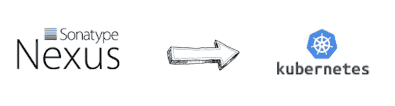

# Jenkins X —管理关系

> 原文：<https://itnext.io/jenkins-x-managing-nexus-17d31ad493d6?source=collection_archive---------6----------------------->



在我的上一篇文章[Jenkins X——管理 Jenkins](/jenkins-x-managing-jenkins-926f0e0f8bcf?source=friends_link&sk=3dcd9c4a8c028661f0b09156c14c271e) 中，我谈到了我们如何管理我们的 Jenkins 服务器。这一次，我将关注 Nexus 服务器，以及如何对其进行类似的管理。

# 当前状态

[Jenkins X](https://jenkins-x.io/) 附带一个可选的 Nexus 服务器，该服务器已打包到平台中，非常适合您使用。然而，随着您的项目变得越来越复杂，您可能会发现自己需要其他的存储库或者对配置进行更改。事实证明，正是这些变化有点难以管理。以下是截至今天的设置:

*   当前的 Jenkins X nexus 图表对预打包的存储库进行了硬编码
*   `postStart.sh`脚本获取存储库脚本文件列表并执行它们
*   GitHub 上有一个未解决的问题，将文件移动到`values.yaml`中，但我不确定何时会修复。

因此，在这种情况下，我们需要一种方法来添加我们的自定义存储库。现在，在我进入实现之前，我想给你一些关于实际发生了什么的背景知识。

# postStart.sh 脚本

[postStart.sh](https://github.com/jenkins-x-charts/nexus/blob/master/postStart.sh) 脚本在 nexus 服务器可用后直接运行。它的工作之一是循环遍历包含存储库创建脚本的文件列表并在 Nexus 中执行它们。脚本本身是幂等的，这意味着只有在 Nexus 存储库不存在的情况下才会创建它。这可以确保您的 Nexus 服务器在启动时拥有所有必需的存储库。

那么，脚本是如何工作的呢？

## Nexus API

Sonatype Nexus 使用 groovy 脚本来配置实例。在这篇文章的范围之外，[这里有一个通过脚本配置 Nexus 的很好的例子](https://github.com/samrocketman/nexus3-config-as-code)。

以下是来自 Nexus 官方网站的更多信息:

*   [https://help . sonatype . com/repo manager 3/rest-and-integration-API/script-API/examples](https://help.sonatype.com/repomanager3/rest-and-integration-api/script-api/examples)
*   [https://github . com/sonatype-nexus-community/nexus-scripting-examples](https://github.com/sonatype-nexus-community/nexus-scripting-examples)

> **还有？你为什么要告诉我这些？**

因为，尽管`postStart.sh`脚本的主要功能是建立 nexus 存储库，**实际上没有什么可以阻止您添加其他脚本**，比如说:

*   创建存储库组
*   添加用户
*   添加角色
*   安排任务等。

# 创建脚本文件

让我们首先创建一个包含自定义脚本的`ConfigMap`资源。由于某种原因，Medium 不想正确显示要点，因此这里的[是指向问题要点的链接:](https://gist.github.com/sboardwell/42ca099b43b8a6163ae5ff6afc31c70a)

上述示例展示了四种最常见的任务类型:

*   **redshift-maven-repository . JSON** 一个公开的 maven 发布库
*   **Apache-org-snapshot s . JSON** 一个公共 maven 快照库
*   **my-protected-repo.json** 
*   **maven-group.json** 脚本创建各种 maven 存储库组

查看内容并用真正的换行符替换`\n`，您可以看到将要执行的实际脚本，例如:

> **注意:**这里有一些关于 Nexus 脚本的优秀信息，包括一个示例项目:[**https://help . sonatype . com/repo manager 3/rest-and-integration-API/script-API/writing-scripts**](https://help.sonatype.com/repomanager3/rest-and-integration-api/script-api/writing-scripts)

# 获取必要的信息

那么，我们如何把我们的文件放在正确的地方呢？我们需要将文件放在 Nexus pod 上的适当目录中。

但我们对此有异议。我们不能挂载整个目录，因为那会破坏所有现有的文件。幸运的是，我们可以使用本文中提到的子路径[来挂载单个文件。](https://blog.sebastian-daschner.com/entries/multiple-kubernetes-volumes-directory)

因为我想自动完成这项工作，所以我们希望将当前挂载与所需列表进行比较。之后，我们需要修补 nexus 部署，添加任何尚未添加的挂载。

因此，我们需要:

*   列出当前的 nexus 部署挂载点
*   列出当前的 nexus 部署子路径
*   从我们的文件中列出自定义回购
*   将配置映射添加到集群
*   创建包含任何新挂载点和子路径的补丁字符串
*   如有必要，应用补丁

为此，我们需要我最喜欢的两个命令的帮助， [jq](https://stedolan.github.io/jq/) 和 [yq](https://mikefarah.github.io/yq/) ，以及一个小命令行 fu。

我们走吧…

## 部署中的当前挂载点

```
kubectl get deployment jenkins-x-nexus \
  -o 'jsonpath={ .spec.template.spec.volumes[*].name }'
```

会给你这样的信息:

```
nexus nexus-data-volume nexus-custom-repo-files
```

## 部署中的当前子路径(repo 文件)

```
kubectl get deployment jenkins-x-nexus \
  -o 'jsonpath={ .spec.template.spec.containers[0].volumeMounts[*].subPath }'
```

会给你这样的信息:

```
apache-org-snapshots.json my-protected-repo.json maven-group.json redshift-maven-repository.json
```

## 来自自定义 yaml 的当前脚本文件

这实际上比最初想的更复杂，主要是因为`yq`不允许输出地图对象的键。为了解决这个问题，我需要使用`yq`来输出数据部分，然后使用`jq`来输出密钥。最终结果是:

```
cat "nexus-repos/nexus-custom-repo-files.yaml" \
  | docker run -i — rm evns/yq -j -r '.data' \
  | docker run -i — rm imega/jq -r 'keys[]' \
  | xargs
```

> **注意:**如果本地安装了 yq 和 jq，docker 命令可以替换为二进制命令

# 创建部署补丁

现在我们有了主要的输入变量，我们可以处理它们并构造我们的补丁字符串。我们将使用 json 补丁类型，因为这允许我们添加到现有的列表中。关于 json 合并[的更多信息可以在这里找到](https://kubernetes.io/docs/tasks/run-application/update-api-object-kubectl-patch/#use-a-json-merge-patch-to-update-a-deployment)。

## 卷安装

首先，添加自定义回购配置映射作为卷(如果它还不存在的话)

```
if [[ "${volumeNames}" != *nexus-custom-repo-files* ]]; then
  patchItemString='
{
  "op": "add",
  "path": "/spec/template/spec/volumes/-",
  "value": {
    "name" : "nexus-custom-repo-files",
    "configMap" : { "name" : "nexus-custom-repo-files" }
  }
}
'
 fi
```

## 子路径

其次，遍历我们的存储库脚本文件，在必要的地方添加子路径(注意`maven-group.json`被放在父目录中——这是 postStart.sh 期望的位置)

```
for repoF in $repoFiles; do
    [ -n "${patchItemString}" ] && separator=',' || separator=''
    if [[ "${subPaths}" != *${repoF}* ]]; then
        local mountPath
        if [[ "${repoF}" == maven-group.json ]]; then
            mountPath="/opt/sonatype/nexus/${repoF}"
        else
            mountPath="/opt/sonatype/nexus/repositories/${repoF}"
        fi
        patchItemString="
${patchItemString}${separator}
{
\"op\": \"add\",
\"path\": \"/spec/template/spec/containers/0/volumeMounts/-\",
\"value\": {
\"mountPath\" : \"${mountPath}\",
\"name\" : \"nexus-custom-repo-files\",
\"subPath\" : \"${repoF}\"
}
}
"
    fi
done
```

## 更新配置图

第三，应用配置图为装载做准备:

```
# update config map
kubectl apply -f <(sops -d nexus-repos/nexus-custom-repo-files.yaml)
```

> **注意:**你会注意到我正在使用 [sops](https://github.com/mozilla/sops) 动态解密文件。我加密了存储库脚本配置映射文件，因为它包含 my-protected-repo 的凭证。

## 修补部署

最后，如有必要，修补部署:

```
# patch if necessary
if [ -n "${patchItemString}" ]; then
    # patch deployment
    patchFile=$(mktemp)
    echo "Patch file: ${patchFile}"
    echo -e "[\n${patchItemString}\n]" > "${patchFile}"
    kubectl patch deployment jenkins-x-nexus - type='json' - patch "$(cat ${patchFile})"
else
    echo "All custom repositories found. No need to patch."
fi
```

# 把所有的放在一起

最后，将所有这些放在一个 bash 函数中会得到这个函数:

它可以作为 Jenkins X 配置过程的一部分运行。

这就是你的 Jenkins X managed Nexus 服务器中的自定义存储库。

我希望这篇文章对你有所帮助，并且你现在对 Nexus 脚本 API 有了一点了解。

在下一章中，我将看看如何使用 gitversion 作为你项目的动态版本驱动。