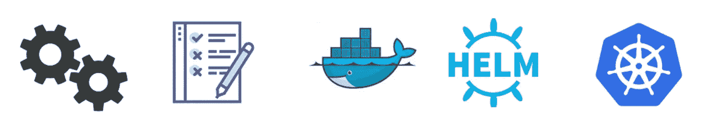

# 詹金斯:X 还是 2.0？

> 原文：<https://itnext.io/jenkins-x-or-2-0-db17138b3ba2?source=collection_archive---------0----------------------->

Jenkins X 已经成为最近最受关注的开源公告之一。

在本文中，我将讨论文档中没有具体提到的新产品的吸引人的特性。

如果你需要任何种类的产品指南或规格，我推荐你阅读关于[动机](http://jenkins-x.io/about/concepts/)和[特征](http://jenkins-x.io/about/features/)的内容。

# 只是一个新的炒作工具吗？在容器中运行 Jenkins 有什么特别之处？

Kubernetes 是管理容器、分布式应用程序和虚拟基础设施的事实上的标准。它由主要的公共云提供商作为托管服务提供，可以在内部安装。如果您现在构建一个云应用程序，并希望它可以在任何地方移植，Kubernetes 是您的选择！

虽然生态系统是巨大的，但它仍然非常年轻，更专注于应对“第一天”的挑战，如 K8s 的推出。首先解决最紧迫的问题是很自然的。2018 年[预计](https://blog.openshift.com/podcast-podctl-30-2018-kubernetes-trends/)会带来更多的稳定、集成和用户体验方面。今天，我们思考如何在第 2 天运营，如何在上面构建一些东西，让开发者更有效率。

Jenkins X 通过整体 CI/CD 管理填补了这一空白。

# 仅仅是詹金斯 2.0 的更名吗？

Jenkins 是在云成为标准之前很久开发的工具，它肯定不是云原生的工具，这意味着它不具备 OOTB 功能来承受停机、无缝扩展等。

幸运的是，它是可扩展的。Jenkins X 用 [Kubernetes 插件](https://plugins.jenkins.io/kubernetes)施展魔法，让你忘记为奴隶提供虚拟机或物理服务器；每个作业都使用一次性代理，在单独的容器中运行，这些容器可以随集群扩展。

借助 Jenkins X，您不仅可以为您的应用获得 K8S 管道，还可以获得高度可扩展的 CI/CD 解决方案。

# 你能让詹金斯加入我们的团队吗？

当 Kubernetes 被作为项目平台时，这是开发团队最常问的问题。迁移主要工具对任何组织来说都意味着大量的改变；从字面上看，它影响所有主要的 DevOps 过程，并需要大量的学习努力。

Jenkins X 附带了 K8s 管道、代理和集成，使得向 Kubernetes 和微服务的迁移更加简单。

# 版本控制呢？

Jenkins X 的设计理念是 GitOps T1。

将所有配置保持在版本控制中意味着更好的安全性、灾难恢复，以及将所有 SDLC 实践应用于操作任务的可能性。

开箱即用，您将 CI/CD 基础架构配置保存到 Git 中，并且您的工具包一直遵循这一原则。

由于情况紧急，你永远没有机会打破这条规则，这是故意的！

# 积木

[Jenkins 2.0](https://jenkins.io/2.0/)——“老古董”CI 服务器

[掌舵人](https://github.com/kubernetes/helm) -包装经理

[草稿](https://github.com/Azure/draft) -开发环境构建工具

[单眼](https://github.com/kubernetes-helm/monocular) -用于头盔储存库的用户界面

[Chartmuseum](https://github.com/kubernetes-helm/chartmuseum) -具有云后端支持的 helm 存储库

[Nexus](https://www.sonatype.com/nexus-repository-oss) -工件库

[Docker 注册表](https://github.com/docker/distribution) -容器图像注册表

以上所有都在一个 [**jx**](https://github.com/jenkins-x/jx) 工具的控制之下，配置是作为一个“平台”、一套舵图表来运送的。

# 重新审视环境管理

对我来说最有趣的一个！

环境作为一个实体是由工具控制的，你可以管理生命周期，提升和配置！您可以轻松地定制、模板化和重用它。

使用 GitOps 模式，每个环境有一个存储库。这是最佳实践，由 jx 的**OOTB 驱动。**

[舵](https://github.com/kubernetes/helm)用于配置管理。环境表示为一个 helm 包，每个应用程序在升级时都作为依赖项添加。这种方法很有意义，因为环境配置是标准化程度最低的领域。许多团队花了很多时间，直到我开始做类似的事情。你将免费得到它！

# 瑞士军刀 CLI

Jx CLI 是该框架所有功能的入口点。

最重要的:这是一个关键的构造，在 CD 管道中被广泛调用。它们可以很容易地直接使用和调试，任何步骤都可以从 CLI 重放或重复。

*最初发表于*[T5【dzone.com】](http://dzone.com/articles/jenkins-x-the-good-bad-and-ugly)*。*