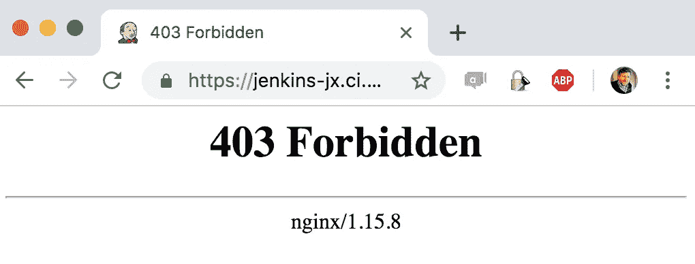

# Jenkins X —保护集群

> 原文：<https://itnext.io/jenkins-x-securing-the-cluster-e1b9fcd8dd05?source=collection_archive---------2----------------------->


何塞·丰塔诺在 [Unsplash](https://unsplash.com?utm_source=medium&utm_medium=referral) 上拍摄的照片

[Jenkins X](https://jenkins-x.io/) 是一个在 Kubernetes 上快速创建 CI/CD 管道的伟大工具。然而，快速设置的便利也带来了一些负面影响。在一系列的帖子中，我将讨论这些问题，并提供我对我们如何解决其中一些问题的看法。

在我们开始之前，我想对我的对手伊利亚·沙伊斯尔塔诺夫(T7)说几句话。像他这样的同事让这样的冒险变得更加愉快:-)。

在为我们的大数据分析公司 [Datameer](https://www.datameer.com/) 创建初始 CI/CD 基础架构时，我们从以下目标开始:

*   VPC: 任何私人的东西都应该放在某种防火墙后面。
*   **VPN:** 如果服务是公开可用的，我们需要限制谁可以访问它们。
*   **TLS:** 因为，老实说，今天没有理由需要任何人通过 http 提供任何服务。
*   **OAuth:** 使用静态 Jenkins，我们希望允许开发人员使用他们的帐户信息登录，而不是在 Jenkins 中创建额外的独立用户。
*   **照本宣科:**我们希望将手动步骤减到最少。

詹金斯 X 提供了一些现成的。但是为了有 100%的覆盖率，需要做一些调整。

# 保护集群—第一点

首要任务是保护我们的 GKE 集群。Jenkins X 提供了自动创建集群的选项，包括:

```
jx create cluster gke
```

不幸的是，GKE 的默认设置目前让世界可以访问主服务器，这意味着我们需要提前创建我们自己的安全集群。顺便说一句，根据发行说明，GKE 将在不久的将来默认为 VPC 本地人[，但是现在我们需要明确地创建一个。](https://cloud.google.com/kubernetes-engine/docs/release-notes)

网上有很多好的资源，像[这个](https://medium.com/google-cloud/vpc-native-clusters-on-google-kubernetes-engine-b7c022c07510)用于手动设置集群，或者[使用 terraform 模块](https://registry.terraform.io/modules/gruntwork-io/gke/google/0.1.1/submodules/gke-cluster)。我们使用 terraform 来创建我们的集群。

无论您如何操作，这里有一些重要的要点:

*   您将能够使用 [***授权网络***](https://cloud.google.com/kubernetes-engine/docs/how-to/authorized-networks) **仅**限制对主设备的访问，限制对内部网络或通过 VPN 的外部访问。
*   您将能够 ***为工作节点、单元和服务*** 分配 IP 范围。这可以用来确保分配的 IP 范围不会与您的内部网络发生冲突，如果您希望两者对等的话。谷歌为[提供了一个确定集群规模的指南。](https://cloud.google.com/kubernetes-engine/docs/how-to/flexible-pod-cidr)

现在，集群是安全的，只能通过可信网络访问，是时候安装 Jenkins X 了。

**更新—2019 年 6 月 25 日:** 感谢 [Hays Clark](https://medium.com/u/5f3fdb3c45b6?source=post_page-----e1b9fcd8dd05--------------------------------) 的这个[提醒](https://kubernetes.slack.com/archives/C9MBGQJRH/p1561405754145600?thread_ts=1561188900.039500&cid=C9MBGQJRH) :-)。**如果在 GKE** 上创建一个私有集群，你将不能从 dockerhub 等上拉映像，因为你的集群是私有的。要解决这个问题，只需按照本文中的[添加一个谷歌云 NAT。](https://medium.com/google-cloud/using-cloud-nat-with-gke-cluster-c82364546d9e)

# 保护集群—第二点

Cloudbees 的工作人员做得很好，他们用合理的默认值让安装 Jenkins X 变得尽可能简单。然而，为了能够在稍后的过程中使用`*.domain.xyz`通配符证书，我们需要做出两个决定:

*   我们需要使用一个真实的域(对于证书管理器 [DNS 挑战](https://docs.cert-manager.io/en/latest/tasks/issuers/setup-acme/dns01/))
*   我们需要将公开服务的 [urltemplate](https://github.com/jenkins-x/exposecontroller/search?q=UrlTemplate&unscoped_q=UrlTemplate) 从
    `"{{.Service}}.{{.Namespace}}.{{.Domain}}"` 更改为
    `"{{.Service}}-{{.Namespace}}.{{.Domain}}"`
    ，这意味着每个名称空间都有一个新的子域。

我们的安装命令看起来像这样:

```
jx install - provider=gke \
 - git-username=${github_username} \
 - git-api-token=${github_api_token} \
 - default-admin-password=${default_admin_password} \
 - version=${jx_version} \
 - no-default-environments=true \
 - git-private=true \
 - no-tiller=false \
 - domain=${jx_domain} \
 - long-term-storage=false \
 - exposecontroller-urltemplate='"{{.Service}}-{{.Namespace}}.{{.Domain}}"' \
 - urltemplate='"{{.Service}}-{{.Namespace}}.{{.Domain}}"' \
 - buildpack=kubernetes-workloads \
 - batch-mode=true
```

> **重要提示:**在安装过程中，将会创建**jxing-nginx-ingress-controller**服务。

您需要创建指向以下内容的 DNS 记录(类型 A ):

*   `YOUR-DOMAIN` >负载平衡器 ip
*   `*.YOUR-DOMAIN` >负载平衡器 ip

您可以使用以下命令找到负载平衡器 ip:

```
kubectl get svc jxing-nginx-ingress-controller -n kube-system -o'jsonpath={ .status.loadBalancer.ingress[0].ip }'
```

在短短几分钟内，我们就有了一个闪亮的新 Jenkins X 平台，并与 [Jenkins](https://jenkins.io/) 、 [Nexus](https://www.sonatype.com/nexus-repository-sonatype) 和众多其他服务一起在我们的安全集群中运行。

> 但是等等，服务只有 http！？！

不要害怕，一个简单的`jx upgrade ingress`执行所有必要的步骤来升级你的入口到我们的域上的 https 你可以在[这篇由 Viktor Farcic](https://technologyconversations.com/2019/05/31/upgrading-ingress-rules-and-adding-tls-certificates-with-jenkins-x) 写的文章中读到更多关于这个的内容。

几分钟后，https 就可用了。不错！

> 但是坚持住，我所有的服务都是对全世界开放的！？！

啊，当然！限制对主机的访问只能防止人们通过`kubectl`访问集群。默认情况下，创建的任何入口都是打开的。

# **限制对服务的访问**

在权衡我们的选择后，最实际的解决方案是从源头解决问题，即“jxing-nginx-ingress-controller”。

我们使用了 nginx 的 [*白名单-来源-范围*](https://kubernetes.github.io/ingress-nginx/user-guide/nginx-configuration/configmap/#whitelist-source-range) 设置，它说:

> 您可以通过`nginx.ingress.kubernetes.io/whitelist-source-range`注释指定允许的客户端 IP 源范围。该值是一个逗号分隔的[CIDR](https://en.wikipedia.org/wiki/Classless_Inter-Domain_Routing)列表，例如`10.0.0.0/24,172.10.0..1,...`。
> 
> 为了对所有入口规则进行全局配置，可以在 [NGINX 配置图](https://kubernetes.github.io/ingress-nginx/user-guide/nginx-configuration/configmap/#whitelist-source-range)中设置`whitelist-source-range`值。
> 
> **提示 1:** 为了让 webhooks 工作，GitHub 服务器也需要被列入白名单。你可以在这里找到他们。
> 
> **专业提示#2:** 不要忘记添加用于您的 pod 的 ip 范围(参见上面的 VPC 部分)。
> 否则你会发现你自己的 pods 不能访问同一个集群内的服务 URLs 个小时的调试，直到我找到这个😅 ).

因此，可以通过以下方式修补 jxing-nginx-ingress-controller:

```
kubectl patch configmap/jxing-nginx-ingress-controller \
      — type merge \
      -p '{"data" : {"whitelist-source-range" : "...CIDRS..."}}' \
      -n kube-system
```

该死的。没起作用！

事实证明，要让这一切正常进行，GKE 还需要一件东西。为了允许授权的 IP 范围，我们需要[保留客户端源 ip](https://kubernetes.io/docs/tasks/access-application-cluster/create-external-load-balancer/#preserving-the-client-source-ip) 。

幸运的是，这只是另一个简单的补丁。

```
kubectl patch svc jxing-nginx-ingress-controller \
      -p '{"spec":{"externalTrafficPolicy":"Local"}}' \
      -n kube-system
```

# 成功！



没有 VPN

我们的集群和 Jenkins X 服务都被安全地打包在白名单 IP 范围的后面，现在是时候考虑 OAuth 集成了。

在接下来的几篇文章中，我将经历更多的冒险，包括:

*   管理 Jenkins 服务器、配置和作业
*   为启用 https 的预览环境引入通配符证书
*   管理定制 nexus 存储库和配置
*   …可能还有其他事情，比如集成 [GitVersion](https://gitversion.readthedocs.io/en/latest/) 来使用 [GitFlow](https://nvie.com/posts/a-successful-git-branching-model/) 跟踪我们的应用版本。不过先看看我们是如何做到的:-)吧

直到下一集...