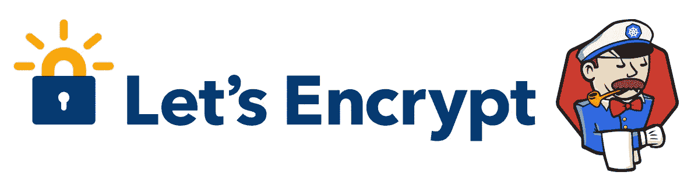
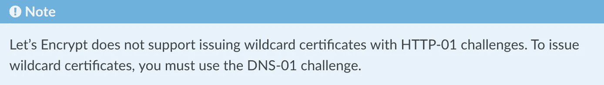

# Jenkins X —启用 TLS 的预览

> 原文：<https://itnext.io/jenkins-x-tls-enabled-previews-d04fa68c7ce9?source=collection_archive---------3----------------------->



欢迎回到 Jenkins X 上的迷你系列。这一节将致力于为预览环境设置通配符证书和 TLS。

在[我之前的帖子](https://medium.com/@sboardwell/jenkins-x-securing-the-cluster-e1b9fcd8dd05)中，我讨论了如何保护这两者:

*   GKE 集群(对工作节点、pod 和服务使用授权网络访问和专用 IP 范围)
*   [Jenkins X](https://jenkins-x.io/) 默认服务(为访问添加 ssl 证书和 IP 白名单)

做完这些之后，是时候考虑将 TLS 添加到 Jenkins X 提供的动态预览环境中了。

非常感谢 [Pablo Loschi](https://medium.com/u/2f0bedd32a9b?source=post_page-----d04fa68c7ce9--------------------------------) 在这里发表了他关于[在 Kubernetes](/using-wildcard-certificates-with-cert-manager-in-kubernetes-and-replicating-across-all-namespaces-5ed1ea30bb93) 中使用通配符证书管理器的原创故事。这是一个救生圈和信用的信用到期，所以谢谢你:-)。

和往常一样，我要向陪伴我进行这次小小冒险的伊利亚·沙伊斯尔塔诺夫(Ilya Shaisultanov)大声致意。

# 预先提供一点信息

在继续之前，我想请你对我们做出的几个技术决策做一个简短的解释。

1.  我们决定使用单个域来支持`*.domain`通配符证书。为此，我们在 exposecontroller 中指定了`"{{.Service}}-{{.Namespace}}.{{.Domain}}"`，例如
    [https://Jenkins . JX . domain . XYZ](https://jenkins.jx.domain.xyz)—>[https://Jenkins-JX . domain . XYZ](https://jenkins-jx.domain.xyz)
2.  如果使用 DNS-01 质询，LetsEncrypt 将只发布通配符证书，因此我们需要使用受支持的 DNS-01 提供商之一的。
    Google cloud DNS[和](https://docs.cert-manager.io/en/latest/tasks/issuers/setup-acme/dns01/google.html) [Cloudflare](https://docs.cert-manager.io/en/latest/tasks/issuers/setup-acme/dns01/cloudflare.html) 都是在这种背景下测试的。



从证书管理器网站

# TL；不耐烦的博士

这个帖子包含了相当多的信息，涵盖了各种半连接的主题。

然而，对于那些手头时间不多的人，我们将执行以下一般步骤:

*   确保准备了正确的 DNS 记录
*   添加 [kubernetes-replicator](https://github.com/mittwald/kubernetes-replicator) (稍后预览时需要)
*   设置凭据启用 DNS-01 质询
*   为我们的域创建通配符证书
*   添加所需的 kubernetes-replicator 注释
*   从新创建的证书创建带有 TLS 的 Jenkins X 预览

# 关于在供应链管理中保守秘密的快速说明

对于这个小问题，你可能有自己的解决办法，但我还是想提一下，如果只是为了安全起见。

Mozilla 公司的 sops 是一个很棒的加密各种文件格式的小工具，包括 YAML。来自[网站](https://github.com/mozilla/sops):

> **sops** 是一个加密文件编辑器，支持 YAML、JSON、ENV、INI 和二进制格式，用 AWS KMS、GCP KMS、Azure Key Vault 和 PGP 加密。

我们用它来加密我们的 kubernetes 秘密，从而允许我们用明文把它们保存在 git 中。以上面的`01-clouddns-service-account.yaml`为例，加密文件如下所示:

```
$ cat cert-manager-utils/01-clouddns-service-account.yaml
apiVersion: v1
data:
 devops-dns-admin_token: **ENC[AES256_GCM,data:<redacted>,type:str]**
kind: Secret
metadata:
 creationTimestamp: null
 name: clouddns-service-account
 namespace: cert-manager
sops:
 kms:
 — arn: **<redacted>**
 created_at: ‘2019–05–23T15:56:06Z’
 enc: <redacted>
 gcp_kms: []
 azure_kv: []
 lastmodified: ‘2019–05–23T18:40:17Z’
 mac: **ENC[AES256_GCM,data:<redacted>,type:str]**
 pgp: []
 encrypted_suffix: _token
 version: 3.2.0
```

未加密时，该文件看起来像:

```
$ sops -d cert-manager-utils/01-clouddns-service-account.yaml
apiVersion: v1
data:
 devops-dns-admin_token: **<redacted>**
kind: Secret
metadata:
 creationTimestamp: null
 name: clouddns-service-account
 namespace: cert-manager
```

一个额外的好处是能够将此与`kubectl apply`和[过程替代](http://www.gnu.org/software/bash/manual/bash.html#Process-Substitution)相结合，以提供**动态解密**:

```
kubectl apply -f <(sops -d cert-manager-utils/01-clouddns-service-account.yaml)
```

虽然，最后我真的不介意选择哪种方法，只要大家都在用加密:-)。

# 确保存在正确的 DNS 条目

这是我在安装 Jenkins X (搜索*“你将需要创建 DNS 记录】*)期间在[早先的帖子中提到过的。](https://medium.com/@sboardwell/jenkins-x-securing-the-cluster-e1b9fcd8dd05)

以防万一你在这里有一个*预装的* Jenkins X 平台，请确保你有域名的 DNS 记录。以下是我之前帖子的摘录:

您需要创建指向以下内容的 DNS 记录(类型 A ):

*   `YOUR-DOMAIN` >负载平衡器 ip
*   `*.YOUR-DOMAIN` >负载平衡器 ip

您可以使用以下命令找到负载平衡器 ip:

```
kubectl get svc jxing-nginx-ingress-controller -n kube-system -o'jsonpath={ .status.loadBalancer.ingress[0].ip
```

# 安装 Kubernetes 复制器

接下来我们将安装 [kubernetes-replicator](https://github.com/mittwald/kubernetes-replicator) 。不幸的是，在撰写本文时，似乎还没有一个官方的掌舵图。然而，它非常容易安装，所以这里有一个快速安装 v1.0.0 的代码片段。

只需复制并粘贴到 shell 中:

现在复制器安装完毕，我们可以添加通配符证书了。

# 创建通配符证书

首先，我们需要 DNS 管理员帐户凭证，根据您的域注册商，可以创建如下:

*   [谷歌云域名系统](https://docs.cert-manager.io/en/latest/tasks/issuers/setup-acme/dns01/google.html)
*   [Cloudflare](https://blog.darkedges.com/2019/02/17/cert-manager-kubernetes-cloudflare-dns/) (第*节“创建 CloudFlare DNS 颁发者”*)

> **提示:**您不一定要使用多个发行者，但是同时指定这两个发行者允许您对多个域使用相同的配置文件。

一旦创建了凭证，我们就可以创建必要的 kubernetes 资源。资源文件被分成 3 组:

*   DNS 管理机密
*   集群发行者
*   证书本身

```
$ tree cert-manager-utils
cert-manager-utils
├── 01-clouddns-service-account.yaml      # cert-manager namespace
├── 01-cloudflare-api-key.yaml            # cert-manager namespace
├── 02-clusterissuer-prod.yaml            # kube-system namespace
├── 02-clusterissuer-staging.yaml         # kube-system namespace
├── 03-cluster-certificate-prod.yaml      # kube-system namespace
└── 03-cluster-certificate-staging.yaml   # kube-system namespace
```

*【暂存】**【生产】*都有文件。这些分别使用 [LetsEncrypt staging 和 prod 环境](https://letsencrypt.org/docs/staging-environment/)。

我强烈建议在转移到 LetsEncrypt prod 环境之前，首先使用登台环境来确保配置是正确的。

## DNS 的秘密

下面的名字只是顺便提个建议。当然，您可以自由地为下面使用的密钥选择自己的名称，如*“devo PS-DNS-admin _ token”*等。

```
cert-manager-utils/01-clouddns-service-account.yaml
—-apiVersion: v1
data:
 devops-dns-admin_token: REPLACE_WITH_BASE64_ENCODED_JSON
kind: Secret
metadata:
 creationTimestamp: null
 name: clouddns-service-account
 namespace: cert-manager cert-manager-utils/01-cloudflare-api-key.yaml
—-apiVersion: v1
data:
 api-key.txt: REPLACE_WITH_BASE64_ENCODED_API_KEY
kind: Secret
metadata:
 name: cloudflare-api-key
 namespace: cert-manager
```

## LetsEncrypt 暂存文件

这些资源将创建一个通配符证书，由 LetsEncrypt 临时环境颁发。

```
cert-manager-utils/02-clusterissuer-staging.yaml
---apiVersion: certmanager.k8s.io/v1alpha1
kind: ClusterIssuer
metadata:
  name: letsencrypt-**staging**-dns
spec:
  acme:
    server: [**https://acme-staging-v02.api.letsencrypt.org/directory**](https://acme-staging-v02.api.letsencrypt.org/directory)
    email: [REPLACE_WITH_your.email@your.domain.com](mailto:REPLACE_WITH_your.email@your.domain.com)
    privateKeySecretRef:
      name: letsencrypt-**staging**
    dns01:
      providers:
        - name: clouddns
          clouddns:
            serviceAccountSecretRef:
              name: clouddns-service-account
              key: devops-dns-admin_token
            project: REPLACE_WITH_your-google-cloud-project
        - name: cloudflare
          cloudflare:
            apiKeySecretRef:
              key: api-key.txt
              name: cloudflare-api-key
            email: [REPLACE_WITH_your.email@your.domain.com](mailto:REPLACE_WITH_your.email@your.domain.com) cert-manager-utils/03-cluster-certificate-staging.yaml
---apiVersion: certmanager.k8s.io/v1alpha1
kind: Certificate
metadata:
  name: jxing-nginx-ingress-controller-wildcard-**staging**
  namespace: kube-system
spec:
  secretName: jxing-nginx-ingress-controller-wildcard-**staging**-tls
  issuerRef:
    name: letsencrypt-**staging**-dns
    kind: ClusterIssuer
  commonName: REPLACE_WITH_YOUR_DOMAIN
  dnsNames:
    - REPLACE_WITH_YOUR_DOMAIN
    - "*.REPLACE_WITH_YOUR_DOMAIN"
  acme:
    config:
      - dns01:
          provider: cloudflare
        domains:
          - REPLACE_WITH_YOUR_DOMAIN
          - "*.REPLACE_WITH_YOUR_DOMAIN"
      - dns01:
          provider: clouddns
        domains:
          - REPLACE_WITH_YOUR_DOMAIN
          - "*.REPLACE_WITH_YOUR_DOMAIN"
```

## LetsEncrypt 产品文件

这里与 staging 文件的唯一区别是 LetsEncrypt 的 *"acme.server"* 的值以及一些资源名称(prod vs staging，用于将两个资源组分开)。

```
cert-manager-utils/02-clusterissuer-prod.yaml
---apiVersion: certmanager.k8s.io/v1alpha1
kind: ClusterIssuer
metadata:
  name: letsencrypt-**prod**-dns
spec:
  acme:
    server: [**https://acme-v02.api.letsencrypt.org/directory**](https://acme-v02.api.letsencrypt.org/directory)
    email: [REPLACE_WITH_your.email@your.domain.com](mailto:REPLACE_WITH_your.email@your.domain.com)
    privateKeySecretRef:
      name: letsencrypt-**prod**
    dns01:
      providers:
        - name: clouddns
          clouddns:
            serviceAccountSecretRef:
              name: clouddns-service-account
              key: devops-dns-admin_token
            project: REPLACE_WITH_your-google-cloud-project
        - name: cloudflare
          cloudflare:
            apiKeySecretRef:
              key: api-key.txt
              name: cloudflare-api-key
            email: [REPLACE_WITH_your.email@your.domain.com](mailto:REPLACE_WITH_your.email@your.domain.com)cert-manager-utils/03-cluster-certificate-prod.yaml
---apiVersion: certmanager.k8s.io/v1alpha1
kind: Certificate
metadata:
  name: jxing-nginx-ingress-controller-wildcard-**prod**
  namespace: kube-system
spec:
  secretName: jxing-nginx-ingress-controller-wildcard-**prod**-tls
  issuerRef:
    name: letsencrypt-**prod**-dns
    kind: ClusterIssuer
  commonName: REPLACE_WITH_YOUR_DOMAIN
  dnsNames:
    - REPLACE_WITH_YOUR_DOMAIN
    - "*.REPLACE_WITH_YOUR_DOMAIN"
  acme:
    config:
      - dns01:
          provider: cloudflare
        domains:
          - REPLACE_WITH_YOUR_DOMAIN
          - "*.REPLACE_WITH_YOUR_DOMAIN"
      - dns01:
          provider: clouddns
        domains:
          - REPLACE_WITH_YOUR_DOMAIN
          - "*.REPLACE_WITH_YOUR_DOMAIN"
```

# 把所有的放在一起

使用一个小小的 bash 函数，我们可以将所有东西放在一起:

这样就可以用了。

`add_certificates staging`
或
`add_certificates prod`

几分钟后，您应该会看到类似这样的内容:

# 在预览环境中使用通配符证书

既然我们已经配置了所有必要的组件，那么将 TLS 添加到预览环境中就非常简单了。

## 检查 exposecontroller 版本

确保你的预览版`requirements.yaml`是 2.3.111 或更高版本。

参见[本例](https://github.com/sboardwell/jx-static-qs01/blob/master/charts/preview/requirements.yaml#L3..L10)。

## 添加空密码以复制您的通配符证书

添加一个空秘密[，如这里所述](https://github.com/mittwald/kubernetes-replicator#2-create-empty-secret)。kubernetes-replicator 将检测这个秘密并将真正的秘密复制到预览名称空间中。

见[本例](https://github.com/sboardwell/jx-static-qs01/blob/master/charts/preview/templates/empty-tls-secret-for-kubernetes-replicator.yaml)。

## 编辑 exposecontroller 配置以添加 TLS

将对以下属性进行更改:

```
tlsacme: true
urltemplate: "\"{{.Service}}-{{.Namespace}}.{{.Domain}}\""
tlsSecretName: "jxing-nginx-ingress-controller-wildcard-prod-tls"
```

参见[本例](https://github.com/sboardwell/jx-static-qs01/blob/master/charts/preview/values.yaml#L9..L11)。

## 成功！

就是这样！每个预览版都将启用 TLS 并使用我们的通配符证书。

恭喜你！

# 可选奖金设置

nginx 还有另一个不错的小选项[为给定的入口控制器](https://kubernetes.github.io/ingress-nginx/user-guide/tls/#default-ssl-certificate)设置一个“默认 ssl 证书”。

设置此选项后，会添加一个默认 ssl 证书作为任何入口请求的后备，因此无需在入口配置中设置`spec.tls.secretName`。

目前，您需要在 exposecontroller 配置中设置`tlsSecretName`,这意味着上述技巧无法使用。然而，首先非常感谢文森特·贝哈尔为[增加了选项](https://github.com/jenkins-x/exposecontroller/pull/178)。

如果您确实希望将默认的 ssl 证书添加到 nginx 控制器中，这里有一个 bash 小代码片段可以做到这一点。

所以，这就是关于 Jenkins X 的迷你系列的第二部分。我希望它能有所帮助。

在第三部分中，我将介绍我们如何在 Jenkins X 平台中管理 Jenkins 服务器，添加 OAuth，更新插件和配置，以及在 git 中保存作业配置。敬请关注…