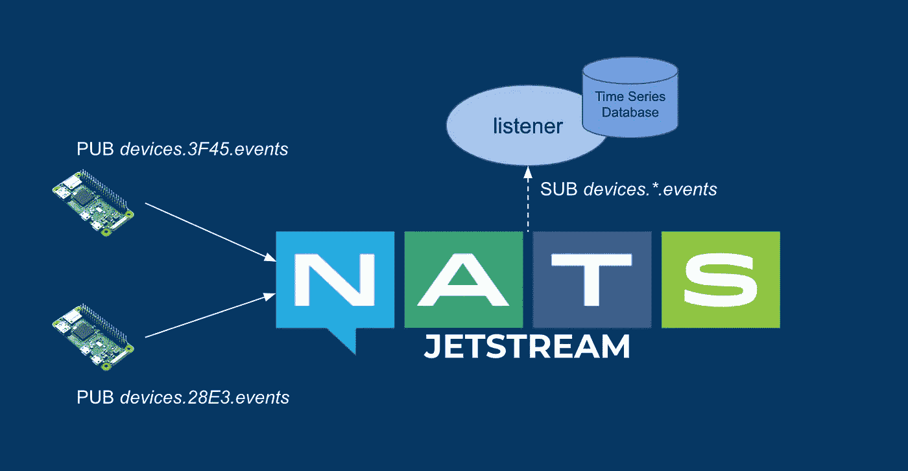
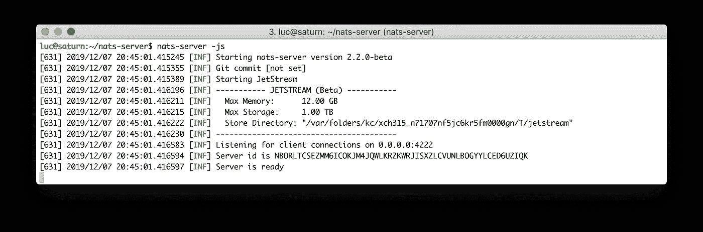
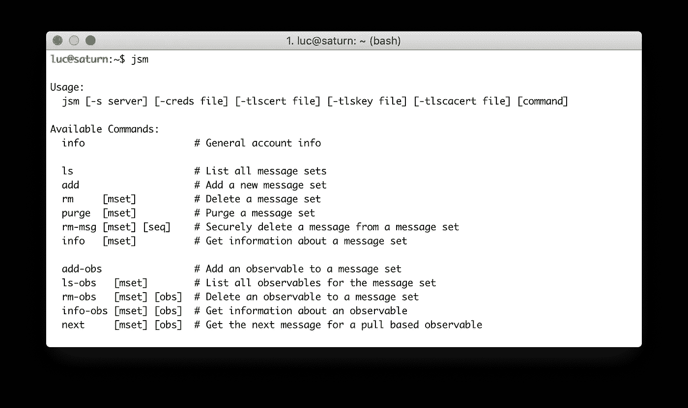
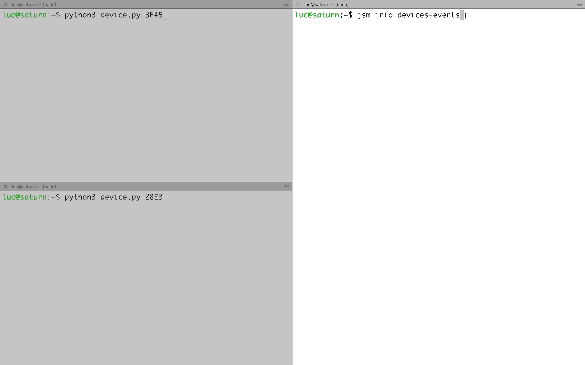
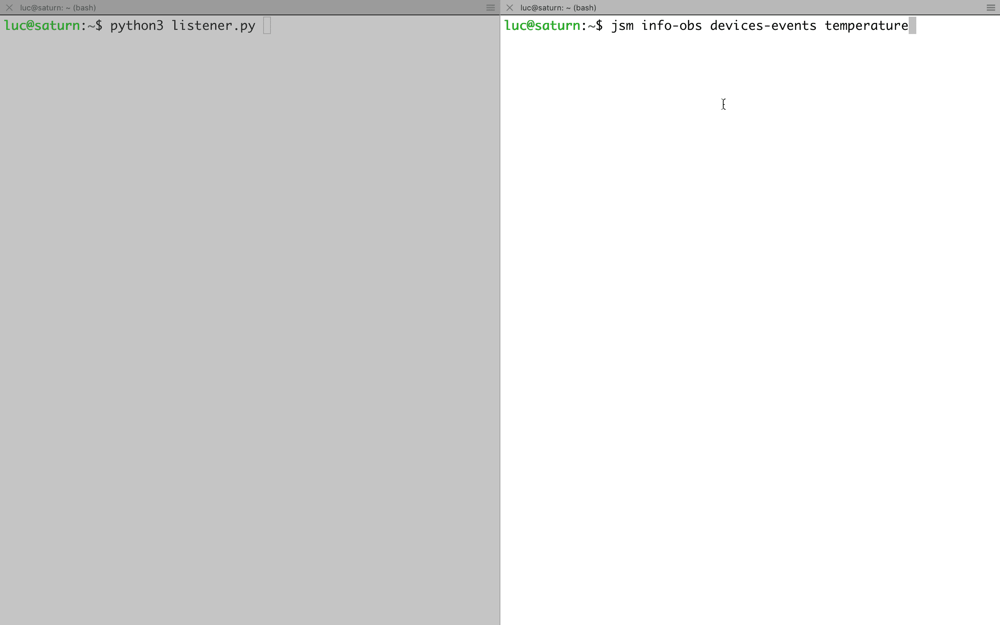

# JetStream:下一代 NATS 持久引擎

> 原文：<https://itnext.io/jetstream-the-next-generation-of-nats-persistence-engine-cb6c2c80dd20?source=collection_archive---------1----------------------->

## 技术预览中主要概念的概述


**更新 Mars 27 2020:** 以下文章是 JetSteam 的技术预览版第一版发布时写的。从那以后发生了很多变化。出于历史目的，本文将保留在此，但当 JetStream 正式上市时，将很快编写一个新版本。请继续收听:)

# 主要概念

在[之前的帖子](/overview-of-nats-streaming-ea0e80449507)中，我们展示了 NATS Steaming，并通过一个简单的基于物联网的用例展示了它的一些功能。我们看到 NATS 流媒体在 NATS 之上实现了消息持久性:NATS 流媒体的客户端和服务器通过底层的 NATS 服务器使用[谷歌协议缓冲区](https://developers.google.com/protocol-buffers/)交换二进制消息

JetStream 是下一代 NATS 流。与其前身不同，JetStream 的所有持久性功能都直接内置于 NATS 中，因此不需要使用任何额外的服务器。因此，JetStream 的客户端只需要使用 NATS 的纯文本协议，没有更多的协议缓冲区。JetStream 还提供了我们将在本帖中介绍的附加功能和新概念。

JetStream 使用两个主要组件:

*   *消息集*定义了我们想要存储的消息类型、排序、保留策略、副本和资源限制
*   定义如何使用消息集的观察值

让我们看看如何在一个简单的例子中使用它们。

# 示例使用案例

在[关于 NATS 流媒体的帖子](/overview-of-nats-streaming-ea0e80449507)中，我们考虑了一个物联网应用。在本帖中，我们将使用该示例的简化版本，其中我们将仅考虑几个设备和单个微服务组件:

*   一个设备在“*设备上发布消息。ID . events*subject(ID 是当前设备标识符)并等待来自服务器的确认**。**此 ack 确保消息已被 NATS 正确接收，但并不表示任何关于向潜在订户交付的信息。发送的消息示例:

```
{ 'ts': '2019–12–08T23:12:00Z', 'temp': '21.3' }
```

*   *监听器*微服务应该订阅*设备。*.事件*”因此它接收包含由它订阅的每个设备发送的温度信息的消息。

注意:在 NATS，流媒体客户端不能使用通配符来创建**持久**订阅。JetStream 打破了这种限制，允许在一个消息集中有多个主题(以及对每个主题的通配符支持)。这绝对是 JetStream 提供的一个很棒的附加功能。

下面的模式说明了上面列出的组件。



示例用例的整体架构

让我们看看如何使用 JetStream 来实现这个例子。

# 启动服务器

JetStream 目前是一个技术预览版，正在等待社区的反馈。由于 jetstrteam 特性还没有发布，我们首先需要克隆 [nats-server GitHub 存储库](http://github.com/nats-io/nats-server.git)，切换到 *jetstream* 分支并构建 nats 服务器(我们所需要的就是在本地机器上安装 Golang)

```
$ git clone [git@github.com](mailto:git@github.com):nats-io/nats-server.git
$ cd nats-server
$ git checkout jetstream
$ go build
$ go install
```

可以使用 *nats-server* 命令的 *-js* 标志运行具有 JetStream 功能的 NATS。



运行具有 JetStream 功能的 NATS 服务器

注意:一个额外的 *-sd* 标志可以用来指定存储目录

JetStream 使用 JSM 工具来管理消息集和可观察组件。在这个技术预览版中，首先需要使用以下命令构建 JSM:

```
$ cd jetstream/jsm
$ go build
$ go install
```

jsm 二进制文件现在可以使用了。



JSM 的可用命令

# 创建消息集

使用 jsm 二进制文件，我们首先创建一个消息集，它将负责在"*设备上发布的消息的存储。*.事件*主题。

注意:jsm 使用普通的 NATS 消息，这允许单个应用程序发布消息、消费者消息以及管理 JetStream

```
$ jsm add
Enter the following information
Name: **devices-events**
Subjects: **devices.*.events**
Limits (msgs, bytes, age):
Storage: file
Received response of "+OK"
```

该消息集具有以下规格:

*   它被命名为*设备-事件*
*   它将存储在*设备上发布的所有消息。*.*主题事件
*   它没有在消息数量、每个消息的大小和 TTL(生存时间)方面定义任何消息限制
*   将确保存储在本地文件系统上

列出现有的消息集，我们可以看到刚刚创建的消息集

```
$ jsm list1) devices-events
```

由于没有设备发布任何消息，该消息集目前为空，我们可以从 *info* 命令中看到:

```
$ jsm info devices-eventsMessages: 0
Bytes:    0 B
FirstSeq: 0
LastSeq:  0
```

现在让我们用一个虚拟设备向 NATS 发送数据。我们将使用以下 Python 代码，即使用 NATS 官方 Python 客户端的代码:

```
import asyncio
import time
import datetime
import random
import json
import sys
from nats.aio.client import Client as NATS# Get device ID
device_id = sys.argv[1]# Get NATS client
nc = NATS()async def sending():
    while True:
      # Build message (with current timestamp and dummy temperature)
      now = datetime.datetime.utcnow()
      ts = now.strftime("%Y-%m-%dT%H:%M:%ST")
      temp = round(random.uniform(20,25), 2)
      msg = json.dumps({'ts': ts, 'temp': temp}).encode() # Send message and wait for an ACK
      subject = "devices.{}.events".format(device_id)
      async def ack_handler(msg):
        data = msg.data.decode()
        print("Received {data}".format(data=data))
      print("Sending {msg}".format(msg=msg))
      await nc.request(subject, msg, cb=ack_handler) # Wait before sending next message
      await asyncio.sleep(1)async def main():
    # Connect client to NATS
    await nc.connect() # Define sending task
    send = asyncio.create_task(sending())
    await sendasyncio.run(main())
```

可以使用以下命令运行该脚本，并提供一个设备标识符作为参数:

```
$ python device.py 3F45
```

几秒钟后，我们可以看到我们的消息集现在包含几条消息:

```
$ jsm info devices-eventsMessages: 72
Bytes:    6.8 kB
FirstSeq: 1
LastSeq:  72
```

下面的动画演示了以下流程:

*   标识符为 3F45 的设备每分钟在“*devices . 3f 45 . events”*(左上)上发布一条消息
*   标识符为 28E3 的设备每分钟在“*设备上发布一条消息。* 28E3 *。事件"*(左下角)
*   消息集内容的演变(右)



添加到消息集中的消息

下一步是创建一个可观察对象，它将定义如何使用存储在消息集中的消息。

# 创造一个可观察的

jsm 二进制允许以交互的方式创建一个可观察对象。需要设置几个参数:

*   基础消息集的名称
*   **持久名称**定义了持久订阅的名称(*持久*是 NATS 流中引入的概念)。虽然 JetStream 支持持久和短暂的可观测量(最后一个需要一个活跃的订户)，但在当前版本中， *jsm* 只支持持久测量
*   消费类型:基于推还是基于拉。
*   消费者应该订阅的主题，以便获取消息(仅用于推送)
*   **交付策略**定义了消息将如何交付。这里有几种可能性:从第一条消息开始发送，只发送最后一条消息，从特定时间开始发送所有消息
*   **确认策略**定义客户端应用程序是否以及如何确认消息传递: *none* (NoAck)表示不需要确认， *all* (AckAll)表示所有消息，直到当前序列号被确认，AckExplicit 表示每个消息需要单独确认
*   **重放策略**定义了消息传递的方式。两个可用选项:一行中的所有消息，它们之间没有任何特定的延迟，或者一个接一个地考虑它们之间存在的原始延迟

在本例中，我们用以下参数配置了可观察对象:

*   底层消息集是**设备-事件**
*   持久名称设置为**温度**(因为它用于从设备获取温度相关信息)
*   它被定义为基于**推动**的消费
*   消息将被推送给订阅了**设备.事件**主题的所有消费者。消息将使用它们发布时的原始主题来传递(稍后会有更多相关内容)。

注意:从可伸缩性的角度来看，对于基于推送的可观察对象，不建议有多个消费者。基于拉的可观察允许容易的缩放。

*   默认值用于所有其他选项

```
$ jsm add-obs
Enter the following information
Message Set Name: **devices-events**
Durable Name: **temperature**
Push or Pull: **Push**
Delivery Subject: **devices.events**
Deliver All? (Y|n):
AckPolicy (None|all|explicit):
Replay Policy (Instant|original):
Received response of "+OK"
```

使用 *jsm，*我们可以列出一个给定消息的所有可观察到的现象:

```
$ jsm ls-obs devices-events1) temperature
```

我们还可以使用观察对象的名称和它所操作的消息集来获得观察对象的信息:

```
$ jsm info-obs devices-events temperature
Received response of {
  "Delivered": {
    "ObsSeq": 1,
    "SetSeq": 1
  },
  "AckFloor": {
    "ObsSeq": 0,
    "SetSeq": 0
  },
  "Pending": null,
  "Redelivery": null
}
```

这里需要注意几件事:

*   要传递的下一条消息是序列号为 1 的消息
*   尚未确认任何消息
*   当前没有挂起的消息(已发送但未确认)
*   没有消息被重新传递

现在可观察对象被创建，常规的 NATS 客户端可以订阅"*devices . events "*subject，以便接收存储在底层消息集中的消息。

让我们考虑一个名为 *listener* 的微服务，它负责收集和解析每条消息，并将其内容存储到一个时间序列数据库中(InfluxDB 可能是实现这一目的的最佳选择，但这是另一个故事)。以下 Python 代码是侦听器的简化版本:

```
import asyncio
import json
import ssl
import sys
from nats.aio.client import Client as NATSasync def run(loop): # Connection to NATS
    nc = NATS()
    await nc.connect(io_loop=loop) # Handling incoming messages
    async def message_handler(msg):
        data = json.loads(msg.data.decode())
        print(data) # Subscription to "devices.events"
    subject="devices.events"
    await nc.subscribe(subject, cb=message_handler)
    print('Subscribed to [%s]' % subject);if __name__ == '__main__':
    loop = asyncio.get_event_loop()
    loop.run_until_complete(run(loop))
    try:
        loop.run_forever()
    finally:
        loop.close()
```

这里需要注意一件重要的事情:侦听器订阅“*设备.事件*主题，而每个设备向“*设备发送消息。ID.events* " subject (ID 是设备的唯一标识符)。事实上，如果侦听器订阅了" *devices.events* "，它将接收到关于消息原始主题的消息。这种行为在下一个版本中可能会有所改变，这样客户端就可以直接订阅原始主题。

启动侦听器，我们可以看到从消息集中的第一条消息开始，所有消息都被传递。下面的动画演示了监听器收到的所有消息。可观察的状态被改变，显示所有的消息都已经被传递(在这个例子中，消息集中有 25 条消息)



用户接收存储在消息集中的消息

如果设备发布了其他消息，侦听器将会接收到这些消息。此外，如果侦听器碰巧离线，而设备继续发布消息，它将从它确认的最后一个序列号开始接收消息。

# 摘要

我们只涉及 JetStream 背后的一些主要概念。此外，由于 JetSteam 服务是在 NATS 境内实施的，所有的 NATS 2.0 安全功能都可以直接用于验证和授权客户。

这篇文章基于 JetStream 的技术预览。因为在它达到稳定版本之前事情可能会改变，这篇文章将会定期更新以反映它的发展。