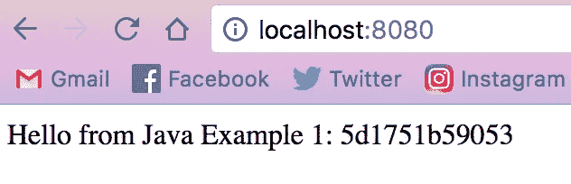
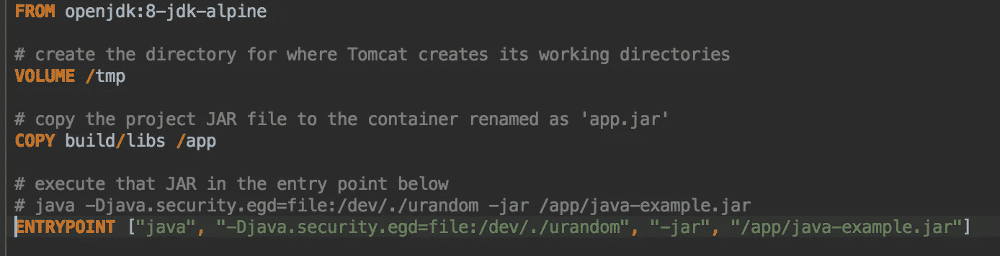

# Jib:在没有任何 Docker 知识的情况下获得专家 Docker 结果

> 原文：<https://itnext.io/jib-getting-expert-docker-results-without-any-knowledge-of-docker-ef5cba294e05?source=collection_archive---------1----------------------->

T4:嗯，我有些消息要告诉你。如果你一直在关注我最新的博客帖子，我已经谈了很多关于 [Docker](https://www.docker.com/what-docker) 的事情，这个惊人的容器化平台使得开发和部署 web 应用程序比以往任何时候都更容易。第一篇文章[介绍了 Docker 基础知识和 Docker CLI。第二款](https://medium.com/@paigen11/docker-101-fundamentals-the-dockerfile-b33b59d0f14b)[是](https://medium.com/@paigen11/docker-102-docker-compose-6bec46f18a0e)，介绍了 Docker Compose，Docker 更复杂，更容易(在我看来)使用，多服务选项。

正确使用的话，Docker 是一个非常强大的工具，但是它需要一分钟才能让你明白:

*   这些命令，
*   文件结构，
*   整个集装箱化的概念本身。

如果你以前没有用过，这并不容易，有一个明确的学习曲线。但是谷歌，曾经的技术领导者，刚刚发布了一个游戏规则改变者…

## 会合三角帆

Jib 是一个全新的，刚刚发布的，基于 Google 容器工具的 Java 插件，它将容器化你的应用。

简而言之:

> Jib 为您的 Java 应用程序构建 Docker 和 [OCI](https://github.com/opencontainers/image-spec) 映像，并作为 [Maven](https://github.com/GoogleContainerTools/jib/blob/master/jib-maven-plugin) 和 [Gradle](https://github.com/GoogleContainerTools/jib/blob/master/jib-gradle-plugin) 的插件提供。Github 起重臂

这对我们来说意味着:

*   没有`Dockerfile`设置，
*   没有为 Maven 或 Gradle 定制的脚本，
*   现成的 Docker 图像生成和发布。

基本上，没有 Docker 的复杂性，但有 Docker 的所有好处。

怎么会？一个插件，一个非常简单的插件。下面我会告诉你有多简单。

**在坡道上实施起重臂**

Jib 有 Maven 和 Gradle 插件。我会用格雷尔，因为那是我最熟悉的。

我们从`build.gradle`文件开始。首先，确保你使用的是 Gradle 4.6 或更高版本——这是 Jib 所需要的。

接下来，更改文件。在`build.gradle`的插件部分，添加这一行。

是的，现在生成 Docker 图像真的很容易。

仅此而已。您已经完成了 Java 应用程序中所需的更改。

现在，从命令行运行 Gradle 任务`./gradlew jibDockerBuild`。这将生成您的本地 Docker 映像，并给出它的映像名称和版本。

好了，最后一步，Docker 在终端运行命令:`docker run -p <host port: Docker app port> <image name: version>`。这样你的应用程序就应该启动了。

我制作了一个示例 Java 应用程序，并将其存储在 Github [这里](https://github.com/paigen11/jib-docker-example)，因此您可以看到这实际上是多么简单。

我还把 Docker 文件留在了那里，所以您可以看到以前运行 Docker 需要什么。请记住，这个项目仅用于构建和运行本地映像，如果您想推送到 Docker hub，请查看 Jib 官方文档(并检查回来，我可能会就此做后续文章)。

对于我的项目，您将运行相同的`./gradlew jibDockerBuild`，然后这个 Docker 运行命令:`docker run -p 8080:8080 java-example:1.0.0-SNAPSHOT`。

这是你在浏览器中进入 [http://localhost:8080](http://localhost:8080) 时会看到的。

在 Jib 之前，我需要一个完全独立的`Dockerfile`来指导如何构建我的应用程序来实现这样的奇迹。

看看这个。这是一个简单的 Java 应用程序。这些 docker 文件可以(并且通常是)更大、更复杂。

多亏了 Jib，`Dockerfiles`可以成为过去——至少对于您的 Java 应用程序来说是这样。另一个好处是，如果你的项目中有一个`docker-compose.yml`文件，它仍然可以和 Jib 一起使用。

就我个人而言，我迫不及待地想把这个一行程序放到我团队的所有 Spring Boot 应用程序中。有了它，我们可以获得 Docker 容器的强大功能和灵活性，而不需要任何关于 Docker 的设置和必要知识。

即使你不是码头专家，有了 Jib，你仍然可以从中获益，并在这个过程中看起来像个摇滚明星。尽情享受吧！

**如果你喜欢读这篇文章，你可能也会喜欢我的其他一些博客:**

*   [Docker 102:Docker-Compose](https://medium.com/@paigen11/docker-102-docker-compose-6bec46f18a0e)
*   [Docker 101:基本面&Docker file](https://medium.com/@paigen11/docker-101-fundamentals-the-dockerfile-b33b59d0f14b)
*   [graph QL 到底是什么？](https://medium.com/@paigen11/what-is-graphql-really-76c48e720202)

**参考资料和更多资源:**

*   Docker: [https://www.docker.com/what-docker](https://www.docker.com/what-docker)
*   Jib, Github repo: [https://github.com/GoogleContainerTools/jib](https://github.com/GoogleContainerTools/jib)
*   Jib,Gradle Plugin: [https://github.com/GoogleContainerTools/jib/tree/master/jib-gradle-plugin](https://github.com/GoogleContainerTools/jib/tree/master/jib-gradle-plugin)
*   Jib Docker Example Repo: [https://github.com/paigen11/jib-docker-example](https://github.com/paigen11/jib-docker-example)