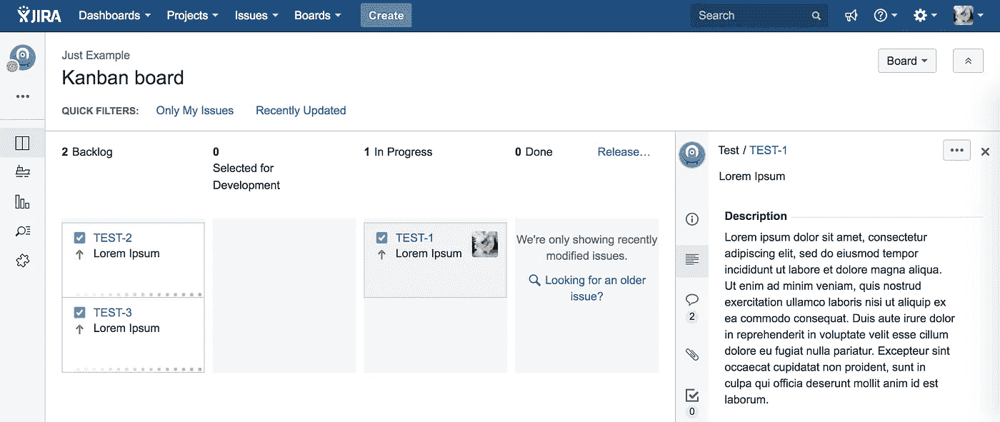

# 在库伯内特斯部署 JIRA 和汇流

> 原文：<https://itnext.io/jira-on-kubernetes-by-helm-8a38357da4e?source=collection_archive---------2----------------------->

Atlassian JIRA 软件和 Confluence 是一个很好的敏捷管理工具。我们可以在几分钟内开始在 Atlassian Cloud 上使用 JIRA 和 Confluence，但在某些情况下我们仍然需要一个私有服务器。



亚特兰蒂斯 JIRA 软件公司

我刚刚发表了 JIRA 和汇流的 Kubernetes 掌舵图。您可以在 Kubernetes 集群上轻松部署 JIRA 和 Confluence。

# 入门指南

## 安装工具

确保您可以使用`helm`命令访问集群。

```
brew install kubernetes-helm
helm init
```

在本文中，我们使用 [Helmfile](https://github.com/roboll/helmfile) 进行配置管理。

```
curl -L -o ~/bin/helmfile [https://github.com/roboll/helmfile/releases/download/v0.17.0/helmfile_darwin_amd64](https://github.com/roboll/helmfile/releases/download/v0.17.0/helmfile_darwin_amd64)
chmod +x ~/bin/helmfile
```

## 部署 JIRA

获取图表的存储库。

```
git clone [https://github.com/int128/devops-kompose](https://github.com/int128/devops-kompose)
cd devops-kompose
```

为您的集群创建`helmfile.yaml`。例如，如果您使用一个`Ingress`在`https://jira.example.com`上部署 JIRA，它将如下所示:

```
releases:
  - name: atlassian-jira-software
    namespace: devops
    chart: ./atlassian-jira-software
    values:
      - ingress:
          enabled: true
          hosts:
            - jira.example.com
        jira:
          reverseProxyHost: jira.example.com
        resources:
          limits:
            memory: 1536Mi
          requests:
            memory: 1536Mi
```

现在应用更改。

```
helmfile syncexec: helm repo update
Hang tight while we grab the latest from your chart repositories...
...
Release "atlassian-jira-software" has been upgraded. Happy Helming!
LAST DEPLOYED: Wed May 16 09:32:11 2018
NAMESPACE: devops
STATUS: DEPLOYEDRESOURCES:
==> v1/Pod(related)
NAME                                      READY  STATUS       RESTARTS  AGE
atlassian-jira-software-7997fcf5c7-qk84j  1/1    Terminating  0         12h==> v1/PersistentVolumeClaim
NAME                     STATUS  VOLUME                                    CAPACITY  ACCESS MODES  STORAGECLASS  AGE
atlassian-jira-software  Bound   pvc-f6a375fc-15e0-11e8-9a6e-06365716f47a  8Gi       RWO           gp2           5d==> v1/Service
NAME                     TYPE       CLUSTER-IP     EXTERNAL-IP  PORT(S)   AGE
atlassian-jira-software  ClusterIP  100.68.177.22  <none>       8080/TCP  5d==> v1beta2/Deployment
NAME                     DESIRED  CURRENT  UP-TO-DATE  AVAILABLE  AGE
atlassian-jira-software  1        0        0           0          5d==> v1beta1/Ingress
NAME                     HOSTS                     ADDRESS           PORTS  AGE
atlassian-jira-software  jira.example.com          1.2.3.4...  80     5dNOTES:
Atlassian JIRA Software is starting now.
```

打开[https://jira.example.com](https://jira.example.com)并设置你的 JIRA 服务器。您可能需要一个外部数据库，如 AWS RDS。

## 部署合流

您可以用同样的方式部署 Confluence。如果您使用`Ingress`在`https://wiki.example.com`上部署 Confluence，您的`helmfile.yaml`将如下所示:

```
releases:
  - name: atlassian-confluence
    namespace: devops
    chart: ./atlassian-confluence
    values:
      - ingress:
          enabled: true
          hosts:
            - wiki.example.com
        confluence:
          reverseProxyHost: wiki.example.com
        resources:
          limits:
            memory: 1800Mi
          requests:
            memory: 1800Mi
```

然后应用更改:

```
helmfile sync
```

# 高级主题

## Helmfile 模板

[Helmfile](https://github.com/roboll/helmfile) 支持变量替换等模板。您可以创建一个模板，并为您的各种项目分发它。

例如，您可以在`helmfile.yaml`中放置一个占位符，如下所示:

```
- name: atlassian-jira-software
    namespace: devops
    chart: ./atlassian-jira-software
    values:
      - ingress:
          enabled: true
          hosts:
            - jira.{{ requiredEnv "DEVOPS_DOMAIN" }}
        jira:
          reverseProxyHost: jira.{{ requiredEnv "DEVOPS_DOMAIN" }}
```

用以下变量创建`.env`:

```
export DEVOPS_DOMAIN=example.com
```

应用更改。

```
source .env
helmfile sync
```

然后 JIRA 将被部署在`jira.example.com`。

## 坚持

JIRA/Confluence 将数据存储到数据库和持久卷中。如果您使用内部数据库(不推荐)，两者在同一个卷中。

默认情况下，该图表创建 8GB 卷。您可以按如下方式更改`helmfile.yaml`中的尺寸:

```
releases:
  - name: atlassian-jira-software
    namespace: devops
    chart: ./atlassian-jira-software
    values:
      - ingress:
          enabled: true
          hosts:
            - jira.example.com
        jira:
          reverseProxyHost: jira.example.com
        persistence:
          size: 100Gi
```

您应该定期拍摄数据库和卷的快照进行备份。

## 记忆

JIRA/汇流需要更多的内存来获得舒适的体验。

默认情况下，一个 pod 需要 1536MB 的内存。在大多数情况下，这可能就足够了，但是您可以通过如下更改`helmfile.yaml`来增加或减少内存:

```
releases:
  - name: atlassian-jira-software
    namespace: devops
    chart: ./atlassian-jira-software
    values:
      - ingress:
          enabled: true
          hosts:
            - jira.example.com
        jira:
          reverseProxyHost: jira.example.com
          javaOptions: -Xmx2g -Xms2g
        resources:
          limits:
            memory: 2560Mi
          requires:
            memory: 2560Mi
```

你必须同时给`javaOptions`和`resources`来防止 OOM 杀手。目前 [JIRA 不支持](https://jira.atlassian.com/browse/JRASERVER-67303) `[-XX:+UseCGroupMemoryLimitForHeap](https://jira.atlassian.com/browse/JRASERVER-67303)` [选项](https://jira.atlassian.com/browse/JRASERVER-67303)。

# 结论

您可以使用 Helm charts 在 Kubernetes 集群上轻松部署 JIRA 和 Confluence。