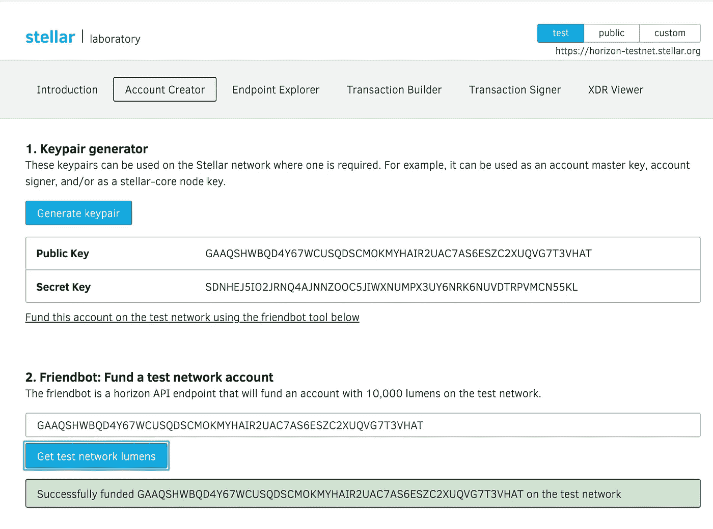
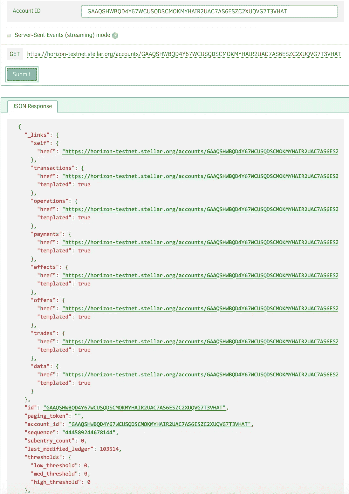

# 以简单的方式加入恒星测试网

> 原文：<https://itnext.io/join-the-stellar-testnet-the-easy-way-70ae5f1e753f?source=collection_archive---------4----------------------->

了解如何使用 Docker Compose 通过 Stellar 开发团队的 testnet 实现定额。

# 背景

作为研究工作的一部分，我希望建立自己独立的恒星网络。我能够从 SatoshiPay GitHub repo 中找到一个现有的项目，其中包括一个 Docker 编写文件，成为 Stellar live 网络的一部分。我认为这将是一件很酷的事情，看看如何将它应用到 Stellar testnet，并最终在未来的某个时候扩展到 Stellar 独立部署。

# 加入测试网络

正如在背景中提到的，最初的 Docker Compose 配置指向的是活动网络，这不是我在这个概念验证中想要使用的。我做了一些谷歌搜索，发现恒星核心文件[测试网络配置](https://github.com/stellar/stellar-core/blob/master/docs/stellar-core_testnet.cfg)。为了便于使用，我在这里包含了这些内容。

接下来我要做的就是找出如何将这些设置映射到 compose，这样我的本地节点就可以成为 Stellar testnet 的一部分。

# 加入网络

在查看了现有的配置并比较了撰写文件中定义的实时网络属性后，我觉得我已经很清楚要作为另一个节点加入到星型网络中需要做些什么。我关注的重点领域是现有的对等网络和节点，以及如何检索 Stellar testnet 上的交易活动历史。结果是一个映射到 Stellar testnet 的更新的 compose yaml 文件。

# 朋友机器人

testnet 包括一项服务，允许开发者快速创建名为 [Friendbot](http://The test https://www.stellar.org/laboratory/#account-creator) 的明星账户。我将使用这个服务在 testnet 上创建一个新帐户。这将允许我验证该帐户存在于我的本地节点中，并确保我已经与更大的 testnet 节点建立了共识。

Friendbot 创建并资助了一个测试账户

现在，我可以使用 horizon UI 验证帐户是否已创建，并检索帐户创建所提交的分类帐。

从公共 testnet horizon UI 获得的帐户

# 建立法定人数

为了验证我们的本地节点是否与全球 Stellar testnet 同步，Stellar 提供了一个指标端点，其中包括本地节点知道的最新分类帐。我发现，初始的法定人数需要时间来建立，但是一旦节点被赶上，网络在确保法定人数方面确实响应迅速。当分类帐编号大于包含交易的分类帐时，您将知道分类帐被卡住。使用指标端点`[http://localhost:80000/metrics](http://localhost:80000/metrics),`您可以验证该账户是否作为分类账 103514 的一部分，指标端点表示本地分类账现在为 103581。

# 验证帐户

现在我们已经建立了 quorum，我们现在可以使用我们的本地 Stellar 节点检索我们在 testnet 上创建的帐户。为了检索特定的帐户，http API 的格式为[http://localhost:8000/account/$ public key](http://localhost:8000/account/$publickey)

这是我们之前用 Friendbot 创建的账户的结果。

> [http://localhost:8000/accounts/gaaqshwbqd 4y 67 wcusqdsscmokmyhair 2 UAC 7 as 6 eszc 2 xuqvg 7t 3 vhat](http://localhost:8000/accounts/GAAQSHWBQD4Y67WCUSQDSCMOKMYHAIR2UAC7AS6ESZC2XUQVG7T3VHAT)

正如您在响应中看到的，本地节点知道最近创建的帐户，我们已经为这个分类帐事务建立了仲裁。

# 把所有的放在一起

既然已经验证了我们已经就最新的事务达成了共识，我们可以开始利用 Stellar SDK 来驱动各种 API 调用，并验证我们可以使用 Stellar 的特性。为了演示这一点，我编写了两个示例流，称为 simpleFlow 和 multiSigFlow，它们利用了 Stellar SDK 的大多数关键特性。

# 结论

在本文中，我介绍了如何配置本地 testnet 节点来充分利用 Docker Compose。虽然一开始建立共识需要一些耐心，但是拥有一个用于测试和开发的本地测试网的好处是值得的。要访问本文中使用的全套资源，请查看我的 GitHub 项目 stellar-testnet。

 [## todkap/stellar-testnet

### 部署简单 Stellar testnet 节点- todkap/stellar-testnet 的配置

github.com](https://github.com/todkap/stellar-testnet)