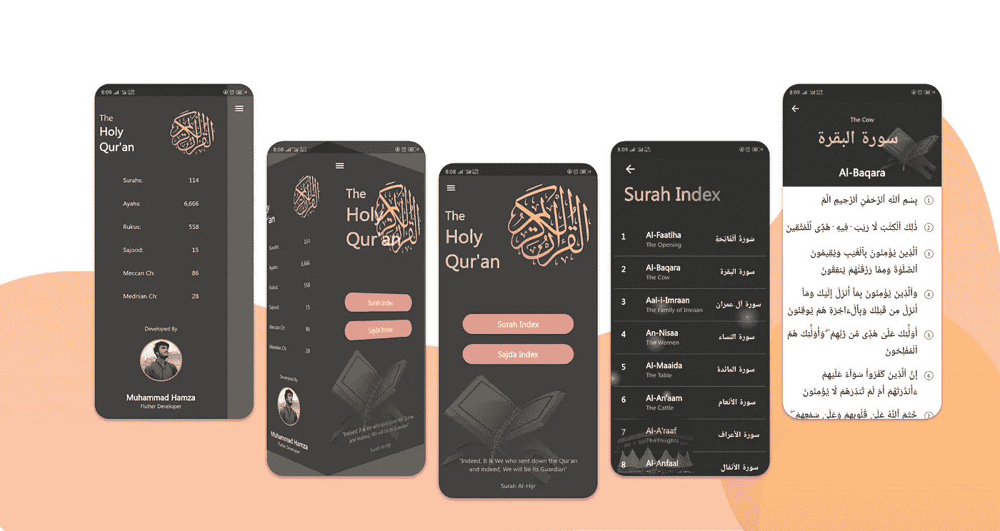
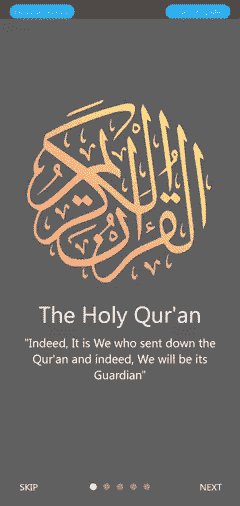

# 从零开始到游戏商店的旅程——神圣的古兰经|飘动应用程序

> 原文：<https://itnext.io/journey-from-scratch-till-play-store-the-holy-quran-flutter-app-407a5370448a?source=collection_archive---------4----------------------->

我已经写了一篇文章解释这个应用程序的基础，你可以在这里阅读*。从那以后，由于很多人要求我把这个上传到 play store，我给这个应用增加了一些新功能。如果你是第一次读到这篇文章，我想在这里强调几件事:*

*   *这个应用程序遵循 MVC 架构*
*   *正在从 API 获取数据*
*   *不使用任何状态管理*
*   *v 1.0.0 是[**开源**](https://github.com/m-hamzashakeel/The_Holy_Quran_App)*
*   *[**播放商店**](https://play.google.com/store/apps/details?id=com.hmz.al_quran&pli=1)*

# *让故事开始吧…！*

**

*神圣的古兰经应用程序*

*从前有一个男孩，他非常喜欢手机…哈哈哈只是开玩笑，我知道我不擅长讲故事，所以不要浪费时间，让我们跳到正题。我想学习 jSON 数据解析和关于 API 和 https 请求的东西。所以，我在搜索开发一个使用复杂 jSON 数据的应用程序。我已经使用过 [*COVID19 追踪器应用*](https://itsallwidgets.com/covid19-tracker-app) 了，但是非常简单。我的一个朋友分享了《古兰经》的 API。因此，旅程从一个简单的想法开始，开发一个应用程序，让人们以数字方式阅读古兰经。*

# *功能—最新版本 1.0.0*

*   *简单导航——你可以直接从他们的索引中打开任何一个 Surah、Sajda 或 Juzz。*
*   ***花哨漂亮的 UI** —这款应用的 UI 设计和颜色组合与新潮的古兰经应用有些不同。*
*   ***Surah/Sajda 信息** —长按任何 Sajda 或 Surah 索引将显示简要信息，即 juz 编号、ayahs 编号、Surah 含义等。*
*   *3D 抽屉动画——从技术上来说，这不是一个特色，但我试图让它看起来有点不同。*

> *动画可能会在宽屏手机或 android pie 上引起一些问题。类似地，还有其他错误。但是我想作为初学者这没什么大不了的😢*

*不管怎样，我会尽快更新的。*

# *未来的功能—1 . 1 . 0 版*

*   ***离线阅读模式** —我将使用 PDF 或本地化数据*
*   ***书签***
*   *搜索——因为这是我的第一个应用😜。我没有任何理由就跳过了。虽然，我知道这可以用动态 API 来开发。*
*   ***继续阅读—** 用户可以从他/她离开阅读的地方继续。*

# *先前版本*

*此前，这个应用程序只有 Surah 和 Sajda index 作为主要数据部分。*

*以前，抽屉保存有关于古兰经的元数据信息，如 Juzs，Surahs，Ayahs，Sajdas，Ruku 等的数量。和往常一样，我的照片在底部，我只是看着天空中的一些鸽子。我知道为什么吗？？！！😆*

**

*先前版本*

# *最终版*

*您已经浏览了我在最新版本中添加的功能。我只是要添加那些较新的。*

*所以，这个版本成立:*

*   *居兹 **指数** —古兰经中的 30 个居兹全部被添加。*
*   ***Surah/Sajda 信息** —长按任意 Surah 或 Sajda 可以查看其简要信息。*
*   ***抽屉更新** —我在抽屉列表中添加了一些其他选项，并删除了元数据信息。*
*   ***简介** —添加在登机屏幕上，作为该应用程序的小简介。*
*   ***帮助指南** —帮助标签，解释此应用程序的全部功能和用法。*
*   ***分享 app** —分享 tab holding，GitHub repo，app 链接，费率按钮玩商店。*

*所以，这个组合真的很酷！！*

**

*最后外观*

# *在这个发展过程中我学到了什么？*

## *jSON 数据解析*

*正如我前面提到的，我想学习 jSON 数据解析，所以这是首要任务。而且我用了很多资源但是 [*这篇*](https://medium.com/flutter-community/parsing-complex-json-in-flutter-747c46655f51) 文章是拔尖的帮助。*

## *3D 抽屉动画*

*除此之外，我在 drawer 中实现了 3D 动画，虽然我跟随了我最喜欢的 Flutter 开发人员，并且我有了所有的 [*代码*](https://github.com/MarcinusX/drawer_challenge/blob/master/lib/custom_drawer_guitar.dart) ，但是在一个真实的应用程序中实现它并做出响应对我来说有点挑战。*

## *应用性能*

*我在应用程序中实现的另一件事是在 flutter 中编写代码的适当方式。早些时候，我只是开始写代码，我不停地在插件和嵌套中插入插件，还有动画，代码有 400 到 500 行长，当我自己需要在其中找到一些代码时，这变得非常痛苦。*

*所以，这次我把我的 app 管理得非常妥当。提取了小部件以实现代码的可重用性，并且在使用动画时对性能的影响很小。为此，我第一次使用了 **AnimatedBuilder** ,它只重建了其中的小部件，而不是整个屏幕，因此性能更好。*

## *股票期权*

*我第一次在我的应用程序中实现了共享功能。我用的是 [*共享*](https://pub.dev/packages/share#-example-tab-) 包。对于所有期待使用这个包的人来说，有一点很重要。确保在实现代码后重新构建你的应用程序，否则它会不断给出错误和异常，你应用它的希望会随着你得到的每个错误而逐渐消失。*

## *通过 Play Store 进行评级和反馈*

*这是非常简单的东西，但因为我学到了这一点，所以我需要提到它。按下**速率&反馈**按钮，您将被重定向至 google play 商店中的应用。我用了另一个包[*launch _ review*](https://pub.dev/packages/launch_review#-example-tab-)*让你非常容易地在 play store 或 apple store 上打开你的应用。**

> **感觉更像一堆包，而不是应用程序。**

## **横幅设计**

**我在使用 Adobe XD 的时候学到了很多东西，比如钢笔工具的使用，不透明度和在你的设计中制作小阴影，让它看起来有点吸引力。虽然，我一直在用 Adobe XD 做我的每一个设计，但是，在这里，我肯定有一些技巧++在我的设计中:)。我不是一个设计师，所以对我来说，Adobe XD 做的工作。**

## **将应用上传到 Play Store**

**最后但同样重要的是，在 play store 上制作应用程序是一种全新的体验。我非常兴奋，这是我的第一个应用程序，它可以在全球范围内使用。任何人都可以访问和使用它，显然这需要互联网连接😅**

**终于，我们到了…！**

****

**最后，我这边几句话啊啊啊啊啊啊啊……！**

***“如果你问我要遵循的终极资源或指南，这两样东西都是受欢迎的:***

> ***练习&一致性***

***这是写给那些问如何变得擅长开发的人的。最后一件事，我真的很感谢* [*瓦利德·阿尔沙德*](https://medium.com/u/f953de41d93f?source=post_page-----407a5370448a--------------------------------) *他让我学习 API&JSON 数据* ❤除此之外没有什么特别的但是我的感觉就像…**

***我；p***

# ***谢谢你们所有人&快乐奋斗💙***

***我们来连线@m_hamzashakeel 或者@m-hamzashakeel***